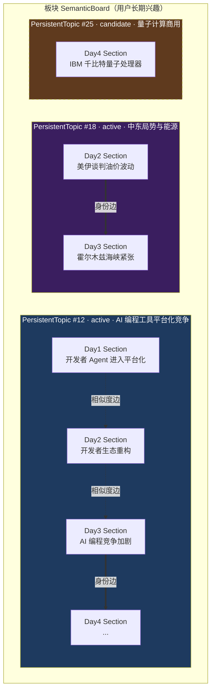
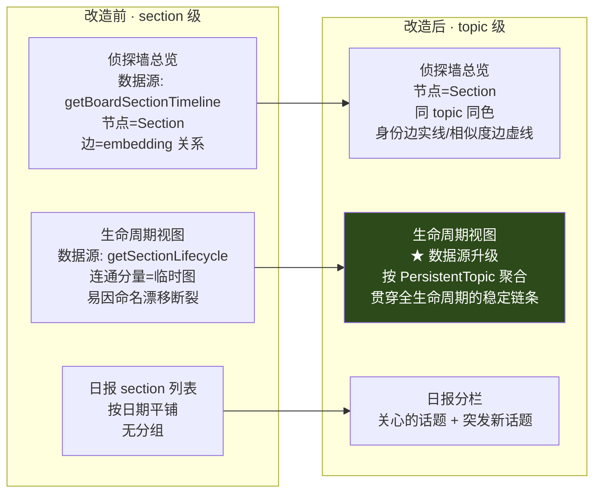
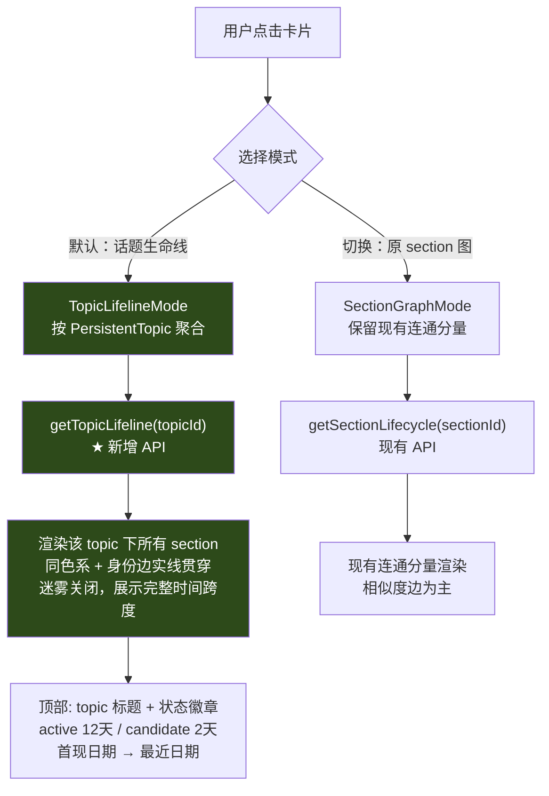
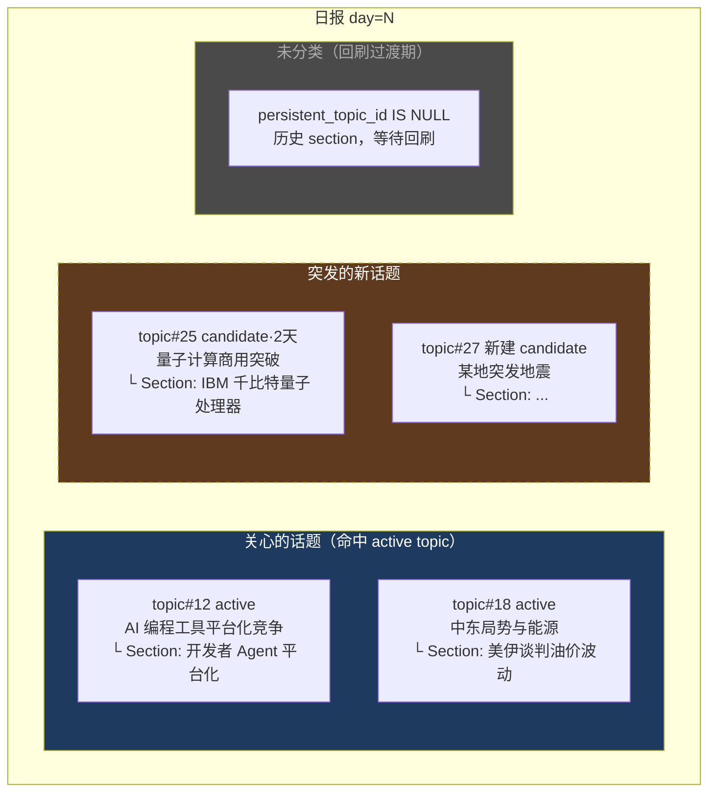

# 持久话题（PersistentTopic）方案设计

> 状态：方案草稿，待评审
> 作者：探索阶段产出
> 日期：2026-06-19
> 关联 spec：`bipartite-relation-matching`、`section-relations`、`section-lifecycle`、`board-upgrade`、`daily-report-system`

## 一、问题诊断

### 1.1 现状三层概念

| 层 | 实体 | 持久性 | 生成方式 |
|----|------|--------|----------|
| 板块 | `SemanticBoard` | **持久** | 用户确认 board-upgrade 建议创建 |
| 叙事组 | `DailyReportSection` | **当天 ephemeral** | `ClusterTags` 每天独立调 LLM 聚类 |
| 关系 | `SectionRelation` | **派生** | 相邻天 section embedding 匈牙利 1:1 匹配 |

关键事实：**section 层和 relation 层都没有持久锚点**。板块持久，但板块下面的"叙事"每天重新生成、每天重新拉关系。

### 1.2 为什么"越加越散乱"——两个根因

**根因 A：聚类无记忆。**

`daily_report_cluster.go:52` 的 `ClusterTags` 每次 from scratch：
- `buildClusterSystemPrompt` 只给分组规则和标题示例，**不注入该 board 历史上已有的叙事框架**。
- LLM 温度 0.1，但 prompt 里没有 anchor，所以同一件事每天命名漂移（"开发者 Agent 工具链进入平台化竞争" → "AI 编程工具竞争加剧" → "开发者生态重构"）。
- `cluster_label` 文本漂移 → 基于 label 生成的 section embedding 漂移 → 匈牙利 Phase 1 断链率上升。

**根因 B：关系纯靠 embedding，没有身份层。**

`bipartite-relation-matching` spec：section 之间只有"相似度边"，penalty=0.28。两个 section 即使讲同一件事，只要 label 文本差一点、embedding distance > 0.28，就被判成 emerging + ending，凭空多出两个状态节点。`daily_report_section_relations` 表只存 `(from, to, distance)`，**没有任何"这两条 section 属于同一个长期话题"的字段**。

### 1.3 结论

匈牙利算法本身没问题（它只是求解器）。问题在它的输入缺少持久身份。修复方向：**在 board 和 section 之间引入一层持久实体 PersistentTopic，让 section 强制归属到它，让聚类有记忆、关系有身份、日报能分栏。**

## 二、目标（验收标准）

1. 同一长期叙事在 DAG 时间线上不再因命名漂移而频繁断链——连续天的 section 默认挂同一 PersistentTopic。
2. 日报展示分两栏：**"关心的话题"（命中已有 PersistentTopic）** + **"突发的新话题"（emerging、未命中）**。
3. PersistentTopic 不会无限累积：新框架需连续 N 天有 section 支撑才自动升级为正式 PersistentTopic；用户可合并/删除/重命名。
4. 现有 board-upgrade 机制不被破坏——PersistentTopic 是 board 内部的子结构，不替代板块。

## 三、数据模型

### 3.1 新增表：`board_persistent_topics`

一个 board 有 N 个 PersistentTopic，表达该 board 内部的长期叙事框架。

```sql
CREATE TABLE board_persistent_topics (
    id              SERIAL PRIMARY KEY,
    semantic_board_id INT NOT NULL REFERENCES semantic_labels(id),
    label           VARCHAR(200) NOT NULL,        -- 叙事框架标题，如"AI 编程工具平台化竞争"
    description     TEXT,                          -- LLM 生成的框架描述
    embedding       vector,                        -- 框架语义向量（label+description 生成）
    status          VARCHAR(20) NOT NULL DEFAULT 'active',
                    -- active: 正式话题；candidate: 草稿态（连续命中升级中）；archived: 已归档
    first_seen_date DATE NOT NULL,                 -- 首次出现日期
    last_seen_date  DATE NOT NULL,                 -- 最近命中日期
    hit_count       INT NOT NULL DEFAULT 1,        -- 累计命中天数
    consecutive_hits INT NOT NULL DEFAULT 0,       -- 当前连续命中天数（用于升级判定）
    created_at      TIMESTAMP DEFAULT NOW(),
    updated_at      TIMESTAMP DEFAULT NOW()
);
CREATE INDEX idx_persistent_topics_board ON board_persistent_topics(semantic_board_id, status);
CREATE INDEX idx_persistent_topics_embedding ON board_persistent_topics
    USING hnsw (embedding vector_cosine_ops);
```

**status 三态对应"自动升级"策略：**
- `candidate`：刚冒头的新叙事，连续命中 < upgrade_threshold（如 3 天）。已参与 section 归属，但日报里归到"突发新话题"。
- `active`：连续命中达阈值自动转正。日报里归到"关心的话题"。
- `archived`：超过 decay_window（如 30 天）无命中，用户可手动归档，不参与新 section 归属。

### 3.2 `daily_report_sections` 新增归属字段

```sql
ALTER TABLE daily_report_sections
    ADD COLUMN persistent_topic_id INT REFERENCES board_persistent_topics(id),
    ADD COLUMN topic_match_distance FLOAT,   -- section embedding 到 topic centroid 的距离，用于审计
    ADD COLUMN topic_match_confidence VARCHAR(20); -- 'anchor_hit' | 'auto_new' | 'unmatched'
```

强制归属的语义：每个 section 必须归属到 1 个 PersistentTopic（无论 active 还是 candidate），`persistent_topic_id` NOT NULL（由后端保证，DB 层不加 NOT NULL 约束以兼容历史数据回刷期间的中间态）。

`topic_match_confidence` 三态：
- `anchor_hit`：命中已有 active/candidate topic（embedding distance ≤ match_threshold）
- `auto_new`：没命中任何 topic，当天新建 candidate topic 归属
- `unmatched`：连 candidate 都建不了（极少，仅当 section embedding 为空时）

### 3.3 与现有表的关系

```
semantic_labels (board)
   │ 1:N
   ▼
board_persistent_topics          ← 新增持久层
   │ 1:N
   ▼
daily_report_sections            ← 当天聚类结果（加 persistent_topic_id）
   │ 1:N
   ▼
daily_report_threads
```

`daily_report_section_relations`（匈牙利关系）**保留不变**，但语义从"唯一的边"降级为"相似度边"。section 之间新增隐含的"身份边"——同 `persistent_topic_id` 即视为同话题延续。

## 四、核心算法

### 4.1 聚类锚定：ClusterTags 注入历史框架（修根因 A）

改造 `ClusterTags`（`daily_report_cluster.go`），新增 `existingTopics []PersistentTopicBrief` 参数：

```
buildClusterSystemPrompt(tagCount, existingTopics):
    base += "\n\n## 该板块已有的叙事框架\n"
    base += "请优先将标签归入下列框架（给出框架名即可），仅当标签明显属于新叙事时才开新组：\n"
    for t in existingTopics:
        base += f"- [{t.id}] {t.label}（最近命中 {t.last_seen_date}，累计 {t.hit_count} 天）\n"
```

LLM 输出 schema 扩展：每个 group 增加 `matched_topic_id`（可为 null，表示新组）。

```json
{"groups": [{"group_name": "...", "tag_ids": [...], "matched_topic_id": 12}]}
```

**校验**：`matched_topic_id` 必须存在于传入的 existingTopics 集合，否则视为 null（防止 LLM 幻觉）。

### 4.2 Section 归属算法（强制 1:N）

在 `GenerateDailyReport` 组装 section 后（Step 6.5，merge 之后），执行归属：

```
AssignSectionsToTopics(boardID, sections, existingTopics):
    for sec in sections:
        if sec.embedding 为空: 
            sec.topic_match_confidence = 'unmatched'; continue
        # 走 embedding 最近邻 + LLM 判定的 matched_topic_id 双重确认
        nearest = 找 existingTopics 里 embedding distance 最小的
        if nearest.distance ≤ match_threshold(0.30) 
           AND LLM 当轮 cluster 标记的 matched_topic_id == nearest.id:
            sec.persistent_topic_id = nearest.id
            sec.topic_match_confidence = 'anchor_hit'
        else:
            # 没命中 → 当天新建 candidate topic
            newTopic = create candidate topic(label=sec.cluster_label, 
                                              embedding=sec.embedding, 
                                              first_seen=today)
            sec.persistent_topic_id = newTopic.id
            sec.topic_match_confidence = 'auto_new'
```

**双重确认**（embedding + LLM matched_topic_id）是为了防止单一路径误判：纯 embedding 会把"中东局势"误并到"全球能源"；纯 LLM 命名可能漂移。两者一致才 anchor_hit，否则按 auto_new 处理（宁开新 candidate，不强行合并）。

### 4.3 自动升级（参考 board-upgrade，修"越积越多"）

在日报保存后、关系重建前，执行 topic 状态机更新：

```
UpdateTopicLifecycle(boardID, today):
    for topic in 该 board 所有 candidate + active topics:
        if 今天有 section 归属到 topic:
            topic.consecutive_hits += 1
            topic.hit_count += 1
            topic.last_seen_date = today
            if topic.status == 'candidate' 
               AND topic.consecutive_hits ≥ upgrade_threshold(3):
                topic.status = 'active'   # 自动转正
        else:
            topic.consecutive_hits = 0   # 断链重置
            if topic.status == 'active' 
               AND today - topic.last_seen_date > decay_window(30):
                topic.status = 'archived'  # 超期归档
```

**与 board-upgrade 的差异**：
- board-upgrade 是"用户手动触发 LLM 建议 → 用户确认"（`board-upgrade` spec 明确 SHALL NOT 自动触发）。
- PersistentTopic 是**自动升级**（candidate → active），因为它粒度更细、数量更多，全部人工确认负担太重。用户介入降级为"事后修正"：合并、重命名、归档。

### 4.4 关系叠加：身份边 + 相似度边（修根因 B）

`bipartite-relation-matching` 的匈牙利 Phase 1 **保留**，但 section 间关系来源扩展为两种：

1. **身份边**（新）：同 `persistent_topic_id` 的相邻天 section，默认存在关系，distance 用实际 embedding distance 填充（可能 > penalty，但身份边不受 penalty 限制）。
2. **相似度边**（现有）：匈牙利 Phase 1/2/3 产出的 embedding 边。

写入时合并：身份边优先，相似度边补充（避免重复）。这样即使某天 section 命名漂移导致 embedding distance = 0.32 > penalty，只要两边都归属同一 active topic，关系不断。

`section-timeline` API 返回的 relations 增加字段 `relation_type: 'identity' | 'similarity'`，前端 DAG 用不同线型区分（实线 = 身份延续，虚线 = 语义相似）。

## 五、日报分栏展示

### 5.1 日报 section 列表分组

`GET /api/daily-reports/:id`（或 section-timeline）响应里 section 增加 `persistent_topic` 嵌套对象（id/label/status）。前端按 topic 分组渲染：

```
┌─ 关心的话题（active topics，命中） ──────────┐
│  [active] AI 编程工具平台化竞争                │
│     └─ section: 开发者 Agent 进入平台化竞争    │
│  [active] 中东局势与能源格局                   │
│     └─ section: 美伊谈判推动油价波动           │
├─ 突发的新话题（candidate / auto_new） ────────┤
│  [candidate·2天] 量子计算商用突破              │
│     └─ section: IBM 发布千比特量子处理器        │
│  [新] 某地突发地震                             │  ← 当天新建 candidate
│     └─ section: ...                            │
└────────────────────────────────────────────────┘
```

### 5.2 DAG 时间线增强

`BoardThreadBrowser` DAG：
- 同一 `persistent_topic_id` 的节点用**同色系**（topic 色），不同 topic 不同色。
- 身份边实线、相似度边虚线。
- candidate topic 节点用虚线边框，提示"观察中"。

## 六、迁移与回刷

### 6.1 历史数据回刷（一次性）

```sql
-- 1. 建表（见 3.1）
-- 2. 从历史 section 反推 PersistentTopic：
--    对每个 board，按时间正序遍历 section，用 embedding 聚类
--    （复用 board-upgrade 的 average_link 聚类，threshold=0.30）
--    每个 cluster 成为一个 active topic（直接给 active，因为已有历史命中）
-- 3. 回填 daily_report_sections.persistent_topic_id
```

提供 `BackfillPersistentTopics(boardID)` 和 `BackfillAllPersistentTopics()`，与现有 `BackfillRelations` 同构。放在 `SaveReport` 之后、`RebuildBoardRelations` 之前执行（关系重建需要 topic_id 来写身份边）。

### 6.2 新日报生成流程（调整后）

```
GenerateDailyReport(boardID, date):
    Step 1-2: collect + dedup + filter tags          [不变]
    Step 3:   ClusterTags(tags, existingTopics)      [改：注入历史框架]
    Step 4-5: highlights + threads                   [不变]
    Step 6:   assemble sections                      [不变]
    Step 7:   MergeSimilarSections                   [不变]
    Step 6.5: AssignSectionsToTopics(新)             [新增：归属]
    Step 6.6: UpdateTopicLifecycle(新)               [新增：状态机]
    Step 8:   SaveReport                             [含 topic_id 写入]
              └─ RebuildBoardRelations(改：含身份边)
```

## 七、配置项（写入 ai_settings）

| key | 默认 | 用途 |
|-----|------|------|
| `persistent_topic_match_threshold` | 0.30 | section 命中 topic 的 embedding distance 上限 |
| `persistent_topic_upgrade_threshold` | 3 | candidate 连续命中天数转 active |
| `persistent_topic_decay_window` | 30 | active 无命中转 archived 的天数 |
| `persistent_topic_cluster_threshold` | 0.30 | 回刷时历史 section 聚类成 topic 的阈值 |

## 八、展示层影响设计（侦探墙 / DAG / 生命周期）

> 核心结论：持久话题（PersistentTopic）**不改匈牙利算法**，但会改变三个展示界面的**数据源语义**。
> 关键洞察：侦探墙当前"生命周期"是 section 级临时连通分量（易漂移断裂）；引入 PersistentTopic 后，**生命周期的天然单位应升级为 PersistentTopic** —— 一个话题 = 一条稳定的红线链条。

### 8.1 三层粒度映射（mermaid）



**图例解读**：
- **实线粗箭头 `==身份边==>`**：同 `persistent_topic_id` 的延续，不受 0.28 penalty 限制 → 即使 Day2→Day3 命名漂移导致 embedding distance=0.32，链不断。
- **虚线 `-.相似度边.->`**：现有匈牙利 Phase 1 边，保留作为补充。
- **candidate topic（T3）**：虚线边框，表示"观察中"，尚未转正。

### 8.2 三个展示界面的改造对比



### 8.3 侦探墙生命周期视图改造（核心改动）

这是你问的重点。当前侦探墙"完整生命周期"调用 `getSectionLifecycle(sectionId)`，返回的是**以该 section 为起点的临时连通分量**——本质是 embedding 关系图。改造后分两种模式：



**新增 API `getTopicLifeline(topicId)`**：
- 返回该 PersistentTopic 下所有 section（按 `persistent_topic_id` 查询，不限天数）
- relations 包含该 topic 内所有 section 两两的身份边 + 历史相似度边
- 相比 `getSectionLifecycle` 的优势：**不依赖 embedding 连通性**，直接用 `persistent_topic_id` 这个身份键聚合 → 不会因命名漂移断裂

### 8.4 侦探墙总览改造（数据源不变，渲染增强）

`getBoardSectionTimeline(boardId, days)` **响应增加字段**，不改端点：

```typescript
SectionTimelineNode {
  id, period_date, cluster_label, status, article_count, thread_count,
  // 新增
  persistent_topic_id: number,
  persistent_topic: {
    id: number,
    label: string,          // "AI 编程工具平台化竞争"
    status: 'active' | 'candidate' | 'archived',
    color: string,          // 主题色（后端按 topic 哈希分配稳定色）
  }
}
SectionRelation {
  from_id, to_id, distance,
  relation_type: 'identity' | 'similarity'  // 新增
}
```

**CardGroup.ts 改造点**（渲染层）：
- 卡片底色 / 图钉颜色按 `persistent_topic.color` 着色（同 topic 同色）
- `RedString` 渲染：`relation_type === 'identity'` 用实线 + 满 opacity；`'similarity'` 用虚线 + 半透明
- candidate topic 的卡片：虚线边框（`PaperMesh` 描边），提示"观察中"

**BFS 生命线增强**：现有 BFS 沿 `SectionRelation` 扩展。改造后 BFS 起点的生命周期候选 = **{该 section 的 persistent_topic_id 相同的全部 section} ∪ {BFS 沿相似度边可达的 section}**。即优先用身份键聚合同话题，再用相似度边补充相关话题。

### 8.5 日报分栏展示（SectionTimeline 渲染层）



### 8.6 改造范围矩阵

| 展示界面 | 数据源变化 | 渲染变化 | 改动量 |
|----------|-----------|----------|--------|
| 侦探墙总览 | API 响应增字段（不改端点） | 卡片按 topic 着色 + 边区分实线/虚线 | 中 |
| 侦探墙生命周期 | **★ 新增 `getTopicLifeline` API** | 默认切 topic 聚合模式，保留 section 图模式 | **大** |
| 日报 section 列表 | API 响应增 `persistent_topic` 嵌套 | 分三栏渲染（关心/突发/未分类） | 中 |
| 2D DAG（BoardThreadBrowser） | 同侦探墙总览 | 同色系 + 边类型区分 | 小 |

### 8.7 兼容性原则（渐进升级）

1. **回刷过渡期**：历史 section `persistent_topic_id IS NULL`，所有展示界面正常渲染（未分类组），不报错。
2. **API 向后兼容**：新增字段都是 optional，老前端读取忽略新字段也能工作。
3. **保留 section 级模式**：侦探墙生命周期提供"话题生命线（默认）/ section 图（切换）"双模式，不强制移除现有行为，用户可对比两种视角。
4. **颜色稳定性**：topic 颜色由后端按 `persistent_topic_id` 哈希分配固定色，避免前端每次刷新重算导致跳色。

### 8.8 关键决策点（需你确认）

- **生命周期默认模式**：默认进"话题生命线"还是"section 图"？建议默认话题生命线（更稳定、更符合"追一根线索"的产品定位），section 图作为可切换项。
- **candidate topic 在总览的可见性**：默认显示（虚线边框）还是默认隐藏？建议显示但弱化，让用户感知"有新叙事在观察中"。
- **topic 合并/拆分的 UI 入口**：放在侦探墙详情面板还是单独的话题管理页？建议先放详情面板（轻量），管理页后续迭代。


### 8.1 误合并风险
双重确认（embedding + LLM matched_topic_id）能大幅降低，但仍有边界情况（同一框架下子话题分化）。缓解：用户可手动拆分 topic（新增 split API）。

### 8.2 LLM 成本增加
`ClusterTags` prompt 变长（注入历史框架列表）。按典型 board 5-15 个 topic，每条增加约 200 token，成本可接受。

### 8.3 candidate 堆积
自动开 candidate 可能在话题多变期产生大量草稿。缓解：decay_window 到期未转正的 candidate 自动 archived（不进 active，不污染"关心的话题"栏）。

### 8.4 向后兼容
历史 section 无 topic_id。回刷脚本一次性补齐；回刷完成前，前端对 `persistent_topic_id IS NULL` 的 section 归到"未分类"组，不报错。

### 8.5 不做的事（显式排除）
- **不做** N:M 归属（你已确认强制 1:N）。
- **不做** PersistentTopic 跨 board 共享（话题属于具体 board，跨 board 是板块层的事）。
- **不替代** board-upgrade（两者粒度不同，并存）。
- **不动** 匈牙利算法本身（只在它下游叠加身份边）。

## 九、验证方案

### 9.1 单元测试（SQLite，无 pgvector）
- `AssignSectionsToTopics`：anchor_hit / auto_new / unmatched 三分支
- `UpdateTopicLifecycle`：升级、断链重置、归档三个状态转移
- 双重确认逻辑：embedding 命中但 LLM 未标记 → auto_new

### 9.2 集成测试（testcontainer pgvector）
- 端到端：连续 4 天生成日报，验证第 3 天 candidate 自动转 active
- 命名漂移场景：Day1 "AI 编程工具竞争" / Day2 "开发者生态重构"，embedding distance 0.32，验证身份边不断链
- 回刷：`BackfillPersistentTopics` 后所有历史 section 有 topic_id

### 9.3 量化指标（上线后观察）
- **断链率**：DAG 上 emerging/ending 节点占比，目标下降 50%+
- **topic 收敛性**：单 board active topic 数量稳定在 5-15，不无限增长
- **anchor_hit 占比**：新 section 命中已有 topic 的比例，目标 > 70%

## 十、实施切片建议（供后续 tasks.md）

1. **Slice 1**：数据模型 + 回刷脚本（建表、BackfillPersistentTopics）→ 验证历史数据补齐
2. **Slice 2**：ClusterTags 注入历史框架 → 验证 LLM 输出 matched_topic_id 合法
3. **Slice 3**：AssignSectionsToTopics + UpdateTopicLifecycle → 验证归属与状态机
4. **Slice 4**：关系叠加（身份边）+ section-timeline API 扩展 → 验证 DAG 断链率下降
5. **Slice 5**：前端日报分栏 + DAG 着色 → 验证两栏展示
6. **Slice 6**：topic 管理 API（合并/重命名/归档/拆分）→ 验证用户事后修正闭环

每个 Slice 独立可交付、可验证。
