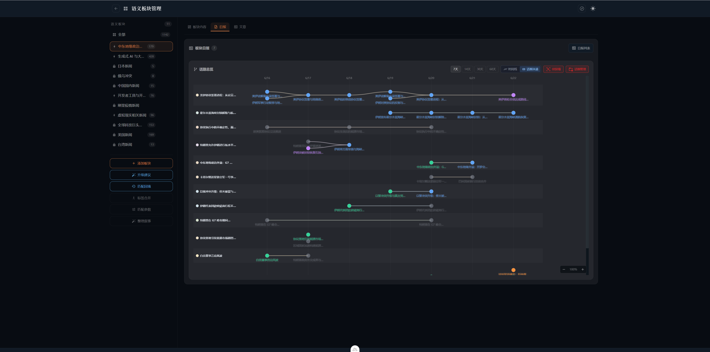
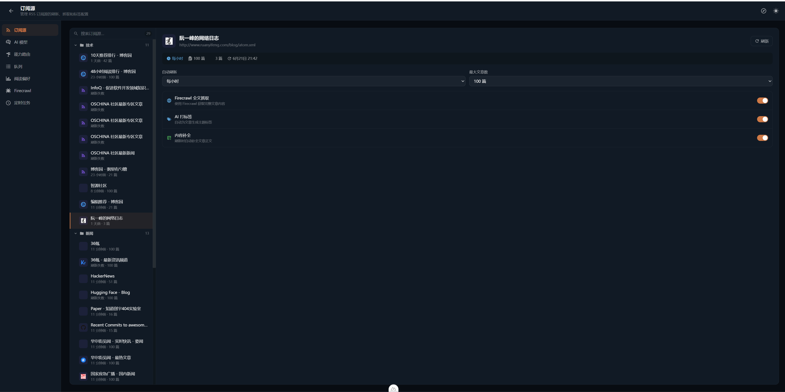
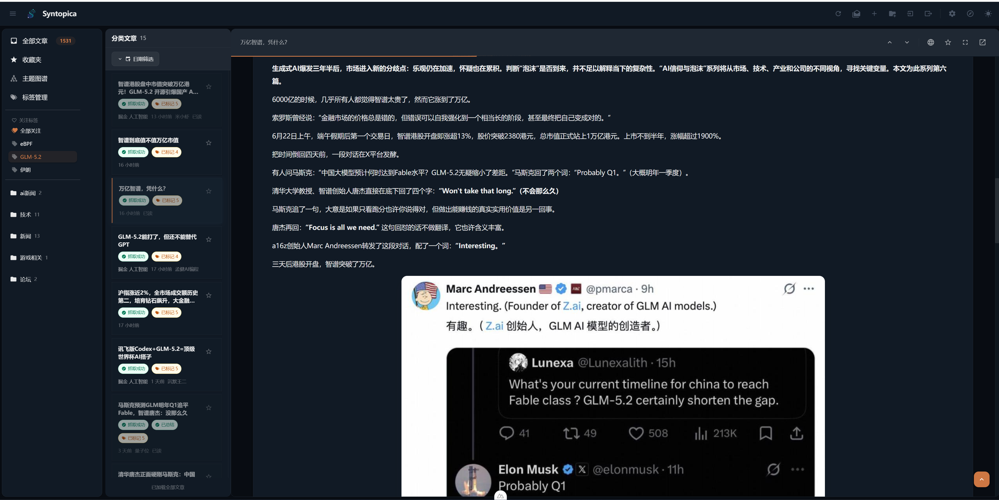
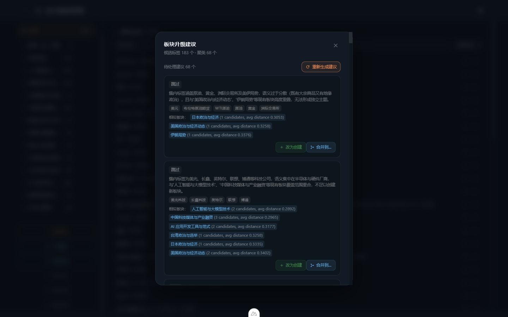
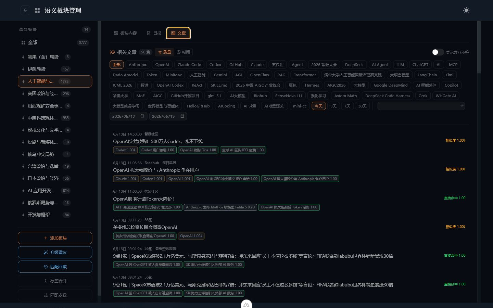
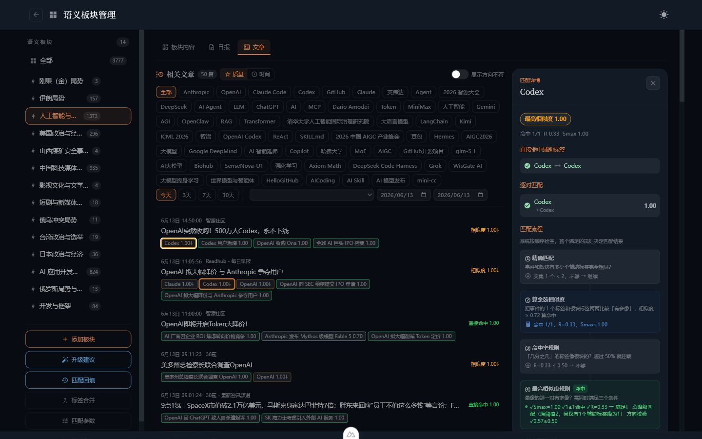
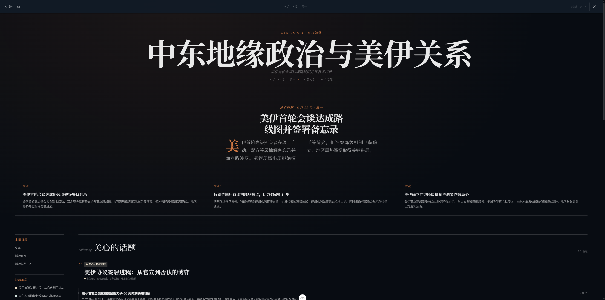
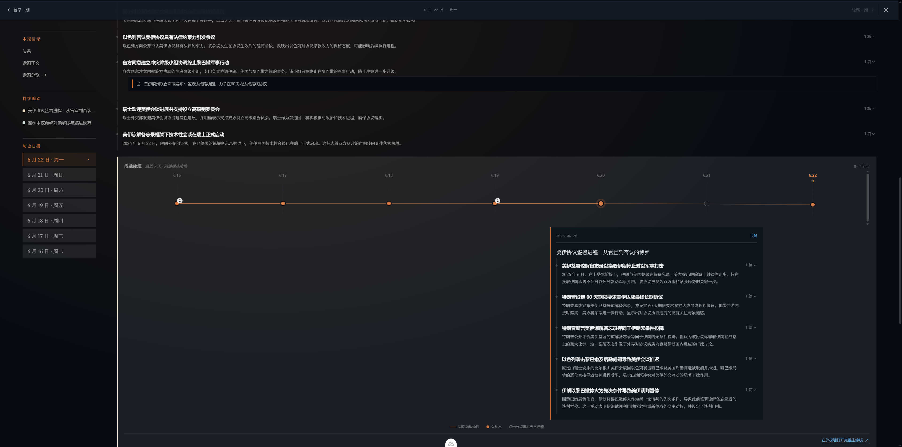
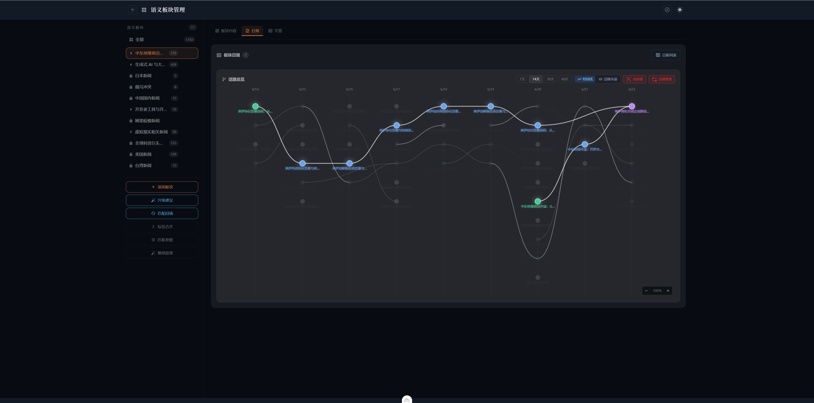

<p align="center">
  
</p>

<h1 align="center">Syntopica</h1>

<p align="center">
  <strong>把分散的信息，整理成可以持续追踪的主题脉络。</strong>
</p>

<p align="center">
  本地优先 · 自选信息源 · 语义板块 · 每日叙事 · 话题演进
</p>

Syntopica 是一个面向个人研究与深度阅读的开源信息工作台。

它从 RSS、RSSHub 和网页等自选信息源持续采集内容，补全正文，生成摘要与语义标签；再把分散的文章归入用户维护的语义板块，形成板块日报、叙事线索、跨日话题演进和主题图谱。

Syntopica 想回答的不是“今天又有多少篇新文章”，而是：

> 我长期关注的领域今天发生了什么？
>
> 哪些内容其实属于同一个事件？
>
> 一个话题是刚刚出现、持续发展，还是正在分化与结束？

<p align="center">
  
</p>

## 为什么做 Syntopica

信息工具已经很多，但几个问题仍然没有自然消失。

### 收集容易，形成认识很难

RSS 阅读器能把不同网站收进一个列表，热点聚合器能告诉你大家正在讨论什么，搜索引擎和 RAG 能回答一次查询。但对于长期关注一个领域的人，真正耗费精力的是后续工作：

- 同一个事件被不同来源反复报道；
- 同一主题每天换一批关键词和表达方式；
- 单篇摘要看完即散，很难与昨天的进展连接；
- 未读数字不断增长，但注意力并没有因此变得更有方向；
- 每次搜索都要重新组织问题，长期关注缺少稳定的容器。

### 单篇 AI 摘要仍然是碎片

让 AI 总结一篇文章并不难。难的是把几十篇文章放在一起，判断哪些内容相关、为什么相关、哪些值得形成一个长期板块，并在第二天继续沿着昨天的线索整理。

因此，Syntopica 没有把聊天框作为核心界面，而是选择了一个更慢、更可维护的对象：**语义板块**。

板块由用户定义边界，AI 负责持续整理，匹配结果保留解释，重要结论可以回到原文复核。

## 一次完整的用户旅程

假设你长期关注 AI Agent、模型基础设施和开发工具。

### 1. 先订阅你信任的信息源

你可以添加、分类和刷新 RSS Feed，也可以通过 OPML 批量导入。对于只提供摘要的 Feed，可选用 Firecrawl 补全网页正文。

这里的数据边界由用户决定。Syntopica 不追求默认覆盖整个公开网络，而是优先整理你主动选择、愿意长期保留的信息源。

<p align="center">
  
</p>

### 2. 系统把文章加工成可组织的信息

文章进入系统后，会依次经历正文补全、AI 内容整理、语义标签提取和 Embedding。每一步都有独立状态，失败任务可以在队列中观察和重试。

阅读页面仍然保留原始来源、原文入口、收藏、已读状态、预览与 iframe 模式。AI 内容是辅助层，不替代原文。
<p align="center">
  
</p>

### 3. 冷启动：从已有内容中发现值得追踪的板块

刚开始使用时，用户往往知道自己“关注 AI”，却不一定已经想好应该建立哪些长期板块。

“升级建议”会从高频辅助标签中收集候选项，结合聚类、相似板块和近期共现事件，让模型判断一组标签是否足以形成独立主题。系统可以建议创建或跳过，用户也可以把建议改为创建，或并入已有板块。

它不是自动替用户决定信息架构，而是把一堆散落标签整理成可审阅的候选方案。

<p align="center">
  
</p>

如果你已经知道自己要追踪什么，也可以直接创建板块。输入名称和描述后，系统会推荐相关标签；确认后执行历史回填，过去的文章也会重新归位。

### 4. 文章进入板块，但匹配不是黑盒

语义板块不是一个关键词收藏夹。

系统会综合精确标签命中、命中率、最高语义相似度和加权规则，将文章归入板块。用户可以按质量或时间查看文章，也可以按构成标签、来源和日期筛选结果。

<p align="center">
  
</p>

点击文章上的匹配标签，可以看到它为什么进入当前板块：直接命中了哪个辅助标签、相似度是多少、逐对匹配结果如何，以及最终命中了哪条规则。

<p align="center">
  
</p>

这也是 Syntopica 的一个重要取舍：AI 可以帮助组织内容，但用户应当能够看到组织依据，并调整标签和阈值，而不是只能接受一个不可解释的推荐结果。

### 5. 日报把文章列表变成当天的叙事

当一天积累了足够内容，Syntopica 会为板块生成日报。

日报先去重和筛选标签，再聚类成事件分组，生成今日重点和叙事线索，并按匹配质量区分核心事件、相关事件和其他动态。每条线索保留关联文章，可以继续展开阅读。

<p align="center">
  
</p>

<p align="center">
  
</p>

这不是把若干单篇摘要拼在一起，而是尝试回答：“这个板块今天主要发生了哪些事，它们分别由哪些文章支撑？”

### 6. 话题总览连接不同日期

单日总结解决了“今天发生什么”，但长期研究还需要知道一个话题如何变化。

话题总览把连续多天的叙事分组排列在时间轴上，并根据语义关系连接相邻节点。节点状态区分新兴、持续、分化、合并和结束。点击节点后，可以查看当天的叙事摘要和关联文章。

<p align="center">
  
</p>

<p align="center">
  
</p>

此外，日报图谱和周报图谱从更全局的尺度呈现事件、人物、关键词与文章之间的关系，适合先观察结构，再进入时间线和原始内容。

<p align="center">
  
</p>

## Syntopica 的产品闭环

```text
自选信息源
    |
    v
订阅刷新与正文补全
    |
    v
AI 整理、标签提取、Embedding
    |
    +----------------------+
    |                      |
    v                      v
辅助标签池             单篇文章阅读
    |
    v
冷启动升级建议 / 手动创建板块
    |
    v
语义匹配与历史文章回填
    |
    +----------------------+
    |                      |
    v                      v
板块文章与匹配解释       板块日报
                           |
                           v
                  跨日话题演进与主题图谱
```

## 与相邻产品的侧重点

Syntopica、传统 RSS 阅读器、热点聚合工具和搜索产品解决的是相邻问题，不是简单的替代关系。

| 产品形态 | 更擅长的任务 | 主要组织单位 |
|---|---|---|
| 传统 RSS 阅读器 | 集中订阅、管理未读、按时间阅读 | Feed 与文章 |
| 热点榜单与舆情工具 | 发现正在流行的内容、监控关键词、及时提醒 | 平台热榜与关键词 |
| 搜索 / RAG | 围绕一个明确问题检索和生成回答 | 查询与回答 |
| **Syntopica** | 对自选信息源做长期语义组织，追踪主题如何变化 | 语义板块、日报与叙事线索 |

### 与 TrendRadar 的区别

[TrendRadar](https://github.com/sansan0/TrendRadar) 更擅长聚合多平台热点与 RSS，进行关键词筛选、AI 分析和多渠道推送。它适合回答：“现在有哪些热点值得立即关注？”

Syntopica 更偏向个人研究工作台：用户先选择信任的信息源，再维护自己的语义板块，查看文章为什么被归类，并通过日报和跨日时间线理解主题演进。它更想回答：“我长期关注的方向最近发生了什么变化？”

两者可以服务同一个用户的不同阶段：前者偏发现和提醒，后者偏整理、阅读、复核与沉淀。

## 适合谁

Syntopica 更适合：

- 长期跟踪技术、行业、政策、学术或竞争动态的个人研究者；
- 已经积累较多 RSS 订阅，但不想只靠未读列表管理注意力的人；
- 需要把多来源报道整理为事件线索的开发者、分析者和内容创作者；
- 希望数据保存在本地，并自行选择本地模型或兼容 API 的用户；
- 愿意维护信息源、标签和板块边界，逐步建立个人信息系统的人。

它目前不太适合：

- 只需要开箱即用热榜和手机推送的轻量用户；
- 需要全网分钟级监测、告警和完整舆情覆盖的业务；
- 需要多人协作、权限、租户和企业审计的团队；
- 不希望维护数据库、抓取服务或 AI 模型配置的用户；
- 把 AI 输出直接作为事实结论、而不回看原文的高风险场景。

## 当前边界与不足

Syntopica 仍在持续迭代。下面这些不是隐藏条件：

- **单用户、无认证。** 默认用于本机或可信内网，不应直接暴露到公网。
- **部署成本高于普通阅读器。** PostgreSQL + pgvector 是核心依赖；全文抓取、本地模型和队列会增加资源消耗。
- **冷启动需要内容积累。** 没有足够的文章、标签和 Embedding 时，升级建议与板块日报不会立刻产生高质量结果。
- **AI 管线存在等待时间。** 正文补全、摘要、打标、Embedding、升级建议和日报生成都可能耗时。
- **结果依赖输入和模型。** RSS 完整度、正文抓取质量、模型指令遵循能力与阈值配置都会影响最终结果。
- **语义组织仍可能犯错。** 匹配解释能帮助发现问题，但不能保证所有文章归类和叙事关系都正确。
- **图谱是观察工具，不是事实数据库。** 重要判断需要回到关联文章和原始来源验证。
- **当前更偏 Web 工作台。** 多渠道推送、移动端体验和团队协作不是现阶段专精方向。

## 功能全景

### 订阅与阅读

- Feed 添加、编辑、删除、手动刷新和全量刷新；
- 分类名称、图标与颜色管理；
- OPML 导入与导出；
- 自动刷新间隔和单 Feed 保留策略；
- 三栏阅读布局、收藏、已读标记和日期筛选；
- 正文预览、原网页 iframe、全屏、上一篇与下一篇。

### 内容增强

- Firecrawl 网页正文抓取；
- RSS 原始内容、抓取正文与 AI 整理稿切换；
- 单篇摘要与语义标签生成；
- 文章重新抓取、重新总结和重新打标；
- 标签关注与按关注标签筛选文章。

### 语义板块

- 手动创建板块与智能推荐构成标签；
- 从辅助标签池生成冷启动升级建议；
- 创建、跳过、改为创建或合并到已有板块；
- 历史文章匹配回填；
- 构成标签和辅助标签维护；
- 匹配参数、方向不符降级和来源/日期筛选；
- 文章匹配分数、逐对相似度与命中规则解释。

### 日报与话题演进

- 每个板块按日生成叙事报告；
- 今日重点、事件聚类、叙事线索和关联文章；
- 核心事件、相关事件与其他动态分层；
- 7/14/30/60 天话题总览；
- 新兴、持续、分化、合并与结束状态；
- 日报图谱、周报图谱和文章时间线。

### AI 与运行管理

- 多 AI Provider 管理；
- 按文章总结、正文补全、主题提取和 Embedding 等能力配置路由；
- 主模型、备用模型、优先级和失败降级；
- Embedding 模型与语义匹配阈值；
- 标签、Embedding 等任务队列监控；
- Feed 刷新、正文补全、日报等定时任务；
- Firecrawl 地址、Key、抓取模式、超时和内容限制；
- 阅读事件、来源评分和偏好统计。

## 快速开始

### 前置条件

- Docker 与 Docker Compose；
- 本地开发需要 Go、Node.js、Corepack 和 `pnpm`；
- 可选：OpenAI 兼容 API、Ollama 或 llama.cpp；
- 可选：Firecrawl，用于网页正文抓取；
- 可选：RSSHub，用于扩展可订阅来源。

### 初始化脚本

初始化脚本会引导完成基础服务、AI Provider 和可选 Firecrawl 配置。

Windows：

```powershell
.\init.ps1
```

Linux：

```bash
bash init.sh
```

启动后访问 `http://localhost:5000`。

### Docker Compose

```bash
# PostgreSQL + Syntopica
docker compose up -d

# 可选：Firecrawl 全文抓取
docker compose -f docker-compose.firecrawl.yml up -d

# 可选：RSSHub + Redis + Browserless
docker compose -f docker-compose.rsshub.yml up -d
```

PostgreSQL 数据默认持久化在 `./data/`。端口和数据库密码可通过 `.env` 调整。

### 本地开发

```powershell
# 1. 启动 PostgreSQL + pgvector
docker compose -f docker-compose.pg.yml up -d

# 2. 启动 Go 后端
cd backend-go
go run cmd/server/main.go

# 3. 新终端启动 Nuxt 前端
cd front
pnpm install
pnpm dev
```

- 前端开发地址：`http://localhost:3000`
- 后端 API：`http://localhost:5000/api`
- WebSocket：`ws://localhost:5000/ws`

## AI 模型配置

模型、API Key、Embedding、能力路由和备用 Provider 都可以在 Web UI 中配置，不需要写入前端配置文件。

### 可选方案

| 方案 | 适合场景 | 说明 |
|---|---|---|
| OpenAI Compatible API | 希望快速使用云模型 | 可连接 OpenAI、DeepSeek 等兼容接口 |
| llama.cpp | 本地部署、希望更强控制力 | OpenAI 兼容接口，文本与 Embedding 可分开部署 |
| Ollama | 本地模型快速试用 | 配置简单，但部分模型的结构化 JSON 遵循能力可能影响效果 |
| 暂不配置 | 先体验基础阅读 | AI 增强、语义板块和日报能力会受限 |

### Ollama 示例

```bash
ollama pull qwen3:8b
ollama pull nomic-embed-text
ollama serve
```

### llama.cpp 示例

从 [llama.cpp Releases](https://github.com/ggml-org/llama.cpp/releases) 下载对应平台的预编译版本，并准备 GGUF 模型。

文本服务：

```bash
./llama-server \
  -m model/Qwen3.5-9B-UD-Q6_K_XL.gguf \
  -c 49152 -ngl 999 \
  --cache-type-k q8_0 --cache-type-v q8_0 \
  --flash-attn on --port 8080 --host 0.0.0.0 \
  --jinja --reasoning-format deepseek \
  --chat-template-kwargs '{"enable_thinking":false}' \
  -np 2
```

Embedding 服务：

```bash
./llama-server \
  -m model/Qwen3-Embedding-4B-Q6_K.gguf \
  -c 8192 --embeddings --pooling mean \
  --host 0.0.0.0 --port 8081
```

如果 Syntopica 运行在 Docker 内，而模型服务运行在宿主机，请使用 `host.docker.internal`，例如：

```text
http://host.docker.internal:8080/v1
http://host.docker.internal:8081/v1
```

### 显存参考

实际占用还会受到 KV Cache、上下文长度、量化方式和并发数影响。

| GPU 显存 | 文本模型参考 | Embedding 模型参考 |
|---|---|---|
| 无 GPU / 4 GB | Qwen3 4B 量化 | Qwen3 Embedding 0.6B |
| 6-8 GB | Qwen3 8B 量化 | Qwen3 Embedding 0.6B / 4B |
| 12 GB | Qwen3.5 9B 量化 | Qwen3 Embedding 4B |
| 16 GB | Qwen3 14B 量化 | Qwen3 Embedding 4B |
| 24 GB+ | Qwen3 32B 量化 | Qwen3 Embedding 4B |

## 技术架构

- **Frontend:** Nuxt 4、Vue 3、TypeScript、Pinia、Tailwind CSS v4
- **Backend:** Go、Gin、GORM
- **Storage:** PostgreSQL、pgvector
- **Optional services:** Redis、Firecrawl、RSSHub、Browserless
- **Realtime:** WebSocket
- **AI integration:** OpenAI Compatible、Ollama、llama.cpp、按能力路由和主备降级

```text
Syntopica/
├── front/                              # Nuxt 4 前端
├── backend-go/                         # Go + Gin 后端
├── docs/reference/                     # 当前架构、API、数据库和开发文档
├── docs/v1.x/                          # 版本设计与里程碑记录
├── docs/experience/                    # 产品体验与演示材料
├── tests/workflow/                     # 工作流集成测试
├── tests/firecrawl/                    # Firecrawl 集成测试
├── docker/                             # Docker 构建配置
├── img/                                # README 与演示图片
├── docker-compose.yml                  # 完整部署
├── docker-compose.pg.yml               # 本地开发 PostgreSQL
├── docker-compose.firecrawl.yml        # 可选 Firecrawl
└── docker-compose.rsshub.yml           # 可选 RSSHub
```

## 文档

- [架构总览](docs/reference/architecture/overview.md)
- [后端架构](docs/reference/architecture/backend.md)
- [前端架构](docs/reference/architecture/frontend.md)
- [运行时与调度器](docs/reference/architecture/runtime.md)
- [数据流](docs/reference/architecture/data-flow.md)
- [API 索引](docs/reference/api/_index.md)
- [语义板块 API](docs/reference/api/semantic-boards.md)
- [日报 API](docs/reference/api/daily-reports.md)
- [主题图谱 API](docs/reference/api/topic-graph.md)
- [数据库文档](docs/reference/database/_index.md)
- [配置说明](docs/reference/configuration.md)
- [开发指南](docs/reference/development.md)
- [测试指南](docs/reference/testing.md)
- [部署指南](docs/reference/deployment.md)

## 贡献

欢迎通过 Issue 描述真实使用场景、信息源兼容问题、错误归类或可复现缺陷。

提交代码前请阅读根目录以及 `front/`、`backend-go/` 下的 `AGENTS.md`，并保持改动范围聚焦。

## License

[GNU General Public License v3.0](LICENSE)
