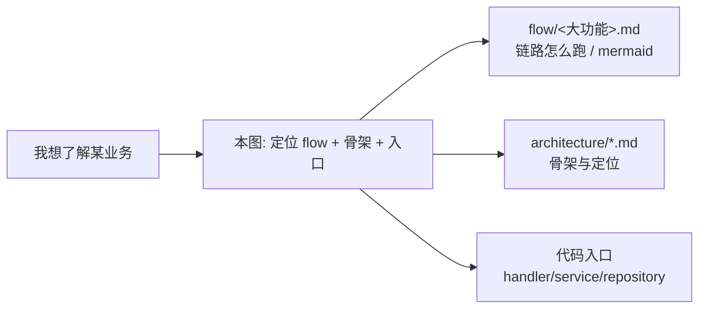

# 详细设计地图（Map）

> **索引层**：业务域 → 流程文档（flow/）→ 架构骨架（architecture/）→ 代码入口。
> 这是从“我想了解某个业务怎么跑”出发的导航总图。架构骨架文档（overview/backend/frontend/runtime/tracing）描述定位与骨架；flow/ 描述链路怎么跑；本图把它们和代码入口连起来。
>
> **另见**：[coupling-map.md](coupling-map.md) — 跨功能传导耦合登记表（“改 A 会影响 B”），配合《开发执行规范》§7 架构体检使用。

## 三层关系

## 业务域索引

| 业务域 | 流程设计（flow/） | 架构骨架（architecture/） | 后端入口 | 前端入口 |
|--------|------------------|--------------------------|----------|----------|
| 阅读 | [reading.md](../flow/reading.md) | [frontend.md](frontend.md) §页面骨架 | `internal/reader/{handler,service}/` | `features/articles/`、`features/shell/`、`stores/` |
| 内容增强 | [content-enrichment.md](../flow/content-enrichment.md) | [backend.md](backend.md) §具体数据链路示例 | `internal/reader/handler/`、`internal/platform/`(firecrawl) | `features/articles/`、`app/api/` |
| AI 总结 | [ai-summary.md](../flow/ai-summary.md) | [backend.md](backend.md) | `internal/reader/`、`internal/platform/airouter/`、`internal/platform/ws/` | `features/ai/` |
| 日报 / Digest | [daily-report.md](../flow/daily-report.md) | [tracing.md](tracing.md) | `internal/admin/`(scheduler, daily_report job)、`internal/topicgraph/` | `features/ai/`(Digest 预览)、`features/articles/`(关联文章)、`features/tags/components/daily-report/`(section 可视化与匹配血缘) |
| 话题图谱 | [topic-graph.md](../flow/topic-graph.md) | [backend.md](backend.md) | `internal/topicgraph/{handler,service,repository}/` | `features/tags/`、`tests/e2e/topic-graph.spec.ts` |
| 语义版块 | [semantic-board.md](../flow/semantic-board.md) | [backend.md](backend.md) | `internal/tagmanagement/{handler,service}/`(auxlabel, board) | `features/tags/` |
| 定时任务（横切） | [scheduler.md](../flow/scheduler.md) | [runtime.md](runtime.md) §Scheduler | `internal/admin/scheduler/`、`internal/app/`(runtime) | `features/settings/` |

## 横切基础设施（非业务域，不进 flow/）

| 基础设施 | 架构文档 | 入口 |
|---------|---------|------|
| 运行时 / 启动 / 优雅退出 | [runtime.md](runtime.md) | `internal/app/runtime.go`、`cmd/server/main.go` |
| 路由面 | [runtime.md](runtime.md) §当前路由面 | `internal/app/router.go` |
| 链路追踪（OpenTelemetry） | [tracing.md](tracing.md) | `internal/platform/tracing/` |
| WebSocket / 事件流 | [frontend.md](frontend.md) §实时事件流 | `internal/platform/ws/`、前端 `composables/useEventStream` |
| 数据库 | [overview.md](overview.md)、[database/](../database/) | `internal/platform/database/` |

## 代码规约去哪查

- 代码怎么写、包怎么分层、lint/测试配置 → [`standard/`](../standard/README.md)
- 业务链路怎么跑 → [`flow/`](../flow/README.md)
- 架构骨架与定位 → 本目录其余文档
