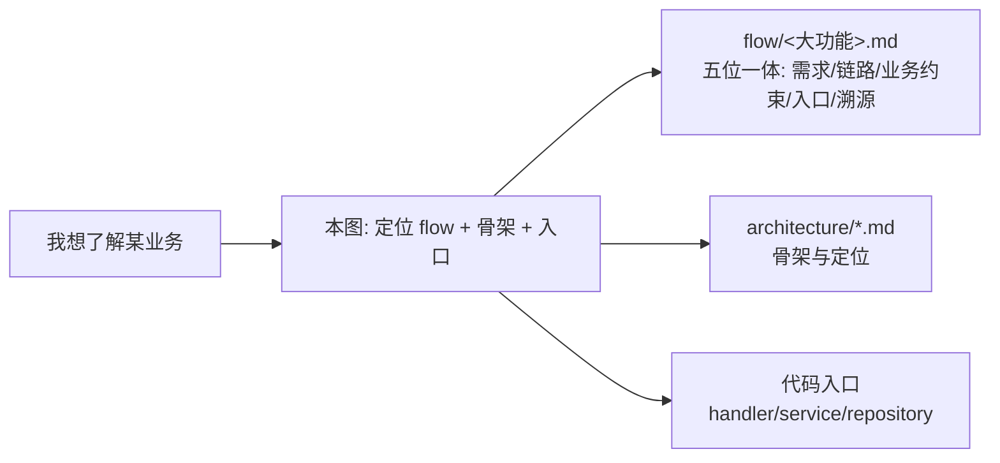

# 详细设计地图（Map）

> **索引层**：业务域 → 流程文档（flow/）→ 架构骨架（architecture/）→ 代码入口。
> 这是从“我想了解某个业务怎么跑”出发的导航总图。架构骨架文档（overview/backend/frontend/runtime/tracing）描述定位与骨架；flow/ 是五位一体活文档（需求说明 / 链路设计 / 业务约束与不变量 / 代码入口 / 变更溯源）；本图把它们和代码入口连起来。
>
> **另见**：[coupling-map.md](coupling-map.md) — 跨功能传导耦合登记表（“改 A 会影响 B”），配合《开发执行规范》§7 架构体检使用。
>
> **另见**：[ui-navigation.md](ui-navigation.md) — 前端多步导航地图（板块日报 → 话题 → section → thread 等），给 Playwright / DeepSeek v4 Flash 按需功能验证复用。

## 三层关系

## 业务域索引

| 业务域 | 流程设计（flow/） | 架构骨架（architecture/） | 后端入口 | 前端入口 |
| -------- | ------------------ | -------------------------- | ---------- | ---------- |
| 阅读 | [reading.md](../flow/reading.md) | [frontend.md](frontend.md) §页面骨架 | `internal/reader/{handler,service}/` | `features/articles/`、`features/shell/`、`stores/` |
| 偏好画像与订阅源发现 | [discovery.md](../flow/discovery.md) | [backend.md](backend.md) | `internal/admin/`（preference_profile/recommendation/catalog_sync service + handler + 两 scheduler job） | `features/discovery/`、`pages/discovery.vue`、`features/settings/`（兴趣画像 / RSSHub 实例配置 section） |
| 内容增强 | [content-enrichment.md](../flow/content-enrichment.md) | [backend.md](backend.md) §具体数据链路示例 | `internal/reader/handler/`、`internal/platform/`(firecrawl) | `features/articles/`、`app/api/` |
| 数据富化编排 | [data-enrichment.md](../flow/data-enrichment.md) | [backend.md](backend.md) | `internal/dataenrichment/`（`enrich_board.go` 版块级编排、`situation_cards.go` 态势卡、`freshness_gate.go` 新鲜度门、`reference_roles.go` 画像注入） | `features/tags/`(`BoardEnrichmentPanel.vue` 版块分析主视图+聚焦分析、`BoardAnalysisReport.vue` 论文式报告、`DebateSection.vue`、`composables/useBoardEnrichment.ts`)、设置页 `ReferenceRolePanel.vue` |
| AI 调用路由 | [ai-summary.md](../flow/ai-summary.md) | [backend.md](backend.md) | `internal/platform/airouter/`、`internal/platform/aihealth/`(启动健康检测 + 自动拉起 + 内存快照 + `Healthy()`)、`internal/reader/`(调用方)、`internal/platform/ws/` | `features/ai/`(AI 路由/供应商配置面板 + 嵌入队列面板；非日报/叙事入口) |
| 日报 / Digest | [daily-report.md](../flow/daily-report.md) | [tracing.md](tracing.md) | `internal/admin/`(scheduler, daily_report job)、`internal/topicgraph/` | `features/tags/components/daily-report/`(日报全屏阅读层 + section 可视化)、`features/articles/`(关联文章正文)、`app/utils/{topicAnchor,matchQuality,threadFit}.ts`(observability: System 1 tag↔板块 / System 2 section↔话题 / System 3 thread↔section) |
| 话题图谱 | [topic-graph.md](../flow/topic-graph.md) | [backend.md](backend.md) | `internal/topicgraph/{handler,service,repository}/` | `features/tags/`、`tests/e2e/topic-graph.spec.ts` |
| 语义版块 | [semantic-board.md](../flow/semantic-board.md) | [backend.md](backend.md) | `internal/tagmanagement/{handler,service}/`(auxlabel, board) | `features/tags/` |
| 定时任务（横切） | [scheduler.md](../flow/scheduler.md) | [runtime.md](runtime.md) §Scheduler | `internal/admin/scheduler/`、`internal/app/`(runtime)（analysis-pause 健康门：`internal/platform/analysispause/` + `internal/platform/aihealth/`，`IsPaused` = 用户暂停 \|\| 模型不健康） | `features/settings/` |

> 日报域三套 observability 并列、展示面互补（System 1 tag↔板块 / System 2 section↔话题 / System 3 thread↔section），入口 utils 见上行，细节见 [daily-report.md](../flow/daily-report.md) §0/§4。

## 横切基础设施（非业务域，不进 flow/）

| 基础设施 | 架构文档 | 入口 |
| --------- | --------- | ------ |
| 运行时 / 启动 / 优雅退出 | [runtime.md](runtime.md) | `internal/app/runtime.go`、`cmd/server/main.go` |
| 路由面 | [runtime.md](runtime.md) §当前路由面 | `internal/app/router.go` |
| 链路追踪（OpenTelemetry） | [tracing.md](tracing.md) | `internal/platform/tracing/` |
| WebSocket / 事件流 | [frontend.md](frontend.md) §实时事件流 | `internal/platform/ws/`、前端 `composables/useEventStream` |
| 数据库 | [overview.md](overview.md)、[database/](../database/) | `internal/platform/database/`（迁移执行器支持事务外执行 `RunOutsideTx` / 声明性 `Down` / `withLockTimeout` 锁守卫，编写规范见 [standard/backend/code-style.md](../standard/backend/code-style.md)「迁移编写规范」） |

## 代码规约去哪查

- 代码怎么写、包怎么分层、lint/测试配置 → [`standard/`](../standard/README.md)
- 业务链路怎么跑 / 业务约束与不变量 → [`flow/`](../flow/README.md)（五位一体；业务约束节是 constraint-injection extension 注入数据源）
- 架构骨架与定位 → 本目录其余文档

## 前端交互验证怎么跑

- **导航地图**：[ui-navigation.md](ui-navigation.md)（多步导航 + 选择器 + 断言锚点，增量维护）
- **验证方式**：opencli 按需交互验证 + kimi-coding/k3 视图验证（断言现写现跑，不堆固定回归脚本）；规则见 [开发执行规范.md §5.3](../开发执行规范.md)，派发模板见 `.agents/skills/ui-verify/`
- **交互约定**：状态标记左对齐、状态说明不伪装动作、可观测性展示分层 → [`standard/frontend/interaction-conventions.md`](../standard/frontend/interaction-conventions.md)
- **稳定 smoke**：`front/tests/e2e/{baseline,daily-report-magazine}.spec.ts`（仅页面骨架/响应式，不堆业务交互回归）
