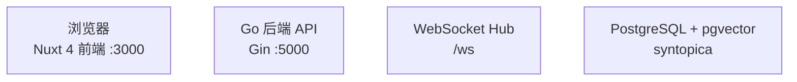

<!-- generated-by: gsd-doc-writer -->
# 项目架构总览

## 系统概述

Syntopica 是一个个人部署的 RSS 阅读器，采用前后端分离的单体架构。Go 后端（Gin + GORM + PostgreSQL + pgvector）负责 RSS 订阅拉取、文章持久化、AI 内容增强（Firecrawl 全文抓取、AI 整理稿生成）、叙事摘要生成和阅读偏好追踪。Nuxt 4 前端（Vue 3 + Pinia + Tailwind CSS v4）以 FeedBro 风格三栏布局呈现订阅、文章和正文。前后端通过 REST API 和 WebSocket 通信，系统面向单用户部署，不含认证体系。

> **注意：SQLite 版本已归档到 `sqlite` 独立分支，主分支不再维护 SQLite 支持。如需使用 SQLite 版本请切换到 `sqlite` 分支。**

## 技术栈

| 层级 | 技术 | 说明 |
| ------ | ------ | ------ |
| 前端 | Nuxt 4 + Vue 3 + TypeScript + Pinia + Tailwind CSS v4 | SSR/SPA 混合，Composition API |
| 后端 | Go + Gin + GORM + PostgreSQL + pgvector | 单二进制 HTTP 服务 |
| AI | OpenAI 兼容 API（通过 airouter 多 provider 路由） | 摘要、内容补全、主题分析 |
| 全文抓取 | Firecrawl | RSS 摘要补全为完整正文 |
| 实时通信 | Gorilla WebSocket | AI 摘要队列进度推送 |
| 定时任务 | internal/admin/scheduler（自研调度器工厂 + Interval） | feed 刷新、摘要生成、偏好更新、digest 输出 |
| 可观测性 | OpenTelemetry + GORM Span Exporter（存入 PostgreSQL） | 链路追踪落库 + 查询 API |
| 配置 | Viper + `configs/config.yaml` | 运行时配置加载 |
| 部署 | Docker Compose | 前后端 + PostgreSQL 三容器，pgdata 持久化卷 |
| 许可证 | GNU General Public License v3 | 见 [LICENSE](../../LICENSE) |

## 组件关系图



### Mermaid 图例 / 读图说明

- 节点框：表示一个组件、服务或状态节点；框内通常是名称 + 补充信息。
- 箭头：表示方向性关系。组件图里通常表示调用、依赖或数据流；状态图里表示状态迁移。
- 起点 / 终态：在 `stateDiagram-v2` 中，`[*] --> 状态A` 表示入口，`状态B --> [*]` 表示终态或流程结束。
- 标签：箭头旁的文字一般表示触发条件、动作或迁移原因；如果没有标签，默认按箭头方向阅读即可。

当前文档里的 Mermaid 主要是组件关系图；如果后续文档出现状态图，建议按“起点 -> 中间状态 -> 终态”的顺序阅读，再看每条箭头上的条件说明。

## 核心子系统

### 1. 订阅与文章（基础数据面）

Feed 管理（`backend-go/internal/reader/`）和文章管理构成系统的基础数据层。Feed 刷新拉取 RSS 源、去重入库文章，后续所有增强能力（Firecrawl、内容补全、摘要、主题分析）都建立在文章记录之上。Feed 配置项（`firecrawl_enabled`、`article_summary_enabled`、`refresh_interval`）决定文章入库后的初始状态流转。

### 2. AI 与内容增强

两层叠加架构：

- **AI Router**（`backend-go/internal/platform/airouter/`）：管理多 AI provider 和 capability route，支持 failover
- **内容处理**（`backend-go/internal/reader/service/`）：Firecrawl 全文抓取、AI 内容补全生成整理稿

### 3. 主题图谱

拆分为 `tagmanagement/` 和 `topicgraph/` 域，形成从标签提取到叙事摘要的完整链路：

- `tagmanagement`（标签系统域）：标签提取、co-tag 扩展、元数据标注、辅助标签管理、语义板匹配与概念、标签合并、关注标签
- `topicgraph`（主题图谱域）：每日报告生成

此外，`tagmanagement` 还承担了以下高级能力：

- Tag embedding 向量化与自动合并（源 DELETE，不再使用 status='merged'）
- Event 标签多行 embedding（semantic title + event_keyword 关键词行）
- SemanticBoard 匹配与升级建议
- 合并后 re-embedding 队列
- Sector（板块概念）生成：auto / LLM / manual 三种模式
- rebuild_jobs 重建任务（模板变更触发批量重放）
- 7 Phase 层级清理（僵尸 Tag → 低质量 → 空 Node → 同 Level 去重 → Template 校验 → Sector 健康 → 聚类信号）

`tagmanagement/service/watched` 负责：

- 关注标签（watched tags）管理

### 4. 叙事摘要

叙事摘要（narrative）生成管线已废弃——生成能力并入 `daily_report` 日报（见 `flow/daily-report.md`）。`narrative_summaries`/`narrative_boards` 两张表仅保留只读历史数据，前端经 `/api/semantic-boards/:id/narratives`（`getBoardNarratives`）访问。原 `/api/narratives/*` 路由已全部移除。

### 4.5 话题总览工作台

话题总览工作台（`front/app/features/tags/components/BoardThreadBrowser.vue`）是叙事摘要的前端编排入口，把持久话题（persistent topic）从纯算法产物升级为用户可干预的编排对象。工作台占满 content：顶部工具条（时间范围选择器 / 视图模式切换 / 回刷归属 / 合并 / 新建泳道）+ 主体 lanes 总览（话题标签列 + 时间网格），泳道 hover 出操作菜单（重命名 / 归档 / 删除）。原 `TopicManageDialog.vue` 弹窗能力（回刷 / 重命名 / 归档 / 合并）已并入工具条与 hover 菜单，弹窗弃用。

视图模式四态：`timeline`（匈牙利相似度 DAG，默认）、`lanes`（按话题分泳道，identity 驱动）、`focus`（单话题专注）、`compose`（手动建泳道编排态，预览 + 候选池 + 体检报告）。

手动建泳道是用户即时操作（独立 API + 事务，不在 `SaveReport` 日报生成流程内）。后端 `topicgraph/repository.CreateManualTopic` 在单事务内：聚合选中 section 的 embedding（mean pooling 纯向量，不走 AI）→ `CreateTopic(status=active, source=manual)` 绕过 candidate 门禁 → 批量 `UpdateSectionTopicAssignment(confidence=manual)` 覆盖单值归属 → `RebuildBoardRelations` 幂等重建该 board 全部关系（含 identity 边）。任一步失败整事务回滚。建好的 active topic 在下一期日报被 `ListAnchorableTopicsByBoard` 纳入 AND-gate，与算法生成的 active topic 一视同仁。`board_persistent_topics.source` 区分 `auto`（算法）/ `manual`（人工），`daily_report_sections.topic_match_confidence` 第四态 `manual` 标记人工归属（不套用算法三态样式）。

### 5. 阅读偏好

行为追踪与偏好分析（`backend-go/internal/admin/`），前端批量上报阅读事件，后端计算偏好分数并更新排序权重。

### 6. 链路追踪

OpenTelemetry 集成（`backend-go/internal/platform/tracing/`），HTTP 请求和调度器入口自动创建 span，自定义 GORM Span Exporter 落库到 PostgreSQL 的 `otel_spans` 表，提供 trace 查询和统计 API。

## 数据流

> 业务链路的详细设计已迁至 [`flow/`](../flow/README.md)（按大功能切分，配 mermaid）。本节只给定位。

主数据流：RSS 源 → 后端拉取/解析 → PostgreSQL 持久化 → 可选（Firecrawl 全文抓取 / 内容补全 / AI 总结 / Digest 聚合 / 标签向量化 / 叙事生成）→ 前端 REST API + WebSocket → Pinia store 映射 → feature 组件渲染。

前端内部：`pages`（路由入口）→ `features/*/components`（业务壳）→ `app/api/*`（唯一 HTTP 边界）→ `stores/api.ts`（主数据源 `useApiStore`）→ `stores/feeds.ts` + `stores/articles.ts`（派生视图）→ 组件渲染。

逐条链路的代码级追读见 [`map.md`](map.md) 与各 `flow/<大功能>.md`。

## 目录结构

```text
my-robot/
├── front/                    # Nuxt 4 前端
│   ├── app/
│   │   ├── api/              # 唯一 HTTP 边界，领域 API 模块
│   │   ├── assets/css/       # 全局主题与样式
│   │   ├── components/       # 通用可复用组件（ai, article, category, common, dialog, feed, layout）
│   │   ├── composables/      # 跨 feature 通用能力（useAI, useRssParser）
│   │   ├── features/         # 业务实现主体（shell, articles, feeds, preferences, ai）
│   │   ├── pages/            # Nuxt 路由入口（index, topics）
│   │   ├── plugins/          # Nuxt 插件（dayjs）
│   │   ├── stores/           # Pinia store（api, feeds, articles, preferences, aiAnalysis）
│   │   ├── types/            # 领域类型定义（api, article, category, feed, ai, common, reading_behavior, scheduler, timeline）
│   │   └── utils/            # 常量和纯工具函数（api, date, text, storage, constants 等）
│   ├── server/               # Nuxt 服务端工具
│   ├── public/               # 静态资源
│   ├── tests/                # 前端单元测试
│   ├── nuxt.config.ts        # Nuxt 配置
│   └── package.json
├── backend-go/               # Go + Gin 后端
│   ├── cmd/                  # 启动入口（server）
│   ├── configs/              # 配置文件（config.yaml）
│   └── internal/
│       ├── app/              # 应用装配（router.go, runtime.go）
│       ├── models/           # 共享 GORM 模型
│       ├── admin/            # 管理后台域（AI、调度器、偏好）
│       ├── reader/           # 订阅与文章域
│       ├── tagmanagement/    # 标签系统域
│       ├── topicgraph/       # 主题图谱域
│       └── platform/         # 共享基础设施（config, database, logging, middleware, ws, airouter, aisettings, tracing, jsonutil, testutil）
├── docs/                     # 项目文档
│   ├── architecture/         # 架构文档（本文档及子模块架构）
│   ├── api/                  # API 文档（按领域拆分，见 api/_index.md）
│   ├── guides/               # 功能指南（content-processing, topic-graph 等）
│   ├── operations/           # 运维文档（development, database, troubleshooting 等）
│   ├── database/             # 数据库字段说明
│   ├── experience/           # 经验沉淀（踩坑记录、编码安全）
│   └── plans/                # 历史设计/实施计划
├── tests/                    # 独立测试
│   ├── workflow/             # Python 集成测试（scheduler、workflow）
│   └── firecrawl/            # Firecrawl 集成检查
├── docker/                   # Docker 相关配置
│   └── postgres/             # PostgreSQL 迁移支持
├── data/                     # PostgreSQL 数据持久化
├── docker-compose.yml        # Docker Compose PostgreSQL 服务（pgvector 扩展）
├── .env.example              # 环境变量模板
├── AGENTS.md                 # 代理协作规则
└── README.md                 # 项目简介与启动指南
```

## 关键设计决策

- **单用户部署**：不含认证体系，前后端直连，适合个人使用场景
- **PostgreSQL + pgvector 持久化**：支持向量检索、关系查询，通过 Docker volume 持久化
- **状态位驱动的内容增强**：文章入库时按 feed 配置设置 `firecrawl_status` 和 `summary_status`，后续调度器按状态位流转处理
- **Feature-based 前端组织**：业务逻辑按 feature 目录组织（`features/*`），不再堆积在通用 `components/` 目录
- **snake_case → camelCase 边界映射**：后端 snake_case 在 API/store 边界统一转 camelCase，组件层不处理字段映射
- **统一调度器管理**：9 类后台任务通过统一 runtime 启动，统一 `/api/schedulers/*` API 查询状态和手动触发
- **多 provider AI 路由**：airouter 管理 provider 和 capability route，支持 failover，而非单 provider 调用

## 后台调度器一览

| 调度器 | 间隔 | 职责 |
| -------- | ------ | ------ |
| AutoRefresh | 60 秒 | 扫描到点 feed 并触发 RSS 刷新 |
| Firecrawl | 300 秒 | 抓取待处理文章完整正文 |
| ContentCompletion | 60 秒 | 基于 Firecrawl 正文生成 AI 整理稿 |
| PreferenceUpdate | 1800 秒 | 更新阅读偏好分数 |
| BlockedArticleRecovery | 3600 秒 | 恢复因 Firecrawl 配置变更等原因阻塞的文章 |
| DailyReport | 86400 秒 | 基于活跃主题标签生成每日叙事摘要 |
| TagQualityScore | 3600 秒 | 重算 topic_tags.quality_score |
| LogCleanup | 86400 秒 | 清理过期日志 |
| AuxLabelCleanup | 3600 秒 | 清理辅助标签 |

## API 面概览

后端通过 `backend-go/internal/app/router.go` 注册以下主路由组：

| 路由组 | 职责 |
| -------- | ------ |
| `/api/categories` | 分类 CRUD |
| `/api/feeds` | 订阅 CRUD、刷新、OPML |
| `/api/articles` | 文章列表、详情、状态更新、统计、标签管理 |
| `/api/ai` | AI provider/route 管理、单篇摘要 |
| `/api/summaries` | 摘要列表、队列任务 |
| `/api/content-completion` | 文章级内容补全触发与状态 |
| `/api/firecrawl` | Firecrawl 抓取、配置、状态 |
| `/api/schedulers` | 统一调度器状态查询和手动触发 |
| `/api/reading-behavior` | 阅读行为上报 |
| `/api/user-preferences` | 偏好查询与更新 |
| `/api/embedding` | Embedding 配置与队列管理 |
| `/api/topic-tags` | 关注标签、标签合并预览 |
| ~~`/api/narratives`~~ | 已废弃（并入 daily_report；历史数据经 `/api/semantic-boards/:id/narratives` 只读） |
| `/api/traces` | 链路追踪查询与统计 |
| `/ws` | WebSocket 实时推送 |

## 部署方式

系统通过 Docker Compose 部署：

- **PostgreSQL 模式**（`docker-compose.yml`，默认）：前后端 + PostgreSQL + pgvector 三容器，数据库通过 `pgdata` volume 持久化，支持向量检索
- **SQLite 模式**：已归档到 `sqlite` 分支，使用 `docker-compose.sqlite.yml` 部署，主分支不再维护

默认端口：前端 `http://localhost:3000`，后端 `http://localhost:5000`。开发模式下前端默认运行在 `http://localhost:3000`。

## 相关文档

- [后端架构](backend.md)：Go 后端分层、目录结构、数据模型、业务链路详解
- [后端运行时](runtime.md)：启动顺序、调度器管理、路由面、优雅退出
- [前端架构](frontend.md)：Nuxt 4 分层、feature 组织、数据映射规则、设计系统
- [前端组件分工](frontend-components.md)：各 feature 组件职责与交互关系
- [业务流程](../flow/README.md)：主链路、前端状态职责、定时任务链路、叙事数据流
- [详细设计地图](map.md)：业务域 → 流程文档 → 架构骨架 / 代码入口
- [链路追踪](tracing.md)：OpenTelemetry 集成、埋点分层、查询 API
- [数据库字段说明](../database/DATABASE_FIELDS.md)：35 张表完整字段字典
- [全局实体关系图](../database/ER_DIAGRAM.md)：FK 关系图与约束矩阵
- [数据生命周期](../database/DATA_LIFECYCLE.md)：6 条数据链路的状态字段流转
- [开发指南](../development.md)：构建、测试、验证命令
- [内容增强](../flow/content-enrichment.md)：Firecrawl + AI 内容补全流程
- [API 文档](../api/_index.md)：按领域拆分的 REST API 参考
