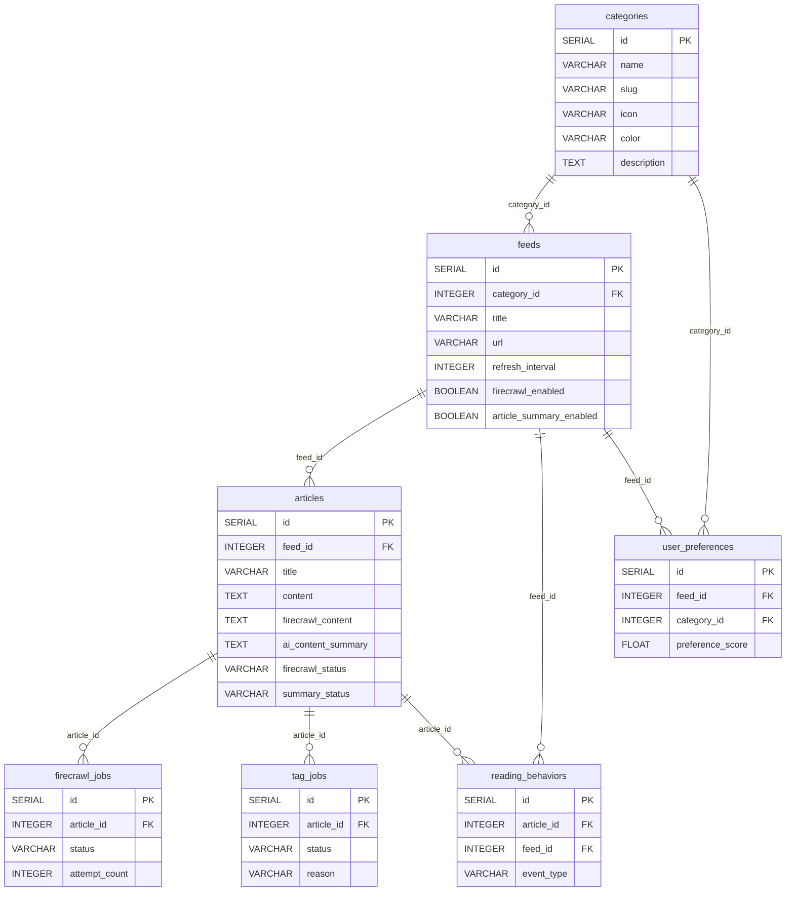
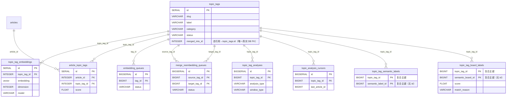
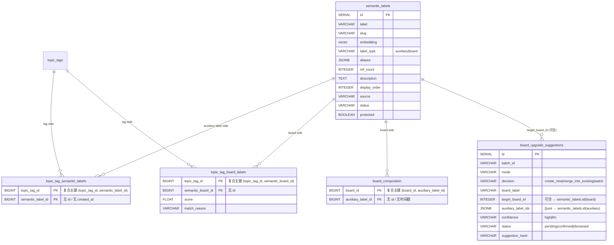
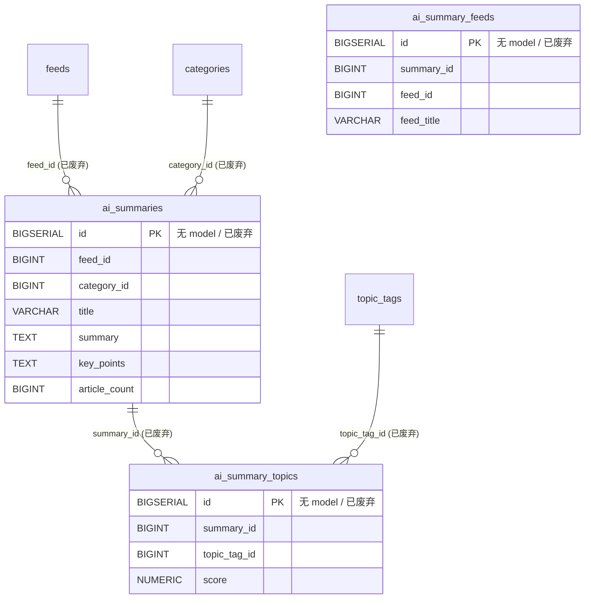
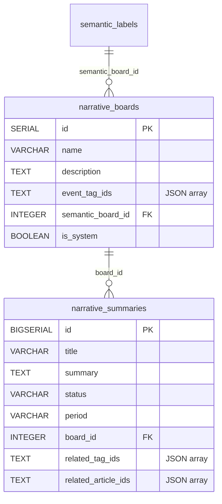
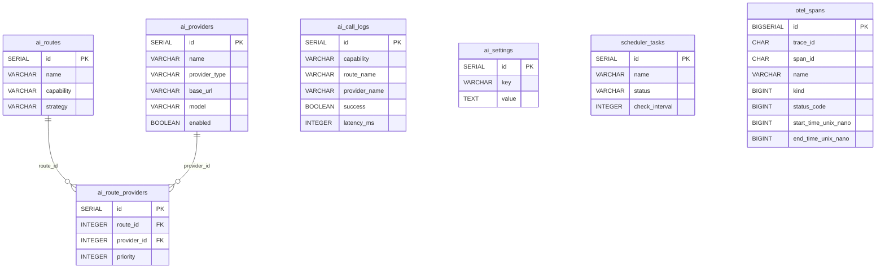
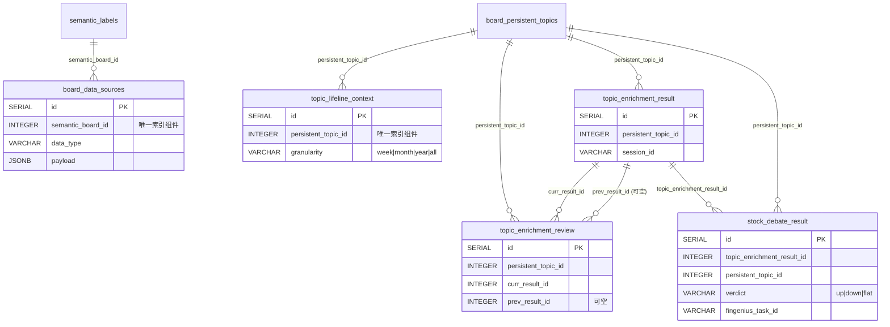
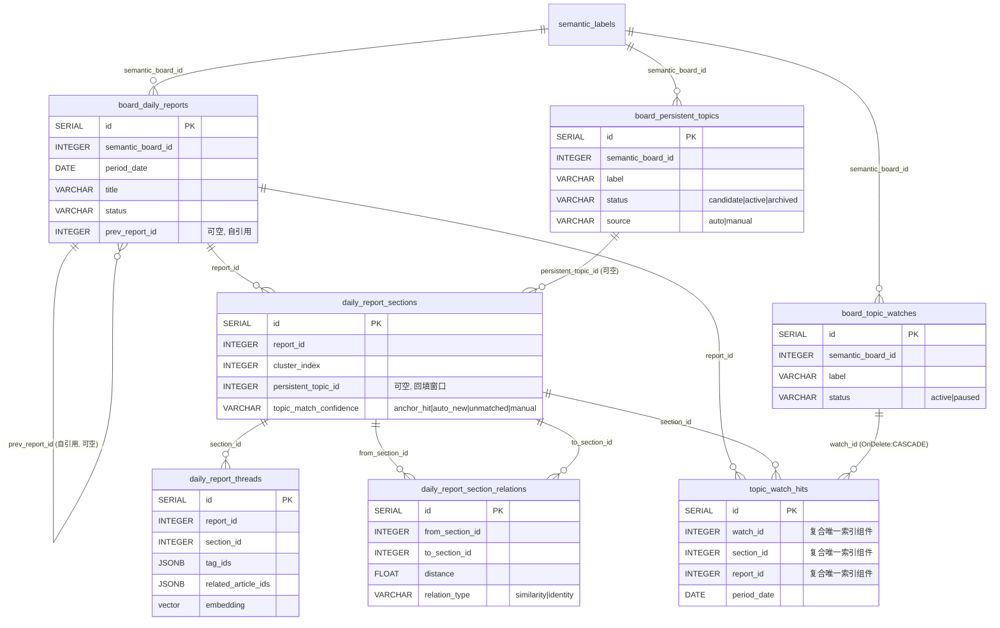

# 全局实体关系图

本文档提供 Syntopica 数据库的全局实体关系图，覆盖 **43 张业务表**（30 Core + 5 DataEnrichment + 7 TopicGraph 日报域 + 1 Tracing），按业务域组织。

> 域级 ER 图使用 Mermaid `erDiagram` 语法，渲染依赖 GitHub/VSCode Mermaid 插件。全局概览图使用纯 ASCII 作为 fallback。

---

## ⚠️ 外键约束真相（必读）

**本文档历史上把所有 GORM 关联都画成了「FK 约束」，这是系统性的误导。** 真相如下（代码权威）：

1. **GORM 全局关闭外键迁移**：`backend-go/internal/platform/database/db.go` 设置 `DisableForeignKeyConstraintWhenMigrating: true`。
2. **迁移 `20260601_0001` 主动 DROP 了历史上 `embedding_queues` / `merge_reembedding_queues` / `topic_tag_embeddings` / `topic_tag_relations` / `topic_tags` 的全部 `fk_*` 约束**（`postgres_migrations.go:472-520`）。
3. **全库真实存在的 DB 级外键共 2 条**：
   - `topic_tags_merged_into_id_fkey`（`topic_tags.merged_into_id → topic_tags.id ON DELETE CASCADE`，迁移 `20260601_0001`）；
   - `fk_topic_watch_hits_watch`（`topic_watch_hits.watch_id → board_topic_watches.id ON DELETE CASCADE`，迁移 `20260801_0002`，对齐 GORM model tag 意图——`DisableForeignKeyConstraintWhenMigrating` 致 AutoMigrate 不建 FK，由版本迁移补齐）。
4. 其余所有「关联」都是 **GORM 应用层逻辑关联**（struct 的 `foreignKey` tag），DB 层**没有**对应的外键约束，`constraint_name` 形如 `fk_feeds_articles`、`fk_categories_feeds` **在数据库里并不存在**。
5. **级联删除（OnDelete:CASCADE）声明很不一致**：只有部分 GORM tag 声明了 `constraint:OnDelete:CASCADE`，很多关联没有任何级联声明。详见下方 [FK 引用矩阵](#fk-引用矩阵)。

> 结论：下文 Mermaid 图中的 `FK` 字样和关系连线，除特别标注外，**均表示 GORM 逻辑关联，不是 DB 物理外键**。ER 图描述的是「业务上的引用关系」，DB 完整性实际由应用层负责。

---

## 全局域级概览

```
┌─────────────────┐       ┌─────────────────────┐
│     Core        │       │    Topic Tags        │
│  ┌───────────┐  │ (GORM │  ┌─────────────────┐ │  ← 逻辑引用中心 (hub)
│  │ categories│──┼──逻辑─┼─→│   topic_tags     │ │
│  ├───────────┤  │ 关联) │  ├─────────────────┤ │
│  │   feeds   │  │       │  │ topic_tag_       │ │
│  ├───────────┤  │       │  │   embeddings     │ │
│  │ articles  │  │       │  ├─────────────────┤ │
│  ├───────────┤  │       │  │ article_topic_   │ │
│  │ reading_  │  │       │  │   tags           │ │
│  │  behaviors│  │       │  ├─────────────────┤ │
│  ├───────────┤  │       │  │ embedding_queues │ │
│  │ user_     │  │       │  ├─────────────────┤ │
│  │ preferences│ │       │  │ merge_reembedding│ │
│  ├───────────┤  │       │  │   _queues        │ │
│  │ firecrawl_│  │       │  ├─────────────────┤ │
│  │   jobs    │  │       │  │ topic_tag_       │ │
│  ├───────────┤  │       │  │   analyses       │ │
│  │ tag_jobs  │  │       │  ├─────────────────┤ │
│  └───────────┘  │       │  │ topic_analysis_  │ │
└─────────────────┘       │  │   cursors        │ │
                          │  ├─────────────────┤ │
┌─────────────────┐       │  │ topic_tag_       │  ┌─────────────────┐
│ Semantic Label  │ (GORM │  │   semantic_      │  │ Data Enrichment │
│  ┌───────────┐  │ 逻辑) │  │   labels         │  │  board_data_    │
│  │semantic_  │──┼───────┤  ├─────────────────┤ │  │   sources       │
│  │  labels   │  │       │  │ topic_tag_board_ │ │  ├───────────────┤ │
│  ├───────────┤  │       │  │   labels         │ │  │ topic_lifeline_ │ │
│  │ board_    │  │       │  ├─────────────────┤ │  │   context       │ │
│  │composition│  │       │  │ board_upgrade_   │ │  ├───────────────┤ │
│  └───────────┘  │       │  │   suggestions    │ │  │ topic_enrichment│ │
└────────┬────────┘       │  └─────────────────┘ │  │  _result/review │ │
         │ (board)        └──────────┬────────────┘  ├───────────────┤ │
         │                           │ (persistent_  │ stock_debate_  │ │
┌────────▼────────┐       ┌──────────▼──────────┐   │   result       │ │
│ Daily Report /  │       │   Narrative         │   └───────────────┘ │
│ Persistent Topic│       │  ┌────────────────┐ │   └─────────────────┘
│  board_daily_   │       │  │narrative_boards │ │
│   reports       │       │  ├────────────────┤ │   ┌─────────────────┐
│  daily_report_  │       │  │narrative_       │ │   │ AI Infra        │
│   sections      │       │  │ summaries       │ │   │ ai_providers/   │
│  daily_report_  │       │  └────────────────┘ │   │  ai_routes/     │
│   threads       │       └─────────────────────┘   │  ai_route_      │
│  daily_report_  │                                 │  providers/     │
│ section_relations                                  │  ai_call_logs/  │
│  board_persistent│                                 │  ai_settings/   │
│   topics        │                                 │  scheduler_tasks│
│  board_topic_   │                                 │  otel_spans     │
│   watches       │                                 └─────────────────┘
│  topic_watch_   │
│   hits          │
└─────────────────┘
```

- 实线箭头 → 表示 **GORM 逻辑引用**（源表字段指向目标表 `id`）；除 `topic_tags.merged_into_id` 外均无 DB 级 FK。
- `semantic_labels` 是语义标签中心表，辅助标签（`label_type=auxiliary`）和 SemanticBoard（`label_type=board`）共存于此表。
- `topic_tags` 通过 `topic_tag_semantic_labels` 和 `topic_tag_board_labels` 两张桥接表与 `semantic_labels` 关联。
- `narrative_boards` / `board_daily_reports` / `board_persistent_topics` / `board_topic_watches` / `board_data_sources` 均通过 `semantic_board_id` 逻辑引用 `semantic_labels`。
- 「AI Summaries」域（`ai_summaries` 等）已废弃（无对应 model，见下文该域说明）。

---

## 域级 ER 图

### Core（核心数据面）



> 本域 CASCADE：`categories→feeds`、`feeds→articles`、`articles→firecrawl_jobs`、`articles→tag_jobs` 的 GORM tag 声明了 `OnDelete:CASCADE`（仍为逻辑关联，非 DB FK）。`reading_behaviors`、`user_preferences` 两端**无** OnDelete 声明。

### Topic Tags（主题标签面）



> 本域 CASCADE：`topic_tags→topic_tag_embeddings`、`topic_tags/article→article_topic_tags` 两端、桥接表两端均声明 `OnDelete:CASCADE`。`embedding_queues.tag_id`、`merge_reembedding_queues.{source,target}_tag_id`、`topic_tag_analyses`、`topic_analysis_cursors` 均**无** OnDelete，且其历史上的 DB FK 已被迁移 `20260601_0001` 主动 DROP。
> `topic_tags.merged_into_id` 是全库**唯一真实 DB 外键**：`topic_tags_merged_into_id_fkey ... ON DELETE CASCADE`。

### Semantic Label（语义标签面）



> 中间表 `topic_tag_semantic_labels` / `topic_tag_board_labels` / `board_composition` **均无 `id` 列**，使用复合主键；桥接表两端声明 `OnDelete:CASCADE`。
> `board_upgrade_suggestions.target_board_id`（可空，单值）与 `auxiliary_label_ids`（JSONB 数组）均逻辑指向 `semantic_labels.id`，无 DB FK。

### AI Summaries（AI 摘要面，已废弃）

> ⚠️ **本域表已废弃**：`ai_summaries` / `ai_summary_feeds` / `ai_summary_topics` 在代码中**无对应 GORM model**，不再 AutoMigrate。仅作历史结构说明保留。`articles.feed_summary_id` 字段在代码中**已不存在**，其与 `ai_summaries` 的历史 FK 也已废止。



### Narrative（叙事摘要面）



> 本域关联均**无** OnDelete 声明，均为逻辑关联（`narrative_boards.semantic_board_id`、`narrative_summaries.board_id`）。

### AI Infrastructure（AI 基础设施）



> 本域关联（`ai_routes/ai_providers ← ai_route_providers`）均**无** OnDelete 声明，均为逻辑关联。`otel_spans` 由独立的 `EnsureTracingTable` AutoMigrate 创建，与其他业务表无关联。

### Data Enrichment（数据增强面）

> 5 张表（`dataenrichment/repository/models.go`，由 `RegisterModels` 注册）。所有 `semantic_board_id` / `persistent_topic_id` 引用均为**逻辑关联，无 DB FK，无 OnDelete 声明**。



### Daily Report / Persistent Topic / Watch（日报与持久话题面）

> 7 张表（`topicgraph/repository/daily_report_models.go`，由 `RegisterModels` 注册）。其中 `board_topic_watches → topic_watch_hits` 已落地为真实 DB FK（`fk_topic_watch_hits_watch` ON DELETE CASCADE，迁移 `20260801_0002`）；其余关联均**无 OnDelete，无 DB FK**（GORM 逻辑关联）。



> `board_topic_watches → topic_watch_hits` 是本域**唯一** `OnDelete:CASCADE` 关联，且已落地为真实 DB FK `fk_topic_watch_hits_watch`（`daily_report_models.go` model tag 声明意图 + 迁移 `20260801_0002` 补齐，修 `DeleteWatch` 在 PG 不级联的生产 bug）。
> `daily_report_sections.persistent_topic_id` 刻意无 NOT NULL，容忍回填窗口。

---

## FK 引用矩阵

> **关键纠正**：本矩阵历史上的 30 行 `constraint_name`（如 `fk_feeds_articles`、`fk_categories_feeds`）**绝大多数在 DB 层并不存在**。下面拆成两部分——「真实 DB 级外键」与「GORM 应用层逻辑关联」。

### Part A — 真实 DB 级外键约束（全库唯一 1 条）

由 `postgres_migrations.go:523` 显式 `ADD CONSTRAINT` 创建。迁移 `20260601_0001` 先 DROP 了所有历史 `fk_*`，仅重建此 1 条。

| source_table | fk_column | target_table | target_column | constraint_name | ON DELETE |
|---|---|---|---|---|---|
| `topic_tags` | `merged_into_id` | `topic_tags` | `id` | `topic_tags_merged_into_id_fkey` | **CASCADE** |

> 自引用：用于话题合并，被合并进的目标话题删除时，源话题的 `merged_into_id` 跟随级联置空/级联。

### Part B — GORM 应用层逻辑关联（foreignKey tag，DB 层未强制外键）

以下关联由 GORM struct 的 `foreignKey` tag 定义，是**业务引用关系**，**DB 层无对应外键约束**。按是否声明 `OnDelete:CASCADE` 分组。

#### B-1. 声明了 OnDelete:CASCADE 的逻辑关联（14 条）

> 即便声明了 CASCADE，也只是 GORM 在应用层操作时的语义约定；DB 层仍无物理 FK。

| source_table | column | target_table | target_column | gorm 关联定义出处 |
| --- | --- | --- | --- | --- |
| `feeds` | `category_id` | `categories` | `id` | `Category.Feeds` (category.go:17) |
| `articles` | `feed_id` | `feeds` | `id` | `Feed.Articles` (feed.go:29) |
| `firecrawl_jobs` | `article_id` | `articles` | `id` | `FirecrawlJob.Article` (job_queue.go:28) |
| `tag_jobs` | `article_id` | `articles` | `id` | `TagJob.Article` (job_queue.go:52) |
| `topic_tag_embeddings` | `topic_tag_id` | `topic_tags` | `id` | `TopicTagEmbedding.TopicTag` (topic_graph.go:130) |
| `article_topic_tags` | `article_id` | `articles` | `id` | `ArticleTopicTag.Article` (topic_graph.go:166) |
| `article_topic_tags` | `topic_tag_id` | `topic_tags` | `id` | `ArticleTopicTag.TopicTag` (topic_graph.go:167) |
| `topic_tag_semantic_labels` | `topic_tag_id` | `topic_tags` | `id` | `TopicTagSemanticLabel.TopicTag` (semantic_label.go:40) |
| `topic_tag_semantic_labels` | `semantic_label_id` | `semantic_labels` | `id` | `TopicTagSemanticLabel.SemanticLabel` (semantic_label.go:41) |
| `topic_tag_board_labels` | `topic_tag_id` | `topic_tags` | `id` | `TopicTagBoardLabel.TopicTag` (semantic_label.go:58) |
| `topic_tag_board_labels` | `semantic_board_id` | `semantic_labels` | `id` | `TopicTagBoardLabel.SemanticBoard` (semantic_label.go:59) |
| `board_composition` | `board_id` | `semantic_labels` | `id` | `BoardComposition.Board` (semantic_label.go:70) |
| `board_composition` | `auxiliary_label_id` | `semantic_labels` | `id` | `BoardComposition.AuxiliaryLabel` (semantic_label.go:71) |
| `topic_watch_hits` | `watch_id` | `board_topic_watches` | `id` | `BoardTopicWatch.Hits` (daily_report_models.go:413) |

#### B-2. 无 OnDelete 声明的逻辑关联（仅 GORM foreignKey，无级联）

| source_table | column | target_table | target_column | 备注 |
| --- | --- | --- | --- | --- |
| `reading_behaviors` | `article_id` | `articles` | `id` | 无 OnDelete |
| `reading_behaviors` | `feed_id` | `feeds` | `id` | 无 OnDelete |
| `user_preferences` | `feed_id` | `feeds` | `id` | 无 OnDelete |
| `user_preferences` | `category_id` | `categories` | `id` | 无 OnDelete |
| `embedding_queues` | `tag_id` | `topic_tags` | `id` | 历史 DB FK 已被迁移 DROP |
| `merge_reembedding_queues` | `source_tag_id` | `topic_tags` | `id` | 历史 DB FK 已被迁移 DROP |
| `merge_reembedding_queues` | `target_tag_id` | `topic_tags` | `id` | 历史 DB FK 已被迁移 DROP |
| `topic_tag_analyses` | `topic_tag_id` | `topic_tags` | `id` | 无 OnDelete |
| `topic_analysis_cursors` | `topic_tag_id` | `topic_tags` | `id` | 无 OnDelete |
| `ai_route_providers` | `route_id` | `ai_routes` | `id` | 无 OnDelete |
| `ai_route_providers` | `provider_id` | `ai_providers` | `id` | 无 OnDelete |
| `narrative_boards` | `semantic_board_id` | `semantic_labels` | `id` | 无 OnDelete |
| `narrative_summaries` | `board_id` | `narrative_boards` | `id` | 无 OnDelete |
| `board_daily_reports` | `semantic_board_id` | `semantic_labels` | `id` | 无 OnDelete |
| `board_daily_reports` | `prev_report_id` | `board_daily_reports` | `id` | 自引用，可空，无 OnDelete |
| `daily_report_sections` | `report_id` | `board_daily_reports` | `id` | 无 OnDelete（`BoardDailyReport.Sections`） |
| `daily_report_sections` | `persistent_topic_id` | `board_persistent_topics` | `id` | 可空，无 OnDelete |
| `daily_report_threads` | `report_id` | `board_daily_reports` | `id` | 无 OnDelete |
| `daily_report_threads` | `section_id` | `daily_report_sections` | `id` | 无 OnDelete（`DailyReportSection.Threads`） |
| `daily_report_section_relations` | `from_section_id` | `daily_report_sections` | `id` | 多对多，无 OnDelete |
| `daily_report_section_relations` | `to_section_id` | `daily_report_sections` | `id` | 多对多，无 OnDelete |
| `board_persistent_topics` | `semantic_board_id` | `semantic_labels` | `id` | 无 OnDelete |
| `board_topic_watches` | `semantic_board_id` | `semantic_labels` | `id` | 无 OnDelete |
| `topic_watch_hits` | `section_id` | `daily_report_sections` | `id` | 无 OnDelete |
| `topic_watch_hits` | `report_id` | `board_daily_reports` | `id` | 无 OnDelete |
| `board_data_sources` | `semantic_board_id` | `semantic_labels` | `id` | 无 OnDelete |
| `topic_lifeline_context` | `persistent_topic_id` | `board_persistent_topics` | `id` | 无 OnDelete |
| `topic_enrichment_result` | `persistent_topic_id` | `board_persistent_topics` | `id` | 无 OnDelete |
| `topic_enrichment_review` | `persistent_topic_id` | `board_persistent_topics` | `id` | 无 OnDelete |
| `topic_enrichment_review` | `curr_result_id` | `topic_enrichment_result` | `id` | 无 OnDelete |
| `topic_enrichment_review` | `prev_result_id` | `topic_enrichment_result` | `id` | 可空，无 OnDelete |
| `stock_debate_result` | `topic_enrichment_result_id` | `topic_enrichment_result` | `id` | 无 OnDelete |
| `stock_debate_result` | `persistent_topic_id` | `board_persistent_topics` | `id` | 无 OnDelete |
| `board_upgrade_suggestions` | `target_board_id` | `semantic_labels` | `id` | 可空，无 OnDelete |

> **单向不对称说明**：部分关联的 CASCADE 仅在「父→子」切片侧声明（如 `Feed.Articles` 有 CASCADE，而反向的 `Article.Feed` 指针无 `constraint` tag）。由于 DB 层无物理 FK，这只影响 GORM 的应用层删除行为，不构成 DB 级不一致。

---

## 关系模式说明

### 桥接表（Many-to-Many，无 id，复合主键）

以下三张桥接表**均无 `id` 列**，使用复合主键（代码权威）：

- **`topic_tag_semantic_labels`**：连接 `topic_tags` ↔ `semantic_labels`（auxiliary）。复合主键 `(topic_tag_id, semantic_label_id)`，无 `created_at`，两端 `OnDelete:CASCADE`。
- **`topic_tag_board_labels`**：连接 `topic_tags` ↔ `semantic_labels`（board），含 `score` / `match_reason` / `downgraded` / `direction_mismatch`。复合主键 `(topic_tag_id, semantic_board_id)`，两端 `OnDelete:CASCADE`。
- **`board_composition`**：连接 `semantic_labels`（board）↔ `semantic_labels`（auxiliary）。复合主键 `(board_id, auxiliary_label_id)`，无时间戳列，两端 `OnDelete:CASCADE`。

> ⚠️ 旧版本文档曾把这三张表写成 `BIGSERIAL id PK`，与代码不符，已纠正。

### 带 id 的桥接/明细表

- **`article_topic_tags`**：连接 `articles` ↔ `topic_tags`，桥接表 + 关联评分，**有 `id`**，两端 `OnDelete:CASCADE`。
- **`ai_route_providers`**：连接 `ai_routes` ↔ `ai_providers`，附带 `priority`，**有 `id`**，无 OnDelete。
- **`daily_report_section_relations`**：连接 `daily_report_sections` ↔ `daily_report_sections`（跨日分区多对多），**有 `id`**，区分 `relation_type`（similarity / identity），唯一约束 `(from_section_id, to_section_id, relation_type)`，无 OnDelete。

### 自引用（Self-Referential）

- **`topic_tags.merged_into_id` → `topic_tags.id`**：话题合并，**唯一真实 DB FK**（`ON DELETE CASCADE`）。
- **`semantic_labels`**：辅助标签和 SemanticBoard 共存于同一张表，通过 `label_type` 区分（非外键自引用）。
- **`board_daily_reports.prev_report_id → board_daily_reports.id`**：前日报告链，可空，逻辑关联。

### 反规范化（Denormalized，无 FK 约束）

- **`ai_call_logs`**：存储 `route_name` 和 `provider_name`（冗余）以保留调用时的上下文快照，即使后续路由/供应商被修改或删除。
- **`board_upgrade_suggestions.auxiliary_label_ids`**（JSONB `[]uint`）：逻辑指向 `semantic_labels.id`（auxiliary），不保证完整性。
- **`daily_report_threads.tag_ids` / `related_article_ids`**（JSONB）：逻辑指向 `topic_tags.id` / `articles.id`，无 FK。

### JSON-stored ID Lists（无 FK 约束的关系）

以下字段使用 JSON 数组存储关联 ID，不通过 FK 约束保证完整性：

- **`narrative_boards.event_tag_ids`** → `topic_tags.id`：关联的 event 标签
- **`narrative_boards.prev_board_ids`** → `narrative_boards.id`：前日关联 Board
- **`narrative_summaries.parent_ids`** → `narrative_summaries.id`：父叙事
- **`narrative_summaries.related_tag_ids`** → `topic_tags.id`：关联标签
- **`narrative_summaries.related_article_ids`** → `articles.id`：关联文章

### 已废弃表（无对应 model）

以下表在代码中无 GORM model，不再 AutoMigrate，仅作历史结构保留：

- `ai_summaries` / `ai_summary_feeds` / `ai_summary_topics`：AI 摘要旧体系
- `topic_analysis_jobs`：旧分析任务表
- `digest_configs`：旧摘要配置表

---

## 更新日志

### 2026-05-23

- **[P0 重大纠正]** 重写「FK 引用矩阵」：明确全库唯一真实 DB FK 是 `topic_tags_merged_into_id_fkey`（`topic_tags.merged_into_id`，ON DELETE CASCADE）；其余约 30 条 `fk_*` 在 DB 层**不存在**，均为 GORM 应用层逻辑关联。矩阵拆为「真实 DB 级外键（1 条）」+「GORM 逻辑关联（按 OnDelete:CASCADE 分组）」。
- 顶部新增「外键约束真相」必读说明，记录 `DisableForeignKeyConstraintWhenMigrating: true` 与迁移 `20260601_0001` DROP 历史 FK 的事实。
- 新增 **Data Enrichment 域**（`board_data_sources` / `topic_lifeline_context` / `topic_enrichment_result` / `topic_enrichment_review` / `stock_debate_result`）。
- 新增 **Daily Report / Persistent Topic / Watch 域**（`board_daily_reports` / `daily_report_sections` / `daily_report_threads` / `daily_report_section_relations` / `board_persistent_topics` / `board_topic_watches` / `topic_watch_hits`）。
- 新增 `board_upgrade_suggestions` 节点（并入 Semantic Label 域）。
- 纠正中间表主键：`topic_tag_semantic_labels` / `topic_tag_board_labels` / `board_composition` 均无 `id`，使用复合主键。
- 如实反映 OnDelete:CASCADE 声明不一致：仅 14 条关联声明 CASCADE，其余无级联。
- AI Summaries 域标注「已废弃（无 model）」；删除 `articles.feed_summary_id` 这条幽灵 FK 行。
- 表数从 35 更正为 43（30 Core + 5 DataEnrichment + 7 TopicGraph 日报域 + 1 Tracing）。

### 2026-05-22

- 语义标签/板块体系重构：移除 Hierarchy 域、board_concepts、topic_tag_relations
- 新增 Semantic Label 域（semantic_labels, topic_tag_semantic_labels, topic_tag_board_labels, board_composition）
- narrative_boards 新增 semantic_board_id，移除 abstract_tag_id 和 board_concept_id
- 表数从 38 更新为 35

### 2026-05-14

- 初始版本：全局 ASCII 概览图、6 个业务域 Mermaid ER 图、35 行 FK 引用矩阵、关系模式说明

---

## 相关文档

- [数据库字段说明](DATABASE_FIELDS.md) — 业务表字段字典
- [数据生命周期](DATA_LIFECYCLE.md) — 数据链路的状态字段流转
- [项目架构总览](../architecture/overview.md) — 系统架构全局视角
- [业务流程](../flow/README.md) — 链路概要设计、函数调用链、前后端协作
- [数据库审计报告](../_audit/database-gaps.md) — 文档与代码差异的逐项核查记录
