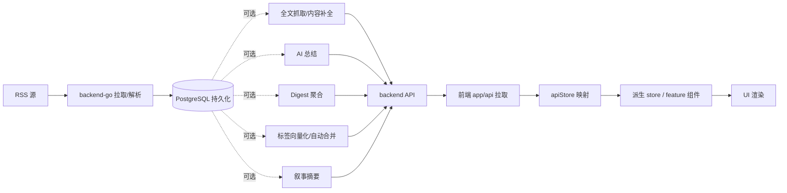

# 业务流程（Flow）

> **业务设计层**：本目录是**业务链路的概要设计**（配 mermaid），按"大功能"切分，跨前后端。
> 互补：`architecture/` 描述骨架定位；`architecture/map.md` 是「业务域 → 流程文档 → 代码入口」的索引地图。

## 这层装什么

业务链路怎么跑、状态怎么流转、前后端怎么协作。**不装**：代码怎么写（去 `standard/`）、架构骨架（去 `architecture/`）。

## 全局主链路

## 流程索引

| 文档 | 大功能 | 涉及 domain / feature |
|------|--------|----------------------|
| [reading.md](./reading.md) | 主阅读页（启动/切分类/切feed/打开文章） | reader / shell, articles |
| [content-enrichment.md](./content-enrichment.md) | 文章内容增强（Firecrawl 全文/整理稿） | platform(firecrawl) / articles |
| [ai-summary.md](./ai-summary.md) | AI 总结批量生成 | reader / ai |
| [daily-report.md](./daily-report.md) | 日报 / Digest 聚合 | admin(daily_report) / ai |
| [topic-graph.md](./topic-graph.md) | 话题图谱（PersistentTopic 归属/展示） | topicgraph / tags |
| [semantic-board.md](./semantic-board.md) | 语义版块（管理/匹配/升级/叙事面板） | tagmanagement / tags |
| [scheduler.md](./scheduler.md) | 定时任务（横切：feed刷新/状态回传/手动trigger） | admin(scheduler) / settings |

## 约束

- 不再维护本地镜像数组同步链，不再使用 `syncToLocalStores()`
- 组件层优先消费已映射好的前端模型
- 与后端交互的细节只应停留在 `app/api` 和 store
