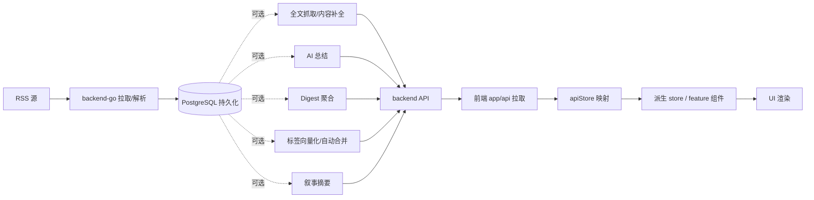

# 业务流程（Flow）

> **业务设计层 · 五位一体活文档**：每个 flow 文档同时承载「需求说明 + 链路设计 + 业务约束 + 代码索引 + 变更溯源」，按"大功能"切分，跨前后端。
> 本目录**替代原用户手册目录（已删除）** 承接"系统能做什么、怎么用"的说明（面向使用视角的「需求说明」节）；API 参考唯一权威源为 `docs/reference/api/`。

## 这层装什么（五段式）

每个 `flow/<功能>.md` 固定五个二级标题（`scripts/check-standards.sh` A 段校验齐全）：

1. **需求说明** — 功能给用户解决什么问题（面向使用视角）
2. **链路设计** — mermaid 流程图 + 状态流转
3. **业务约束与不变量** — 状态机/幂等/去重/限额等业务红线。**是 constraint-injection extension 的注入数据源（业务规范 what 段）**——apply 改代码前按命中 domain 自动注入 system prompt（见《开发执行规范》§0.6）。注入为双源，执行规范 how 段来自 `standard/` 文档头标 `doc-impact-applies` 且命中的「## Requirements」节。
4. **代码入口** — 后端 handler/service + 前端 feature 入口（含 `backend-go/internal/<domain>/` 包路径，context 靠它关联 flow↔domain）
5. **变更溯源** — archive change 链接表（见《开发执行规范》§12.2）

**不装**：代码怎么写（去 `standard/`）、架构骨架（去 `architecture/`）、跨功能传导耦合（去 `architecture/coupling-map.md`）。

## 全局主链路

## 流程索引

| 文档 | 大功能 | 涉及 domain / feature |
| ------ | -------- | ---------------------- |
| [reading.md](./reading.md) | 主阅读页（启动/切分类/切feed/打开文章） | reader / shell, articles |
| [content-enrichment.md](./content-enrichment.md) | 文章内容增强（Firecrawl 全文/整理稿） | dataenrichment, reader / articles |
| [data-enrichment.md](./data-enrichment.md) | 数据富化编排（爬取/补全/向量化的编排链） | dataenrichment |
| [ai-summary.md](./ai-summary.md) | AI 总结批量生成 | reader / ai |
| [daily-report.md](./daily-report.md) | 日报 / Digest 聚合 | admin(daily_report) / ai |
| [topic-graph.md](./topic-graph.md) | 话题图谱（PersistentTopic 归属/展示） | topicgraph / tags |
| [semantic-board.md](./semantic-board.md) | 语义版块（管理/匹配/升级/叙事面板） | tagmanagement / tags |
| [scheduler.md](./scheduler.md) | 定时任务（横切：feed刷新/状态回传/手动trigger） | admin(scheduler) / settings |

## 约束

- 不再维护本地镜像数组同步链，不再使用 `syncToLocalStores()`
- 组件层优先消费已映射好的前端模型
- 与后端交互的细节只应停留在 `app/api` 和 store

## 变更溯源

| 日期 | 变更 | 摘要 | 归档位置 |
|------|------|------|----------|
| 2026-07-20 | docs-harness-consolidation | flow 升级五位一体活文档（需求/链路/业务约束/代码入口/溯源）；业务约束节作为注入数据源（时为 `doc-impact.sh context`，2026-08-22 起由 constraint-injection extension 接管，见 port-constraint-injection）；原 user-guide 定位由 flow「需求说明」节承接 | [archive/2026-07-20-docs-harness-consolidation](../../../openspec/changes/archive/2026-07-20-docs-harness-consolidation) |
| 2026-08-21 | add-change-scope | 新增 `scripts/change-scope.sh` 改动范围→最小验证命令机械判定（路径三档映射，未命中不猜）；quality-gate turn_end 升级自动跑影响包 `go test -short`（DB 集成测试 -short 自动 skip）。「测试只跑影响包」从自觉规则变机械执行 | [archive/2026-08-21-add-change-scope](../../../openspec/changes/archive/2026-08-21-add-change-scope) |
| 2026-08-21 | amend-dev-workflow | 测试纪律改用例先行（Scenario 即黑盒用例+复杂档白盒用例，顺序解绑，bug 先复现底线不变）；调研两级落点（change research.md / `docs/research/`），experience 回归纯踩坑复盘 | [archive/2026-08-21-amend-dev-workflow](../../../openspec/changes/archive/2026-08-21-amend-dev-workflow) |
| 2026-08-23 | port-constraint-injection | 移植 constraint-injection extension（harness 层每 turn 注入：flow「业务约束与不变量」节级注入 + standard JIT 路径命中 + 关键词命中粘性保前缀缓存 + pin_finding 两级落点）；`doc-impact.sh context` 子命令退役，9 个 flow 文档脚注数据源表述改指 extension | [archive/2026-08-23-port-constraint-injection](../../../openspec/changes/archive/2026-08-23-port-constraint-injection) |
| 2026-08-23 | harness-facts-tier-a | harness 层事实库落地（`.pi/harness/events.db` 六类事件记账：constraint.inject / pin.write / pin.read / gate.check / subagent.dispatch / session.start），constraint-injection 注入与 pin 读写经 lib/harness-log 自报，模型零参与；flow 文档作为注入数据源的机制不变，仅新增记账维度 | [archive/2026-08-23-harness-facts-tier-a](../../../openspec/changes/archive/2026-08-23-harness-facts-tier-a) |
| 2026-08-23 | constraint-domain-declaration | 约束注入改业务域显式声明：proposal.md 头部 `constraint-domains` 标记声明即注入（change 全文退出关键词命中源，根治 harness 类 change 撞车误注入）；9 个 flow 文档头部补 `doc-impact-applies` 标签成为 JIT 路径命中单一真相源（json jitDocs 退役） | [archive/2026-08-23-constraint-domain-declaration](../../../openspec/changes/archive/2026-08-23-constraint-domain-declaration) |
| 2026-08-23 | constraint-injection-tier-b | 注入工程升级两件：① 注入块总量预算（budgetBytes 默认 32K）+ 分层降级（keyword→jit→findings digest→域声明→占位，永不真丢，降级确定性保前缀缓存），constraint.inject 附 degraded 记账；② 档位持久化（mode.set 事件）+ 会话边界恢复三路径（resume/reload 两段式、startup 冷启动同 sessionId 恢复——真实链路返工实证 quit 重启走 startup）。事件词汇六类→七类，flow 约束节内容与辖区不变 | [archive/2026-08-23-constraint-injection-tier-b](../../../openspec/changes/archive/2026-08-23-constraint-injection-tier-b) |
| 2026-08-23 | fix-mode-recovery-cross-session | 档位恢复勘误：砍掉 tier-b 第 2 段「全局最新 mode.set 兜底」——多 pi 窗口并行是常态，全局最新几乎必然属其他窗口（实测探索窗口 reload 被灌入他窗口 implementation 档）；resume/reload/startup 三路径统一仅按同 sessionId 取数，/resume 用目标会话自身 id 必中，兜底防御场景不存在 | [archive/2026-08-23-fix-mode-recovery-cross-session](../../../openspec/changes/archive/2026-08-23-fix-mode-recovery-cross-session) |
