# 业务流程（Flow）

> **业务设计层 · 五位一体活文档**：每个 flow 文档同时承载「需求说明 + 链路设计 + 业务约束 + 代码索引 + 变更溯源」，按"大功能"切分，跨前后端。
> 本目录**替代原用户手册目录（已删除）** 承接"系统能做什么、怎么用"的说明（面向使用视角的「需求说明」节）；API 参考唯一权威源为 `docs/reference/api/`。

## 这层装什么（五段式）

每个 `flow/<功能>.md` 固定五个二级标题（`scripts/check-standards.sh` A 段校验齐全）：

1. **需求说明** — 功能给用户解决什么问题（面向使用视角）
2. **链路设计** — mermaid 流程图 + 状态流转
3. **业务约束与不变量** — 状态机/幂等/去重/限额等业务红线。**是 `doc-impact.sh context` 子命令的数据源**——apply 改代码前按命中 domain 自动 dump 给 agent（见《开发执行规范》§0.6），故必须准确、有实质。
4. **代码入口** — 后端 handler/service + 前端 feature 入口（含 `backend-go/internal/<domain>/` 包路径，context 靠它关联 flow↔domain）
5. **变更溯源** — archive change 链接表（见《开发执行规范》§12.2）

**不装**：代码怎么写（去 `standard/`）、架构骨架（去 `architecture/`）、跨功能传导耦合（去 `architecture/coupling-map.md`）。

## 全局主链路

```mermaid
flowchart LR
  RSS[RSS 源] --> BACK[backend-go 拉取/解析]
  BACK --> PG[(PostgreSQL 持久化)]
  PG -.可选.-> ENRICH[全文抓取/内容补全]
  PG -.可选.-> SUMMARY[AI 总结]
  PG -.可选.-> DIGEST[Digest 聚合]
  PG -.可选.-> TAG[标签向量化/自动合并]
  PG -.可选.-> NARR[叙事摘要]
  ENRICH & SUMMARY & DIGEST & TAG & NARR --> API[backend API]
  API --> FETCH[前端 app/api 拉取]
  FETCH --> STORE[apiStore 映射]
  STORE --> DERIVE[派生 store / feature 组件]
  DERIVE --> UI[UI 渲染]
```

## 流程索引

| 文档 | 大功能 | 涉及 domain / feature |
| ------ | -------- | ---------------------- |
| [reading.md](./reading.md) | 主阅读页（启动/切分类/切feed/打开文章） | reader / shell, articles |
| [content-enrichment.md](./content-enrichment.md) | 文章内容增强（Firecrawl 全文/整理稿） | dataenrichment, reader / articles |
| [data-enrichment.md](./data-enrichment.md) | 数据富化编排（爬取/补全/向量化的编排链） | dataenrichment |
| [ai-summary.md](./ai-summary.md) | AI 总结批量生成 | reader / ai |
| [daily-report.md](./daily-report.md) | 日报 / Digest 聚合 | admin(daily_report) / ai |
| [topic-graph.md](./topic-graph.md) | 话题图谱（PersistentTopic 归属/展示） | topicgraph / tags |
| [semantic-board.md](./semantic-board.md) | 语义版块（管理/匹配/升级/叙事面板） | tagmanagement / tags |
| [scheduler.md](./scheduler.md) | 定时任务（横切：feed刷新/状态回传/手动trigger） | admin(scheduler) / settings |

## 约束

- 不再维护本地镜像数组同步链，不再使用 `syncToLocalStores()`
- 组件层优先消费已映射好的前端模型
- 与后端交互的细节只应停留在 `app/api` 和 store

## 变更溯源

| 日期 | 变更 | 摘要 | 归档位置 |
|------|------|------|----------|
| 2026-07-20 | docs-harness-consolidation | flow 升级五位一体活文档（需求/链路/业务约束/代码入口/溯源）；业务约束节作为 `doc-impact.sh context` 数据源；原 user-guide 定位由 flow「需求说明」节承接 | [archive/2026-07-20-docs-harness-consolidation](../../../openspec/changes/archive/2026-07-20-docs-harness-consolidation) |
