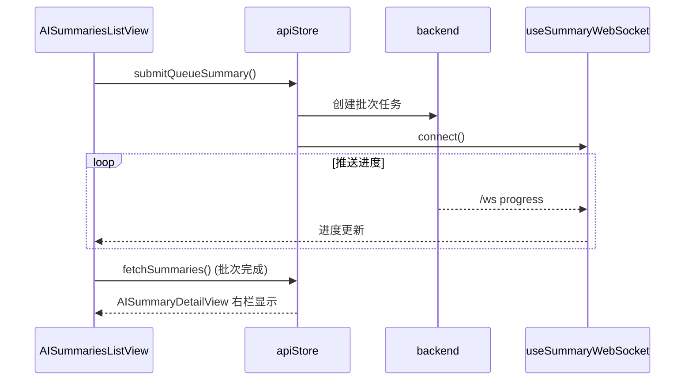

# AI 总结流程（AI Summary）

> 大功能：AI 总结批量生成（队列 + WebSocket 进度推送）。
> 跨端。互补：`flow/scheduler.md` §auto_summary 状态流。

## 批量总结链路

## 代码入口

- 后端：`internal/reader/`（AI 总结）、`internal/platform/airouter/`、`internal/platform/ws/`
- 前端：`front/app/features/ai/`、`front/app/stores/`

## 资料来源

迁自原 `architecture/data-flow.md`（AI 总结流）。
