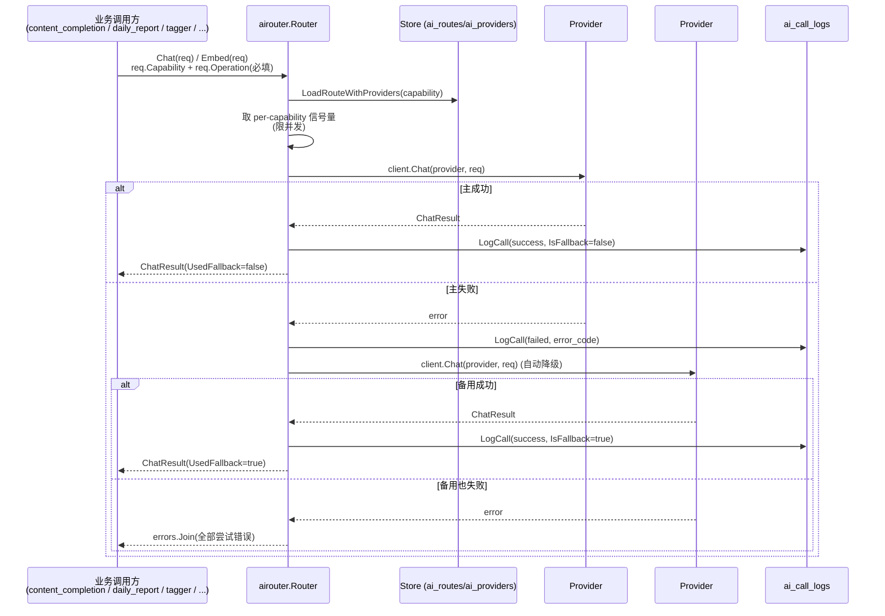

# AI 调用路由流程（AI Router / AI Summary）

> 大功能：统一 AI 调用路由——按 capability 选 provider、失败自动降级、per-capability 并发限流、全量调用审计。
> 跨端（后端 airouter + 前端 AI Router 配置面板）。互补：`flow/content-enrichment.md`（文章级整理稿走 `CapabilitySummary`）、`flow/daily-report.md`（日报管线走 `CapabilityDigestPolish`）。

## 需求说明

系统里有大量 AI 调用（文章整理稿、日报聚类/线程、标签提取、embedding、整理稿润色），早期各自直连 LLM、缺统一治理。AI 路由层（airouter）解决：

- **能力路由**：按「能力」（summary / topic_tagging / digest_polish / open_notebook / embedding）把请求路由到配置好的 provider，不同能力可用不同模型/供应商。
- **失败降级**：同一能力下多个 provider 按序尝试，主 provider 失败自动切备用，调用方无感。
- **并发限流**：每能力独立并发上限，避免单能力打爆 LLM 配额。
- **调用审计**：每次调用（成功/失败）落 `ai_call_logs`，含 operation、prompt、token 用量、provider、延迟、session，供调试幻觉 / 查错数据 / 重建编排。
- **配置可视**：前端「AI」页配置能力路由、provider、备用链、embedding 队列，无需改后端代码。

> **范围说明（待主线程确认）**：本 flow 早期标题为「AI 总结批量生成（队列 + WebSocket 进度推送）」，描述的 `submitQueueSummary` / `AISummariesListView` / `useSummaryWebSocket` 等 feed 级批量总结功能在当前后端 router 与前端代码中**已不存在**——该能力被 `content_completion`（文章级整理稿，见 `flow/content-enrichment.md`）与日报（版块级叙事，见 `flow/daily-report.md`）取代。当前 `internal/platform/airouter/` + `front/app/features/ai/` 实际承载的是 AI 调用路由层，故本 flow 围绕真实存在的功能重写。如主线程确认批量总结另有归处，请订正本 flow 定位。

## 链路设计

### Chat / Embed 路由



### 前端配置链路

```text
AI 页 (front/app/features/ai/)
  → AIRouterSettingsPanel: 配置每能力的 provider 路由
  → AIRouterBackupProviders: 配置备用 provider 顺序（降级链）
  → AIRouterCapabilityRoutes: 能力↔路由绑定
  → AIProviderManagement: provider 凭据/模型
  → EmbeddingQueuePanel: embedding 队列状态
  → useAIRouterSettings: 统一读写
```

## 业务约束与不变量

> 本节同时是 `scripts/doc-impact.sh context` 的数据源——改 `internal/platform/airouter/` 代码前会被自动 dump，必读。

1. **请求必须带 `Operation`**：`Chat`/`Embed` 要求 `req.Operation != ""`，空则直接 `errors.New("airouter: Operation is required")` 不发请求。`Capability` 同样必填，决定路由到哪条 `ai_routes` 记录。
2. **五类能力固定枚举**：`summary` / `topic_tagging` / `digest_polish` / `open_notebook` / `embedding`（`store.go` 常量）。新增能力属于跨域语义变更，不是局部改动。
3. **per-capability 并发信号量**：默认并发 `topic_tagging:3 / digest_polish:2 / open_notebook:2 / embedding:5`（其他默认 3），可由 `ai_routes.max_concurrency` 覆盖；信号量按 capability 存于 `sync.Map`，`acquireSem` 用 `ctx.Done()` 抢占、避免无限等待。
4. **失败顺序降级（provider chain）**：`LoadRouteWithProviders` 返回有序 provider 列表，按 `idx` 依次尝试；成功的 `IsFallback = (idx > 0)`；全部失败用 `errors.Join` 聚合所有 provider 错误返回。调用方据此决定是否还有下游 fallback（如 content_completion 在 router 失败后还回退 legacy `AIService`）。
5. **全量调用审计（成功/失败都记）**：每次尝试都写 `ai_call_logs`（`store.LogCall`），含 `operation` / `capability` / `route_name` / `provider_name` / `model` / `success` / `is_fallback` / `latency_ms` / `error_code` / `session_id`；成功还记 `prompt`（`formatMessages`）+ `response_snippet` + `token_usage`。审计是调试幻觉 / 查错数据的唯一回放源。
6. **prompt / response 截断保护**：`response_snippet` 截到 `maxResponseSnippet=10000` runes；`prompt` 截到 `maxPromptRunes=20000` runes（超长保头 18000 + 尾 2000 + 截断标记），避免长 prompt 撑爆日志列。
7. **provider 类型受限**：内置仅 `openai_compatible` / `ollama` 两种 client（均走 `OpenAICompatibleClient`）；未知 provider 类型记为 `unsupported` 并跳过该 provider。
8. **调用日志 7 天清理**：`ai_call_logs` 由 `job_log_cleanup.go` 周期清理（默认 7 天），审计窗口有限，长期分析需另存。

## 代码入口

- **后端 airouter（核心）**：`backend-go/internal/platform/airouter/router.go`（`Router.Chat` / `Router.Embed` / 信号量 / 降级链）、`store.go`（`Capability` 常量、`Store.LoadRouteWithProviders` / `ResolvePrimaryProvider` / `LogCall`）、`fallback.go`（降级辅助）、`openai_compatible.go`（provider client）、`embedding.go`（embedding client）、`test_connection.go`（连通性自检）。
- **后端配置/审计**：`internal/models/`（`AIProvider` / `AIRoute` / `AICallLog` 模型）、`backend-go/internal/admin/handler/ai_handler.go`（AI 路由/provider 配置与调用日志查询）、`backend-go/internal/admin/handler/ai_call_log_handler.go`、`backend-go/internal/admin/scheduler/job_log_cleanup.go`（日志清理）。
- **消费方**：`internal/reader/service/content_completion_service.go`（`CapabilitySummary`）、`internal/topicgraph/service/`（`CapabilityDigestPolish` 等日报 LLM）、`internal/tagmanagement/service/`（`CapabilityTopicTagging`）。
- **前端**：`front/app/features/ai/components/`（AIRouterSettingsPanel / AIRouterBackupProviders / AIRouterCapabilityRoutes / AIProviderManagement / EmbeddingQueuePanel）、`front/app/features/ai/composables/useAIRouterSettings.ts`、`front/app/api/`。

## 变更溯源

| 日期 | 变更 | 摘要 | 归档位置 |
|------|------|------|----------|
| 2026-07-05 | ai-call-logging-schema | `AICallLog` 补 4 列（`operation` / `prompt` / `token_usage` / `session_id`），把 prompt 真正落库、补查询 API 与前端视图，让 AI 调用可观测/可回放/可审计 | [`openspec/changes/archive/2026-07-05-ai-call-logging-schema`](../../../openspec/changes/archive/2026-07-05-ai-call-logging-schema) |
