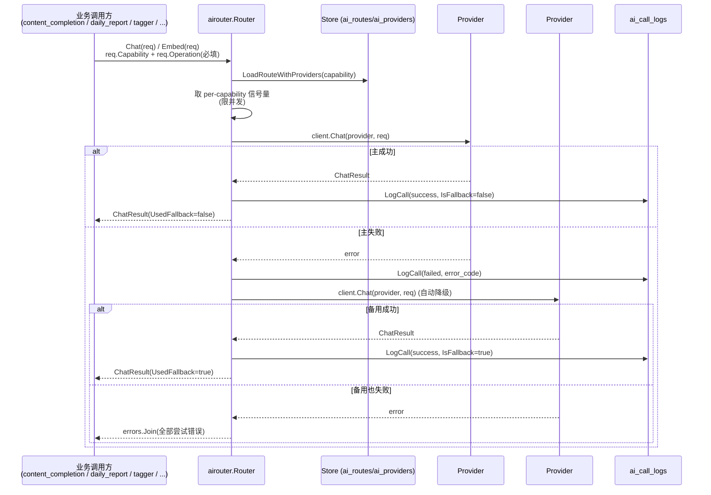

# AI 调用路由流程（AI Router / AI Summary）

<!-- doc-impact-applies: backend-go/internal/platform/airouter/ | section=业务约束与不变量 -->
> 大功能：统一 AI 调用路由——按 capability 选 provider、失败自动降级、per-capability 并发限流、全量调用审计。
> 跨端（后端 airouter + 前端 AI Router 配置面板）。互补：`flow/content-enrichment.md`（文章级整理稿走 `CapabilitySummary`）、`flow/daily-report.md`（日报管线走 `CapabilityDigestPolish`）。

## 需求说明

系统里有大量 AI 调用（文章整理稿、日报聚类/线程、标签提取、embedding、整理稿润色），早期各自直连 LLM、缺统一治理。AI 路由层（airouter）解决：

- **能力路由**：按「能力」（summary / topic_tagging / digest_polish / open_notebook / embedding）把请求路由到配置好的 provider，不同能力可用不同模型/供应商。
- **失败降级**：同一能力下多个 provider 按序尝试，主 provider 失败自动切备用，调用方无感。
- **并发限流**：每能力独立并发上限，避免单能力打爆 LLM 配额。
- **调用审计**：每次调用（成功/失败）落 `ai_call_logs`，含 operation、prompt、token 用量、provider、延迟、session，供调试幻觉 / 查错数据 / 重建编排。
- **配置可视**：前端「AI」页配置能力路由、provider、备用链、embedding 队列，无需改后端代码。

> **范围说明（已确认过时，仅留路由层）**：本 flow 早期标题为「AI 总结批量生成（队列 + WebSocket 进度推送）」，描述的 `submitQueueSummary` / `AISummariesListView` / `useSummaryWebSocket` 等 feed 级批量总结功能在后端 router 与前端代码中**已不存在**。批量总结能力已被 **`content_completion` 调度器**（兼容别名 `ai_summary`）+ 文章级整理稿 API 取代（见 `flow/content-enrichment.md`）；版块级叙事走日报（见 `flow/daily-report.md`）。当前 `internal/platform/airouter/` + `front/app/features/ai/` 实际承载的是 **AI 调用路由层（airouter）**，本 flow 围绕此真实功能描述。

## 链路设计

### Chat / Embed 路由



### 前端配置链路

```text
AI 页 (front/app/features/ai/)
  → AIRouterSettingsPanel: 配置每能力的 provider 路由
  → AIRouterBackupProviders: 配置备用 provider 顺序（降级链）
  → AIRouterCapabilityRoutes: 能力↔路由绑定
  → AIProviderManagement: provider 凭据/模型
  → EmbeddingQueuePanel: embedding 队列状态
  → useAIRouterSettings: 统一读写
```

## 业务约束与不变量

> 本节同时是 constraint-injection extension 的注入数据源——改 `internal/platform/airouter/` 代码前会被自动注入 system prompt，必读。

1. **Chat/Embed 请求必须携带非空 Operation，空则报错不发请求；Capability 同样必填并决定路由**：`Chat`/`Embed` 要求 `req.Operation != ""`，空则直接 `errors.New("airouter: Operation is required")` 不发请求。`Capability` 同样必填，决定路由到哪条 `ai_routes` 记录。
2. **capability 枚举固定为五类（summary/topic_tagging/digest_polish/open_notebook/embedding），新增属跨域语义变更**：`summary` / `topic_tagging` / `digest_polish` / `open_notebook` / `embedding`（`store.go` 常量）。新增能力属于跨域语义变更，不是局部改动。
3. **并发必须按 capability 信号量限流，默认值可被 ai_routes.max_concurrency 覆盖**：默认并发 `topic_tagging:3 / digest_polish:2 / open_notebook:2 / embedding:5`（其他默认 3），可由 `ai_routes.max_concurrency` 覆盖；信号量按 capability 存于 `sync.Map`，`acquireSem` 用 `ctx.Done()` 抢占、避免无限等待。
4. **provider 失败必须按列表顺序依次降级尝试，全部失败以 errors.Join 聚合所有错误返回**：`LoadRouteWithProviders` 返回有序 provider 列表，按 `idx` 依次尝试；成功的 `IsFallback = (idx > 0)`；全部失败用 `errors.Join` 聚合所有 provider 错误返回。调用方据此决定是否还有下游 fallback（如 content_completion 在 router 失败后还回退 legacy `AIService`）。
5. **每次 AI 调用尝试无论成败都必须写 ai_call_logs 审计，成功额外记 prompt 与 response_snippet**：每次尝试都写 `ai_call_logs`（`store.LogCall`），含 `operation` / `capability` / `route_name` / `provider_name` / `model` / `success` / `is_fallback` / `latency_ms` / `error_code` / `session_id`；成功还记 `prompt`（`formatMessages`）+ `response_snippet` + `token_usage`。审计是调试幻觉 / 查错数据的唯一回放源。
6. **审计日志必须做截断保护：response_snippet 截 10000 runes，prompt 截 20000 runes 保头尾**：`response_snippet` 截到 `maxResponseSnippet=10000` runes；`prompt` 截到 `maxPromptRunes=20000` runes（超长保头 18000 + 尾 2000 + 截断标记），避免长 prompt 撑爆日志列。
7. **provider 类型只支持 openai_compatible/ollama 两种 client，未知类型记 unsupported 并跳过**：内置仅 `openai_compatible` / `ollama` 两种 client（均走 `OpenAICompatibleClient`）；未知 provider 类型记为 `unsupported` 并跳过该 provider。
8. **ai_call_logs 默认 7 天周期清理，审计窗口有限，长期分析必须另行保存**：`ai_call_logs` 由 `job_log_cleanup.go` 周期清理（默认 7 天），审计窗口有限，长期分析需另存。
9. **model_kind 必须区分 llm/embedding 且与 provider_type 正交，embedding 路由只接 embedding 模型（UpsertRoute 校验）**：与 `provider_type`（协议维度）正交——`model_kind` 表达功能类型（对话/推理 vs 向量嵌入），默认 `llm`。embedding 任务路由硬约束只接 `embedding` 模型、llm 路由只接 `llm` 模型（`UpsertRoute` 保存时校验，违反返回错误）；provider 可选 `start_command`（本地进程启动命令，启动健康检测时按总开关 `auto_start_models` 拉起，见 `flow/scheduler.md` §业务约束 #7 健康门）。
10. **Router.Embed 仅白名单 operation 可走持久化缓存，缓存读写失败一律降级为未命中、不得阻断真实调用**：只有 `embeddingCacheOperations` 白名单内的 operation（当前仅 `tagmanagement.embedding`，输入由 tag 固定属性构成、跨文章重复）参与缓存；白名单外（`section.embedding` 文章正文、`tagmanagement.auxlabel_embedding` 标签+文章上下文一次性组合、`discovery.route_embedding` 路由回填等）不查不写直接走 provider（实测命中率 0-10%，命中无收益纯占存储）。白名单内：route 加载后、**acquireSem 之前**按 `SHA-256(provider.Model + "\x00" + join(Input, "\x00"))` 查 `ai_embedding_cache`（命中不占信号量、不发 HTTP，直接反序列化返回，`ai_call_logs` 记 `Success=true` + `request_meta` 含 `"cache_hit":true`）；provider 调用成功后按成功 provider 的 model `ON CONFLICT DO NOTHING` 幂等落缓存（embedding 列存 bytea 二进制小端 float32 字节流，2026-08-28 起替代 jsonb 浮点文本，2560 维行 ~10KB vs 原 ~31.5KB，存量已无损转换；input_preview 截 200 runes，写失败仅 warn 不阻断）。缓存读写失败均降级为未命中，不得阻断真实调用。缓存记录由 `job_log_cleanup` 顺带清理 14 天前数据（命中集中在写入后 1-2 天的夜间窗口，更长保留无命中率贡献）。注意：缓存 key 的 model 取 route provider 的 Model（当前所有调用点均不设 `req.Model`；client 层 `req.Model` 优先，未来新增调用点若设了 `req.Model` 需先归一 effective model 再参与 key）。

## 代码入口

- **后端 airouter（核心）**：`backend-go/internal/platform/airouter/router.go`（`Router.Chat` / `Router.Embed` / 信号量 / 降级链）、`store.go`（`Capability` 常量、`Store.LoadRouteWithProviders` / `ResolvePrimaryProvider` / `LogCall`；`UpsertRoute` 按 capability 校验 provider `model_kind`（embedding 路由只接 embedding、llm 路由只接 llm）、`UpsertProvider` 校验 `model_kind` 合法值（llm/embedding））、`fallback.go`（降级辅助）、`openai_compatible.go`（provider client）、`embedding.go`（embedding client）、`test_connection.go`（连通性自检，复用于 `aihealth` 启动健康检测 GET /models 零 token）。
- **后端 AI 健康（ai-model-health-gate）**：`backend-go/internal/platform/aihealth/`（启动健康检测 + 自动拉起 + 内存快照；`Healthy()`/`GetSnapshot()`/`RunStartupProbe`，快照未就绪 fail-closed），见 `flow/scheduler.md` §业务约束 #7 健康门。
- **后端配置/审计**：`internal/models/`（`AIProvider` / `AIRoute` / `AICallLog` 模型）、`backend-go/internal/admin/handler/ai_handler.go`（AI 路由/provider 配置与调用日志查询）、`backend-go/internal/admin/handler/ai_call_log_handler.go`、`backend-go/internal/admin/scheduler/job_log_cleanup.go`（日志清理）。
- **消费方**：`internal/reader/service/content_completion_service.go`（`CapabilitySummary`）、`internal/topicgraph/service/`（`CapabilityDigestPolish` 等日报 LLM）、`internal/tagmanagement/service/`（`CapabilityTopicTagging`）。
- **前端**：`front/app/features/ai/components/`（AIRouterSettingsPanel / AIRouterBackupProviders / AIRouterCapabilityRoutes / AIProviderManagement / EmbeddingQueuePanel）、`front/app/features/ai/composables/useAIRouterSettings.ts`、`front/app/api/`。

## 变更溯源

| 日期 | 变更 | 摘要 | 归档位置 |
|------|------|------|----------|
| 2026-07-05 | ai-call-logging-schema | `AICallLog` 补 4 列（`operation` / `prompt` / `token_usage` / `session_id`），把 prompt 真正落库、补查询 API 与前端视图，让 AI 调用可观测/可回放/可审计 | [`openspec/changes/archive/2026-07-05-ai-call-logging-schema`](../../../openspec/changes/archive/2026-07-05-ai-call-logging-schema) |
| 2026-08-04 | ai-model-health-gate | AI provider 增 `model_kind`（llm/embedding）区分 + `start_command`（本地模型自动拉起配置）；路由绑定按 capability 校验 provider 类型（embedding 路由只接 embedding provider，llm 路由只接 llm），冲突拒绝；启动探针与健康门禁见 scheduler 流程 | [`openspec/changes/archive/2026-08-04-ai-model-health-gate`](../../../openspec/changes/archive/2026-08-04-ai-model-health-gate) |
| 2026-08-21 | nightly-throughput-embedding-cache-parallel-crawl | `Router.Embed` 增持久化缓存（白名单制，仅 `tagmanagement.embedding`；TTL 14 天，命中不占信号量，`ai_call_logs` 记 cache_hit）；firecrawl 队列串行→3 worker 并行（atomic 计数+500ms 限速），夜间窗口吞吐 ×3 | [`openspec/changes/archive/2026-08-21-nightly-throughput-embedding-cache-parallel-crawl`](../../../openspec/changes/archive/2026-08-21-nightly-throughput-embedding-cache-parallel-crawl) |
| 2026-08-31 | optimize-pg-storage | 缓存 embedding 列 jsonb→bytea（float32 小端字节流，~31.5KB→~10KB/行，存量无损预迁移）；tracing 默认采样 1.0→0.05（`TRACE_SAMPLE_RATIO` 可调，otel_spans 日增降 ~96%）；docker-compose autovacuum 调优 | [`openspec/changes/archive/2026-08-31-optimize-pg-storage`](../../../openspec/changes/archive/2026-08-31-optimize-pg-storage) |
| 2026-09-04 | constraint-declaration-redline | 约束节红线句格式化：本域「业务约束与不变量」节每条约束改写为首行加粗自含红线句 + 细节跟后（语义不变），declaration 注入降为红线层（上线后实测 bytes 降约 60%），细节层经关键词/JIT 全节注入按需补全；本域为格式改写，无业务行为变更 | [`openspec/changes/archive/2026-09-04-constraint-declaration-redline`](../../../openspec/changes/archive/2026-09-04-constraint-declaration-redline) |
