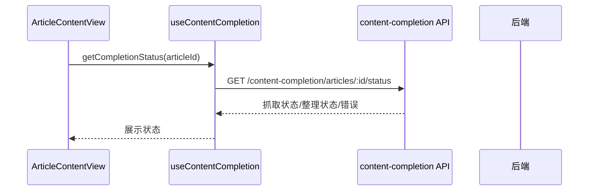

# 文章内容增强流程（Content Enrichment）

> 大功能：文章正文抓取（readability 主力 / Firecrawl 兜底）/ 内容补全 / 整理稿生成。
> 跨端。互补：`architecture/backend.md` §具体数据链路示例。

## 正文抓取双源降级链

文章正文抓取采用「readability 优先 → Firecrawl 兜底」的双源降级链，消除 Firecrawl 单点依赖：

```text
文章 URL
  ├─ 1. ReadabilityCrawler（进程内纯 Go，~200ms，零外部依赖）
  │     HTTP GET → go-readability 提正文 → html-to-markdown
  │     └─ isUsableArticle? (≥500字 + 垃圾词<3) → 是：采用，结束
  │
  └─ 2. FirecrawlCrawler（树莓派，JS 渲染兜底，仅 SPA 站需要）
        └─ readability 不合格时降级调用
```

- **SSR 站**（博客园、博客类）：readability 进程内搞定，不碰树莓派。
- **SPA 站**（36氪、掘金、智源）：readability 提到空壳，自动降级 Firecrawl 渲染 JS。
- 树莓派挂掉时，SSR 文章不受影响；仅 SPA 文章进入 `firecrawl_status=failed` 重试队列。

## Firecrawl / 内容补全状态



## 手动抓取全文

```text
ArticleContentView
  → useFirecrawlApi.crawlArticle(articleId)
  → 后端执行抓取
  → 再次查询 completion status
  → 更新 article.firecrawlContent / firecrawlStatus / summaryStatus
```

## 手动生成整理稿

```text
ArticleContentView
  → completeArticle(articleId, { force: true })
  → 后端生成 ai_content_summary
  → 更新 summary_status / summary_generated_at
  → 再次查询 completion status
  → UI 渲染整理稿
```

## 代码入口

- 后端：`internal/reader/service/crawler.go`（`Crawler` 接口 + 中立 `ScrapeResult`）、`readability_crawler.go`（进程内主力）、`fallback_crawler.go`（降级链）、`firecrawl_service.go`（Firecrawl 兜底）、`internal/reader/handler/`（content_completion_handler）、`internal/platform/`（firecrawl job queue）
- 前端：`front/app/features/articles/`、`front/app/api/`

## 调度器命名与正文优先级（代码级细节）

- **content_completion vs ai_summaries**：运行时对外用 `content_completion` 作为规范 scheduler 名，仍兼容旧别名 `ai_summary`；它对应「文章级内容补全」，**不是** `ai_summaries` 表里的 feed 聚合摘要。
- **正文提取优先级**：`AIContentSummary` → `FirecrawlContent` → `Content` → `Description`

## 资料来源

迁自原 `architecture/data-flow.md`（文章内容增强流）。

## 变更溯源

| 日期 | 变更 | 摘要 | 归档位置 |
|------|------|------|----------|
| 2026-07-11 | lightweight-crawler-fallback | readability 进程内主力 + Firecrawl 兜底降级链，消除树莓派单点 | [`openspec/changes/archive/2026-07-11-lightweight-crawler-fallback`](../../../openspec/changes/archive/2026-07-11-lightweight-crawler-fallback) |
