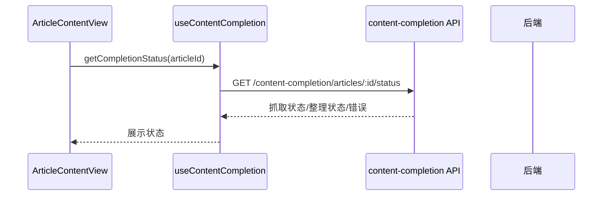

# 文章内容增强流程（Content Enrichment）

> 大功能：Firecrawl 全文抓取 / 内容补全 / 整理稿生成。
> 跨端。互补：`architecture/backend.md` §具体数据链路示例。

## Firecrawl / 内容补全状态



## 手动抓取全文

```text
ArticleContentView
  → useFirecrawlApi.crawlArticle(articleId)
  → 后端执行抓取
  → 再次查询 completion status
  → 更新 article.firecrawlContent / firecrawlStatus / summaryStatus
```

## 手动生成整理稿

```text
ArticleContentView
  → completeArticle(articleId, { force: true })
  → 后端生成 ai_content_summary
  → 更新 summary_status / summary_generated_at
  → 再次查询 completion status
  → UI 渲染整理稿
```

## 代码入口

- 后端：`internal/reader/handler/`（content_completion_handler）、`internal/platform/`（firecrawl job queue）
- 前端：`front/app/features/articles/`、`front/app/api/`

## 调度器命名与正文优先级（代码级细节）

- **content_completion vs ai_summaries**：运行时对外用 `content_completion` 作为规范 scheduler 名，仍兼容旧别名 `ai_summary`；它对应「文章级内容补全」，**不是** `ai_summaries` 表里的 feed 聚合摘要。
- **正文提取优先级**：`AIContentSummary` → `FirecrawlContent` → `Content` → `Description`

## 资料来源

迁自原 `architecture/data-flow.md`（文章内容增强流）。
