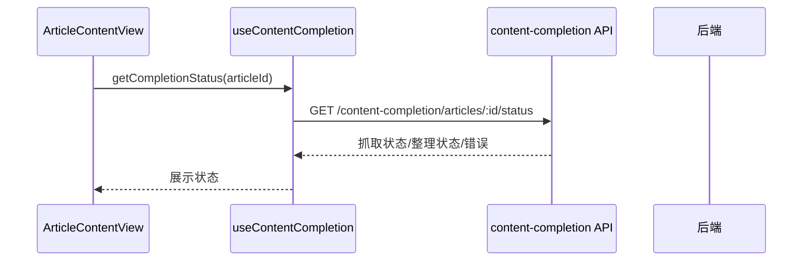

# 文章内容增强流程（Content Enrichment）

<!-- doc-impact-applies: backend-go/internal/reader/ | section=业务约束与不变量 -->
> 大功能：文章正文抓取（readability 主力 / Firecrawl 兜底）/ 内容补全（文章级 AI 整理稿）/ 手动触发。
> 跨端。互补：`architecture/backend.md` §具体数据链路示例、`flow/reading.md` §Article 打标签时机。

## 需求说明

文章入库时往往只有 RSS 摘要（`description`），正文为空或太短。内容增强解决「让每篇文章有可读全文 + 可读 AI 整理稿」：

- **正文抓取**：默认走进程内 readability（快、零外部依赖），SSR 站即够；SPA 站 readability 抓到空壳时自动降级 Firecrawl（树莓派渲染 JS）。
- **内容补全**：拿到正文后，按 feed 开关决定是否调用 LLM 生成文章级 `ai_content_summary`（整理稿），写回 articles 表。
- **手动兜底**：正文抓取与整理稿均可手动触发单篇 / 整 feed；force 模式可重生成。
- **状态可见**：前端通过 completion status / overview 接口看到抓取进度、补全进度与卡住原因。

> 注意：本 flow 的「内容补全」生成的是 **article 级** 整理稿（`articles.ai_content_summary`），不是 `ai_summaries` 表的 feed 聚合摘要，也不是日报。运行时 scheduler 名为 `content_completion`（兼容旧别名 `ai_summary`）。

## 链路设计

### 正文抓取双源降级链

```text
文章 URL
  ├─ 1. ReadabilityCrawler（进程内纯 Go，~200ms，零外部依赖）
  │     HTTP GET → go-readability 提正文 → html-to-markdown
  │     └─ isUsableArticle? (≥500字 + 垃圾词<3) → 是：采用，结束
  │
  └─ 2. FirecrawlCrawler（树莓派，JS 渲染兜底，仅 SPA 站需要）
        └─ readability 不合格时降级调用
```

- **SSR 站**（博客园、博客类）：readability 进程内搞定，不碰树莓派。
- **SPA 站**（36氪、掘金、智源）：readability 提到空壳，自动降级 Firecrawl 渲染 JS。
- 树莓派挂掉时，SSR 文章不受影响；仅 SPA 文章进入 `firecrawl_status=failed` 重试队列。

### 端到端处理链路（feed 刷新 → 抓正文 → 补整理稿）

```text
Feed refresh
  -> article created
  -> firecrawl_status = pending            (if feed.firecrawl_enabled)
  -> Firecrawl scheduler 抓全文
  -> firecrawl_status = completed
  -> summary_status = incomplete           (if feed.article_summary_enabled)
  -> ContentCompletion scheduler 基于 firecrawl_content 生成 ai_content_summary
  -> summary_status = complete
```

一句话：内容处理链路的核心对象始终是 `articles` 表，Firecrawl 与内容补全都在给 article 补字段；**不是**通过单独队列表驱动，而是通过 article 上的状态字段进入后续 scheduler 扫描范围。

### Firecrawl / 内容补全状态查询



### 手动抓取全文

```text
ArticleContentView
  → useFirecrawlApi.crawlArticle(articleId)  (POST /api/firecrawl/article/:id)
  → 后端执行抓取 → 写回 firecrawl_content / firecrawl_status / firecrawl_crawled_at
  → 成功后 summary_status 设为 incomplete（触发后续补全）
  → 再次查询 completion status → UI 更新
```

### 手动生成整理稿

```text
ArticleContentView
  → completeArticle(articleId, { force: true })  (POST /api/content-completion/articles/:id/complete)
  → 后端生成 ai_content_summary → 更新 summary_status / summary_generated_at
  → 再次查询 completion status → UI 渲染整理稿
```

### 关键状态字段

feed 级开关：`firecrawl_enabled`、`article_summary_enabled`、`tagging_enabled`、`max_completion_retries`。

article 级状态：`firecrawl_status`（`pending`/`processing`/`completed`/`failed`）、`firecrawl_content`、`firecrawl_error`、`firecrawl_crawled_at`；`summary_status`（`incomplete`/`pending`/`complete`/`failed`）、`ai_content_summary`、`content_form`（`mono`/`aggregate`/空）、`completion_attempts`、`completion_error`、`summary_generated_at`、`summary_processing_started_at`。

## 业务约束与不变量

> 本节同时是 constraint-injection extension 的注入数据源——改 `internal/reader/`（crawler / content_completion / firecrawl） 代码前会被自动注入 system prompt，必读。

1. **展示层正文按 AIContentSummary→FirecrawlContent→Content→Description 优先级取用，内容补全只用 firecrawl_content、为空直接失败**：展示层 `AIContentSummary → FirecrawlContent → Content → Description`；但**内容补全（`CompleteArticle`）只用 `firecrawl_content`**——为空直接失败（`No firecrawl content available`），不会退而用 `content`/`description`。故 Firecrawl 未完成的文章进不了补全链路。
2. **内容补全必须四道门禁全过才执行：article 存在、feed 存在且开启 article_summary_enabled、firecrawl completed、非 force 时重试未超限**：① article 存在；② feed 存在且 `article_summary_enabled=true`（否则报 `AI summary not enabled for this feed`）；③ `firecrawl_status == completed`（否则报 `firecrawl not completed`）；④ 非 force 时 `completion_attempts < max_completion_retries`（超限标 `failed` 并返回 `max completion retries exceeded`）。
3. **补全状态机为 incomplete → pending → complete|failed，失败超限置 failed、未超限回退 incomplete**：`incomplete → pending → (complete | failed)`。开始处理先 claim（置 `pending` + `completion_attempts += 1` + 清 `completion_error` + 记 `summary_processing_started_at`）；成功置 `complete` + 写 `ai_content_summary` + `summary_generated_at` + 清 lease；失败时若已达重试上限置 `failed`，否则回退 `incomplete`。
4. **补全重试上限 max_completion_retries 默认 1、可按 feed 覆盖，force=true 跳过上限并清空旧稿重新生成**：`max_completion_retries` 默认 **1**，可由 feed 覆盖；`force=true` 跳过上限检查并清空旧 `ai_content_summary` / `summary_generated_at` 重新生成。
5. **同一 article 不得被并发补全处理，claim 用条件 UPDATE 乐观锁，抢不到返回非错误**：`claimArticleForCompletion` 用条件 UPDATE（`WHERE` 带 `summary_status` + stale 判断，靠 `RowsAffected>0` 判定是否抢到）保证同一 article 不会被并发 scheduler / 手动触发同时处理；抢不到直接返回（非错误）。
6. **补全处理租约超 32min（30min lease + 2min grace）即 stale 可重新 claim，卡死文章由 blocked_article_recovery 重置**：`summary_processing_started_at` 超过 `30min`（lease）+ `2min`（clock skew grace）= 32min 视为 stale，可被重新 claim；`blocked_article_recovery` scheduler 配合把卡在 `processing`/`pending` 的文章重置。Firecrawl 同理有自己的 processing 超时恢复。
7. **Firecrawl 调度固定 3 worker 并行、单批最多 50 篇，只抓 firecrawl_enabled 且 firecrawl_status=pending 的文章**：`FirecrawlScheduler` 每 300 秒轮询，只查 `feeds.firecrawl_enabled=true AND articles.firecrawl_status=pending`，单批最多 50 篇、**固定 3 worker 并行**（jobs channel 分发，`firecrawlWorkerCount=3`）抓取，每 worker 处理完一篇后 500ms 礼貌限速；completed/failed 计数用 `atomic.Int32`，WS 广播计数快照（瞬时可能乱序、批末守恒 `completed+failed==total`）；抓前置 `processing`、抓后置 `completed`/`failed`；进度经 `platform/ws` 广播 `firecrawl_progress`。租约/退避/terminal 降级（`firecrawl_failed_fallback` retag）语义与串行时代一致。
8. **补全成功且 feed.tagging_enabled=true 时必须 enqueue tag_jobs 以整理稿重新打标签**：补全成功且 `feed.tagging_enabled=true` 时，enqueue `tag_jobs`（reason=`summary_completed`）重新打标签（整理稿是更优的打标签输入）。
9. **内容补全调度器规范名为 content_completion、兼容旧别名 ai_summary，均非 ai_summaries 表的 feed 聚合摘要**：对外规范名为 `content_completion`，仍接受旧别名 `ai_summary`；它**不是** `ai_summaries` 表里的 feed 聚合摘要。
10. **整理稿首行形态注释必须剥离后入库：标记值存 articles.content_form，正文不得残留注释，解析失败降级 mono**：摘要 system prompt（`GetSystemPrompt("zh")`）要求模型在首行输出形态判定 HTML 注释 `<!-- form: mono|aggregate -->`（异构栏目合集 = aggregate，单主题多章节也算 mono）。入库前 `parseContentFormMark` 解析并剥离该注释行：标记值存 `articles.content_form`，剥离后正文存 `ai_content_summary`（摘要正文**不得**残留注释）；解析失败（模型未输出/非法值）时 `content_form` 落空、原文照存，下游打标降级走 mono 路径。`force` 重生成时同步清空 `content_form` 防旧值残留。存量文章（change 合并前）`content_form` 为空，不回填。

## 代码入口

- **后端 reader 域（正文抓取）**：`backend-go/internal/reader/service/crawler.go`（`Crawler` 接口 + 中立 `ScrapeResult`）、`readability_crawler.go`（进程内主力）、`fallback_crawler.go`（降级链）、`firecrawl_service.go`（Firecrawl 兜底）、`backend-go/internal/reader/handler/`（content_completion_handler、firecrawl handler）。
- **后端 reader 域（内容补全）**：`backend-go/internal/reader/service/content_completion_service.go`（`CompleteArticle` / `CompleteArticleWithForce` / `claimArticleForCompletion` / `ListReadyArticles` / `GetOverview`）、`backend-go/internal/reader/service/content_form.go`（`parseContentFormMark` 形态标记解析/剥离）、`backend-go/internal/reader/service/feed_service.go`（refresh 写入初始状态位）、`backend-go/internal/reader/routes.go`（`/content-completion/*`、`/firecrawl/*`）。
- **后端调度（admin 域）**：`backend-go/internal/admin/scheduler/job_firecrawl.go`、`job_content_completion.go`、`job_blocked_article_recovery.go`。
- **平台层**：`backend-go/internal/platform/airouter/`（补全走 `CapabilitySummary` 路由，失败回退 fallback AIService）、`backend-go/internal/platform/ws/`（进度广播）、`backend-go/internal/tagmanagement/`（补全后 enqueue tag job）。
- **前端**：`front/app/features/articles/components/ArticleContentView.vue`、`front/app/features/articles/composables/useContentCompletion.ts`、`front/app/features/shell/components/FeedLayoutShell.vue`（feed 开关编辑）、`front/app/utils/articleContentSource.ts`（内容来源切换）、`front/app/api/`。

## 变更溯源

| 日期 | 变更 | 摘要 | 归档位置 |
| ------ | ------ | ------ | ---------- |
| 2026-05-10 | global-settings-feed-controls | feed 级新增 `tagging_enabled` 开关与 Firecrawl / 内容补全 toggle 并列；Firecrawl 完成回调也检查 `tagging_enabled` 决定是否入 tag 队列 | [`openspec/changes/archive/2026-05-10-global-settings-feed-controls`](../../../openspec/changes/archive/2026-05-10-global-settings-feed-controls) |
| 2026-05-13 | backend-package-restructure | `contentprocessing/` → `reader/` 域（content_completion / firecrawl 归入 reader service）；旧 user-guide 的 `internal/domain/*`、`internal/jobs/` 路径已失效 | [`openspec/changes/archive/2026-05-13-backend-package-restructure`](../../../openspec/changes/archive/2026-05-13-backend-package-restructure) |
| 2026-07-11 | lightweight-crawler-fallback | readability 进程内主力 + Firecrawl 兜底降级链，消除树莓派单点 | [`openspec/changes/archive/2026-07-11-lightweight-crawler-fallback`](../../../openspec/changes/archive/2026-07-11-lightweight-crawler-fallback) |
| 2026-08-20 | aggregate-article-tagging | 摘要调用附带内容形态判定：首行 `<!-- form: mono\|aggregate -->` 解析后存 `articles.content_form`，为下游打标分流提供依据；force 重生成同步清空 | [`archive/2026-08-22-aggregate-article-tagging`](../../../openspec/changes/archive/2026-08-22-aggregate-article-tagging) |
| 2026-08-21 | nightly-throughput-embedding-cache-parallel-crawl | firecrawl 队列串行→固定 3 worker 并行（jobs channel 分发、atomic 计数、每 worker 500ms 礼貌限速）；租约/退避/terminal 降级语义不变；夜间窗口 avg_wait 3.8h→分钟级 | [`openspec/changes/archive/2026-08-21-nightly-throughput-embedding-cache-parallel-crawl`](../../../openspec/changes/archive/2026-08-21-nightly-throughput-embedding-cache-parallel-crawl) |
| 2026-09-04 | constraint-declaration-redline | 约束节红线句格式化：本域「业务约束与不变量」节每条约束改写为首行加粗自含红线句 + 细节跟后（语义不变），declaration 注入降为红线层（上线后实测 bytes 降约 60%），细节层经关键词/JIT 全节注入按需补全；本域为格式改写，无业务行为变更 | [`openspec/changes/archive/2026-09-04-constraint-declaration-redline`](../../../openspec/changes/archive/2026-09-04-constraint-declaration-redline) |
