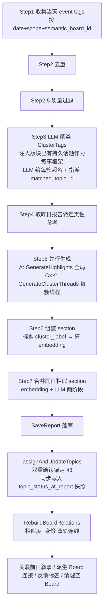
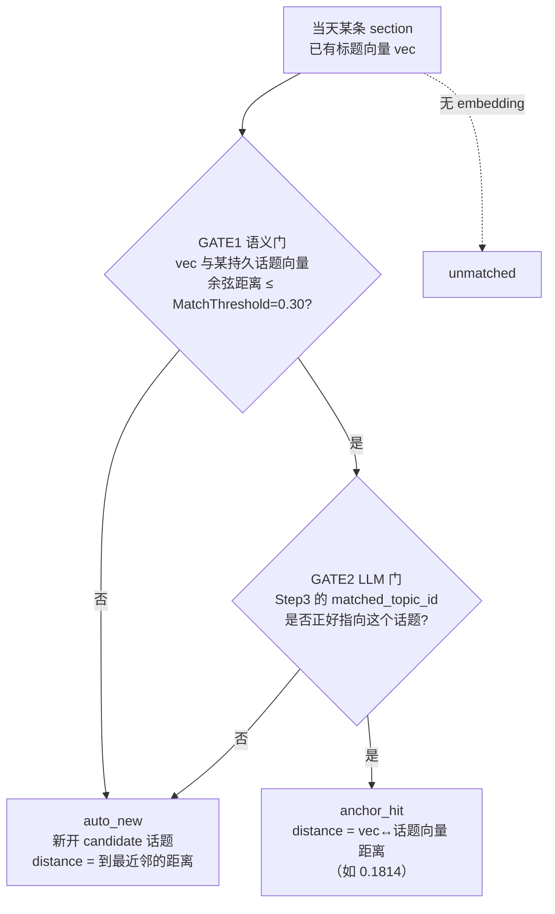

# 日报 / Digest 流程（Daily Report）

> 大功能：每日叙事生成（后端）+ Digest 预览/查看（前端）+ Section 可视化。
> 跨端。互补：`flow/topic-graph.md`（持久话题生命周期、关系双轨）、`flow/semantic-board.md`（版块）、`architecture/tracing.md`。

## 0. 概念字典（先看这个）

理解日报，先分清四个对象。它们是"生成 → 锚定 → 展示"整条链的语义基石：

| 概念 | 是什么 | 关键字段 | 谁负责 |
|------|--------|---------|--------|
| **Report**（日报） | 一个版块某天的一份叙事报告，含若干 section | `board_daily_reports.period_date` | 后端 scheduler 触发生成 |
| **Section**（条目） | **当天一个叙事单元** = 一簇 tag/文章聚成的一组。LLM 给簇起名（标题）| `cluster_label`(标题)、`cluster_tag_ids`、`article_count`、`embedding` | 后端 LLM 聚类 + 起名 |
| **Thread**（线程/事件） | section 内的逐条叙事（标题+摘要+置信度+关联文章），每个 thread 来自 cluster 内的一簇 tag/文章 | `daily_report_threads.{title,section_id,tag_ids,fit_distance}` | 后端 LLM 逐簇生成 |
| **PersistentTopic**（持久话题） | **跨天演进的话题**，把每天的 section 串成一条叙事链 | `board_persistent_topics.{label,embedding,status}` | 后端锚定/生命周期管理（见 `topic-graph.md`）|

> **Section 的 embedding 从哪来？** 用它的标题文本（`cluster_label`）算出来。即"section 的向量 = 它标题的语义向量"。
> **持久话题的 embedding 从哪来？** 从**第一条**创建该话题的 section 继承（首义向量）。后续 section 靠"自己的标题向量"和"话题首义向量"比距离来锚定。
>
> ⚠️ **粒度错位陷阱**：锚定（§2）的判断单位是 **section（标题向量）**，thread 不参与。一个被 LLM 误聚进 section 的跑题 thread（如"机器人控制器"事件混入"OpenAI 发布管控"section）会随所在 section 锚定成功而**搭便车**进入话题，即便它跟话题八竿子打不着。锚定看着合理（标题近）≠ section 内每条 thread 都贴合——因为 LLM 聚类（Step3）只保证簇内 tag 在它看来"同类"，不保证每条都严丝合缝。详见 §2「粒度错位」。

### 三套匹配血缘（看 section 时有三套独立信号，别混）

| 维度 | 回答的问题 | 字段 | 展示面 | 归属 change |
|------|-----------|------|--------|------------|
| **System 1：标签↔版块** | 这条 section 的 tag 有多贴合**版块** | `best_tier`/`avg_score`/`quality_breakdown` | 正文 tier 色点 + hover 探针 per-tag 明细 | `quality-scoring-observability` |
| **System 2：section↔话题** | 这条 section 有多紧地锚到**持久话题** | `topic_match_distance`/`topic_match_confidence`/`persistent_topic` | 正文锚定紧实度点 + 探针顶部「话题锚定」行 | `topic-anchor-match-observability` |
| **System 3：thread↔section** | 这条 thread 有多忠于它所在的 **section 标题** | `fit_distance` | thread 行降级样式（灰显+折叠+离群标记）+ hover/展开探究行（贴合度数值+中文标签）| `thread-fit-observability` |

三套并列、互不依赖、展示面互补：System 1 量 tag 贴合**版块**、System 2 量 section 贴近**话题**、System 3 量 **thread 忠于 section 标题**。本文重点讲 System 2 锚定机制（§2），System 3 软降级见 §4。

## 1. 后端：每日叙事生成管线

`GenerateDailyReport(ctx, boardID, date)` 是入口，分步管线（`daily_report_orchestrator.go`）：



> **Step3 是锚定的第一道门**：LLM 聚类时拿到版块已有的持久话题作为叙事框架，**自己决定**当前每个簇归到哪个已有话题（产出 `matched_topic_id`，只在内存里，不落库）。这个"LLM 的主观归属"是后续双重确认的一半。
>
> **ANCHOR 同步写入报告时快照**：双重确认完成后，每条 section 的 `topic_status_at_report` 与 `persistent_topic_id`、`topic_match_distance`、`topic_match_confidence` 在同一事务内写入。快照值为当时 PersistentTopic 的 `candidate|active`；未归属写 NULL。历史快照不随后续 topic 状态变化回填。

## 2. 后端：Section↔话题 锚定机制（System 2）

`assignAndUpdateTopics → planTopicAssignments`（`daily_report_assignment.go`）对当天**每一条 section** 独立判定，**双重确认**（两道门都过才算锚中）：



三态落地为 section 的 `topic_match_confidence` 列，`topic_match_distance` 存对应距离：

| confidence | 触发条件 | distance 含义 | 展示 |
|-----------|---------|--------------|------|
| **anchor_hit** | 两道门都过 | **这条 section 标题向量 ↔ 话题首义向量** 的真实余弦距离 | 实心→半透明点（按 distance 分紧/稳/松）|
| **auto_new** | 没锚中已有 → 新开话题 | 到最近邻的距离（≥0.30，"没够上"）| 空心 accent 点（新话题候选）|
| **unmatched** | 无 embedding | 0 / 缺省 | 空心灰点 |

### 关于 distance 的常见误解（重要）

- **distance 不是平均值**，是单条 section 的客观值：它自己的标题向量 离 话题首义向量 多远。话题下 N 条 section 就有 N 个各自独立的 distance。
- **distance 不是"当天相似度"**，是跨天的"这条 section 标题"和"话题当初被定义时的标题"的语义距离。
- **"松锚定/稳锚定"是前端展示分桶**（双阈值 `0.05 / 0.15` 切 anchor_hit 的三段），不是后端语义；后端只认 `≤0.30` 这一道线。

### 为什么"看着不像"却锚中了？

`MatchThreshold=0.30`（余弦距离 0.30 ≈ 相似度 0.70）本身偏松，加上 LLM 按**大主题**归并（如把"AI 伦理/Anthropic 扩张"主观归到"中美竞争与人才流动"）。只要 LLM 认了这个 topic 且向量距离 < 0.30，就会 anchor_hit——哪怕标题字面差距大。这是阈值+聚类的固有特性。收紧阈值/提高 embedding 区分度归 `embedding-content-mismatch` 待办 issue（领域 change），本可观测层只如实暴露结果。

### 粒度错位：跑题 thread 搭便车（真实案例）

锚定判断的粒度是 **section（标题向量）**，但用户实际看的是 **thread（事件）**。两者粒度不一致，会产生"这条事件明显跑题却出现在该话题下"的观感：

```
Step3 LLM 聚类：把某 tag（如"机器人"）误归进 OpenAI 簇
    ↓
Step5 在簇内生成跑题 thread（如"机器人控制器争夺"）
    ↓
Step6 section 标题 = "OpenAI 发布管控与治理动荡"
    ↓
锚定：标题向量 OpenAI发布 ↔ topic OpenAI债务 = 0.1814 < 0.30 → anchor_hit ✅
    ↓
跑题 thread 随所在 section 锚定成功 → 搭便车进入 OpenAI 话题
```

**判定**：这不是锚定算法的 bug（0.1814 这个距离本身合理——两个 OpenAI 标题确实近），根源在**更早的 LLM 聚类误归**（Step3），而锚定只拿 section 标题向量判断、不校验 section 内 thread 是否贴合。治理方向有二：

- **上游治本**：提升 LLM 聚类（`ClusterTags`）的 tag 归簇纯度，或给 thread 增加与 section 主题的校验，不让跑题 thread 进簇。
- **下游可观测**：本 change（`topic-anchor-match-observability`）如实暴露 section 锚定距离；thread 粒度的贴合度现已有独立信号——`thread-fit-observability`（System 3）事后校验 thread 标题 embedding 与所属 section 标题 embedding 的余弦距离，离群（`fit_distance` > 0.28）软降级（灰显+折叠+离群标记，见 §4）。治理点是**事后校验 thread↔section 贴合度**，而非在 Step3 归簇后做紧凑性剔除——伞形话题的子事件 embedding 天然分散，紧凑性剔除会误杀合理子事件（见 `thread-fit-observability` design D1）。

### 可锚定话题选择器：聚类与归属共享同一集合

ClusterTags 注入（Step3）与双重确认归属（§2）**共享同一个可锚定 PersistentTopic 选择器**（`ListAnchorableTopicsByBoard`），保证两侧集合一致：

1. 全部 active 话题无条件入选。
2. candidate 需 `last_seen_date` 在 `persistent_topic_candidate_decay_window`（默认 7 天）内，按 `last_seen_date DESC, hit_count DESC, id ASC` 排序，最多保留 `persistent_topic_candidate_prompt_limit`（默认 20）条。
3. 窗口外或被截断的 candidate 不出现在任何一侧，消除单边锚定的隐式 bug。

> 参数默认：`MatchThreshold` 0.30、`UpgradeThreshold` 3（兼管理 UI 可见门槛）、`CandidateDecayWindow` 7 天（仅 prompt 卫生过滤，不触发归档）、`CandidatePromptLimit` 20，运行时可由 `ai_settings` 覆盖（`PersistentTopicConfig`）。话题自身的 candidate→active→archived 生命周期（全人工归档）与关系双轨见 `topic-graph.md`，此处不重复。

## 3. 前端：Digest 预览/查看链路

```text
DigestListView
  → getStatus()
  → getPreview(daily|weekly, date)
  → 左栏分类 + 中栏 summary 列表 + 右栏详情
  → runNow() 可立即生成新版本
  → DigestDetail 按 article_ids 拉关联文章
  → 关联文章在弹窗中复用 ArticleContentView
```

## 4. 前端：Section 可视化与三套匹配血缘

日报 section 在 TagsPage 渲染（`features/tags/components/daily-report/`）。System 1/2 在**卡片头部**并列两枚独立维度的点，System 3 在 **thread 行**做降级——三者展示面互补，分数文字一律进 hover/展开探究区（保沉浸阅读）：

| 维度 | 匹配对象 | 正文 | 探究区（hover）|
|------|---------|------|----------------|
| System 1（标签↔版块）| 每 tag 为什么打进**版块** | `SectionTierBadge` 色点（无数字）| `SectionQualityExplore` per-tag 明细（含分数）|
| System 2（section↔话题）| section 多紧锚到**持久话题** | `SectionAnchorBadge` 紧实度点（无数字，形态五档）| 探针顶部「🔗 话题锚定」行（话题名 + 距离 + 中文标签）|

- **System 2 紧实度分档**（`utils/topicAnchor.ts`，双阈值 `0.05 / 0.15`，`confidence` 主判据、`distance` 仅细分 `anchor_hit`）：`anchor_hit` 极紧 / 稳锚 / 松锚三档（实心→半透明→淡半透明）、`auto_new` 新候选（空心 accent）、`unmatched` / 历史未锚定（空心灰）。
- **System 3（thread↔section，thread 行级降级）**：离群 thread（`fit_distance` > 阈值）行套 `drm-thread--demoted`（灰 token + 默认折叠 + `mdi:alert-circle-outline` 离群标记，无数字）；section 底部出提示行「另有 N 条可能跑题的线索」。thread 展开/探究行展示 `fit_distance.toFixed(2)` + `threadFitLabel` 中文标签（贴合 / 可能跑题 / 无贴合信号）。阈值标定：`utils/threadFit.ts` 单阈值 `THREAD_FIT_DEMOTE_THRESHOLD = 0.28`（2026-06-26 现网 86 thread 标定：候选 0.20 会误降级 35%，0.28 仅降级 8% 抓真跑题，见 `thread-fit-observability` design D3）。无 `fit_distance` 的历史 thread 按正常渲染（有信号才触发降级）。
- **展示分层哲学**：正文极轻（仅形态/色彩/降级，无任何数字），分数文字只进 hover/展开探究区——保沉浸阅读。System 1/2 在 section 头部并列（tier 点 + 锚定点），System 3 在 thread 行降级，探究区分区（System 2 锚定行在上、System 1 per-tag 明细在下、System 3 thread 行内探究）。
- 历史 section（缺 `quality_breakdown` 或锚定字段）/ 历史 thread（无 `fit_distance`）统一降级为正常展示，不报错。后端接口已 SELECT 锚定与贴合度字段，纯前端消费。

## 5. 代码入口

- **后端生成**：`internal/topicgraph/service/daily_report_orchestrator.go`（`GenerateDailyReport` 管线）、`service/daily_report_llm.go`（聚类/线程 LLM）、`repository/daily_report_assignment.go`（双重确认锚定 `planTopicAssignments`）。
- **后端调度**：`internal/admin/`（scheduler, daily_report job）、`internal/topicgraph/`（service/repository/handler）。
- **前端**：`front/app/features/ai/`（Digest 预览/查看）、`front/app/features/articles/`（关联文章）、`front/app/features/tags/components/daily-report/`（section 可视化与匹配血缘）、`front/app/utils/topicAnchor.ts`（锚定分档）、`front/app/utils/threadFit.ts`（thread↔section 贴合度分档）。

## 6. 互补文档 / 资料来源

- 互补：`flow/topic-graph.md`（持久话题生命周期 candidate→active→archived、关系相似度/身份双轨）、`flow/semantic-board.md`（版块）、`architecture/tracing.md`。
- 迁自原 `architecture/data-flow.md`（Digest 流 / 叙事数据流·每日叙事生成）。
