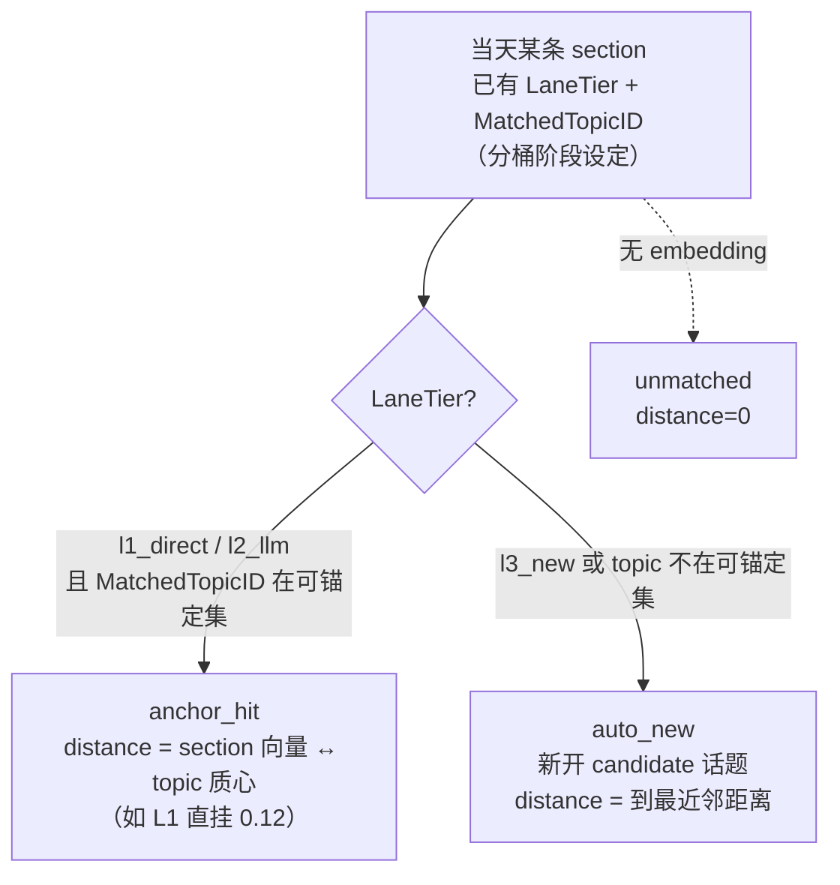

# 日报 / Digest 流程（Daily Report）

> 大功能：每日叙事生成（后端）+ Digest 预览/查看（前端）+ Section 可视化。
> 跨端。互补：`flow/topic-graph.md`（持久话题生命周期、关系双轨）、`flow/semantic-board.md`（版块）、`architecture/tracing.md`。

## 需求说明

日报解决「一个版块每天发生的事，怎么变成一篇可读、可回溯、能跨天串成话题链的叙事」。具体回答：

- **当天发生了什么**：把版块当天的事件 tag 收集、去重、质量过滤后聚类成若干 section（叙事单元），LLM 给每个 section 起标题并生成 section 内的 thread（逐条事件）。
- **和已有话题什么关系**：每个 section 通过「泳道分桶归属」关联到版块的持久话题（L1 质心强挂沿用 / L2 LLM 裁决留换 / L3 新开候选），把每天的 section 串成跨天演进的话题链。
- **怎么看**：前端「日报阅读层」在 TagsPage 内以全屏层承载当日报告的报纸式阅读；section 用三套独立匹配血缘（标签↔版块、section↔话题、thread↔section）做轻量可视化 + 深度探究。
- **用户主权**：用户可手动挑若干 section 建一条 active 持久话题（手动泳道），不必等算法连续命中。

理解日报，先分清四个对象。它们是「生成 → 锚定 → 展示」整条链的语义基石：

| 概念 | 是什么 | 关键字段 | 谁负责 |
| ------ | -------- | --------- | -------- |
| **Report**（日报） | 一个版块某天的一份叙事报告，含若干 section | `board_daily_reports.period_date` | 后端 scheduler 触发生成 |
| **Section**（条目） | **当天一个叙事单元** = 一簇 tag/文章聚成的一组。LLM 给簇起名（标题） | `cluster_label`(标题)、`cluster_tag_ids`、`article_count`、`embedding` | 后端 LLM 聚类 + 起名 |
| **Thread**（线程/事件） | section 内的逐条叙事（标题+摘要+置信度+关联文章），每个 thread 来自 cluster 内的一簇 tag/文章 | `daily_report_threads.{title,section_id,tag_ids,fit_distance}` | 后端 LLM 逐簇生成 |
| **PersistentTopic**（持久话题） | **跨天演进的话题**，把每天的 section 串成一条叙事链 | `board_persistent_topics.{label,embedding,status}` | 后端锚定/生命周期管理（见 `topic-graph.md`） |

> **Section 的 embedding 从哪来？** 用它的标题文本（`cluster_label`）算出来。即「section 的向量 = 它标题的语义向量」。
> **持久话题的匹配锚点从哪来？** 从 topic 近期 section embedding 的**质心**（`board_persistent_topics.centroid`，近 `centroid_window` 默认 30 条均权平均）算出；当天 tag 按到各 topic 质心的余弦距离分 L1/L2/L3 桶。topic 无 centroid（新 topic / section<2）退化「首义向量」（第一条 section 继承的 `embedding`）。
>
> ⚠️ **粒度错位陷阱**：锚定（见「链路设计 · 锚定机制」）的判断单位是 **section（标题向量）**，thread 不参与。一个被 LLM 误聚进 section 的跑题 thread（如「机器人控制器」事件混入「OpenAI 发布管控」section）会随所在 section 锚定成功而**搭便车**进入话题，即便它跟话题八竿子打不着。锚定看着合理（标题近）≠ section 内每条 thread 都贴合——因为 LLM 聚类（Step3）只保证簇内 tag 在它看来「同类」，不保证每条都严丝合缝。详见「链路设计 · 锚定机制 · 粒度错位」。

### 三套匹配血缘（看 section 时有三套独立信号，别混）

| 维度 | 回答的问题 | 字段 | 展示面 | 归属 change |
| ------ | ----------- | ------ | -------- | ------------ |
| **System 1：标签↔版块** | 这条 section 的 tag 有多贴合**版块** | `best_tier`/`avg_score`/`quality_breakdown` | 正文 tier 色点 + hover 探针 per-tag 明细 | `quality-scoring-observability` |
| **System 2：section↔话题** | 这条 section 有多紧地锚到**持久话题** | `topic_match_distance`/`topic_match_confidence`/`persistent_topic` | 正文锚定紧实度点 + 探针顶部「话题锚定」行 | `topic-anchor-match-observability` |
| **System 3：thread↔section** | 这条 thread 有多忠于它所在的 **section 标题** | `fit_distance` | thread 行降级样式（灰显+折叠+离群标记）+ hover/展开探究行（贴合度数值+中文标签） | `thread-fit-observability` |

三套并列、互不依赖、展示面互补：System 1 量 tag 贴合**版块**、System 2 量 section 贴近**话题**、System 3 量 **thread 忠于 section 标题**。本文重点讲 System 2 锚定机制，System 3 软降级见「链路设计 · 前端可视化」。

## 链路设计

### 后端：每日叙事生成管线

`GenerateDailyReport(ctx, boardID, date)` 是入口，分步管线（`daily_report_orchestrator.go`）：

```mermaid
flowchart TD
  STEP1[Step1 收集当天 event tags<br/>按 date+scope+semantic_board_id] --> STEP2[Step2 去重]
  STEP2 --> STEP2_5[Step2.5 质量过滤]
  STEP2_5 --> STEP3[Step3 加载可锚定 topic<br/>ListAnchorableTopicsByBoard<br/>返回 centroid + is_vacuum]
  STEP3 --> LANE[Lane 泳道分桶 ClusterTagsLane<br/>tag embedding ↔ topic 质心 余弦距离<br/>L1<0.18 直挂 / L2∈[0.18,0.30] LLM / L3>0.30 新建<br/>吸尘器 topic 的 tag 降级 L2]
  LANE --> STEP4[Step4 取昨日报告做连贯性参考]
  STEP4 --> STEP5[Step5 并行生成<br/>A: GenerateHighlights 全局<br/>C×K: GenerateClusterThreads 每簇线程]
  STEP5 --> STEP6[Step6 组装 section<br/>天生挂 topic（LaneTier+MatchedTopicID）<br/>标题 cluster_label → 算 embedding]
  STEP6 --> STEP7[Step7 合并同日相似 section<br/>embedding + LLM 两阶段]
  STEP7 --> SAVE[SaveReport 落库]
  SAVE --> ANCHOR[assignAndUpdateTopics<br/>lane-driven 归属（读 LaneTier+MatchedTopicID）<br/>同步写入 topic_status_at_report 快照 + lane_tier]
  ANCHOR --> REFRESH[提交后异步刷新<br/>UpdateCentroidOnSectionChange<br/>RecomputeVacuumStats]
  REFRESH --> REL[RebuildBoardRelations<br/>相似度+身份 双轨连线]
  REL --> FALL[关联前日叙事 / 派生 Board 连接 / 反馈标签 / 清理空 Board]
```

> **Lane 分桶决定归属（取代旧 Step3 LLM 自由聚类）**：当天 tag 按到各 topic **质心**的余弦距离分三桶——L1<`lane_l1_threshold`(0.18) 直挂该 topic（不调 LLM）；L2∈[0.18, 0.30] 交 LLM 在 top-K(`l2_candidate_k`)候选上做「留/换/新」；L3>0.30 起新叙事 candidate。吸尘器 topic（`is_vacuum=true`，质心过宽）的 tag 从 L1 降级 L2。section 天生挂 topic，**消除旧「LLM 自由聚类 → 事后 section 标题向量匹配 topic」两段式**（形态4错锚根源）。
>
> **ANCHOR 同步写入报告时快照**：lane-driven 归属完成后，每条 section 的 `topic_status_at_report` 与 `persistent_topic_id`、`topic_match_distance`、`topic_match_confidence`、`lane_tier` 在同一事务内写入。快照值为当时 PersistentTopic 的 `candidate|active`；未归属写 NULL。历史快照不随后续 topic 状态变化回填。
>
> **提交后异步刷新质心 / 吸尘器**：SaveReport 事务提交后，`UpdateCentroidOnSectionChange` 重算被触及 topic 的质心（读已提交数据，失败仅告警不阻断保存），`RecomputeVacuumStats` 按近 `vacuum_window`(7 天) 重算 strong/mid 计数与 `is_vacuum` 标记。质心/吸尘器是「读旧值可接受」的日级更新，不走主事务。

### 后端：Section↔话题 锚定机制（System 2）

`assignAndUpdateTopics → planTopicAssignments`（`daily_report_assignment.go`）对当天**每一条 section** 按**上游分桶结果**（`LaneTier` + `MatchedTopicID`）映射归属——归属在分桶阶段已定，此步只映射 confidence + distance（旧的双重确认 AND-gate 已移除）：



三态落地为 section 的 `topic_match_confidence` 列，`topic_match_distance` 存对应距离：

| confidence | 触发条件 | distance 含义 | 展示 |
| ----------- | --------- | -------------- | ------ |
| **anchor_hit** | L1 直挂或 L2 LLM 留/换命中既有 topic | **section 向量 ↔ topic 质心** 的真实余弦距离 | 实心→半透明点（按 distance 分紧/稳/松） |
| **auto_new** | L3 新叙事，或 L2 换/新（topic 不在候选集）→ 新开 candidate | 到最近邻的距离（一般 ≥0.30） | 空心 accent 点（新话题候选） |
| **unmatched** | 无 embedding，无法分桶 | 0 / 缺省 | 空心灰点 |

#### 关于 distance 的常见误解（重要）

- **distance 不是平均值**，是单条 section 的客观值：它自己的标题向量 离 topic **质心** 多远。话题下 N 条 section 就有 N 个各自独立的 distance。
- **distance 不是「当天相似度」**，是跨天的「这条 section 标题」和「topic 近期 section 质心」的语义距离（质心随窗口滚动更新）。
- **「松锚定/稳锚定」是前端展示分桶**（双阈值 `0.05 / 0.15` 切 anchor_hit 的三段），不是后端语义；后端 lane 分桶认 `lane_l1_threshold`(0.18)/`lane_l2_threshold`(0.30) 两道线。

#### 为什么「看着不像」却锚中了？

`lane_l2_threshold=0.30` 是 L2/L3 分界（余弦距离 0.30 ≈ 相似度 0.70）。L1 直挂（<0.18）是高置信强匹配；L2∈[0.18,0.30] 不硬挂，交 LLM 在 top-K 候选上做「留/换/新」三选一——相比旧「LLM 全量自由聚类再事后匹配」，输入聚焦、万能包装/强行打包诱因大幅减少。仍可能「看着不像」的两个来源：① **吸尘器 topic**（质心过宽，`is_vacuum=true`）把沾边 tag 吸成最近邻（但新流程会把它降级 L2 交 LLM 裁决）；② L2 LLM 主观把语义沾边的 tag 归并到某 topic。收紧阈值/提高 embedding 区分度归 `embedding-content-mismatch` 待办 issue（领域 change），本可观测层只如实暴露结果。

#### 粒度错位：跑题 thread 搭便车（真实案例）

锚定判断的粒度是 **section（标题向量）**，但用户实际看的是 **thread（事件）**。两者粒度不一致，会产生「这条事件明显跑题却出现在该话题下」的观感：

```text
Step3 Lane 分桶：某 tag（如"机器人"）到 OpenAI 质心 0.18（L2 弱区）<br/>→ LLM 裁决 keep，归入 OpenAI
    ↓
Step5 在簇内生成跑题 thread（如"机器人控制器争夺"）
    ↓
Step6 section 标题 = "OpenAI 发布管控与治理动荡"
    ↓
归属：tag 到 OpenAI 质心 0.18 ∈ [0.18,0.30]（L2）→ LLM keep → anchor_hit ✅
    ↓
跑题 thread 随所在 section 锚定成功 → 搭便车进入 OpenAI 话题
```

**判定**：这不是锚定算法的 bug（0.18 这个质心距离本身合理——tag 与 OpenAI topic 确实近），根源在 **L2 LLM 把沾边 tag keep 进 OpenAI** + **粒度错位**（归属按 section、用户看 thread），锚定只拿 section 标题向量判断、不校验 section 内 thread 是否贴合。治理方向有二：

- **上游治本**：提升 L2 LLM 裁决（`ClusterTagsLane`）的候选注入质量 + 吸尘器降级覆盖（过宽 topic 的 tag 不直挂），或给 thread 增加与 section 主题的校验，不让跑题 thread 进簇。
- **下游可观测**：`topic-anchor-match-observability` 如实暴露 section 锚定距离；thread 粒度的贴合度由 `thread-fit-observability`（System 3）事后校验 thread 标题 embedding 与所属 section 标题 embedding 的余弦距离，离群（`fit_distance` > 0.28）软降级（灰显+折叠+离群标记，见「前端可视化」）。治理点是**事后校验 thread↔section 贴合度**，而非在 Step3 归簇后做紧凑性剔除——伞形话题的子事件 embedding 天然分散，紧凑性剔除会误杀合理子事件（见 `thread-fit-observability` design D1）。

#### 可锚定话题选择器：聚类与归属共享同一集合

ClusterTagsLane 分桶（Step3）与归属判定**共享同一个可锚定 PersistentTopic 选择器**（`ListAnchorableTopicsByBoard`，返回 centroid + is_vacuum），保证两侧集合一致：

1. 全部 active 话题无条件入选。
2. candidate 需 `last_seen_date` 在 `persistent_topic_candidate_decay_window`（默认 7 天）内，按 `last_seen_date DESC, hit_count DESC, id ASC` 排序，最多保留 `persistent_topic_candidate_prompt_limit`（默认 20）条。
3. 窗口外或被截断的 candidate 不出现在任何一侧，消除单边锚定的隐式 bug。

### 后端：日报运维 backfill 端点

除每日自动生成外，日报域提供三个手动回填端点（`topicgraph/handler/daily_report_handler.go:59-67`），用于修正历史数据 / 重建派生结果，均为 POST 异步触发：

```text
POST /api/daily-reports/backfill-embeddings   重建 section embedding（按 cluster_label）+ 重新匹配
POST /api/daily-reports/backfill-relations    重建关系双轨（相似度 + 身份）连线
POST /api/daily-reports/backfill-topics       重建持久话题
```

可按 board 限定（body 传 `board_id`）或全量回填，与自动生成一样走 topicgraph service、幂等重建。

### 前端：日报阅读层

日报**不设独立 Digest 列表页**，而是在 TagsPage 内以「全屏阅读层」承载当日报告的报纸式阅读：

```text
TagsPage (front/app/features/tags/components/TagsPage.vue)
  → BoardDailyReportTimeline.vue（全屏阅读层入口）
  → useDailyReportReader.ts（阅读编排：拉取 / 分节 / 导航）
  → api/dailyReports.ts（getBoardDailyReports / getDailyReportDetail / generateDailyReport）
  → features/tags/components/daily-report/（Masthead 报头 / Sidebar 侧栏 / TopicSection 分节 / MiniLifeline 迷你生命线）
```

> 旧文档描述的 `DigestListView` / `getPreview(daily|weekly)` / `runNow` 链路对应的组件**已不存在**（周报能力已下线，仅留日报）。手动生成走 `POST /api/daily-reports/generate`。

### 前端：话题盯盘（topic-watch / watch-hits）

用户可在版块上 watch 若干持久话题（`board_topic_watches`）；每生成一份日报，LLM 自动评估各 section 命中哪些被 watch 的话题，结果写 `topic_watch_hits`，前端在日报顶部用 WatchBar 汇总命中：

```text
CRUD：POST/GET /api/semantic-boards/:id/topic-watches、PATCH/DELETE /api/topic-watches/:id
命中查询：GET /api/daily-reports/:id/watch-hits
后端评估：service/daily_report_watch.go 的 EvaluateWatchHits —— SaveReport 之后（其事务外）执行，
         LLM 对每个 active watch × 全部 section 评估，写 TopicWatchHit 行
前端：features/tags/components/daily-report/DailyReportWatchBar.vue + topicWatchGrouping.ts + api/topicWatches.ts
```

**不变量**：watch 评估是**只读覆盖层**——失败被吞掉仅记日志，**不改**任何 section 的 `persistent_topic_id`、不动 topic 的 `consecutive_hits`（`daily_report_watch.go` 注释明示 SHALL NOT）。

### 前端：Section 可视化与三套匹配血缘

日报 section 在 TagsPage 渲染（`features/tags/components/daily-report/`）。System 1/2 在**卡片头部**并列两枚独立维度的点，System 3 在 **thread 行**做降级——三者展示面互补，分数文字一律进 hover/展开探究区（保沉浸阅读）：

| 维度 | 匹配对象 | 正文 | 探究区（hover）|
|------|---------|------|----------------|
| System 1（标签↔版块）| 每 tag 为什么打进**版块** | `SectionTierBadge` 色点（无数字）| `SectionQualityExplore` per-tag 明细（含分数）|
| System 2（section↔话题）| section 多紧锚到**持久话题** | `SectionAnchorBadge` 紧实度点（无数字，形态五档）| 探针顶部「🔗 话题锚定」行（话题名 + 距离 + 中文标签）|

- **System 2 紧实度分档**（`utils/topicAnchor.ts`，双阈值 `0.05 / 0.15`，`confidence` 主判据、`distance` 仅细分 `anchor_hit`）：`anchor_hit` 极紧 / 稳锚 / 松锚三档（实心→半透明→淡半透明）、`auto_new` 新候选（空心 accent）、`unmatched` / 历史未锚定（空心灰）。
- **System 3（thread↔section，thread 行级降级）**：离群 thread（`fit_distance` > 阈值）行套 `drm-thread--demoted`（灰 token + 默认折叠 + `mdi:alert-circle-outline` 离群标记，无数字）；section 底部出提示行「另有 N 条可能跑题的线索」。thread 展开/探究行展示 `fit_distance.toFixed(2)` + `threadFitLabel` 中文标签（贴合 / 可能跑题 / 无贴合信号）。阈值标定：`utils/threadFit.ts` 单阈值 `THREAD_FIT_DEMOTE_THRESHOLD = 0.28`（2026-06-26 现网 86 thread 标定：候选 0.20 会误降级 35%，0.28 仅降级 8% 抓真跑题，见 `thread-fit-observability` design D3）。无 `fit_distance` 的历史 thread 按正常渲染（有信号才触发降级）。
- **展示分层哲学**：正文极轻（仅形态/色彩/降级，无任何数字），分数文字只进 hover/展开探究区——保沉浸阅读。System 1/2 在 section 头部并列（tier 点 + 锚定点），System 3 在 thread 行降级，探究区分区（System 2 锚定行在上、System 1 per-tag 明细在下、System 3 thread 行内探究）。
- 历史 section（缺 `quality_breakdown` 或锚定字段）/ 历史 thread（无 `fit_distance`）统一降级为正常展示，不报错。后端接口已 SELECT 锚定与贴合度字段，纯前端消费。

## 业务约束与不变量

> 本节同时是 `scripts/doc-impact.sh context` 的数据源——改 `internal/topicgraph/`（日报生成 / 锚定）或 `internal/admin/scheduler/job_daily_report.go` 代码前会被自动 dump，必读。

1. **同 board + 同日覆盖式重建（幂等）**：`SaveReport` 按 `(semantic_board_id, period_date)` upsert——命中已有报告则**更新并删除其旧 section / thread 后重建**，不产生重复报告。手动 `runNow` / 调度器重跑同一天都是「整份重建」，不是新建。
2. **归属：泳道分桶（lane-driven，旧 AND-gate 已移除）**：当天 tag 按到 topic **质心**（`centroid`）的余弦距离分桶——L1<`lane_l1_threshold`(0.18) 直挂（不调 LLM）/ L2∈[0.18,0.30] 交 LLM 在 top-K(`l2_candidate_k`)候选上做留/换/新 / L3>`lane_l2_threshold`(0.30) 新建；吸尘器 topic（`is_vacuum=true`，质心过宽）的 tag 从 L1 降级 L2。归属由 section 的 `LaneTier`+`MatchedTopicID` 路由：L1/L2 命中既有 topic → `anchor_hit`；L3 或 topic 不在候选集 → `auto_new`（新开 candidate）；section 无 embedding → `unmatched`。
3. **锚定三态落地为 `topic_match_confidence`**：`anchor_hit`（L1 直挂或 L2 LLM 留/换命中既有 topic，distance = section 向量↔topic 质心）/ `auto_new`（L3 新建或 L2 换/新，distance = 到最近邻距离，一般 ≥0.30）/ `unmatched`（无 embedding，无法分桶，distance=0）；手动建泳道另有第四态 `manual`（非算法三态）。
4. **section / 持久话题 embedding 来源固定**：section 的 embedding = 其标题 `cluster_label` 文本的语义向量；持久话题的**匹配锚点** = `centroid`（近 `centroid_window` 默认 30 条 section embedding 均权平均；退化首义向量 `embedding`），手动建泳道则 = 选中 section embedding 的 mean pooling 聚合向量。改 embedding 算法会影响所有锚定距离，属跨域语义变更。
5. **topic_status_at_report 快照同事务写入、不回填**：lane 归属完成后，section 的 `topic_status_at_report` / `persistent_topic_id` / `topic_match_distance` / `topic_match_confidence` / `lane_tier` 在同一事务内写入，快照值为当时 PersistentTopic 的 `candidate|active`，未归属写 NULL；历史快照不随后续 topic 状态变化回填。
6. **可锚定话题选择器两侧共享且严格筛选**：lane 分桶（Step3）与归属判定共享 `ListAnchorableTopicsByBoard`（返回 centroid + is_vacuum）——active 无条件入选；candidate 需 `last_seen_date` 在 `CandidateDecayWindow`（默认 7 天）内、按 `last_seen_date DESC, hit_count DESC, id ASC` 排序、最多保留 `CandidatePromptLimit`（默认 20）条；窗口外 / 被截断的 candidate 不出现在任何一侧。
7. **默认参数可被 `ai_settings` 覆盖**：`MatchThreshold` 0.30、`UpgradeThreshold` 3（兼管理 UI 可见门槛）、`CandidateDecayWindow` 7 天（仅 prompt 卫生过滤，不触发归档）、`CandidatePromptLimit` 20、**lane 分桶 6 阈值**：`LaneL1Threshold` 0.18 / `LaneL2Threshold` 0.30 / `VacuumRatio` 0.20 / `CentroidWindow` 30 / `VacuumWindow` 7 / `L2CandidateK` 5（`PersistentTopicConfig`）。注意 `CandidateDecayWindow` 只过滤 prompt，不触发 candidate 归档。
8. **手动建泳道是用户主权声明、跳过算法门禁**：`POST /semantic-boards/:id/persistent-topics/manual`（body：`label` + `section_ids[]`）在**独立事务**（不在 `SaveReport` 管线内）聚合选中 section embedding（mean pooling）→ `CreateTopic(status=active, source='manual')`（跳过 candidate 阶段与 `upgrade_threshold` 连续命中门禁）→ 批量改写选中 section 的 `persistent_topic_id`（覆盖原值，单值外键）+ `topic_match_confidence='manual'` → `RebuildBoardRelations`（幂等重建）。建好的 active topic 立即被纳入可锚定集合（`source='manual'` 仅标记来源、不影响入选）；**下一期日报**生成时与自动 active topic 一样参与 lane 分桶（锚点 = 其 centroid，初期退化聚合向量）。
9. **持久话题生命周期为全人工归档**：candidate→active→archived 状态流转靠人工归档，不自动转正 / 归档；连续命中门禁（`UpgradeThreshold`）与关系双轨（相似度 + 身份）见 `flow/topic-graph.md`。

## 代码入口

- **后端生成（topicgraph 域）**：`backend-go/internal/topicgraph/service/daily_report_orchestrator.go`（`GenerateDailyReport` 管线）、`backend-go/internal/topicgraph/service/daily_report_lane.go`（L1/L2/L3 泳道分桶 `ClusterTagsLane`/`BucketTagsByCentroid`）、`backend-go/internal/topicgraph/service/daily_report_llm.go`（聚类 / 线程 LLM）、`backend-go/internal/topicgraph/repository/daily_report_assignment.go`（lane 归属 `planTopicAssignments`）、`backend-go/internal/topicgraph/repository/daily_report_topic_repository.go`（质心/吸尘器 `ComputeTopicCentroid`/`RecomputeVacuumStats`/`PersistentTopicConfig`）、`backend-go/internal/topicgraph/repository/daily_report_repository.go`（`SaveReport` upsert）、`backend-go/internal/topicgraph/repository/daily_report_manual_topic.go`（手动建泳道）、`backend-go/internal/topicgraph/handler/daily_report_handler.go`、`backend-go/internal/topicgraph/routes.go`。
- **后端调度（admin 域）**：`backend-go/internal/admin/scheduler/job_daily_report.go`（daily_report job）、`backend-go/internal/admin/handler/scheduler_handler.go`。
- **平台层**：`backend-go/internal/platform/airouter/`（日报 LLM 走 `CapabilityDigestPolish` 等能力路由）、`backend-go/internal/platform/ws/`。
- **后端 watch 评估**：`backend-go/internal/topicgraph/service/daily_report_watch.go`（`EvaluateWatchHits`）、`backend-go/internal/topicgraph/handler/topic_watch_handler.go`（topic-watch CRUD + watch-hits 查询）、`backend-go/internal/topicgraph/repository/daily_report_models.go`（`BoardTopicWatch` / `TopicWatchHit` 模型）。
- **前端**：`front/app/features/tags/components/BoardDailyReportTimeline.vue`（日报阅读层全屏入口）、`front/app/features/tags/composables/useDailyReportReader.ts`（阅读编排）、`front/app/api/dailyReports.ts`、`front/app/api/topicWatches.ts`、`front/app/features/tags/components/daily-report/`（section 可视化、三套匹配血缘、话题盯盘 WatchBar）、`front/app/utils/topicAnchor.ts`（锚定分档）、`front/app/utils/threadFit.ts`（thread↔section 贴合度分档）。

> 互补：`flow/topic-graph.md`（持久话题生命周期 candidate→active→archived、关系相似度/身份双轨）、`flow/semantic-board.md`（版块）、`architecture/tracing.md`。迁自原 `architecture/data-flow.md`（Digest 流 / 叙事数据流·每日叙事生成）。

## 变更溯源

| 日期 | 变更 | 摘要 | 归档位置 |
| ------ | ------ | ------ | ---------- |
| 2026-05-29 | matching-quality-and-daily-report-redesign | 方向校验扩展到 hit_rate/weighted 全规则；文章按匹配质量排序（direct_hit>hit_rate>max_sim>weighted）；日报精简 + 报纸布局重构 | [`openspec/changes/archive/2026-05-29-matching-quality-and-daily-report-redesign`](../../../openspec/changes/archive/2026-05-29-matching-quality-and-daily-report-redesign) |
| 2026-05-31 | section-lifecycle-ui | Section 获得独立生命周期：`DailyReportSection` 新增 `status`（emerging/continuing/ending）+ `prev_section_id`，由后端按 `cluster_tag_ids` Jaccard 相似度推导（非 LLM）；线程总览改 section 粒度 | [`openspec/changes/archive/2026-05-31-section-lifecycle-ui`](../../../openspec/changes/archive/2026-05-31-section-lifecycle-ui) |
| 2026-07-05 | manual-topic-lane | 手动建泳道：用户主动建 active topic（`source=manual`），次期接入 AND-gate；新增 `board_persistent_topics.source` 列 + `topic_match_confidence=manual` 第四态；前端工作台化（弃 `TopicManageDialog`） | [`openspec/changes/archive/2026-07-05-manual-topic-lane`](../../../openspec/changes/archive/2026-07-05-manual-topic-lane) |
| 2026-07-28 | daily-report-lane-driven-clustering | 日报归属反转：旧「LLM 自由聚类 → 事后 section 标题向量匹配 topic」改为「embedding 质心分桶（L1/L2/L3）→ LLM 弱区裁决/兜底」；topic 匹配锚点首义向量→历史 section 质心（`centroid`）；新增吸尘器 topic 检测（`is_vacuum`）；section 新增 `lane_tier`；新增 6 阈值 | 待归档（[`openspec/changes/daily-report-lane-driven-clustering`](../../../openspec/changes/daily-report-lane-driven-clustering)）—归档后按 §12.2 补 archive 链接 |
| 2026-07-23 | topic-watchlist-observability | 持久话题可观测性：话题关注（watch）+ 命中追踪 + 赋值推理（topic_watch_hits / board_topic_watches 表）；§1 Step3 注入 active 话题近期 section/thread 内容（不止 label） | [`openspec/changes/archive/2026-07-23-topic-watchlist-observability`](../../../openspec/changes/archive/2026-07-23-topic-watchlist-observability) |
