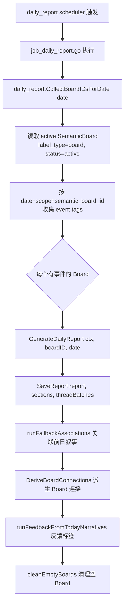

# 日报 / Digest 流程（Daily Report）

> 大功能：Digest 预览/查看/立即生成 + 每日叙事生成。
> 跨端。互补：`flow/topic-graph.md`（日报与话题归属）、`architecture/tracing.md`。

## Digest 预览/查看链路

```text
DigestListView
  → getStatus()
  → getPreview(daily|weekly, date)
  → 左栏分类 + 中栏 summary 列表 + 右栏详情
  → runNow() 可立即生成新版本
  → DigestDetail 按 article_ids 拉关联文章
  → 关联文章在弹窗中复用 ArticleContentView
```

## 每日叙事生成（后端）



## 日报 Section 可视化与匹配血缘（前端）

日报 section 在 TagsPage 渲染（`features/tags/components/daily-report/`），每个 section 卡片携带**两套独立维度的匹配血缘**，各自有独立的展示面：

| 维度 | 匹配对象 | 字段 | 正文 | 探究区（hover 探针） |
|------|---------|------|------|---------------------|
| System 1（标签↔板块） | 每 tag 为什么打进**板块** | `best_tier` / `quality_breakdown` | `SectionTierBadge` 色点（无数字） | `SectionQualityExplore` per-tag 明细（含分数） |
| System 2（section↔话题） | section 多紧锚到**持久话题** | `topic_match_distance` / `topic_match_confidence` | `SectionAnchorBadge` 紧实度点（无数字，形态五档） | 探针顶部「话题锚定」行（话题名 + 距离 + 中文标签） |

**展示分层哲学**：正文极轻（仅形态/色彩，无任何数字），分数文字只进 hover 探究区——保沉浸阅读。两套维度在正文并列呈现（tier 点 + 锚定点），在探究区分区（System 2 锚定行在上、System 1 per-tag 明细在下）。

- System 2 紧实度分档（双阈值 `0.05 / 0.15`，`confidence` 主判据、`distance` 仅细分 `anchor_hit`）：`anchor_hit` 极紧 / 稳锚 / 松锚三档（实心→半透明→淡半透明）、`auto_new` 新候选（空心 accent）、`unmatched` / 历史未锚定（空心灰）。分档逻辑在共享 `utils/topicAnchor.ts`。
- 历史 section（缺 `quality_breakdown` 或锚定字段）统一降级，不报错。后端四接口（detail/timeline/lifeline/topic-lifeline）均已 SELECT 锚定字段，纯前端消费。

## 代码入口

- 后端：`internal/admin/`（scheduler, daily_report job）、`internal/topicgraph/`（daily_report service/repository）
- 前端：`front/app/features/ai/`（Digest 预览/查看）、`front/app/features/articles/`（关联文章）、`front/app/features/tags/components/daily-report/`（section 可视化与匹配血缘）

## 资料来源

迁自原 `architecture/data-flow.md`（Digest 流 / 叙事数据流·每日叙事生成）。
