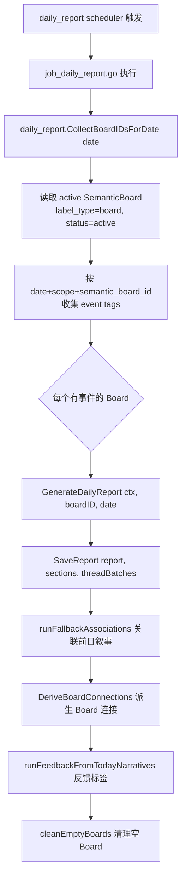

# 日报 / Digest 流程（Daily Report）

> 大功能：Digest 预览/查看/立即生成 + 每日叙事生成。
> 跨端。互补：`flow/topic-graph.md`（日报与话题归属）、`architecture/tracing.md`。

## Digest 预览/查看链路

```text
DigestListView
  → getStatus()
  → getPreview(daily|weekly, date)
  → 左栏分类 + 中栏 summary 列表 + 右栏详情
  → runNow() 可立即生成新版本
  → DigestDetail 按 article_ids 拉关联文章
  → 关联文章在弹窗中复用 ArticleContentView
```

## 每日叙事生成（后端）



## 代码入口

- 后端：`internal/admin/`（scheduler, daily_report job）、`internal/topicgraph/`（daily_report service/repository）
- 前端：`front/app/features/ai/`、`front/app/features/articles/`

## 资料来源

迁自原 `architecture/data-flow.md`（Digest 流 / 叙事数据流·每日叙事生成）。
