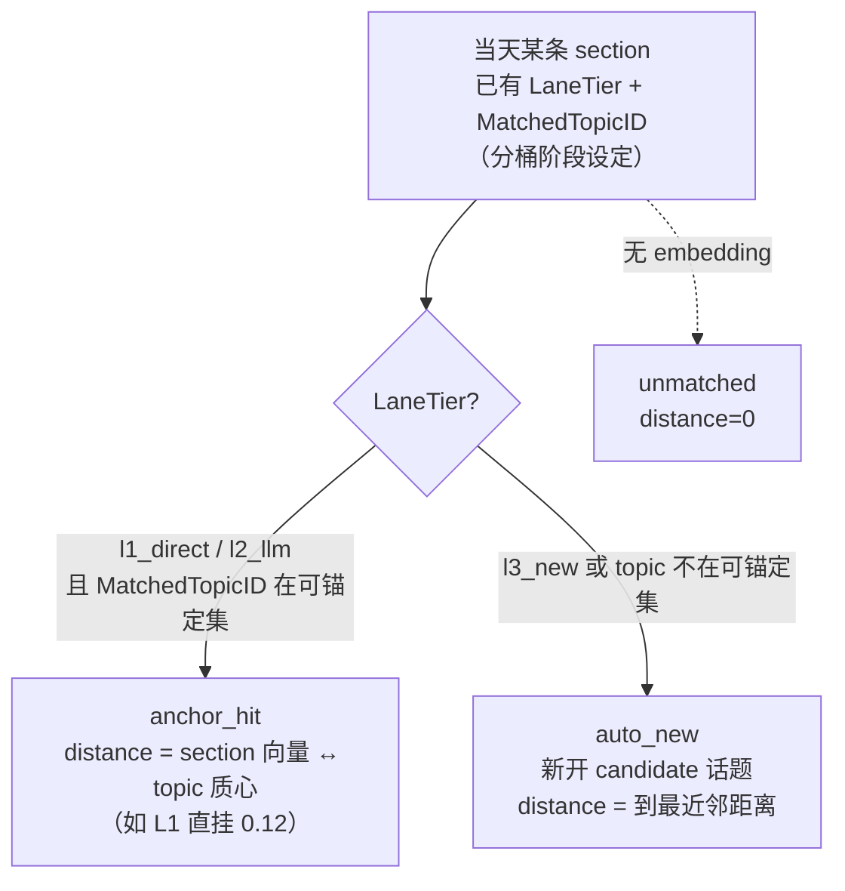

# 日报 / Digest 流程（Daily Report）

<!-- doc-impact-applies: backend-go/internal/topicgraph/, backend-go/internal/admin/scheduler/ | section=业务约束与不变量 -->
> 大功能：每日日报生成（后端）+ Digest 预览/查看（前端）+ Section 可视化。
> 跨端。互补：`flow/topic-graph.md`（持久话题生命周期、关系双轨）、`flow/semantic-board.md`（版块）、`architecture/tracing.md`。

## 需求说明

日报解决「一个版块每天发生的事，怎么变成一篇可读、可回溯、能跨天串成话题链的日报」。具体回答：

- **当天发生了什么**：把版块当天的事件 tag 收集、去重、质量过滤后聚类成若干 section（章节单元），LLM 给每个 section 起标题并生成 section 内的 thread（逐条事件）。
- **和已有话题什么关系**：每个 section 通过「泳道分桶归属」关联到版块的持久话题（L1 质心强挂沿用 / L2 LLM 裁决留换 / L3 新开候选），把每天的 section 串成跨天演进的话题链。
- **怎么看**：前端「日报阅读层」在 TagsPage 内以全屏层承载当日报告的报纸式阅读；section 用三套独立匹配血缘（标签↔版块、section↔话题、thread↔section）做轻量可视化 + 深度探究。
- **用户主权**：用户可手动挑若干 section 建一条 active 持久话题（手动泳道），不必等算法连续命中。

理解日报，先分清四个对象。它们是「生成 → 锚定 → 展示」整条链的语义基石：

| 概念 | 是什么 | 关键字段 | 谁负责 |
| ------ | -------- | --------- | -------- |
| **Report**（日报） | 一个版块某天的一份报告，含若干 section | `board_daily_reports.period_date` | 后端 scheduler 触发生成 |
| **Section**（条目） | **当天一个章节单元** = 一簇 tag/文章聚成的一组。LLM 给簇起名（标题） | `cluster_label`(标题)、`cluster_tag_ids`、`article_count`、`embedding` | 后端 LLM 聚类 + 起名 |
| **Thread**（线程/事件） | section 内的逐条叙事线（标题+摘要+置信度+关联文章），每个 thread 来自 cluster 内的一簇 tag/文章 | `daily_report_threads.{title,section_id,tag_ids,fit_distance}` | 后端 LLM 逐簇生成 |
| **PersistentTopic**（持久话题） | **跨天演进的话题**，把每天的 section 串成一条话题链 | `board_persistent_topics.{label,embedding,status}` | 后端锚定/生命周期管理（见 `topic-graph.md`） |

> **Section 的 embedding 从哪来？** 用它的**内容化文本**（所聚 tag 的 label+description+代表文章摘录拼接）算出来（2026-08-22 起不再取标题文本，见约束 4）。
> **持久话题的匹配锚点从哪来？** 从 topic 近期 section embedding 的**质心**（`board_persistent_topics.centroid`，近 `centroid_window` 默认 30 条均权平均）算出；当天 tag 按到各 topic 质心的余弦距离分 L1/L2/L3 桶。topic 无 centroid（新 topic / section<2）退化「首义向量」（第一条 section 继承的 `embedding`）。
>
> ⚠️ **粒度错位陷阱**：锚定（见「链路设计 · 锚定机制」）的判断单位是 **section（标题向量）**，thread 不参与。一个被 LLM 误聚进 section 的跑题 thread（如「机器人控制器」事件混入「OpenAI 发布管控」section）会随所在 section 锚定成功而**搭便车**进入话题，即便它跟话题八竿子打不着。锚定看着合理（标题近）≠ section 内每条 thread 都贴合——因为 LLM 聚类（Step3）只保证簇内 tag 在它看来「同类」，不保证每条都严丝合缝。详见「链路设计 · 锚定机制 · 粒度错位」。

### 三套匹配血缘（看 section 时有三套独立信号，别混）

| 维度 | 回答的问题 | 字段 | 展示面 | 归属 change |
| ------ | ----------- | ------ | -------- | ------------ |
| **System 1：标签↔版块** | 这条 section 的 tag 有多贴合**版块** | `best_tier`/`avg_score`/`quality_breakdown` | 正文 tier 色点 + hover 探针 per-tag 明细 | `quality-scoring-observability` |
| **System 2：section↔话题** | 这条 section 有多紧地锚到**持久话题** | `topic_match_distance`/`topic_match_confidence`/`persistent_topic` | 正文锚定紧实度点 + 探针顶部「话题锚定」行 | `topic-anchor-match-observability` |
| **System 3：thread↔section** | 这条 thread 有多忠于它所在的 **section 标题** | `fit_distance` | thread 行降级样式（灰显+折叠+离群标记）+ hover/展开探究行（贴合度数值+中文标签） | `thread-fit-observability` |

三套并列、互不依赖、展示面互补：System 1 量 tag 贴合**版块**、System 2 量 section 贴近**话题**、System 3 量 **thread 忠于 section 标题**。本文重点讲 System 2 锚定机制，System 3 软降级见「链路设计 · 前端可视化」。

## 链路设计

### 后端：日报生成管线

`GenerateDailyReport(ctx, boardID, date)` 是入口，分步管线（`daily_report_orchestrator.go`）：

```mermaid
flowchart TD
  STEP1[Step1 收集当天 event tags<br/>按 date+scope+semantic_board_id] --> STEP2[Step2 去重]
  STEP2 --> STEP2_5[Step2.5 质量过滤]
  STEP2_5 --> STEP3[Step3 加载可锚定 topic<br/>ListAnchorableTopicsByBoard<br/>返回 centroid + is_vacuum]
  STEP3 --> LANE[Lane 泳道分桶 ClusterTagsLane<br/>tag embedding ↔ topic 质心 余弦距离<br/>L1<0.18 直挂 / L2∈[0.18,0.30] LLM / L3>0.30 新建<br/>吸尘器 topic 的 tag 降级 L2]
  LANE --> STEP4[Step4 存前日报告引用 PrevReportID<br/>findPreviousReportBrief 仅写引用 ID<br/>未进任何 LLM prompt]
  STEP4 --> STEP5[Step5 并行生成<br/>A: GenerateHighlights 全局<br/>C×K: GenerateClusterThreads 每簇线程]
  STEP5 --> STEP6[Step6 组装 section<br/>天生挂 topic（LaneTier+MatchedTopicID）<br/>标题 cluster_label → 算 embedding]
  STEP6 --> STEP7[Step7 合并同日相似 section<br/>embedding + LLM 两阶段]
  STEP7 --> SAVE[SaveReport 落库]
  SAVE --> ANCHOR[assignAndUpdateTopics<br/>lane-driven 归属（读 LaneTier+MatchedTopicID）<br/>同步写入 topic_status_at_report 快照 + lane_tier]
  ANCHOR --> REFRESH[提交后异步刷新<br/>UpdateCentroidOnSectionChange<br/>RecomputeVacuumStats]
  REFRESH --> REL[RebuildBoardRelations<br/>相似度+身份 双轨连线]
  REL --> FALL[关联前日日报 / 派生 Board 连接 / 反馈标签 / 清理空 Board]
```

> **Lane 分桶决定归属（取代旧 Step3 LLM 自由聚类）**：当天 tag 按到各 topic **质心**的余弦距离分三桶——L1<`lane_l1_threshold`(0.18) 且最近 topic 为 **active**（观察期门禁，`persistent_topic_candidate_l1_gate_enabled` 默认开）直挂该 topic（不调 LLM）；L2∈[0.18, 0.30]（含 candidate 近距离降级与 vacuum 降级）交 LLM 在 top-K(`l2_candidate_k`)候选上做「留/换/新」；L3>0.30 起新话题 candidate。吸尘器 topic（`is_vacuum=true`，质心过宽）的 tag 从 L1 降级 L2；**candidate topic 不享有直挂资格**——系统猜想的框架每次挂载都要过 LLM 审，用户确认过的 active 框架才信任直挂。section 天生挂 topic，**消除旧「LLM 自由聚类 → 事后 section 标题向量匹配 topic」两段式**（形态4错锚根源）。
>
> **section 展示标题内容化（随 promptVersion 5.0）**：section 的 `cluster_label` 由当天实际内容派生（threads LLM 顺带产出的 `section_title`，遵守事实锚与「不得复述话题名」约束），不再默认取所挂话题的 label——话题 label 仅承担归属锚与兜底。兜底链：LLM 当日标题 → 首条 thread 标题 → 话题 label → L3 分组名，永不出空标题（超长按 200 runes 截断对齐列预算）。时间线跨天串联靠 `persistent_topic_id`，不依赖标题一致。
>
> **L2 裁决 prompt 注入内容（prompt 卫生）**：`buildL2Prompt` 只注入**非叙事线**信号——候选 topic 的 label、状态（正式/观察中）、最近命中日期、累计天数、质心距离、近期 section 实际 tag 标签（`cluster_tag_ids` join `topic_tags.label` 的事实指纹，每 section 截 5 个，格式 `section (日期): tag1 / tag2`，覆盖 active+candidate，注入窗口排除当日，见约束 15）；**不注入**历史 thread 的 title / summary 文案，切断「昨天幻觉 thread → 今天作为 briefs 喂回 → LLM 延续叙事线」的渗透闭环；也不注入被话题 label 硬覆盖的 `cluster_label`（零信息复读）。system 对「观察中」候选携带从严指令：依据其近期实际内容从严判断 keep，无内容支撑的一次性标题话题不应仅凭域相近 keep；响应解析尊重 LLM 显式 target（见约束 16）
>
> **ANCHOR 同步写入报告时快照**：lane-driven 归属完成后，每条 section 的 `topic_status_at_report` 与 `persistent_topic_id`、`topic_match_distance`、`topic_match_confidence`、`lane_tier` 在同一事务内写入。快照值为当时 PersistentTopic 的 `candidate|active`；未归属写 NULL。历史快照不随后续 topic 状态变化回填。
>
> **提交后异步刷新质心 / 吸尘器**：SaveReport 事务提交后，`UpdateCentroidOnSectionChange` 重算被触及 topic 的质心（读已提交数据，失败仅告警不阻断保存），`RecomputeVacuumStats` 按近 `vacuum_window`(7 天) 重算 strong/mid 计数与 `is_vacuum` 标记。质心/吸尘器是「读旧值可接受」的日级更新，不走主事务。
>
> **Step7.5 Watch 物化追加（watch-materialized-topic）**：同日合并之后、落库之前，board 的 active 物化轨关注各产出一个追加 section——`keyword_topic` 扫描当天全量未归档文章（标题+择优摘要层，零 AI、可捞 tag 体系漏网），命中文章机械聚合为固定名「关键字『X』相关话题」板块（`lane_tier=watch_keyword`、无持久话题、无 embedding）；`sentence_topic` 用关注缓存的一句话向量在 board 辅助标签池（`board_composition` join `semantic_labels.embedding`）余弦检索 top-K（阈值/上限可配 `watch_sentence_retrieval_threshold`/`watch_sentence_retrieval_top_k`，默认 0.55/8），命中标签经 `topic_tag_semantic_labels` 解析为当天有文章的 event tag，文章并集聚合成挂**专属持久话题**（`source=manual/status=active`，`lane_tier=watch_sentence`，`topic_match_confidence=manual`）的板块。专属话题首次物化时创建（`Embedding=Centroid=检索句向量`，命中计数种 0 由同事务 lifecycle 推到 1），后续作为 lane 锚与普通 manual active 话题一视同仁。物化 section 不参与同日合并与关系计算；report 级聚合计数保持聚类口径；任一关注物化失败降级跳过（log warn），不阻断日报。当天无命中不产空板块（sentence 话题记当日未命中，自然衰减）。

### 后端：Section↔话题 锚定机制（System 2）

`assignAndUpdateTopics → planTopicAssignments`（`daily_report_assignment.go`）对当天**每一条 section** 按**上游分桶结果**（`LaneTier` + `MatchedTopicID`）映射归属——归属在分桶阶段已定，此步只映射 confidence + distance（旧的双重确认 AND-gate 已移除）：



三态落地为 section 的 `topic_match_confidence` 列，`topic_match_distance` 存对应距离：

| confidence | 触发条件 | distance 含义 | 展示 |
| ----------- | --------- | -------------- | ------ |
| **anchor_hit** | L1 直挂或 L2 LLM 留/换命中既有 topic | **section 向量 ↔ topic 质心** 的真实余弦距离 | 实心→半透明点（按 distance 分紧/稳/松） |
| **auto_new** | L3 新话题，或 L2 换/新（topic 不在候选集）→ 新开 candidate | 到最近邻的距离（一般 ≥0.30） | 空心 accent 点（新话题候选） |
| **unmatched** | 无 embedding，无法分桶 | 0 / 缺省 | 空心灰点 |

#### 关于 distance 的常见误解（重要）

- **distance 不是平均值**，是单条 section 的客观值：它自己的标题向量 离 topic **质心** 多远。话题下 N 条 section 就有 N 个各自独立的 distance。
- **distance 不是「当天相似度」**，是跨天的「这条 section 标题」和「topic 近期 section 质心」的语义距离（质心随窗口滚动更新）。
- **「松锚定/稳锚定」是前端展示分桶**（双阈值 `0.05 / 0.15` 切 anchor_hit 的三段），不是后端语义；后端 lane 分桶认 `lane_l1_threshold`(0.18)/`lane_l2_threshold`(0.30) 两道线。

#### 为什么「看着不像」却锚中了？

`lane_l2_threshold=0.30` 是 L2/L3 分界（余弦距离 0.30 ≈ 相似度 0.70）。L1 直挂（<0.18）是高置信强匹配；L2∈[0.18,0.30] 不硬挂，交 LLM 在 top-K 候选上做「留/换/新」三选一——相比旧「LLM 全量自由聚类再事后匹配」，输入聚焦、万能包装/强行打包诱因大幅减少。仍可能「看着不像」的两个来源：① **吸尘器 topic**（质心过宽，`is_vacuum=true`）把沾边 tag 吸成最近邻（但新流程会把它降级 L2 交 LLM 裁决）；② L2 LLM 主观把语义沾边的 tag 归并到某 topic。收紧阈值/提高 embedding 区分度归 `embedding-content-mismatch` 待办 issue（领域 change），本可观测层只如实暴露结果。

#### 粒度错位：跑题 thread 搭便车（真实案例）

锚定判断的粒度是 **section（标题向量）**，但用户实际看的是 **thread（事件）**。两者粒度不一致，会产生「这条事件明显跑题却出现在该话题下」的观感：

```text
Step3 Lane 分桶：某 tag（如"机器人"）到 OpenAI 质心 0.18（L2 弱区）<br/>→ LLM 裁决 keep，归入 OpenAI
    ↓
Step5 在簇内生成跑题 thread（如"机器人控制器争夺"）
    ↓
Step6 section 标题 = "OpenAI 发布管控与治理动荡"
    ↓
归属：tag 到 OpenAI 质心 0.18 ∈ [0.18,0.30]（L2）→ LLM keep → anchor_hit ✅
    ↓
跑题 thread 随所在 section 锚定成功 → 搭便车进入 OpenAI 话题
```

**判定**：这不是锚定算法的 bug（0.18 这个质心距离本身合理——tag 与 OpenAI topic 确实近），根源在 **L2 LLM 把沾边 tag keep 进 OpenAI** + **粒度错位**（归属按 section、用户看 thread），锚定只拿 section 标题向量判断、不校验 section 内 thread 是否贴合。治理方向有二：

- **上游治本**：提升 L2 LLM 裁决（`ClusterTagsLane`）的候选注入质量 + 吸尘器降级覆盖（过宽 topic 的 tag 不直挂），或给 thread 增加与 section 主题的校验，不让跑题 thread 进簇。
- **下游可观测**：`topic-anchor-match-observability` 如实暴露 section 锚定距离；thread 粒度的贴合度由 `thread-fit-observability`（System 3）事后校验 thread 标题 embedding 与所属 section 标题 embedding 的余弦距离，离群（`fit_distance` > 0.28）软降级（灰显+折叠+离群标记，见「前端可视化」）。治理点是**事后校验 thread↔section 贴合度**，而非在 Step3 归簇后做紧凑性剔除——伞形话题的子事件 embedding 天然分散，紧凑性剔除会误杀合理子事件（见 `thread-fit-observability` design D1）。

#### 可锚定话题选择器：聚类与归属共享同一集合

ClusterTagsLane 分桶（Step3）与归属判定**共享同一个可锚定 PersistentTopic 选择器**（`ListAnchorableTopicsByBoard`，返回 centroid + is_vacuum），保证两侧集合一致：

1. 全部 active 话题无条件入选。
2. candidate 需 `last_seen_date` 在 `persistent_topic_candidate_decay_window`（默认 7 天）内，按 `last_seen_date DESC, hit_count DESC, id ASC` 排序，最多保留 `persistent_topic_candidate_prompt_limit`（默认 20）条。
3. 窗口外或被截断的 candidate 不出现在任何一侧，消除单边锚定的隐式 bug。

### 后端：日报运维 backfill 端点

除每日自动生成外，日报域提供三个手动回填端点（`topicgraph/handler/daily_report_handler.go:59-67`），用于修正历史数据 / 重建派生结果，均为 POST 异步触发：

```text
POST /api/daily-reports/backfill-embeddings   重建 section embedding（按 cluster_label）+ 重新匹配
POST /api/daily-reports/backfill-relations    重建关系双轨（相似度 + 身份）连线
POST /api/daily-reports/backfill-topics       重建持久话题
```

可按 board 限定（body 传 `board_id`）或全量回填，与自动生成一样走 topicgraph service、幂等重建。

### 前端：日报阅读层

日报**不设独立 Digest 列表页**，而是在 TagsPage 内以「全屏阅读层」承载当日报告的报纸式阅读：

```text
TagsPage (front/app/features/tags/components/TagsPage.vue)
  → BoardDailyReportTimeline.vue（全屏阅读层入口）
  → useDailyReportReader.ts（阅读编排：拉取 / 分节 / 导航）
  → api/dailyReports.ts（getBoardDailyReports / getDailyReportDetail / generateDailyReport）
  → features/tags/components/daily-report/（Masthead 报头 / Sidebar 侧栏 / TopicSection 分节 / MiniLifeline 迷你生命线）
```

> 旧文档描述的 `DigestListView` / `getPreview(daily|weekly)` / `runNow` 链路对应的组件**已不存在**（周报能力已下线，仅留日报）。手动生成走 `POST /api/daily-reports/generate`。

### 前端：话题盯盘（topic-watch / watch-hits）

用户可在版块上创建用户声明的 watch（`board_topic_watches`，与持久话题独立）；命中写 `topic_watch_hits`。创建/管理唯一入口在版块工作台 `TagsPage` 的 tab 栏右端「我在追踪 (N)」面板：入口位置与职责不变，图标/文案保持单行。日报时间线维持日期顺序、在每期记录下以紧凑 tag 预告 active watch 命中；日报详情不再有独立 WatchBar，而在「关心的话题」之前以「追踪关键字」「追踪话题」全宽分区提供可定位索引：

```text
CRUD：POST/GET /api/semantic-boards/:id/topic-watches、PATCH/DELETE /api/topic-watches/:id
日报列表：一次批量关联回填每期 `active_watch_summaries`（watch 去重、仅 active），时间线最多显示两个 #/✦ tag 与 +N，不改变日期顺序
命中查询：GET /api/daily-reports/:id/watch-hits（仅 active，含 watch_label / watch_type）；点 tag 或详情索引定位 `report-section-{section_id}`
日报后端评估：service/daily_report_watch.go 的 EvaluateWatchHits —— SaveReport 之后（其事务外）执行：
  type=label   → 每个 active label watch × 全部 section 的批量 AI 单信号判定
  type=keyword → threads 标题+摘要的大小写不敏感文本匹配（零 AI），空格=AND、|=OR
  两轨命中合并写 TopicWatchHit，以 (watch_id, section_id, report_id) 唯一索引幂等去重
创建 keyword：handler 在 watch 落库后同步调用 MatchKeywordInstant，回扫近 14 天 section；失败只记 Warn，watch 仍创建成功
前端：TagsPage.vue（版块级入口）+ topic-watch/WatchManagePanel.vue / TopicWatchCreateDialog.vue + BoardDailyReportTimeline.vue（时间线预告）+ daily-report/DailyReportWatchIndex.vue（详情优先索引）+ api/topicWatches.ts
```

**不变量**：watch 评估是**只读覆盖层**——失败被吞掉仅记日志，**不改**任何 section 的 `persistent_topic_id`、不动 topic 的 `consecutive_hits`（`daily_report_watch.go` 注释明示 SHALL NOT）。

### 前端：Section 可视化与三套匹配血缘

日报 section 在 TagsPage 渲染（`features/tags/components/daily-report/`）。System 1/2 在**卡片头部**并列两枚独立维度的点，System 3 在 **thread 行**做降级——三者展示面互补，分数文字一律进 hover/展开探究区（保沉浸阅读）：

| 维度 | 匹配对象 | 正文 | 探究区（hover）|
|------|---------|------|----------------|
| System 1（标签↔版块）| 每 tag 为什么打进**版块** | `SectionTierBadge` 色点（无数字）| `SectionQualityExplore` per-tag 明细（含分数）|
| System 2（section↔话题）| section 多紧锚到**持久话题** | `SectionAnchorBadge` 紧实度点（无数字，形态五档）| 探针顶部「🔗 话题锚定」行（话题名 + 距离 + 中文标签）|

- **System 2 紧实度分档**（`utils/topicAnchor.ts`，双阈值 `0.05 / 0.15`，`confidence` 主判据、`distance` 仅细分 `anchor_hit`）：`anchor_hit` 极紧 / 稳锚 / 松锚三档（实心→半透明→淡半透明）、`auto_new` 新候选（空心 accent）、`unmatched` / 历史未锚定（空心灰）。
- **System 3（thread↔section，thread 行级降级）**：离群 thread（`fit_distance` > 阈值）行套 `drm-thread--demoted`（灰 token + 默认折叠 + `mdi:alert-circle-outline` 离群标记，无数字）；section 底部出提示行「另有 N 条可能跑题的线索」。thread 展开/探究行展示 `fit_distance.toFixed(2)` + `threadFitLabel` 中文标签（贴合 / 可能跑题 / 无贴合信号）。阈值标定：`utils/threadFit.ts` 单阈值 `THREAD_FIT_DEMOTE_THRESHOLD = 0.28`（2026-06-26 现网 86 thread 标定：候选 0.20 会误降级 35%，0.28 仅降级 8% 抓真跑题，见 `thread-fit-observability` design D3）。无 `fit_distance` 的历史 thread 按正常渲染（有信号才触发降级）。
- **展示分层哲学**：正文极轻（仅形态/色彩/降级，无任何数字），分数文字只进 hover/展开探究区——保沉浸阅读。System 1/2 在 section 头部并列（tier 点 + 锚定点），System 3 在 thread 行降级，探究区分区（System 2 锚定行在上、System 1 per-tag 明细在下、System 3 thread 行内探究）。
- 历史 section（缺 `quality_breakdown` 或锚定字段）/ 历史 thread（无 `fit_distance`）统一降级为正常展示，不报错。后端接口已 SELECT 锚定与贴合度字段，纯前端消费。

## 业务约束与不变量

> 本节同时是 constraint-injection extension 的注入数据源——改 `internal/topicgraph/`（日报生成 / 锚定）或 `internal/admin/scheduler/job_daily_report.go` 代码前会被自动注入 system prompt，必读。

1. **同 board + 同日覆盖式重建（幂等）**：`SaveReport` 按 `(semantic_board_id, period_date)` upsert——命中已有报告则**更新并删除其旧 section / thread 后重建**，不产生重复报告。手动 `runNow` / 调度器重跑同一天都是「整份重建」，不是新建。
2. **归属：泳道分桶（lane-driven，旧 AND-gate 已移除）**：当天 tag 按到 topic **质心**（`centroid`）的余弦距离分桶——L1<`lane_l1_threshold`(0.18) 且最近 topic 为 **active**（观察期门禁，`persistent_topic_candidate_l1_gate_enabled` 默认开，见约束 14）直挂（不调 LLM）/ L2∈[0.18,0.30]（含 candidate 近距离降级与 vacuum 降级）交 LLM 在 top-K(`l2_candidate_k`)候选上做留/换/新（keep/switch 解析尊重 LLM 显式 target，见约束 16） / L3>`lane_l2_threshold`(0.30) 新建；吸尘器 topic（`is_vacuum=true`，质心过宽）的 tag 从 L1 降级 L2。归属由 section 的 `LaneTier`+`MatchedTopicID` 路由：L1/L2 命中既有 topic → `anchor_hit`；L3 或 topic 不在候选集 → `auto_new`（新开 candidate）；section 无 embedding → `unmatched`。
3. **锚定三态落地为 `topic_match_confidence`**：`anchor_hit`（L1 直挂或 L2 LLM 留/换命中既有 topic，distance = section 向量↔topic 质心）/ `auto_new`（L3 新建或 L2 换/新，distance = 到最近邻距离，一般 ≥0.30）/ `unmatched`（无 embedding，无法分桶，distance=0）；手动建泳道另有第四态 `manual`（非算法三态）。
4. **section / 持久话题 embedding 来源固定**：section 的 embedding = **内容化文本**（所聚 tag 的 label+description+代表文章摘录拼接，100 runes/tag、总长 480 runes（按 embedding 网关单条 512 token 输入上限校准）；兜底链 无 tags→thread 标题→`cluster_label`）的语义向量，不再取标题文本——标题嵌入会把 L1/L2 命中 section 冻结在 topic label 上，`topic_match_distance` 恒为 ≈0 回声、质心永不漂移，形成同域 tag 无限吸附黑洞；持久话题的**匹配锚点** = `centroid`（近 `centroid_window` 默认 30 条 section embedding 均权平均；退化首义向量 `embedding`，首义向量亦为内容向量），手动建泳道则 = 选中 section embedding 的 mean pooling 聚合向量。质心随 section 实际内容漂移：错挂内容会把质心拉离标题语义，后续无关 tag 距离自然出带。改 embedding 算法会影响所有锚定距离，属跨域语义变更（历史数据可用 `POST /daily-reports/backfill-embeddings?recompute=true` 回刷）。
5. **topic_status_at_report 快照同事务写入、不回填**：lane 归属完成后，section 的 `topic_status_at_report` / `persistent_topic_id` / `topic_match_distance` / `topic_match_confidence` / `lane_tier` 在同一事务内写入，快照值为当时 PersistentTopic 的 `candidate|active`，未归属写 NULL；历史快照不随后续 topic 状态变化回填。
6. **可锚定话题选择器两侧共享且严格筛选**：lane 分桶（Step3）与归属判定共享 `ListAnchorableTopicsByBoard`（返回 centroid + is_vacuum）——active 无条件入选；candidate 需 `last_seen_date` 在 `CandidateDecayWindow`（默认 7 天）内、按 `last_seen_date DESC, hit_count DESC, id ASC` 排序、最多保留 `CandidatePromptLimit`（默认 20）条；窗口外 / 被截断的 candidate 不出现在任何一侧。
7. **默认参数可被 `ai_settings` 覆盖**：`MatchThreshold` 0.30、`UpgradeThreshold` 3（兼管理 UI 可见门槛）、`CandidateDecayWindow` 7 天（仅 prompt 卫生过滤，不触发归档）、`CandidatePromptLimit` 20、**lane 分桶 6 阈值**：`LaneL1Threshold` 0.18 / `LaneL2Threshold` 0.30 / `VacuumRatio` 0.20 / `CentroidWindow` 30 / `VacuumWindow` 7 / `L2CandidateK` 5（`PersistentTopicConfig`），以及**观察期门禁开关** `persistent_topic_candidate_l1_gate_enabled`（默认 true，见约束 14）。注意 `CandidateDecayWindow` 只过滤 prompt，不触发 candidate 归档。
8. **手动建泳道是用户主权声明、跳过算法门禁**：`POST /semantic-boards/:id/persistent-topics/manual`（body：`label` + `section_ids[]`）在**独立事务**（不在 `SaveReport` 管线内）聚合选中 section embedding（mean pooling）→ `CreateTopic(status=active, source='manual')`（跳过 candidate 阶段与 `upgrade_threshold` 连续命中门禁）→ 批量改写选中 section 的 `persistent_topic_id`（覆盖原值，单值外键）+ `topic_match_confidence='manual'` → `RebuildBoardRelations`（幂等重建）。建好的 active topic 立即被纳入可锚定集合（`source='manual'` 仅标记来源、不影响入选）；**下一期日报**生成时与自动 active topic 一样参与 lane 分桶（锚点 = 其 centroid，初期退化聚合向量）。
9. **持久话题生命周期为全人工归档**：candidate→active→archived 状态流转靠人工归档，不自动转正 / 归档；连续命中门禁（`UpgradeThreshold`）与关系双轨（相似度 + 身份）见 `flow/topic-graph.md`。
10. **线索引用文章永久可读（归档豁免，article-archive-instead-of-delete）**：thread 的 `related_article_ids` 按 ID 反查文章（`daily_report_repository.go` 反查查询）**不过滤 `archived`**——feed 超限文章自 2026-08-19 起归档而非删除（见 `flow/reading.md` §业务约束 6），新引用零死链；按 ID 详情接口同样豁免。改动前被物理删除的历史文章（当时约 94% 引用）无法复活，前端按"文章不存在"降级展示。
10. **L2 裁决 prompt 历史隔离**：`buildL2Prompt`（operation `daily_report.decide_l2_tags`）SHALL NOT 注入候选话题的历史叙事线文案（`daily_report_threads` 的 title / summary）；仅可注入非叙事线信号——topic label、状态、最近命中日期、累计天数、质心距离、近期 section 实际 tag 标签（`cluster_tag_ids` 解析的事实指纹，见约束 15）。system 裁决依据措辞须与实际注入内容一致（「标签语义与近期实际 tag 标签」）。随 `promptVersion` "4.0" 生效。
11. **日报文案事实锚约束**：highlights（`daily_report.highlights`）与 thread（`daily_report.threads`）的 system prompt SHALL 含事实锚——title / reason / summary 仅基于所列标签事实（label / description / 代表文章），禁止编造未列举的事件、具体数字（涨跌幅/金额/连板数/百分比/跌停涨停）、市场情绪（恐慌/狂热/崩盘/抛售）、因果推断（引发/导致/因此）；信息不足宁可不生成（可返回空 threads）。JSON schema 的 `summary` / `reason` 字段 description 同步追加「须基于所列标签事实，禁止编造」。随 `promptVersion` "4.0" 生效。
12. **同日 section 合并受开关控制且默认关闭，不得跨越锚定边界**：同日两阶段合并（确定性 <0.20 + 灰区 [0.20,0.25) LLM 仲裁 + union-find 传递闭包）受 `ai_settings` 键 `daily_report_section_merge_enabled`（`PersistentTopicConfig.SectionMergeEnabled`）控制，**默认 false**——开关关闭时 section 按 lane 管线原始分组落库，不产生任何合并。开关开启时，合并候选对（确定性 + 灰区）SHALL 先过锚定边界校验：仅「双方 `MatchedTopicID` 相等且非 NULL」或「双方均 NULL（同 L3 新话题池）」可合并，不同 topic 或 NULL↔非 NULL 跨界一律拒绝（不建边、不进 LLM 仲裁）；边界过滤在建边前执行，union-find 闭包分量内锚定必然一致。背景：内容化 embedding（约束 4）把无关章节间距压到 0.11~0.25，0.20/0.25 阈值在新几何下无判别力（2026-08-22 全部 11 板塌缩为 1~2 个 mega-section、当日 0 新话题）；lane 归属（约束 2）是系统记录，展示层合并不得跨越。确定性合并候选对逐对记审计日志（双方 label/锚/lane/距离/结果），与灰区 `ai_call_logs` 共同构成可回放审计面。
13. **Watch 双轨只读且幂等**：`board_topic_watches.type` 缺省 `label`（历史行仍走原 AI 批量单信号）；`keyword` 仅匹配 section 的 threads `title + summary`，大小写不敏感，空格 AND / `|` OR，命中理由固定为「含关键字『…』」，**不得调用 AI**。`EvaluateWatchHits` 与建 keyword 后的 `MatchKeywordInstant` 共写 `topic_watch_hits`，必须以 `(watch_id, section_id, report_id)` OnConflict DoNothing 去重；即时回扫窗口固定近 14 天（第 14 天含、15 天不含），失败只 Warn 且不得阻断创建。两条轨迹均不得改 `persistent_topic_id`、不得推进持久话题生命周期。
14. **candidate 不享有 L1 直挂资格（观察期门禁，candidate-topic-l2-gate）**：`BucketTagsByCentroid` 的 L1 分支要求最近 topic `status=active`——最近话题为 candidate 时（即使距离 < `lane_l1_threshold`、非 vacuum）SHALL 降级进入 L2 band 交 LLM 裁决；语义：「用户确认过的框架信任直挂，系统猜想的框架每次挂载都要过审」。开关 `persistent_topic_candidate_l1_gate_enabled`（`PersistentTopicConfig.CandidateL1GateEnabled`，默认 true，可在线回退旧行为）。一次性事件退场靠 candidate 失去当日命中 → 7 天 `CandidateDecayWindow` 自然滑出，**不引入自动归档，全人工 archive 主权不变**。
15. **briefs 注入 = section 当天实际 tag 标签（事实指纹）**：`ListTopicRecentBriefs` 的注入内容 SHALL 为 `cluster_tag_ids`（JSON 数组，按原序）join `topic_tags.label`（过滤 `status='active'`，每 section 截 5 个）的事实指纹，SHALL NOT 取 `cluster_label`（被 orchestrator 话题 label 硬覆盖，零信息复读）或 thread 叙事文案（红线见约束 10）；注入范围 SHALL 覆盖 active 与 candidate 两类（candidate 流经 L2 裁决，需要内容供判断），每话题上限 5 section（7 天窗口）；**注入窗口 SHALL 排除当日 sections**（`period_date < today`）——同日重跑时当日早前运行挂错的 tag 会作为"近期内容"证据洗白错挂（自证回路），次日运行昨日 section 才作为证据。查询失败降级 label-only，不阻塞日报生成。
16. **L2 keep 解析尊重显式 target（candidate-topic-l2-gate）**：`parseL2Response` 对 decision=keep 且 LLM 显式携带候选集内另一 `target_topic_id` 的（小模型常态混用 keep/switch，实测 ~10-20%），SHALL 尊重该指定归属而非静默改写回 embedding 最近候选——否则 keep 会把 tag 无条件吸附回最近处（含僵尸 candidate，LLM 语义判断被丢弃）；target 为空或不在候选集内时归属最近候选（安全网，不降级 new，区别于集外 switch 的降级规则）。
16. **物化 section 管线边界（watch-materialized-topic）**：物化板块以 `lane_tier` 前缀 `watch_` 为唯一判据——`watch_keyword` section（PersistentTopicID=NULL）SHALL 被自动归属/建题逻辑排除（防被 L3 收编成 candidate）；`watch_sentence` section 正常参与话题生命周期推进（consecutive_hits/hit_count/last_seen 与普通 section 同机制），但其话题**不进质心刷新 touched 集**（锚点语义 = 用户检索句意图，质心保持种子向量）。全部 `watch_*` section SHALL 被排除出关系计算（相似度边 + 身份边）与提示轨扫描（keyword 提示 SQL 过滤 + label 提示构建过滤）；物化轨关注（keyword_topic/sentence_topic）SHALL NOT 产生 `topic_watch_hits`。物化 section 无 embedding（落库走 Omit 路径写 NULL）。report 级聚合计数（article_count/event_tag_count/cluster_count）保持常规聚类口径不因物化重算；section 自身 `article_count` 如实。
17. **section 展示标题内容化（daily-report-section-title-decouple，随 promptVersion 5.0）**：`daily_report_sections.cluster_label` SHALL 由当天实际内容派生——threads LLM 响应顶层 `section_title`（遵守事实锚与「不得复述聚类名/话题名」约束）为首选，SHALL NOT 默认取所挂话题 label 作展示标题（旧「标题冻结在话题创建时的事件名」是钉子户现象根源，2026-08 board 2128 实证）。兜底链固定：LLM 当日标题 → 首条 thread 标题 → 话题 label（命中时）→ 分组名，各级 Trim 后非空才胜出，超长按 200 runes 截断（列 size:200）。话题归属字段（persistent_topic_id / lane_tier / topic_match_*）与标题来源正交；历史 section 不回刷，前端时间线靠 persistent_topic_id 串联跨天演进。

## 代码入口

- **后端生成（topicgraph 域）**：`backend-go/internal/topicgraph/service/daily_report_orchestrator.go`（`GenerateDailyReport` 管线）、`backend-go/internal/topicgraph/service/daily_report_lane.go`（L1/L2/L3 泳道分桶 `ClusterTagsLane`/`BucketTagsByCentroid`）、`backend-go/internal/topicgraph/service/daily_report_llm.go`（聚类 / 线程 LLM）、`backend-go/internal/topicgraph/repository/daily_report_assignment.go`（lane 归属 `planTopicAssignments`）、`backend-go/internal/topicgraph/repository/daily_report_topic_repository.go`（质心/吸尘器 `ComputeTopicCentroid`/`RecomputeVacuumStats`/`PersistentTopicConfig`）、`backend-go/internal/topicgraph/repository/daily_report_repository.go`（`SaveReport` upsert）、`backend-go/internal/topicgraph/repository/daily_report_manual_topic.go`（手动建泳道）、`backend-go/internal/topicgraph/handler/daily_report_handler.go`、`backend-go/internal/topicgraph/routes.go`。
- **后端调度（admin 域）**：`backend-go/internal/admin/scheduler/job_daily_report.go`（daily_report job）、`backend-go/internal/admin/handler/scheduler_handler.go`。
- **平台层**：`backend-go/internal/platform/airouter/`（日报 LLM 走 `CapabilityDigestPolish` 等能力路由）、`backend-go/internal/platform/ws/`。
- **后端 watch 评估**：`backend-go/internal/topicgraph/service/daily_report_watch.go`（`EvaluateWatchHits` 双轨）、`backend-go/internal/topicgraph/service/keyword_match.go`（表达式解析 / 文本匹配 / 即时回扫）、`backend-go/internal/topicgraph/handler/topic_watch_handler.go`（topic-watch CRUD + watch-hits 查询）、`backend-go/internal/topicgraph/repository/topic_watch_repository.go`（section+threads 文本读取）、`backend-go/internal/topicgraph/repository/daily_report_models.go`（`BoardTopicWatch` / `TopicWatchHit` 模型）。
- **前端**：`front/app/features/tags/components/TagsPage.vue`（版块级关注入口）、`front/app/features/tags/components/topic-watch/`（管理面板 / 创建对话框）、`front/app/features/tags/components/BoardDailyReportTimeline.vue`（日报时间线预告 + 阅读层全屏入口）、`front/app/features/tags/composables/useDailyReportReader.ts`（阅读编排）、`front/app/api/dailyReports.ts`、`front/app/api/topicWatches.ts`、`front/app/features/tags/components/daily-report/`（section 可视化、三套匹配血缘、`DailyReportWatchIndex` 详情索引）、`front/app/utils/topicAnchor.ts`（锚定分档）、`front/app/utils/threadFit.ts`（thread↔section 贴合度分档）。

> 互补：`flow/topic-graph.md`（持久话题生命周期 candidate→active→archived、关系相似度/身份双轨）、`flow/semantic-board.md`（版块）、`architecture/tracing.md`。迁自原 `architecture/data-flow.md`（Digest 流 / 叙事数据流·每日叙事生成）。

## 变更溯源

| 日期 | 变更 | 摘要 | 归档位置 |
| ------ | ------ | ------ | ---------- |
| 2026-05-29 | matching-quality-and-daily-report-redesign | 方向校验扩展到 hit_rate/weighted 全规则；文章按匹配质量排序（direct_hit>hit_rate>max_sim>weighted）；日报精简 + 报纸布局重构 | [`openspec/changes/archive/2026-05-29-matching-quality-and-daily-report-redesign`](../../../openspec/changes/archive/2026-05-29-matching-quality-and-daily-report-redesign) |
| 2026-05-31 | section-lifecycle-ui | Section 获得独立生命周期：`DailyReportSection` 新增 `status`（emerging/continuing/ending）+ `prev_section_id`，由后端按 `cluster_tag_ids` Jaccard 相似度推导（非 LLM）；线程总览改 section 粒度 | [`openspec/changes/archive/2026-05-31-section-lifecycle-ui`](../../../openspec/changes/archive/2026-05-31-section-lifecycle-ui) |
| 2026-07-05 | manual-topic-lane | 手动建泳道：用户主动建 active topic（`source=manual`），次期接入 AND-gate；新增 `board_persistent_topics.source` 列 + `topic_match_confidence=manual` 第四态；前端工作台化（弃 `TopicManageDialog`） | [`openspec/changes/archive/2026-07-05-manual-topic-lane`](../../../openspec/changes/archive/2026-07-05-manual-topic-lane) |
| 2026-07-28 | daily-report-lane-driven-clustering | 日报归属反转：旧「LLM 自由聚类 → 事后 section 标题向量匹配 topic」改为「embedding 质心分桶（L1/L2/L3）→ LLM 弱区裁决/兜底」；topic 匹配锚点首义向量→历史 section 质心（`centroid`）；新增吸尘器 topic 检测（`is_vacuum`）；section 新增 `lane_tier`；新增 6 阈值 | [`openspec/changes/archive/2026-08-01-daily-report-lane-driven-clustering`](../../../openspec/changes/archive/2026-08-01-daily-report-lane-driven-clustering) |
| 2026-07-23 | topic-watchlist-observability | 持久话题可观测性：话题关注（watch）+ 命中追踪 + 赋值推理（topic_watch_hits / board_topic_watches 表）；§1 Step3 注入 active 话题近期 section/thread 内容（不止 label） | [`openspec/changes/archive/2026-07-23-topic-watchlist-observability`](../../../openspec/changes/archive/2026-07-23-topic-watchlist-observability) |
| 2026-08-19 | daily-report-prompt-hygiene | prompt 卫生：L2 裁决 prompt 去历史 thread 注入（仅留 label+命中元数据+section 框架名）；highlights/thread system prompt 加事实锚（禁止编造事件/数字/情绪/因果）；`promptVersion` 3.0→4.0；修正 mermaid Step4（PrevReportID 仅引用、不进 prompt） | [`openspec/changes/archive/2026-08-19-daily-report-prompt-hygiene`](../../../openspec/changes/archive/2026-08-19-daily-report-prompt-hygiene) |
| 2026-08-19 | article-archive-instead-of-delete | 线索引用文章永久可读：feed 超限文章归档替代删除，`related_article_ids` 按 ID 反查豁免 archived 过滤；新引用零死链（历史死链不可复活） | [`openspec/changes/archive/2026-08-19-article-archive-instead-of-delete`](../../../openspec/changes/archive/2026-08-19-article-archive-instead-of-delete) |
| 2026-08-22 | fix-section-embedding-content-based | section embedding 内容化：embedding 输入从 cluster_label 标题文本改为所聚 tag 事实文本（label+description+代表文章，480 runes 截断），打破 lane 命中标题回声闭环（topic_match_distance ≈0 / 质心冻结 / 同域吸附黑洞）；backfill-embeddings 端点扩展 recompute/board_id/since_days 三参 + 质心重算 + 关系重建；回修 context 取消泄漏 | [`openspec/changes/archive/2026-08-22-fix-section-embedding-content-based`](../../../openspec/changes/archive/2026-08-22-fix-section-embedding-content-based) |
| 2026-08-24 | retire-narrative-legacy | 「叙事」×20 逐条判归属改写（日报/叙事线/章节语境）；旧 narrative 双轨下线后日报成为唯一承接者 | [`openspec/changes/archive/2026-08-24-retire-narrative-legacy`](../../../openspec/changes/archive/2026-08-24-retire-narrative-legacy) |
| 2026-08-25 | candidate-topic-l2-gate | 观察期门禁：candidate 取消 L1 直挂资格（近距离降级 L2，开关 `persistent_topic_candidate_l1_gate_enabled` 默认开）；briefs 事实化（section 实际 tag 标签取代冻结 label 复读，覆盖 active+candidate，排除当日防同日重跑自证）；L2 keep 解析尊重显式 target（小模型 keep/switch 混用时不再吸附回 embedding 最近候选，卡里巴夫僵尸 candidate 案例根因）；prompt 观察期从严指令 | [`openspec/changes/archive/2026-08-25-candidate-topic-l2-gate`](../../../openspec/changes/archive/2026-08-25-candidate-topic-l2-gate) |
| 2026-08-24 | watch-keyword-and-quickadd | watch 双轨化：keyword 纯文本匹配 + 近 14 天即时回扫；版块级管理入口；日报时间线命中预告与详情正文列优先索引（替代独立 WatchBar） | [`openspec/changes/archive/2026-08-24-watch-keyword-and-quickadd`](../../../openspec/changes/archive/2026-08-24-watch-keyword-and-quickadd) |
| 2026-08-25 | watch-materialized-topic | watch 物化轨：keyword_topic（当天含词文章聚合临时板块，零 AI，可捞 tag 漏网）/ sentence_topic（一句话向量检索辅助标签→挂专属 manual active 持久话题的板块，跨天延续）；`board_topic_watches` 加 query/embedding_cache/persistent_topic_id；lane_tier 扩 watch_keyword/watch_sentence；物化边界约束见 §16 | [`openspec/changes/archive/2026-08-25-watch-materialized-topic`](../../../openspec/changes/archive/2026-08-25-watch-materialized-topic) |
| 2026-08-22 | fix-section-merge-blackhole | 同日合并黑洞修复：内容化 embedding 新几何下 0.20/0.25 阈值失效，union-find 闭包把跨章节 section 链式熔断成 mega-section 且伪装 l1_direct 归因、吞噬 L3 新话题（当日 0 新话题）；引入锚定边界（不同 `MatchedTopicID` / 新话题↔锚定跨界禁止合并，建边前过滤）+ kill switch `daily_report_section_merge_enabled`（默认 false）+ Stage 1 逐对审计日志 | [`openspec/changes/archive/2026-08-23-fix-section-merge-blackhole`](../../../openspec/changes/archive/2026-08-23-fix-section-merge-blackhole) |
| 2026-08-27 | daily-report-section-title-decouple | section 展示标题内容化：`cluster_label` 不再默认取话题 label（标题冻结旧事件名 = 钉子户根源），改由 threads LLM 顺带产出当日 `section_title`（事实锚 + 禁复述话题名），四级兜底链 + 200 runes 截断；话题退为归属锚，历史不回刷；promptVersion 5.0 | [`openspec/changes/daily-report-section-title-decouple`](../../../openspec/changes/daily-report-section-title-decouple) |
