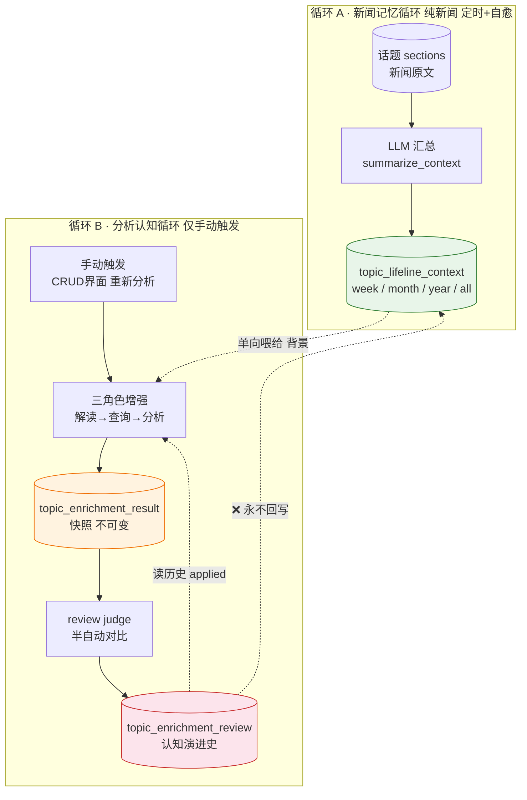
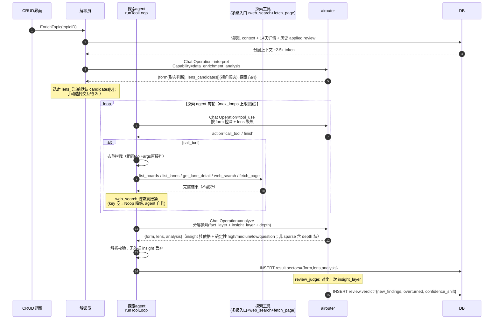
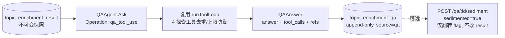

# 数据增强认知闭环流程（Data Enrichment）

<!-- doc-impact-applies: backend-go/internal/dataenrichment/ | section=业务约束与不变量 -->
> 大功能：持久话题的数据增强认知闭环——两个独立循环 + 三表关注点分离。
> 跨端。互补：`flow/daily-report.md`（持久话题归属）、`architecture/runtime.md`（scheduler 装配）。

## 需求说明

数据增强（Data Enrichment）解决「持久话题从『被动记录』走向『主动认知演进』」的问题。话题图谱（`flow/topic-graph.md`）把每天的 section 锚定到持久话题，但用户看到的只是新闻事实的累积。数据增强给持久话题叠加两层认知：

- **新闻记忆（循环 A，自动）**：按周 / 月 / 年 / 全周期滚动汇总话题下的新闻 section，形成话题的「背景记忆」——客观，只随新闻变。
- **分析认知（循环 B，手动）**：用户对感兴趣的话题发起「重新分析」，三角色 agent（解读员 → 研究助理 → 分析员）调用外部数据源工具（`web_search` 联网检索 + `fetch_page` 正文抓取 + 内部多级导航）产出**结构化深度剖析**快照（事实层 + 见解层 + 深度层），并与上次判断对比反思，让认知随每次分析迭代自我修正。

两循环通过 `topic_lifeline_context` 单向连接、隔离运行：新闻事实保持客观，分析认知可迭代修正，互不污染。可选的 FinGenius 个股辩论提供标的级深度分析。

## 链路设计

### 核心架构：两个独立循环

持久话题的演进分析通过两个隔离循环实现，通过 `topic_lifeline_context`（表1）单向连接：



**设计原则**：循环A只产新闻事实记忆（客观，只随新闻变）；循环B产分析认知（主观，随每次分析迭代自我修正）。两者隔离——review 永远不回写表1（保持新闻事实客观）。

### 三表关注点分离

| 表 | 角色 | 生命周期 | 可变？ | 谁写 |
| ----- | ------ | ---------- | -------- | ------ |
| `topic_lifeline_context` | 新闻记忆（背景） | 滚动更新，按周期 | 可（循环A刷新/人工编辑） | 循环A（`summarize_context`） |
| `topic_enrichment_result` | 当下判断（快照） | 一次分析一行 | **不可变** | 循环B 探索agent（analyze 步骤） |
| `topic_enrichment_review` | 两次快照间的增量（反思） | 追加 | deviation_summary 可人工调 | review judge / 用户手动 |

类比：**记住过去（表1）→ 形成判断（表2）→ 反思对比（表3）→ 下次判断更准（读历史 review）**。

### 循环A：新闻记忆循环

#### 触发时刻（Asia/Shanghai，避开 daily_report）

| granularity | 调度器 | 墙钟 | 函数 |
| ------------- | -------- | ------ | ------ |
| week | lifeline_weekly | 每周一 03:00 | `NextWeeklyLifelineTime` |
| month | lifeline_monthly | 每月 1 号 03:30 | `NextMonthlyLifelineTime` |
| year | lifeline_yearly | 每年 1 月 1 号 04:00 | `NextYearlyLifelineTime` |

- **定时**：按 wall-clock 触发各自 granularity 的汇总刷新。
- **检查自愈**：每次 Job 执行时扫描所有活跃 topic 的 `as_of_date` 滞后缺口，从 `as_of_date` 次周期起逐块补齐——**补的是遗漏的周期，不是覆盖当前周期**。`as_of_date` 顺序推进。
- **手动**：CRUD 界面可手动重生成任意 granularity。

#### 汇总算法

- **week**：按周块处理。正常定时时直接汇总当前周；自愈时从 `as_of_date` 次周起逐周块增量合并补齐。
- **month / year / all**：读「自上次汇总以来的增量 sections」+「该 granularity 旧汇总」→ LLM 合并生成新汇总。各 granularity 平行维护自己的滚动窗口，不搞层层金字塔合并。

### 循环B：分析认知循环（解读员 + 探索 agent，causal-analysis-agent）

仅手动触发（CRUD 界面"重新分析"按钮），不挂日报管线。分析目标从旧「演进定位」改为「探索判断 agent——形态随话题变 + 见解为核心 + 深度层强制」：解读员（结构化分析编辑）判形态+提视角候选，研究助理拿多级入口 + `web_search` + `fetch_page` 自主探索，产出分层见解（事实层 + 见解层 + **深度层**，确定性分级，依据强制；深度层映射「内部看美国」分析基因：系统重定位 / 多层机制 / 历史类比 / 边界限定 / 可核查证据链）。



**形态判断**（`form`）：`event_chain`(事件链) / `theme_vein`(主题脉络) / `single_point`(单点影响) / `structural`(结构演化，长时段结构命题无离散事件) / `sparse`(骨感)，判据含 hit_count/section 数/cluster_label 发散度/内容语义，枚举可扩展。**见解层**：事实层(验证) + 见解层(推演，产出主体)，每条 insight 必挂文章/时间线依据（无依据 parse 时丢弃）+ 确定性分级（high/medium/low/question）。**深度层**（非 sparse 形态强制）：`system_reframe`(系统重定位) / `mechanism_layers`(多层机制) / `historical_analogy`(历史类比) / `regime_shift`(范式转折，可空) / `boundary`(反过度解读边界，非空) / `evidence_chain`(可核查证据链，`source_type ∈ news|web|page`)；sparse 不产深度层。**骨感型**诚实标注信息不足，不硬推演。**视角机制**（模式丙）：agent 提具体问题式视角候选（结构/系统题） → 用户选（当前默认 candidates[0]，手动选择 UI 待 3c）。

### 11 个 LLM Operation 速查

| Operation | Capability | 循环 | 角色 | 触发方式 |
| ----------- | ------------ | ------ | ------ | ---------- |
| `data_enrichment.summarize_context` | `data_enrichment_news` | A | 汇总 | 定时 + 检查自愈 + 手动 |
| `data_enrichment.interpret` | `data_enrichment_analysis` | B | 解读员（形态判断+视角候选） | 手动增强 |
| `data_enrichment.tool_use` | `data_enrichment_analysis` | B / 版块调查 | 查询员每轮（版块调查共享研究循环复用） | 手动增强 / 深入调查 |
| `data_enrichment.analyze` | `data_enrichment_analysis` | B | 分析员（分层见解） | 手动增强 |
| `data_enrichment.review_judge` | `data_enrichment_analysis` | B / 版块链 | review 对比（topic 洞察 + 版块简报 + 同父同题调查，按链复用） | 增强后自动 |
| `data_enrichment.board_brief` | `data_enrichment_analysis` | 版块简报 | 简报（单次 LLM，不联网不注方法） | 手动（分析板块按钮） |
| `data_enrichment.board_method_select` | `data_enrichment_analysis` | 版块调查 | 方法卡选择（0-2 张，仅元数据） | 深入调查 |
| `data_enrichment.board_hypothesize` | `data_enrichment_analysis` | 版块调查 | 假设生成（2-4 + 必含 H0） | 深入调查 |
| `data_enrichment.board_synthesize` | `data_enrichment_analysis` | 版块调查 | 综合评估（五态 + 有限结论） | 深入调查 |
| `data_enrichment.debate_distill` | `data_enrichment_analysis` | 可选 | 辩论提炼 | 辩论完成后自动 |
| `data_enrichment.qa_tool_use` | `data_enrichment_analysis` | B 追问 | 报告追问每轮 | 用户对已生成报告手动提问 |

> 旧 `data_enrichment.board_interpret`（v1 版块命题生成）写路径已退役，新链路 0 调用，仅函数/parser 保留作 legacy 读取兼容。

SessionID 规则：

- 循环B：`data_enrichment_{topic_id}_{uuid8}`，一次增强内所有 LLM 调用共享
- 版块简报链：`data_enrichment_board_{board_id}_{uuid8}`（board_brief + 简报 review_judge）
- 版块调查链：同前缀新 uuid，`InvestigateBoardQuestion` 入口生成并传播（board_method_select / board_hypothesize / 共享研究循环 tool_use / board_synthesize 共享）
- 循环A：`lifeline_context_{topic_id}_{granularity}_{uuid8}`，一次汇总共享
- 个股辩论提炼：`data_enrichment_debate_{topic_id}_{result_id}`
- 报告追问：`data_enrichment_qa_{result_id}_{uuid8}`，每次询问唯一（基于 result，同一报告多轮追问各自独立 session）

### 版块级简报与问题调查（board-level-deep-analysis：默认简报 + 显式调查）

单泳道分析回答「这条泳道怎么回事」；版块级**默认动作是简报**——事实观察、关系类型与未知项，不预设立场；深度只发生在用户**显式选题调查**——多假设（含零假设）+ 支持/反证检索。语义板块是分类容器而非天然因果系统（同板块泳道仅语义相关，不保证共同驱动），因此不再自动把泳道织成单一传导链；旧「命题→论文式论证」自动链已退役为 legacy 只读（见下）。

#### 默认链：版块简报 `EnrichBoard(boardID)` → `result_kind=board_brief`

1. **门槛**：板块 `enrichment_enabled`（同步预检，未开 400）。
2. **备料**：活跃泳道 → month/year 补全门（约束#17）→ 态势卡装配（week→month→section 指纹降级，质量排序，上限 12 卡）。
3. **单次 LLM**（Operation `data_enrichment.board_brief`）：输入只有态势卡 + 同 kind applied review digest（首份恒空）；**不联网（无工具循环）、不注入方法卡正文**。产出 sectors：`{summary, observations[](≤5, 挂 lane_id+basis+as_of_date), relationships[](≤6, 关系类型：共同驱动/因果/分化/仅相关/暂无关系), uncertainties[], research_questions[](≤4 可选题), lane_refs[], retry_reason?, degraded?, degraded_why?}`。
4. **降级**：坏 JSON / 缺 summary / 零有效观察 → 纠偏重试一次；再败机械降级（`degraded=true`，只从卡上机械产观察，不编造关系与研究问题）；全 sparse 如实标注素材不足（observations/relationships 空数组，不出研究问题）。
5. **落库 + review**：append-only 落库（kind=board_brief）；第二份起对比上一份简报（`board_brief_review.go`，复用 `review_judge`）；已 apply review digest 在生成下一份简报**前**注入。review 永不回写 lifeline。

#### 显式链：问题调查 `InvestigateBoardQuestion(boardID, parentBriefID, question)` → `result_kind=board_investigation`

question ∈ generated（父简报 `research_questions` 候选 id，文本以父简报为准）/ custom（用户自填）；`question_key` = trim + 空白折叠后问题文本的 SHA-256（两种 source 同算法；同父同题重跑 append 多行）。链内 LLM 顺序：

1. `board_method_select`（有 enabled 方法卡才调）：按问题 + 父简报投影（元数据，不含全部正文）选 **0-2 张**方法卡；调用失败/坏 JSON 降级 0 张、不重试。
2. `board_hypothesize`：**2-4 个竞争假设 + 必含零假设 H0**，不预选赢家；方法卡正文（经 `method_sanitizer.go` 清洗固定修辞后）只进此调用与综合调用。
3. **共享研究循环**（复用 Operation `data_enrichment.tool_use`）：单一 loop 覆盖全部假设，纪律要求 ≥1 中性查询 + 每个非零假设 ≥1 反证查询；工具失败/未覆盖项如实记 `research.gaps`；lane 白名单来自父简报。
4. `board_synthesize`：研究结果 → 每假设**五态评估** `supported|plausible|insufficient|weakened|refuted` + 有限结论（summary/confidence/scope/boundary）+ 可核查证据链（web/page 必带 url+quote+institution+date）；允许 H0 最可信，也允许全部假设 `insufficient`，不强造赢家。坏 JSON 重试一次仍败则**整次失败不落库**（父简报不动，绝不机械编造调查结论）。空响应由 airouter 在 provider 边界统一规范化为 `empty_response`（retryable）失败并走 ordered fallback（见 [ai-logging](../standard/backend/ai-logging.md)）。若 fallback 已完整产出四个顶层字段且词法扫描证明只缺根对象最后一个 `}`，综合专用 parser 仅补该单一终止符并在 `input_snapshot.synthesis.repair_reason` 记 `terminal_root_delimiter`；内部截断/错配/未闭字符串/尾随正文/缺 `lane_refs` 仍严格重试或失败，不做通用括号补全。
5. **原子落库 + 分链 review**：综合成功且机械清洗完成后才一次写入 investigation；中途任一步失败不留半行。仅同 `board + parent_result_id + question_key` 的重跑进入 `review_judge` 对比，review 失败不回滚已完成调查，也不回写 lifeline。

**机械护栏**：高置信 `supported` 必须有 web/page 可核查证据（quote 与工具原文保守 substring 核对）且研究做过反证（本假设或其 derived_from），否则降级 medium + gap + boundary 注记；方法卡绝不作为证据 `source_type`；幽灵 lane（父简报白名单外）落库前剔除。跨 provider 若 lane evidence 漏 `ref` 但给出白名单内安全正整数 `lane_id`，只在 `ref` 为空时归一为十进制 `ref`；显式非法 `ref` 不由别名掩盖。证据清洗后会合并 evidence 极性与 hypothesis 引用，`supported` 无支持证据或 `refuted/weakened` 无反证时视为结构失败并纠错重试，禁止落“证据链空但已证实/推翻”的快照。前端零证据只显示“没有通过核验、可展示的证据”，不猜测研究是否采到材料。调查内部不跑补全门/态势卡、不改写父简报；调查 review 按 `parent_result_id + question_key` 找同题重跑对比（`board_investigation_review.go`）。

#### 旧链退场（legacy）

旧自动论文链（`board_interpret` 命题 → `runBoardAgentLoop` 方向探索 → `boardAnalyze` 论文式五字段）在新触发链路 0 调用（测试断言三 Operation 计数为 0），函数与 parser 保留仅作存量读取兼容；存量行由迁移 `20260828_0001` 回填 `result_kind=legacy_board_analysis`，前端 `BoardAnalysisReport.vue` 只读渲染并标「旧版分析」，详情/列表/QA 照常。

#### 任务互斥与轮询

版块简报/调查共用 analysisRunner：同 board 任一 job 在跑时再触发（任意 kind）→ **409 + data 携当前任务身份**（前端恢复该 job 轮询，不误把调查完成当新简报）；成功触发 → **202 信封** `{status:"started", job_id, job_kind: board_brief|board_investigation, scope:"board", target_id}`；前端按 job_id 轮询 `GET /enrichment/analysis-status?job_id=`（未知 404；`?scope=board|topic&id=` 查当前/最近任务，无任务返 idle 骨架）；单次后台上限 30min。

前端：`BoardEnrichmentPanel.vue` 工作台（简报主视图 + 聚焦分析折叠区 + 历史下拉 kind 标签）按 `result_kind` 三分派 `BoardBriefReport.vue` / `BoardInvestigationReport.vue` / legacy `BoardAnalysisReport.vue`；lane 引用点击下钻 → 聚焦分析预填 lens（`prefill_lens` 透传 `EnrichTopicLens`，写入可编辑输入框、允许修改、不自动触发）；单泳道报告渲染（CausalAnalysisReport）不变。

### 跨版块关系发现（add-evidence-backed-cross-board-relations：证据优先流水线）

泛用机制：从某版块简报的观察/研究问题出发，用博查外部检索找「谁与本版块的变化有关」，再在库内保守解析目标版块、独立盲验证据、人工裁决生效——不做 board×board 全量扫描，不写死任何领域规则。

```
简报 observation/question（source）
  → Scout（博查 plan queries → web_search → extract 候选概念）两步程序化 LLM
  → Resolve（库内保守解析：embedding+词法双模式，唯一高分才 resolved；
            歧义/无目标 → unresolved 保留，不硬选）
  → Verify（独立 session 盲验：四竞争解释 H1因果/H2共同驱动/H3相关/H0无关，
           自带反证检索；quote 与工具原文保守 substring 核对）
  → Persist（cross_board_relations 生命周期 unresolved→proposed→confirmed
            /dismissed/expired；suggestion_hash 幂等 + dismiss 冷却）
  → 消费（confirm 后注入下一份简报「已确认外部关系背景」机械字段）
```

- **手动入口**：简报观察/研究问题行内「发现关联」按钮 → `POST /semantic-boards/:id/enrichment/analysis/relations/discover`（202 job / 409 冲突）。
- **自动入口**：新简报落库后 non-fatal enqueue（板级开关 `relation_auto_discovery_enabled` 默认关 + 全局预算 `auto_max_sources_per_brief`，按稳定 observation 顺序取预算内 source；同 board 批次进程内互斥）。
- **调查链动态授权**：调查 agent 可经 `search_internal_context`/`list_lanes` 的**服务端 JSON 成功结果**临时获得跨版块泳道 `get_lane_detail` 授权（`DynamicLaneGrantSet`）；web/模型文本永不授权，grant 不跨会话；跨版块 lane 引用落库前 DB 级归属复验（漂移即剔除）。

### 报告追问（causal-analysis-agent D9，可选追问）

报告（`topic_enrichment_result`）生成后保持**不可变**（业务约束：result 不可变）。用户对同一报告（topic 档或板块档均可）发起多轮追问，复用循环 B 的工具循环（5 个探索工具，见下），但把报告快照（如 `{form, lens, analysis}` / 简报或调查 sectors）植入系统提示而非重新研究主题。



**不变量**：① 报告永不重写；② 每轮追问 append 一行 `topic_enrichment_qa`；③ `sediment` 仅翻转 qa 行的 `sedimented` flag，是用户 pin 持久笔记的手段，不回写 result。板块档 QA 同机制（`/semantic-boards/:id/enrichment/analysis/results/:rid/qa`，`handler/board_qa_handler.go`）——三种 board kind（简报/调查/legacy）均可追问，append-only，跨板块/scope 不符统一 404。**5 个探索工具**：`list_boards`（活跃看板）/ `list_lanes`（看板下持久话题，按热度排）/ `get_lane_detail`（泳道详情，复用循环 A 的 `RenderLifelineForAgent`）/ `web_search`（博查联网检索，key 空时 Noop 降级）/ `fetch_page`（网页正文抓取，复用 reader readability）。

### FinGenius 可选辩论（个股深度分析）

分析员输出 `sectors[].symbols`（每个板块的代表标的池）后，用户可选择对感兴趣的标的发起个股辩论——交给外部 FinGenius（6 角色 agent 多轮辩论 + 投票），Syntopica 作 HTTP 客户端调用，结果存 `stock_debate_result` 表。**独立可选步骤，不串主流程**。

```mermaid
flowchart TB
    R[循环B 分析员产出<br/>result.sectors[].symbols] --> BTN[用户前端④ 开始辩论 按钮<br/>手动触发]
    BTN --> POST[POST /analyze<br/>FinGenius 服务端<br/>返回 task_id 数组]
    POST --> POLL[轮询 GET /task/:id<br/>每 FINGENIUS_POLL_INTERVAL=8s]
    POLL -->|running| POLL
    POLL -->|done| DISTILL[Syntopica LLM 提炼<br/>Operation: data_enrichment.debate_distill<br/>FinGenius 原始输出 → 三档 stance]
    DISTILL --> SAVE[(stock_debate_result<br/>append-only)

    style BTN fill:#e3f2fd,stroke:#1565c0
    style DISTILL fill:#fff3e0,stroke:#ef6c00
    style SAVE fill:#fce4ec,stroke:#c62828
```

**为什么独立**：① FinGenius 辩论 2-3 分钟，串进主流程会拖慢循环B；② 辩论失败不应阻塞板块方向预测（non-fatal）；③ 用户只对感兴趣的标的辩论，不必全跑。

**提炼规则**：FinGenius 输出是「6 段文本 + 二档投票(bullish/bearish)」，Syntopica 侧一次轻量 LLM 调用（`debate_distill`）将其转成三档结构（up/down/flat），存 `stock_debate_result` 的 `verdict`/`consensus`/`agents`/`votes` 提炼字段。提炼失败则降级展示原始文本（`fingenius_research`/`fingenius_battle`）。

**降级**：FinGenius 服务不可用时 non-fatal——循环B 主流程照常完成，前端个股辩论区块显示连接失败提示。Syntopica 不开 FinGenius 时完全可用。

## 业务约束与不变量

> 本节是 constraint-injection extension 的注入数据源：apply 改 `internal/dataenrichment/` 代码前会自动注入 system prompt，必须遵守。

1. **review 采纳（applied=true）不得回写 topic_lifeline_context，新闻记忆不受分析污染**：`topic_enrichment_review` 的 `applied=true`（采纳）不触发写 `topic_lifeline_context`——新闻事实保持客观，分析反思只影响下次分析输入，不篡改新闻记忆。落地点：`service/orchestrator.go` / `service/review_judge.go`。
2. **topic_enrichment_result 写入后不得修改，一次分析一行快照**：`topic_enrichment_result` 写入后不修改（一次分析一行快照），确保 review 有稳定对比基准。落地点：repository。
3. **循环 B 只能由界面「重新分析」手动触发，且板块须开启 enrichment_enabled**：不挂日报 / 定时管线，只能 CRUD 界面「重新分析」按钮触发；且需板块开启 `enrichment_enabled`（默认 false），否则 handler 直接拒绝（`handler.go`）。
4. **agent loop 必须带三防御：关 thinking、工具结果不截断、重复调用拦截**（循环 B 查询员）：① Qwen3 thinking 关闭（DB provider 配置 `enable_thinking=false` + 用户消息 `/no_think` prefix 双保险）；② 工具结果不截断（完整返回）；③ 去重拦截——相同 `tool+args` 的重复调用直接挡（`dedupKeyFor`，`seenCalls` map）。单次增强最多 `maxAgentLoops=6` 轮。
5. **循环 A 自愈只能补齐滞后周期缺口，不得覆盖已有周期**：定时 Job 扫描活跃 topic 的 `as_of_date` 滞后缺口，从 `as_of_date` 次周期起逐块补齐——补的是遗漏周期，`as_of_date` 顺序推进，不覆盖当前周期。落地点：`service/lifeline_context.go`。
6. **循环 A week/month/year 定时时段必须避开 daily_report 生成时间**：week 每周一 03:00、month 每月 1 号 03:30、year 每年 1 月 1 号 04:00（Asia/Shanghai），与日报生成错峰。
7. **每次切片的输入输出必须可经 ai_call_logs 与 result jsonb 全链路重建**：每次切片的输入 + 输出均可通过 `ai_call_logs` + `result.tool_calls` jsonb + `result.input_snapshot` jsonb 重建（全链路留痕）。
8. **FinGenius 不可用时循环 B 主流程必须照常完成，辩论失败不得阻塞分析**：FinGenius 服务不可用时循环 B 主流程照常完成，前端个股辩论区块显示连接失败提示；Syntopica 不开 FinGenius 时完全可用。辩论失败不阻塞结构化深度分析。
9. **每条 insight 必须挂文章/时间线依据，无依据见解解析时丢弃**（causal-analysis-agent）：每条 insight 必须挂文章/时间线依据（evidence），无依据的 insight 在 parse 时丢弃（`Insight.hasEvidence()` 校验），不悬空发散。落地点：`service/orchestrator.go` analyze 解析。
10. **web_search 必须走真实后端且只用原始网页结果，key 未配降级不阻断主流程**（data-enrichment-structural-depth）：`web_search` 首个真实后端为博查 Bocha（`api.bochaai.com`，**只用通搜原始网页结果模式 `summary:false`，禁用 AI 总结模式**——AI summary 有幻觉风险不可作可核查证据）。**API key 界面可配 + 动态读**：存 `ai_settings` 表 `bocha_config`（照 Firecrawl），`BochaWebSearcher` 每次 `Search` 现读，优先级 **DB(界面) > env(`BOCHA_API_KEY`) > config.yaml(`bocha.*`) > 空**——界面改即时生效不重启；全空→返回 not configured，`executeWebSearch` 降级错误 JSON，agent 自判、不阻断主流程。`WebSearcher` 接口可扩展（未来换 Tavily 零改动编排）。落地点：`service/web_search.go` / `wire.go` / `aisettings/config_store.go`（`bocha_config`）/ 设置页「博查搜索」section。
11. **解读员 interpret 必须输出五形态 form 枚举与 lens_candidates 视角候选**（data-enrichment-structural-depth）：解读员 `interpret` 输出 `form`（**五形态枚举** `event_chain`/`theme_vein`/`single_point`/`structural`/`sparse`，可扩展）+ `lens_candidates[]`（具体问题式视角，结构/系统题）；当前选定 lens 默认取 candidates[0]，手动选择交互待 3c。落地点：`service/orchestrator.go` interpret / `service/lens_source.go`。
12. **非 sparse 形态必须产出合格深度层、sparse 禁深度层，web/page 证据必须带可核查 url+quote**（data-enrichment-structural-depth）：非 sparse 形态分析强制产出 `depth` 块，`system_reframe`/`boundary` 非空、`mechanism_layers`≥1、`evidence_chain`≥1，缺则 analyze 重试一次；`sparse` 禁深度层。`evidence_chain` 中 `web`/`page` 类必须带 `url`+`quote`(原文摘录，非 AI 转述)+`institution`+`date` 供前端点击核查。新增 `fetch_page` 工具复用 `reader` 域 `readability_crawler` 抓正文（超长截断），单工具失败返回错误 JSON 不阻断 agent loop。旧 result（无 depth）读取时降级渲染不崩。落地点：`service/orchestrator.go` `validateDepth` / `service/fetch_page.go` / 前端 `CausalAnalysisReport.vue`。
13. **旧作者画像必须退役禁入 prompt，方法卡只能调查链清洗注入不得全局注入**（board-level-deep-analysis）：`reference_roles` 原表与 GET API 保留一版本，但写 API（POST/PUT/DELETE）一律 410 并指向 `/analysis-methods`；enabled 旧画像也不得再进入 topic/board 的 interpret/agentLoop/analyze prompt（设置页旧面板已下架）。升级迁移 `20260828_0002` 将旧角色按原文字节复制到 `analysis_methods`（统一 `enabled=false`、`legacy=true`，同名新方法存在时 `ON CONFLICT DO NOTHING` 幂等跳过，不覆盖用户编辑）；`20260831_0001` 将未被用户编辑过的系统 seed 画像（name+title+content 字节钉死身份）翻 disabled，用户编辑过的行不动（反正已无 prompt 调用方）。方法卡正文只允许在调查链按问题选中后经清洗注入（hypothesize/synthesize），简报/事实阶段永不全局注入。落地点：`repository.AnalysisMethod` / `service/analysis_methods.go` / `service/method_sanitizer.go` / `handler/analysis_method_handler.go` / `handler/reference_role_handler.go` / 迁移 `20260828_0002` + `20260831_0001`。
14. **topic_enrichment_result 必须按 result_kind 做 scope/owner 形状互斥并 DB 级强制**（board-level-deep-analysis）：`topic_enrichment_result.result_kind` ∈ `topic_analysis|board_brief|board_investigation|legacy_board_analysis`（DB CHECK + 形状约束：topic_analysis = topic owner、无父无 key；brief/legacy = board owner、无父无 key；investigation = board owner、必挂父 + 64-hex question_key）；复合 FK `fk_topic_enrichment_result_parent_board(parent_result_id,semantic_board_id) ON DELETE RESTRICT` + 触发器 `trg_validate_topic_enrichment_result_parent` DB 级强制（调查父必须是同版块 board_brief；有子调查的 brief 不得改 kind/board）。查询/列表/详情按 board+scope 过滤（可选 kind 过滤），他板块/scope 不符 404；review 按 kind 分链：简报只比上一份简报、调查只比同父同题重跑、legacy 只读不比。review 不回写 lifeline 红线同样适用。落地点：迁移 `20260828_0001` / `service/enrich_board.go` / `service/board_brief_review.go` / `service/board_investigation_review.go` / `handler/board_enrichment_handler.go`。
15. **lane 证据的 lane_id 必属本次分析允许的泳道白名单，幽灵引用落库前剔除**（board-level-deep-analysis）：`evidence_chain` 中 `source_type=lane` 的 `ref` 与 `lane_refs[].lane_id` 必须属于本次分析允许的泳道集（调查链 = 父简报 lane 白名单；legacy 链 = 活跃泳道集）——LLM 幻觉出的不存在泳道（幽灵引用）在落库前被解析器逐条剔除，单条剔除不拒整份。落地点：`service/board_investigation_synthesis.go`（调查）/ `service/evidence.go`（legacy）。
16. **单泳道分析必须收拢为聚焦分析折叠入口，不得替代或并列于版块简报/调查**（board-level-deep-analysis）：版块简报/调查不是单泳道分析的替代——前端单泳道分析收拢为「聚焦分析」折叠区（下钻入口）；简报观察/关系/研究问题与调查证据的 lane 引用点击 → 聚焦分析预填 lens（`prefill_lens` 透传 `EnrichTopicLens`，可修改不自动触发）触发单泳道深挖。单泳道报告渲染（CausalAnalysisReport）保持不变。落地点：前端 `BoardEnrichmentPanel.vue` / `BoardBriefReport.vue` / `BoardInvestigationReport.vue`。
17. **分析装配前必须对活跃泳道 month/year 档跑补全门，缺失补建、过期重算**（fix-board-analysis-material）：EnrichBoard/EnrichTopic 装配前对活跃泳道 **month/year 档**执行补全——从 section 数据推有料周期集，无行→补建（含首份，首建归分析路径）、行最后写于 72h 前→重算覆盖（修复历史半月档）；全局限额 40 次 LLM、溢出降级留日志；失败降级不阻塞；串行限流；任何写入 `as_of_date` 钳制 ≤ now（周期边界未来日期属脏数据）。**week 档退出分析路径**（近期记忆归 14 天窗口详情，长期归 month/year；`lifeline_weekly` 定时任务停用，存量 week 行保留可被取材链消费）。落地点：`service/freshness_gate.go` / `service/lifeline_context.go`。
18. **调查证据必须直接相关、支持与反证并列保存，检索不到如实记 gap 不编造**（board-level-deep-analysis）：调查证据链以直接相关性优先，支持与反证并列保存（`support_evidence`/`counter_evidence` 分区）；旧「≥3 类证据硬配额」prompt 仅 legacy 文件残留、无调用方，不再是红线；某类证据检索不到时如实记 gap/boundary，不编造。落地点：`service/board_investigation_synthesis.go` / `service/orchestrator.go` analyzePrompt。
19. **态势卡取材必须按 week→month→指纹→description 链降级兜底，不得同义反复**（fix-board-analysis-material）：`laneFactsDigest` 取材链为 **week → month → section 指纹 → description → none**——week 缺失时 month 档压缩摘要（最新 2 期）为主要事实源（生产形态：month 全量维护、week 滞后）；指纹降级携带 thread 标题实质内容（前 3 条拼接，无 thread 退 cluster_label），MUST NOT 输出「泳道名 (N篇)」同义反复；密度信号计入 lifeline 可用性（month/week 在库 +2）；`facts_source` 枚举含 `lifeline_month` 可追溯。落地点：`service/situation_cards.go`。
20. **get_lane_detail 必须附带月/年历史背景记忆段，无归档如实标注不静默省略**（fix-board-analysis-material）：`RenderLifelineForAgent` 在逐日演进后追加「历史背景记忆（月/年档案）」段——month 最新 2 期 + year 最新 1 期，总预算 4000 rune、超限标注 `[档案截断]`、无归档如实标注「（无背景记忆归档）」不静默省略。落地点：`service/lifeline_renderer.go`（接口 `GetTopicLifelineArchive`，生产实现 `dataenrichment/production_wiring.go` 查 `topic_lifeline_context`）。
21. **分析触发必须异步返回 202，同板块任一任务在跑时再触发一律 409 互斥**（fix-board-analysis-material / board-level-deep-analysis）：循环 B trigger（板块简报/调查/单泳道档）立即返回 202 job 信封（`{status:"started", job_id, job_kind, scope, target_id}`），分析在 detached ctx 后台跑完落库——MUST NOT 把 request-context 传进分析链（客户端断连 = 整次分析作废，含补全门备料）；同 board 任一 job 在跑时再触发（任意 kind）→ 409 且 data 携当前任务身份（`AnalysisStatus`，前端恢复该 job 轮询，不误把调查完成当新简报）；未开启板块同步预检 400 语义保留；后台单次上限 30min；内存 job 表（单实例单用户），进程重启=空闲态。前端轮询 `GET /enrichment/analysis-status?job_id=`。落地点：`handler/analysis_runner.go` / `handler/board_enrichment_handler.go` / 前端 `useBoardEnrichment.ts` 轮询。
22. **版块简报必须纯事实：单次 LLM 不联网、不注入方法卡正文，失败只机械降级**（board-level-deep-analysis）：默认版块触发只产 board_brief——单次 LLM 不联网（无工具循环）、不注入方法卡正文；输入只有补全后态势卡 + 同 kind applied review digest；坏 JSON 纠偏重试一次，再败机械降级（`degraded=true`，仅从卡上机械产观察，不编造关系/研究问题）；全 sparse 如实标注素材不足。落地点：`service/board_brief.go` / `service/enrich_board.go`。
23. **调查必须挂同版块简报父与 question_key，必产含零假设的竞争假设不预选赢家**（board-level-deep-analysis）：调查必须挂同版块 board_brief 父（DB 级强制）+ question_key；`board_hypothesize` 必产 2-4 竞争假设且含零假设，不预选赢家；共享研究循环纪律 ≥1 中性查询 + 每非零假设 ≥1 反证查询；`board_synthesize` 坏 JSON 重试一次仍败则整次失败不落库；高置信 supported 必须有 web/page 可核查证据（quote 与工具原文保守 substring 核对）且研究做过反证，否则降级 medium+gap；方法卡绝不作为证据 source_type；幽灵 lane（父简报白名单外）落库前剔除。落地点：`service/board_investigation{,_research,_synthesis}.go` / `service/analysis_methods.go` / `service/method_sanitizer.go`。
24. **跨版块关系发现必须从 source 经外部证据找目标，不得扫版块对、不得强选目标**（add-evidence-backed-cross-board-relations）：跨版块关系发现从 source 出发经外部证据找目标（复杂度 O(source×预算)，非 O(board²)）；外部世界可提及库中不存在的概念——保持 unresolved 不强选目标；解析唯一高分（embedding cosine ≥ `relation_resolve_threshold` 且 top1-top2 差 ≥ `relation_resolve_margin`）才 resolved，否则 ambiguous/no_match。落地点：`service/relation_scout.go` / `service/relation_resolver.go`。
25. **verifier 必须独立 session 盲验不看 scout 自评分，质量分级纯程序计算**（add-evidence-backed-cross-board-relations）：verifier 独立 session、不看 scout 自评分；四竞争解释必含零假设，不预选赢家；质量分级纯程序计算（evidence 完整性/反证处理/quote 核对），忽略模型自报 confidence；高置信 supported 必有 web/page 可核查证据。伪造 source / 无出处 quote 在 parse 时丢弃。落地点：`service/relation_scout.go` runRelationVerifier / `service/relation_evidence.go`。
26. **机器判定的跨版块关系最高只能到 proposed，必须用户 confirm 后才进简报**（add-evidence-backed-cross-board-relations）：resolved+supported 最多 proposed，**用户 confirm 才进简报**（confirm 事务内重验目标版块存在）；dismiss 带 reason 进 `dismiss_cooldown_days`（默认 14 天）冷却防重现；confirmed 有 `confirmed_ttl_hours`（默认 720h）有效期，读取路径即时判过期 + `relation_expire` 定时任务批量转 expired；`suggestion_hash` 部分唯一索引（status IN unresolved,proposed）保幂等。落地点：`repository/relation_repository.go` / `handler/relation_discovery_handler.go` / `scheduler_jobs.go`。
27. **confirmed 关系必须由服务端机械装配注入简报 cross_board_relations 字段，LLM 不得生成**（add-evidence-backed-cross-board-relations）：confirmed 未过期关系按 quality DESC（CASE 数值映射，非字典序）、confirmed_at DESC、id ASC 预算内注入简报为服务端装配的 `cross_board_relations` 字段（LLM 不生成、不联网、不进原 relationships 的 lane 白名单校验）；input_snapshot 冻结注入块原文与截断计数；旧简报缺字段降级为空不崩。落地点：`service/enrich_board.go` loadConfirmedRelationBackground / `service/board_brief.go`。


## 代码入口

- **后端编排**：`backend-go/internal/dataenrichment/`（`handler/` 14 条 REST API + `enrichment_enabled` 门槛、`service/orchestrator.go` 循环B 三角色编排、`service/lifeline_context.go` 循环A 汇总 + 自愈、`service/review_judge.go` review 对比、`service/debate_service.go` + `fingenius_client.go` + `debate_distill.go` 个股辩论、`service/tool_registry.go` 数据源工具、`service/airouter_client.go`、`repository/` 三表持久化）。
- **后端调度**：`backend-go/internal/dataenrichment/scheduler_jobs.go`（lifeline_weekly/monthly/yearly 注册）+ `scheduler_next_run.go`（`NextWeeklyLifelineTime` 等）。
- **后端熔接**：`backend-go/internal/app/runtime.go`（注册 scheduler + handler + 15s check interval）。
- **后端版块级分析**（board-level-deep-analysis）：`service/enrich_board.go`（简报编排入口 `EnrichBoard`）、`service/board_brief.go`（简报 prompt/解析/机械降级）、`service/board_investigation.go`（方法选择+假设生成）、`service/board_investigation_research.go`（共享研究循环+护栏）、`service/board_investigation_synthesis.go`（调查编排入口 `InvestigateBoardQuestion`+综合）、`service/board_brief_review.go` / `board_investigation_review.go`（按 kind 分链 review）、`service/situation_cards.go`（态势卡）、`service/freshness_gate.go`（补全门）、`service/analysis_methods.go` + `method_sanitizer.go`（方法卡组装/固定修辞清洗）、`service/board_interpret.go` + `board_analysis.go` + `evidence.go`（v1 论文链，legacy-only 无调用方）；handler 侧 `handler/board_enrichment_handler.go`（简报/调查 trigger、kind 过滤、详情）、`handler/board_qa_handler.go`（三 kind 板块 QA）、`handler/analysis_method_handler.go`（方法卡 CRUD）、`handler/analysis_runner.go`（job_id/job_kind 同板块互斥轮询）、`handler/reference_role_handler.go`（旧角色只读 + 写 410）。

- **后端跨版块关系**（add-evidence-backed-cross-board-relations）：`repository/relation_models.go` + `relation_repository.go`（两表/状态机/幂等，迁移 `20260901_0001`）、`service/relation_scout.go`（scout 两步 + verifier 盲验两步）、`service/relation_resolver.go`（保守解析纯函数）、`service/relation_evidence.go`（quote 核对/质量分级）、`service/relation_discovery.go`（编排 + 自动发现 enqueue + per-board 互斥）、`service/search_internal_context.go`（内部检索工具 + `DynamicLaneGrantSet` 动态授权）、`internal_context_impl.go`（DB 词法检索）、`handler/relation_discovery_handler.go`（六路由）、`scheduler_jobs.go` `RelationExpireJob`（每小时过期维护）。
- **前端跨版块关系**：`BoardRelationPanel.vue`（建议列表/详情/裁决动作）、`composables/useBoardRelations.ts`（202/409 轮询 + epoch 守卫）、`BoardBriefReport.vue`（发现关联入口 + 已确认关系分区）、`BoardInvestigationReport.vue`（跨版块泳道引用标注与跳转）、`BoardEditDialog.vue`（自动发现开关，默认关闭）。
- **前端**：`front/app/features/tags/components/BoardEnrichmentPanel.vue`（板块详情页「数据增强」工作台：简报主视图 + 聚焦分析折叠区 + 按 result_kind 三分派）、`BoardBriefReport.vue`（简报渲染：观察/关系/不确定项/可选题 + 下钻 + 选题调查入口）、`BoardInvestigationReport.vue`（调查报告：假设五态评估/支持反证 gap 分区/证据展开）、`BoardAnalysisReport.vue`（legacy 论文式报告，标「旧版分析」）、`DebateSection.vue`（FinGenius 个股辩论）、`composables/useBoardEnrichment.ts`（202/409 恢复/按 job_id 轮询状态机）；设置页「分析方法」section（`SettingsSectionAnalysisMethods.vue` + `AnalysisMethodPanel.vue`，sectionKey `analysis-methods`；旧 `ReferenceRolePanel.vue` 已下架不再挂载，写操作只能走 `/analysis-methods`）。

### REST API 路由

数据增强相关 API（注册在 `/api` 下）：

**表1 topic_lifeline_context（话题分层上下文）**

| 方法 | 路径 | 说明 |
| ------ | ------ | ------ |
| GET | `/persistent-topics/:topicId/enrichment/contexts` | 列出某话题所有 granularity 的 context |
| GET | `/persistent-topics/:topicId/enrichment/contexts/:granularity` | 获取单个 granularity context |
| PUT | `/persistent-topics/:topicId/enrichment/contexts/:granularity` | 人工编辑 context content（body: `{content}`） |
| POST | `/persistent-topics/:topicId/enrichment/contexts/:granularity/regenerate` | 手动重生成某 granularity context |

**表2 topic_enrichment_result（分析结果）**

| 方法 | 路径 | 说明 |
| ------ | ------ | ------ |
| GET | `/persistent-topics/:topicId/enrichment/results` | 列出某话题所有 result（slim summary） |
| GET | `/persistent-topics/:topicId/enrichment/results/:id` | 获取单个 result 完整内容 |
| POST | `/persistent-topics/:topicId/enrichment/results/trigger` | 手动触发循环B增强（需板块开启 enrichment_enabled） |

**表3 topic_enrichment_review（认知演进）**

| 方法 | 路径 | 说明 |
| ------ | ------ | ------ |
| GET | `/persistent-topics/:topicId/enrichment/reviews` | 列出某话题所有 review |
| POST | `/persistent-topics/:topicId/enrichment/reviews` | 手动创建 review（body: `{curr_result_id, deviation_summary, prev_result_id?}`） |
| PUT | `/persistent-topics/:topicId/enrichment/reviews/:id` | 编辑 deviation_summary |
| POST | `/persistent-topics/:topicId/enrichment/reviews/:id/apply` | 采纳 review（applied=true，不回写表1） |

**FinGenius 个股辩论（可选，不串主流程）**

| 方法 | 路径 | 说明 |
|------|------|------|
| POST | `/persistent-topics/:topicId/enrichment/results/:id/debates` | 触发辩论（body: `{symbols: [{code, name, sector}]}`，空 body 默认取 result.sectors.symbols） |
| GET | `/persistent-topics/:topicId/enrichment/results/:id/debates` | 列出某 result 的所有辩论结果 |

**板块数据源绑定**

| 方法 | 路径 | 说明 |
| ------ | ------ | ------ |
| GET | `/semantic-boards/:id/data-sources` | 列出板块绑定的数据源 |
| PUT | `/semantic-boards/:id/data-sources` | 创建/更新数据源绑定 |
| DELETE | `/semantic-boards/:id/data-sources/:sourceType` | 删除数据源绑定 |

**版块级简报/调查（board-level-deep-analysis）**

| 方法 | 路径 | 说明 |
| ------ | ------ | ------ |
| POST | `/semantic-boards/:id/enrichment/analysis/trigger` | 触发版块简报（需板块开启 enrichment_enabled；202 job 信封，`job_kind=board_brief`） |
| POST | `/semantic-boards/:id/enrichment/analysis/investigations/trigger` | 对父简报某问题触发深入调查（body `{briefing_result_id, question_id?\|question?}`；202 `job_kind=board_investigation`；同步预检 400/404） |
| GET | `/semantic-boards/:id/enrichment/analysis/results` | 版块档历史列表（`?kind=board_brief\|board_investigation\|legacy_board_analysis`，缺省全部；非法 kind 400） |
| GET | `/semantic-boards/:id/enrichment/analysis/results/:rid` | 单份版块档 result 详情（含 result_kind/parent_result_id/question_key；他板块/scope 不符 404） |
| POST / GET | `/semantic-boards/:id/enrichment/analysis/results/:rid/qa` | 板块档报告追问提问/列表（三 kind 均可；append-only；跨板块/scope 不符统一 404） |
| POST | `/semantic-boards/:id/enrichment/analysis/results/:rid/qa/:qid/sediment` | 沉淀某轮追问为持久笔记（仅翻 sedimented flag，不改 result） |
| GET | `/enrichment/analysis-status` | 异步任务状态轮询（`?job_id=` 精确查含已完成的，未知 404；`?scope=board\|topic&id=` 当前/最近任务，无任务返 idle 骨架） |

**分析方法卡与旧角色兼容**

| 方法 | 路径 | 说明 |
| ------ | ------ | ------ |
| GET / POST | `/analysis-methods` | 列表 / 创建方法卡（创建默认 disabled，可显式传 enabled） |
| GET / PUT / DELETE | `/analysis-methods/:id` | 详情 / 局部更新 / 软删除 |
| PUT | `/analysis-methods/:id/enable` | body `{enabled}` 启停 |
| GET | `/reference-roles`、`/reference-roles/:id` | 旧角色一版本只读兼容 |
| POST / PUT / DELETE | `/reference-roles...` | 返回 410；改用 `/analysis-methods` |

单泳道 trigger（`POST /persistent-topics/:topicId/enrichment/results/trigger`）新增可选 body `{prefill_lens}`——版块简报观察/关系/研究问题/lane 引用与调查证据下钻时预填视角，透传 `EnrichTopicLens` 覆盖默认 lens 候选；预填写入可编辑输入框、允许修改、不自动触发。
## 变更溯源

| 日期 | 变更 | 摘要 | 归档位置 |
|------|------|------|----------|
| 2026-07-23 | data-enrichment-orchestration | 两独立循环（A新闻记忆 + B分析认知）+ 三表关注点分离 + FinGenius 可选辩论；6 个 LLM Operation + 2 个 Capability；stock_debate_result 表 + debate_distill 提炼；详见本 flow 文档及 DATABASE_FIELDS.md §16 / ai-logging.md | [`openspec/changes/archive/2026-07-23-data-enrichment-orchestration`](../../../openspec/changes/archive/2026-07-23-data-enrichment-orchestration) |
| 2026-07-23 | causal-analysis-agent | 分析主线重做：推翻 orch 的「演进定位」主线为「探索判断 agent」——话题形态判断（event_chain/theme_vein/single_point/sparse）+ 视角候选与选择 + 探索工具集（list_boards/list_lanes/get_lane_detail/web_search）+ 分层见解（事实层/见解层 + 确定性分级 high/medium/low/question）+ 报告追问（topic_enrichment_qa 多轮 + 手动沉淀）；骨架（三表/agent loop 三防御/可观测/循环A）复用 | [`openspec/changes/archive/2026-07-23-causal-analysis-agent`](../../../openspec/changes/archive/2026-07-23-causal-analysis-agent) |
| 2026-08-19 | data-enrichment-structural-depth | 数据增强从「A 股产业点评」改造为「结构化深度剖析」：接通博查 web_search 真后端（通搜原始结果模式，key 空→Noop 降级）+ 新增 fetch_page 工具（复用 reader readability 取可核查原文）+ 新增 `structural` 形态（五形态枚举）+ 分析产物新增**深度层**（system_reframe/mechanism_layers/historical_analogy/regime_shift/boundary/evidence_chain，非 sparse 强制）+ 三角色 prompt 去「A 股/产业」硬编码 + 清除 spec 残留旧「走向预测」主线；**BREAKING** 删除金融方向（list_etf_by_keyword/get_etf_quote/list_sectors 工具 + etf_quote/exchange_rate/gdelt_event source_type 枚举）；追补：博查 key 界面可配（DB>env>config.yaml 动态读）+ 能力路由 UI 显式化 data_enrichment_news/analysis | [`openspec/changes/archive/2026-08-19-data-enrichment-structural-depth`](../../../openspec/changes/archive/2026-08-19-data-enrichment-structural-depth) |
| 2026-08-26 | board-level-deep-analysis | 版块分析两代落地（2026-08-28 验收推翻 v1 论文链后重做）：v2 = 默认简报（`board_brief` 单次 LLM 纯事实观察）+ 显式选题调查（`board_investigation`：方法卡 0-2 张→2-4 假设必含 H0→共享研究循环中性+反证→五态综合）+ result_kind/parent/question_key 数据模型（复合 FK+触发器 DB 级强制）+ 三 kind QA 与按 kind 分链 review + 方法卡库 `analysis_methods`（旧 `reference_roles` 退役只读、写 410）+ 202/409 job 信封与 job_id 轮询 + 前端简报/调查/legacy 三视图；v1 态势卡/补全门/lane 下钻基础设施复用；附 airouter `empty_response` 空响应规范化 fallback 修复 | [`openspec/changes/archive/2026-08-31-board-level-deep-analysis`](../../../openspec/changes/archive/2026-08-31-board-level-deep-analysis) |
| 2026-08-27 | fix-board-analysis-material | 素材断供修复：态势卡取材链插 month 兜底（生产形态 week 97% 缺失→month 全量在库却无人消费）+ section 指纹改带 thread 标题实质内容（去「泳道名 (N篇)」同义反复）+ get_lane_detail 附带月/年背景记忆档案段（4000 rune 预算）+ 密度信号计入 lifeline 可用性 + 前端工作台收口（删旧话题选择条/单一下拉/新闻背景折叠化）；追加：补全门升级（week 档退出分析路径、72h 重算、as_of 钉到 now）+ 分析触发异步化（detached ctx + 同板块 409 互斥 + 轮询） | [`openspec/changes/archive/2026-08-31-fix-board-analysis-material`](../../../openspec/changes/archive/2026-08-31-fix-board-analysis-material) |
| 2026-09-04 | constraint-declaration-redline | 约束节红线句格式化：本域「业务约束与不变量」节每条约束改写为首行加粗自含红线句 + 细节跟后（语义不变），declaration 注入降为红线层（上线后实测 bytes 降约 60%），细节层经关键词/JIT 全节注入按需补全；本域为格式改写，无业务行为变更 | [`openspec/changes/archive/2026-09-04-constraint-declaration-redline`](../../../openspec/changes/archive/2026-09-04-constraint-declaration-redline) |
| 2026-09-02 | add-evidence-backed-cross-board-relations | 跨版块关系发现：证据优先流水线（Scout 博查检索→保守 Resolve→独立盲验 Verify→人工裁决 Persist）+ `cross_board_relation_runs`/`cross_board_relations` 两表生命周期（unresolved/proposed/confirmed/dismissed/expired，hash 幂等+dismiss 冷却+TTL 过期）+ confirmed 关系注入简报机械字段 `cross_board_relations`（质量数值排序预算截断）+ 调查链 `search_internal_context` 动态授权跨版块泳道（服务端 JSON 结果才 grant、落库前归属复验）+ 手动六路由 API（trigger 202/409、list/detail、confirm/dismiss/re-resolve）与 `relation_expire` 定时维护 + 自动发现默认关闭（板级开关+全局预算+per-board 互斥）+ 前端发现入口/建议面板/简报分区/调查跨版块标注 | （归档后补链接） |

> 资料来源：架构设计 `openspec/changes/data-enrichment-orchestration/design.md`（§0 两循环 + §4.2b 个股辩论 + §11 六决策）；概要设计 `openspec/changes/data-enrichment-orchestration/overview.md`（mermaid 流程图 + 6 Operation 速查）。
