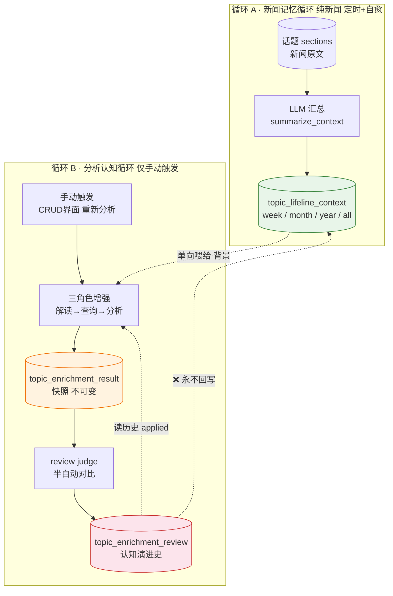
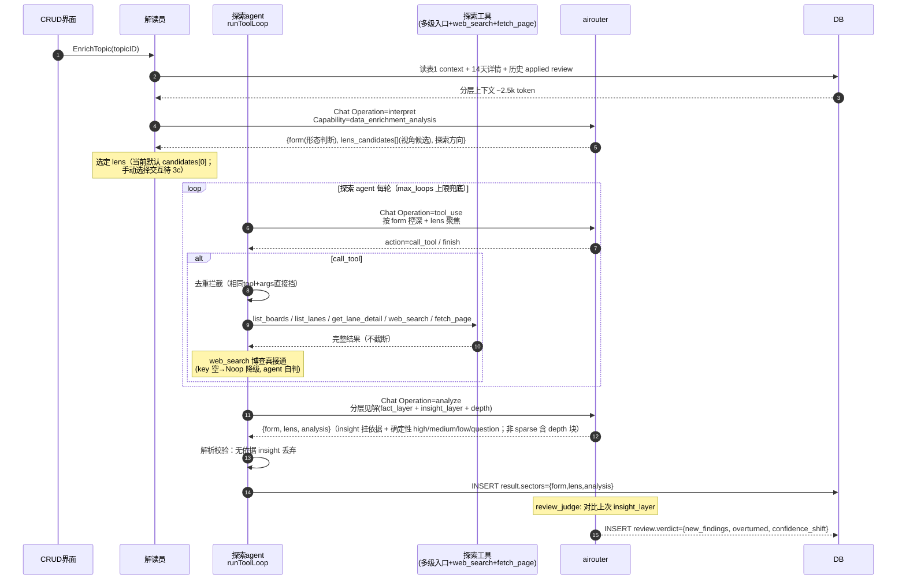
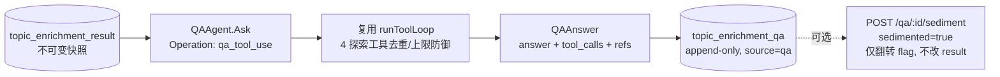

# 数据增强认知闭环流程（Data Enrichment）

<!-- doc-impact-applies: backend-go/internal/dataenrichment/ | section=业务约束与不变量 -->
> 大功能：持久话题的数据增强认知闭环——两个独立循环 + 三表关注点分离。
> 跨端。互补：`flow/daily-report.md`（持久话题归属）、`architecture/runtime.md`（scheduler 装配）。

## 需求说明

数据增强（Data Enrichment）解决「持久话题从『被动记录』走向『主动认知演进』」的问题。话题图谱（`flow/topic-graph.md`）把每天的 section 锚定到持久话题，但用户看到的只是新闻事实的累积。数据增强给持久话题叠加两层认知：

- **新闻记忆（循环 A，自动）**：按周 / 月 / 年 / 全周期滚动汇总话题下的新闻 section，形成话题的「背景记忆」——客观，只随新闻变。
- **分析认知（循环 B，手动）**：用户对感兴趣的话题发起「重新分析」，三角色 agent（解读员 → 研究助理 → 分析员）调用外部数据源工具（`web_search` 联网检索 + `fetch_page` 正文抓取 + 内部多级导航）产出**结构化深度剖析**快照（事实层 + 见解层 + 深度层），并与上次判断对比反思，让认知随每次分析迭代自我修正。

两循环通过 `topic_lifeline_context` 单向连接、隔离运行：新闻事实保持客观，分析认知可迭代修正，互不污染。可选的 FinGenius 个股辩论提供标的级深度分析。

## 链路设计

### 核心架构：两个独立循环

持久话题的演进分析通过两个隔离循环实现，通过 `topic_lifeline_context`（表1）单向连接：



**设计原则**：循环A只产新闻事实记忆（客观，只随新闻变）；循环B产分析认知（主观，随每次分析迭代自我修正）。两者隔离——review 永远不回写表1（保持新闻事实客观）。

### 三表关注点分离

| 表 | 角色 | 生命周期 | 可变？ | 谁写 |
| ----- | ------ | ---------- | -------- | ------ |
| `topic_lifeline_context` | 新闻记忆（背景） | 滚动更新，按周期 | 可（循环A刷新/人工编辑） | 循环A（`summarize_context`） |
| `topic_enrichment_result` | 当下判断（快照） | 一次分析一行 | **不可变** | 循环B 探索agent（analyze 步骤） |
| `topic_enrichment_review` | 两次快照间的增量（反思） | 追加 | deviation_summary 可人工调 | review judge / 用户手动 |

类比：**记住过去（表1）→ 形成判断（表2）→ 反思对比（表3）→ 下次判断更准（读历史 review）**。

### 循环A：新闻记忆循环

#### 触发时刻（Asia/Shanghai，避开 daily_report）

| granularity | 调度器 | 墙钟 | 函数 |
| ------------- | -------- | ------ | ------ |
| week | lifeline_weekly | 每周一 03:00 | `NextWeeklyLifelineTime` |
| month | lifeline_monthly | 每月 1 号 03:30 | `NextMonthlyLifelineTime` |
| year | lifeline_yearly | 每年 1 月 1 号 04:00 | `NextYearlyLifelineTime` |

- **定时**：按 wall-clock 触发各自 granularity 的汇总刷新。
- **检查自愈**：每次 Job 执行时扫描所有活跃 topic 的 `as_of_date` 滞后缺口，从 `as_of_date` 次周期起逐块补齐——**补的是遗漏的周期，不是覆盖当前周期**。`as_of_date` 顺序推进。
- **手动**：CRUD 界面可手动重生成任意 granularity。

#### 汇总算法

- **week**：按周块处理。正常定时时直接汇总当前周；自愈时从 `as_of_date` 次周起逐周块增量合并补齐。
- **month / year / all**：读「自上次汇总以来的增量 sections」+「该 granularity 旧汇总」→ LLM 合并生成新汇总。各 granularity 平行维护自己的滚动窗口，不搞层层金字塔合并。

### 循环B：分析认知循环（解读员 + 探索 agent，causal-analysis-agent）

仅手动触发（CRUD 界面"重新分析"按钮），不挂日报管线。分析目标从旧「演进定位」改为「探索判断 agent——形态随话题变 + 见解为核心 + 深度层强制」：解读员（结构化分析编辑）判形态+提视角候选，研究助理拿多级入口 + `web_search` + `fetch_page` 自主探索，产出分层见解（事实层 + 见解层 + **深度层**，确定性分级，依据强制；深度层映射「内部看美国」分析基因：系统重定位 / 多层机制 / 历史类比 / 边界限定 / 可核查证据链）。



**形态判断**（`form`）：`event_chain`(事件链) / `theme_vein`(主题脉络) / `single_point`(单点影响) / `structural`(结构演化，长时段结构命题无离散事件) / `sparse`(骨感)，判据含 hit_count/section 数/cluster_label 发散度/内容语义，枚举可扩展。**见解层**：事实层(验证) + 见解层(推演，产出主体)，每条 insight 必挂文章/时间线依据（无依据 parse 时丢弃）+ 确定性分级（high/medium/low/question）。**深度层**（非 sparse 形态强制）：`system_reframe`(系统重定位) / `mechanism_layers`(多层机制) / `historical_analogy`(历史类比) / `regime_shift`(范式转折，可空) / `boundary`(反过度解读边界，非空) / `evidence_chain`(可核查证据链，`source_type ∈ news|web|page`)；sparse 不产深度层。**骨感型**诚实标注信息不足，不硬推演。**视角机制**（模式丙）：agent 提具体问题式视角候选（结构/系统题） → 用户选（当前默认 candidates[0]，手动选择 UI 待 3c）。

### 7 个 LLM Operation 速查

| Operation | Capability | 循环 | 角色 | 触发方式 |
| ----------- | ------------ | ------ | ------ | ---------- |
| `data_enrichment.summarize_context` | `data_enrichment_news` | A | 汇总 | 定时 + 检查自愈 + 手动 |
| `data_enrichment.interpret` | `data_enrichment_analysis` | B | 解读员（形态判断+视角候选） | 手动增强 |
| `data_enrichment.tool_use` | `data_enrichment_analysis` | B | 查询员每轮 | 手动增强 |
| `data_enrichment.analyze` | `data_enrichment_analysis` | B | 分析员（分层见解） | 手动增强 |
| `data_enrichment.review_judge` | `data_enrichment_analysis` | B | review 对比 | 增强后自动 |
| `data_enrichment.debate_distill` | `data_enrichment_analysis` | 可选 | 辩论提炼 | 辩论完成后自动 |
| `data_enrichment.qa_tool_use` | `data_enrichment_analysis` | B 追问 | 报告追问每轮 | 用户对已生成报告手动提问 |

SessionID 规则：

- 循环B：`data_enrichment_{topic_id}_{uuid8}`，一次增强内所有 LLM 调用共享
- 循环A：`lifeline_context_{topic_id}_{granularity}_{uuid8}`，一次汇总共享
- 个股辩论提炼：`data_enrichment_debate_{topic_id}_{result_id}`
- 报告追问：`data_enrichment_qa_{result_id}_{uuid8}`，每次询问唯一（基于 result，同一报告多轮追问各自独立 session）

### 版块级深度分析（board-level-deep-analysis：跨泳道命题论证）

单泳道分析回答「这条泳道怎么回事」；版块级分析回答「这个板块作为一个系统怎么了」——跨泳道提命题、论文式论证。入口 `EnrichBoard(boardID)`：

1. **门槛**：板块 `enrichment_enabled`（同单泳道开关）。
2. **新鲜度门**（D9）：活跃泳道 week/month/year 三档 lifeline 滞后 >72h（严格大于）者串行补齐；无记录≠落后；失败降级不阻塞分析。
3. **态势卡装配**：每活跃泳道一卡（lifeline week→section 指纹→描述三级降级）；质量分=活跃度+密度−3×sparse 历史排序定详略；SparseHistory≥2 强制 brief；上限 12 卡。
4. **命题生成**（`board_interpret` Operation）：候选（钩子×切角）×3 + chosen + reason；LLM 烂两次机械降级（标 degraded）；全 sparse 诚实降级不硬编。
5. **探索 + 分析**：每方向 `runBoardAgentLoop`（内部工具优先，maxLoops=6）→ `boardAnalyzeCall` 产论文式论证（intro→层级递进 layers→boundary→conclusion 含确定性分级）+ 强制深度层 + 泳道引用。
6. **落库**：scope=board 五字段 `{thesis, candidates, argument, depth, lane_refs}`；自动 review 对比上一份 board 档（不回写 lifeline）。

参考角色（`reference_roles` 表）注入 interpret/analyze/agentLoop 三环节 system prompt 提供方法论参照系（只注入方法不注入事实）；证据多样性纪律要求 evidence_chain 尽量覆盖 ≥3 类证据。前端：`BoardAnalysisReport.vue` 论文式渲染 + lane 引用点击下钻（`prefill_lens` 透传 `EnrichTopicLens` 触发单泳道聚焦分析，单泳道报告渲染保持不变）。

### 报告追问（causal-analysis-agent D9，可选追问）

报告（`topic_enrichment_result`）生成后保持**不可变**（业务约束：result 不可变）。用户可对同一报告发起多轮追问，复用循环 B 的工具循环（4 个探索工具：`list_boards` / `list_lanes` / `get_lane_detail` / `web_search`），但把报告快照（`{form, lens, analysis}`）植入系统提示而非重新研究主题。



**不变量**：① 报告永不重写；② 每轮追问 append 一行 `topic_enrichment_qa`；③ `sediment` 仅翻转 qa 行的 `sedimented` flag，是用户 pin 持久笔记的手段，不回写 result。**5 个探索工具**：`list_boards`（活跃看板）/ `list_lanes`（看板下持久话题，按热度排）/ `get_lane_detail`（泳道详情，复用循环 A 的 `RenderLifelineForAgent`）/ `web_search`（博查联网检索，key 空时 Noop 降级）/ `fetch_page`（网页正文抓取，复用 reader readability）。

### FinGenius 可选辩论（个股深度分析）

分析员输出 `sectors[].symbols`（每个板块的代表标的池）后，用户可选择对感兴趣的标的发起个股辩论——交给外部 FinGenius（6 角色 agent 多轮辩论 + 投票），Syntopica 作 HTTP 客户端调用，结果存 `stock_debate_result` 表。**独立可选步骤，不串主流程**。

```mermaid
flowchart TB
    R[循环B 分析员产出<br/>result.sectors[].symbols] --> BTN[用户前端④ 开始辩论 按钮<br/>手动触发]
    BTN --> POST[POST /analyze<br/>FinGenius 服务端<br/>返回 task_id 数组]
    POST --> POLL[轮询 GET /task/:id<br/>每 FINGENIUS_POLL_INTERVAL=8s]
    POLL -->|running| POLL
    POLL -->|done| DISTILL[Syntopica LLM 提炼<br/>Operation: data_enrichment.debate_distill<br/>FinGenius 原始输出 → 三档 stance]
    DISTILL --> SAVE[(stock_debate_result<br/>append-only)

    style BTN fill:#e3f2fd,stroke:#1565c0
    style DISTILL fill:#fff3e0,stroke:#ef6c00
    style SAVE fill:#fce4ec,stroke:#c62828
```

**为什么独立**：① FinGenius 辩论 2-3 分钟，串进主流程会拖慢循环B；② 辩论失败不应阻塞板块方向预测（non-fatal）；③ 用户只对感兴趣的标的辩论，不必全跑。

**提炼规则**：FinGenius 输出是「6 段文本 + 二档投票(bullish/bearish)」，Syntopica 侧一次轻量 LLM 调用（`debate_distill`）将其转成三档结构（up/down/flat），存 `stock_debate_result` 的 `verdict`/`consensus`/`agents`/`votes` 提炼字段。提炼失败则降级展示原始文本（`fingenius_research`/`fingenius_battle`）。

**降级**：FinGenius 服务不可用时 non-fatal——循环B 主流程照常完成，前端个股辩论区块显示连接失败提示。Syntopica 不开 FinGenius 时完全可用。

## 业务约束与不变量

> 本节是 constraint-injection extension 的注入数据源：apply 改 `internal/dataenrichment/` 代码前会自动注入 system prompt，必须遵守。

1. **review 永不回写表1**：`topic_enrichment_review` 的 `applied=true`（采纳）不触发写 `topic_lifeline_context`——新闻事实保持客观，分析反思只影响下次分析输入，不篡改新闻记忆。落地点：`service/orchestrator.go` / `service/review_judge.go`。
2. **result 不可变**：`topic_enrichment_result` 写入后不修改（一次分析一行快照），确保 review 有稳定对比基准。落地点：repository。
3. **循环 B 仅手动触发 + 板块开关**：不挂日报 / 定时管线，只能 CRUD 界面「重新分析」按钮触发；且需板块开启 `enrichment_enabled`（默认 false），否则 handler 直接拒绝（`handler.go`）。
4. **agent loop 三防御**（循环 B 查询员）：① Qwen3 thinking 关闭（DB provider 配置 `enable_thinking=false` + 用户消息 `/no_think` prefix 双保险）；② 工具结果不截断（完整返回）；③ 去重拦截——相同 `tool+args` 的重复调用直接挡（`dedupKeyFor`，`seenCalls` map）。单次增强最多 `maxAgentLoops=6` 轮。
5. **循环 A 自愈补遗漏，非覆盖**：定时 Job 扫描活跃 topic 的 `as_of_date` 滞后缺口，从 `as_of_date` 次周期起逐块补齐——补的是遗漏周期，`as_of_date` 顺序推进，不覆盖当前周期。落地点：`service/lifeline_context.go`。
6. **循环 A 时段避开 daily_report**：week 每周一 03:00、month 每月 1 号 03:30、year 每年 1 月 1 号 04:00（Asia/Shanghai），与日报生成错峰。
7. **可追溯**：每次切片的输入 + 输出均可通过 `ai_call_logs` + `result.tool_calls` jsonb + `result.input_snapshot` jsonb 重建（全链路留痕）。
8. **FinGenius 降级 non-fatal**：FinGenius 服务不可用时循环 B 主流程照常完成，前端个股辩论区块显示连接失败提示；Syntopica 不开 FinGenius 时完全可用。辩论失败不阻塞结构化深度分析。
9. **见解依据强制**（causal-analysis-agent）：每条 insight 必须挂文章/时间线依据（evidence），无依据的 insight 在 parse 时丢弃（`Insight.hasEvidence()` 校验），不悬空发散。落地点：`service/orchestrator.go` analyze 解析。
10. **web_search 真接通 + 降级**（data-enrichment-structural-depth）：`web_search` 首个真实后端为博查 Bocha（`api.bochaai.com`，**只用通搜原始网页结果模式 `summary:false`，禁用 AI 总结模式**——AI summary 有幻觉风险不可作可核查证据）。**API key 界面可配 + 动态读**：存 `ai_settings` 表 `bocha_config`（照 Firecrawl），`BochaWebSearcher` 每次 `Search` 现读，优先级 **DB(界面) > env(`BOCHA_API_KEY`) > config.yaml(`bocha.*`) > 空**——界面改即时生效不重启；全空→返回 not configured，`executeWebSearch` 降级错误 JSON，agent 自判、不阻断主流程。`WebSearcher` 接口可扩展（未来换 Tavily 零改动编排）。落地点：`service/web_search.go` / `wire.go` / `aisettings/config_store.go`（`bocha_config`）/ 设置页「博查搜索」section。
11. **形态判断 + 视角机制**（data-enrichment-structural-depth）：解读员 `interpret` 输出 `form`（**五形态枚举** `event_chain`/`theme_vein`/`single_point`/`structural`/`sparse`，可扩展）+ `lens_candidates[]`（具体问题式视角，结构/系统题）；当前选定 lens 默认取 candidates[0]，手动选择交互待 3c。落地点：`service/orchestrator.go` interpret / `service/lens_source.go`。
12. **深度层强制 + fetch_page 可核查原文**（data-enrichment-structural-depth）：非 sparse 形态分析强制产出 `depth` 块，`system_reframe`/`boundary` 非空、`mechanism_layers`≥1、`evidence_chain`≥1，缺则 analyze 重试一次；`sparse` 禁深度层。`evidence_chain` 中 `web`/`page` 类必须带 `url`+`quote`(原文摘录，非 AI 转述)+`institution`+`date` 供前端点击核查。新增 `fetch_page` 工具复用 `reader` 域 `readability_crawler` 抓正文（超长截断），单工具失败返回错误 JSON 不阻断 agent loop。旧 result（无 depth）读取时降级渲染不崩。落地点：`service/orchestrator.go` `validateDepth` / `service/fetch_page.go` / 前端 `CausalAnalysisReport.vue`。
13. **参考角色 = 方法非事实**（board-level-deep-analysis）：`reference_roles` 表存方法论画像（如「内部看美国」分析基因），注入 interpret/analyze/agentLoop 三环节 system prompt——只注入**分析方法**（概念考古/举证责任门/机制保质期等），不注入事实观点；画像不提供新闻事实，事实一律来自 lifeline/工具检索。单条 >4000 字符（rune 计）注入时整条丢弃（不截断，防止断章取义）；enabled 现查 DB 即时生效。落地点：`service/reference_roles.go` / `platform/database/reference_role_seed.go`（首份画像 seed）。
14. **版块档分析 scope 隔离**（board-level-deep-analysis）：`topic_enrichment_result.analysis_scope` ∈ topic|board；board 档 result 挂 `semantic_board_id`，sectors 载五字段 `{thesis, candidates, argument, depth, lane_refs}`；查询/列表/详情按 board+scope 过滤，他板块 result 404；版块档 review 只对比上一份 board 档快照（topic 档不参与）。review 不回写 lifeline 红线同样适用于版块级。落地点：`service/enrich_board.go` / `handler/board_enrichment_handler.go`。
15. **lane 证据 lane_id 必属活跃集**（board-level-deep-analysis）：`evidence_chain` 中 `source_type=lane` 的 `ref` 与 `lane_refs[].lane_id` 必须属于本次分析的活跃泳道集——LLM 幻觉出的不存在泳道（幽灵引用）在落库前被 `sanitizeEvidenceChain`/解析器逐条剔除，单条剔除不拒整份。落地点：`service/evidence.go` / `service/enrich_board.go` boardAnalyzeCall。
16. **单泳道降级定位**（board-level-deep-analysis）：版块级分析不是单泳道分析的替代——前端单泳道分析收拢为「聚焦分析」折叠区（下钻入口）；版块报告 lane 引用点击 → 聚焦分析预填 lens（`prefill_lens` 透传 `EnrichTopicLens`）触发单泳道深挖。单泳道报告渲染（CausalAnalysisReport）保持不变。落地点：前端 `BoardEnrichmentPanel.vue` / `BoardAnalysisReport.vue`。
17. **补全门替代保鲜门**（fix-board-analysis-material）：EnrichBoard/EnrichTopic 装配前对活跃泳道 **month/year 档**执行补全——从 section 数据推有料周期集，无行→补建（含首份，首建归分析路径）、行最后写于 72h 前→重算覆盖（修复历史半月档）；全局限额 40 次 LLM、溢出降级留日志；失败降级不阻塞；串行限流；任何写入 `as_of_date` 钳制 ≤ now（周期边界未来日期属脏数据）。**week 档退出分析路径**（近期记忆归 14 天窗口详情，长期归 month/year；`lifeline_weekly` 定时任务停用，存量 week 行保留可被取材链消费）。落地点：`service/freshness_gate.go` / `service/lifeline_context.go`。
18. **证据多样性纪律**（board-level-deep-analysis）：analyze prompt 约束 `evidence_chain` 尽量覆盖 ≥3 类证据（数据序列/报告文献/历史对照/新闻网页）+ 一手源检索引导；某类检索不到时在 boundary 诚实标注，不编造。落地点：`service/board_analysis.go` / `orchestrator.go` analyzePrompt。
19. **态势卡取材链含 month 兜底**（fix-board-analysis-material）：`laneFactsDigest` 取材链为 **week → month → section 指纹 → description → none**——week 缺失时 month 档压缩摘要（最新 2 期）为主要事实源（生产形态：month 全量维护、week 滞后）；指纹降级携带 thread 标题实质内容（前 3 条拼接，无 thread 退 cluster_label），MUST NOT 输出「泳道名 (N篇)」同义反复；密度信号计入 lifeline 可用性（month/week 在库 +2）；`facts_source` 枚举含 `lifeline_month` 可追溯。落地点：`service/situation_cards.go`。
20. **get_lane_detail 附带历史背景记忆**（fix-board-analysis-material）：`RenderLifelineForAgent` 在逐日演进后追加「历史背景记忆（月/年档案）」段——month 最新 2 期 + year 最新 1 期，总预算 4000 rune、超限标注 `[档案截断]`、无归档如实标注「（无背景记忆归档）」不静默省略。落地点：`service/lifeline_renderer.go`（接口 `GetTopicLifelineArchive`，生产实现 `dataenrichment/production_wiring.go` 查 `topic_lifeline_context`）。
21. **分析触发异步化**（fix-board-analysis-material）：循环 B trigger（板块档+单泳道档）立即返回，分析在 detached ctx 后台跑完落库——MUST NOT 把 request-context 传进分析链（客户端断连 = context canceled = 整次分析作废，含补全门备料）；同目标在跑 → 409 防重入；前端轮询 `/enrichment/analysis-status` 拿 running/finished/error/result_id；未开启板块同步预检 400 语义保留；后台单次上限 30min。内存 job 表（单实例单用户），进程重启=空闲态。落地点：`handler/analysis_runner.go` / `handler/handler.go` / `handler/board_enrichment_handler.go` / 前端 `useBoardEnrichment.ts` 轮询。

## 代码入口

- **后端编排**：`backend-go/internal/dataenrichment/`（`handler/` 14 条 REST API + `enrichment_enabled` 门槛、`service/orchestrator.go` 循环B 三角色编排、`service/lifeline_context.go` 循环A 汇总 + 自愈、`service/review_judge.go` review 对比、`service/debate_service.go` + `fingenius_client.go` + `debate_distill.go` 个股辩论、`service/tool_registry.go` 数据源工具、`service/airouter_client.go`、`repository/` 三表持久化）。
- **后端调度**：`backend-go/internal/dataenrichment/scheduler_jobs.go`（lifeline_weekly/monthly/yearly 注册）+ `scheduler_next_run.go`（`NextWeeklyLifelineTime` 等）。
- **后端熔接**：`backend-go/internal/app/runtime.go`（注册 scheduler + handler + 15s check interval）。
- **后端版块级分析**（board-level-deep-analysis）：`service/enrich_board.go`（EnrichBoard 编排）、`service/situation_cards.go`（态势卡装配）、`service/board_interpret.go`（命题生成）、`service/board_analysis.go`（探索/分析 prompt + agent loop 分支）、`service/freshness_gate.go`（新鲜度门）、`service/evidence.go`（证据链清洗/多样性）、`service/reference_roles.go`（参考角色注入）、`handler/board_enrichment_handler.go`（版块分析 API）。
- **前端**：`front/app/features/tags/components/BoardEnrichmentPanel.vue`（板块详情页「数据增强」工作台：版块分析主视图 + 聚焦分析折叠区）、`BoardAnalysisReport.vue`（版块报告论文式渲染 + lane 下钻）、`DebateSection.vue`（FinGenius 个股辩论）、`composables/useBoardEnrichment.ts`（trigger/review/board analysis 状态）、设置页 `ReferenceRolePanel.vue`（参考角色管理）。

### REST API 路由

14 条数据增强相关 API（注册在 `/api` 下）：

**表1 topic_lifeline_context（话题分层上下文）**

| 方法 | 路径 | 说明 |
| ------ | ------ | ------ |
| GET | `/persistent-topics/:topicId/enrichment/contexts` | 列出某话题所有 granularity 的 context |
| GET | `/persistent-topics/:topicId/enrichment/contexts/:granularity` | 获取单个 granularity context |
| PUT | `/persistent-topics/:topicId/enrichment/contexts/:granularity` | 人工编辑 context content（body: `{content}`） |
| POST | `/persistent-topics/:topicId/enrichment/contexts/:granularity/regenerate` | 手动重生成某 granularity context |

**表2 topic_enrichment_result（分析结果）**

| 方法 | 路径 | 说明 |
| ------ | ------ | ------ |
| GET | `/persistent-topics/:topicId/enrichment/results` | 列出某话题所有 result（slim summary） |
| GET | `/persistent-topics/:topicId/enrichment/results/:id` | 获取单个 result 完整内容 |
| POST | `/persistent-topics/:topicId/enrichment/results/trigger` | 手动触发循环B增强（需板块开启 enrichment_enabled） |

**表3 topic_enrichment_review（认知演进）**

| 方法 | 路径 | 说明 |
| ------ | ------ | ------ |
| GET | `/persistent-topics/:topicId/enrichment/reviews` | 列出某话题所有 review |
| POST | `/persistent-topics/:topicId/enrichment/reviews` | 手动创建 review（body: `{curr_result_id, deviation_summary, prev_result_id?}`） |
| PUT | `/persistent-topics/:topicId/enrichment/reviews/:id` | 编辑 deviation_summary |
| POST | `/persistent-topics/:topicId/enrichment/reviews/:id/apply` | 采纳 review（applied=true，不回写表1） |

**FinGenius 个股辩论（可选，不串主流程）**

| 方法 | 路径 | 说明 |
|------|------|------|
| POST | `/persistent-topics/:topicId/enrichment/results/:id/debates` | 触发辩论（body: `{symbols: [{code, name, sector}]}`，空 body 默认取 result.sectors.symbols） |
| GET | `/persistent-topics/:topicId/enrichment/results/:id/debates` | 列出某 result 的所有辩论结果 |

**板块数据源绑定**

| 方法 | 路径 | 说明 |
| ------ | ------ | ------ |
| GET | `/semantic-boards/:id/data-sources` | 列出板块绑定的数据源 |
| PUT | `/semantic-boards/:id/data-sources` | 创建/更新数据源绑定 |
| DELETE | `/semantic-boards/:id/data-sources/:sourceType` | 删除数据源绑定 |

**版块级深度分析**（board-level-deep-analysis）

| 方法 | 路径 | 说明 |
| ------ | ------ | ------ |
| POST | `/semantic-boards/:id/enrichment/analysis/trigger` | 手动触发版块级分析（需板块开启 enrichment_enabled；响应含 result + review_generated + freshness_report） |
| GET | `/semantic-boards/:id/enrichment/analysis/results` | 版块档分析历史列表（scope=board，最新在前） |
| GET | `/semantic-boards/:id/enrichment/analysis/results/:rid` | 单份版块档 result 详情（他板块/单泳道档 404） |

**参考角色（方法论画像）**

| 方法 | 路径 | 说明 |
| ------ | ------ | ------ |
| GET | `/reference-roles` | 列出全部参考角色 |
| POST | `/reference-roles` | 创建（body: `{name, title?, content, enabled?}`） |
| GET | `/reference-roles/:id` | 单条详情 |
| PUT | `/reference-roles/:id` | 更新（含 enabled 启停，即时生效） |
| DELETE | `/reference-roles/:id` | 删除 |

单泳道 trigger（`POST /persistent-topics/:topicId/enrichment/results/trigger`）新增可选 body `{prefill_lens}`——版块报告下钻预填视角，透传 `EnrichTopicLens` 覆盖默认 lens 候选。
## 变更溯源

| 日期 | 变更 | 摘要 | 归档位置 |
|------|------|------|----------|
| 2026-07-23 | data-enrichment-orchestration | 两独立循环（A新闻记忆 + B分析认知）+ 三表关注点分离 + FinGenius 可选辩论；6 个 LLM Operation + 2 个 Capability；stock_debate_result 表 + debate_distill 提炼；详见本 flow 文档及 DATABASE_FIELDS.md §16 / ai-logging.md | [`openspec/changes/archive/2026-07-23-data-enrichment-orchestration`](../../../openspec/changes/archive/2026-07-23-data-enrichment-orchestration) |
| 2026-07-23 | causal-analysis-agent | 分析主线重做：推翻 orch 的「演进定位」主线为「探索判断 agent」——话题形态判断（event_chain/theme_vein/single_point/sparse）+ 视角候选与选择 + 探索工具集（list_boards/list_lanes/get_lane_detail/web_search）+ 分层见解（事实层/见解层 + 确定性分级 high/medium/low/question）+ 报告追问（topic_enrichment_qa 多轮 + 手动沉淀）；骨架（三表/agent loop 三防御/可观测/循环A）复用 | [`openspec/changes/archive/2026-07-23-causal-analysis-agent`](../../../openspec/changes/archive/2026-07-23-causal-analysis-agent) |
| 2026-08-19 | data-enrichment-structural-depth | 数据增强从「A 股产业点评」改造为「结构化深度剖析」：接通博查 web_search 真后端（通搜原始结果模式，key 空→Noop 降级）+ 新增 fetch_page 工具（复用 reader readability 取可核查原文）+ 新增 `structural` 形态（五形态枚举）+ 分析产物新增**深度层**（system_reframe/mechanism_layers/historical_analogy/regime_shift/boundary/evidence_chain，非 sparse 强制）+ 三角色 prompt 去「A 股/产业」硬编码 + 清除 spec 残留旧「走向预测」主线；**BREAKING** 删除金融方向（list_etf_by_keyword/get_etf_quote/list_sectors 工具 + etf_quote/exchange_rate/gdelt_event source_type 枚举）；追补：博查 key 界面可配（DB>env>config.yaml 动态读）+ 能力路由 UI 显式化 data_enrichment_news/analysis | [`openspec/changes/archive/2026-08-19-data-enrichment-structural-depth`](../../../openspec/changes/archive/2026-08-19-data-enrichment-structural-depth) |
| 2026-08-26 | board-level-deep-analysis | 版块级深度分析：EnrichBoard 跨泳道编排（态势卡装配→命题生成→多方向 agent 探索→论文式分析）+ 新鲜度门（>72h 补齐，幂等钳制）+ 证据多样性纪律 + 参考角色库（方法论画像注入，首份「内部看美国」画像 seed）+ evidence lane/kind 两级分类 + 幽灵泳道引用清洗 + 前端版块分析主视图/聚焦分析折叠区/参考角色设置页 + scope 隔离（analysis_scope 列迁移） | 本 change |
| 2026-08-27 | fix-board-analysis-material | 素材断供修复：态势卡取材链插 month 兜底（生产形态 week 97% 缺失→month 全量在库却无人消费）+ section 指纹改带 thread 标题实质内容（去「泳道名 (N篇)」同义反复）+ get_lane_detail 附带月/年背景记忆档案段（4000 rune 预算）+ 密度信号计入 lifeline 可用性 + 前端工作台收口（删旧话题选择条/单一下拉/新闻背景折叠化） | 本 change |

> 资料来源：架构设计 `openspec/changes/data-enrichment-orchestration/design.md`（§0 两循环 + §4.2b 个股辩论 + §11 六决策）；概要设计 `openspec/changes/data-enrichment-orchestration/overview.md`（mermaid 流程图 + 6 Operation 速查）。
