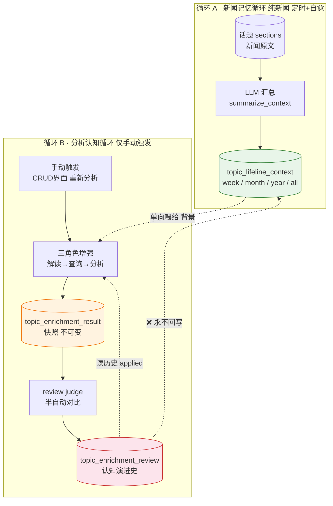
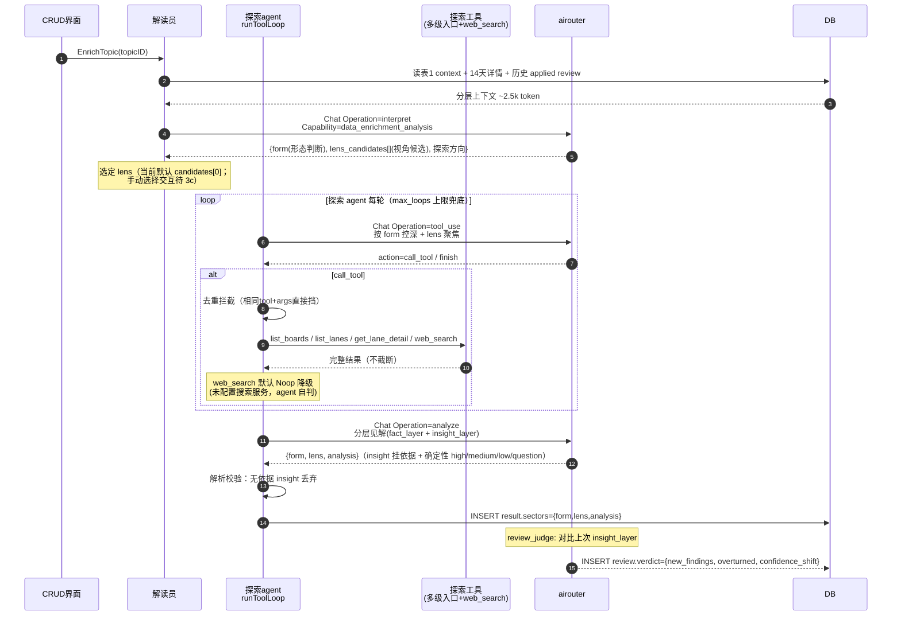
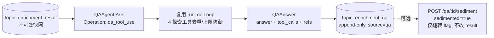

# 数据增强认知闭环流程（Data Enrichment）

> 大功能：持久话题的数据增强认知闭环——两个独立循环 + 三表关注点分离。
> 跨端。互补：`flow/daily-report.md`（持久话题归属）、`architecture/runtime.md`（scheduler 装配）。

## 需求说明

数据增强（Data Enrichment）解决「持久话题从『被动记录』走向『主动认知演进』」的问题。话题图谱（`flow/topic-graph.md`）把每天的 section 锚定到持久话题，但用户看到的只是新闻事实的累积。数据增强给持久话题叠加两层认知：

- **新闻记忆（循环 A，自动）**：按周 / 月 / 年 / 全周期滚动汇总话题下的新闻 section，形成话题的「背景记忆」——客观，只随新闻变。
- **分析认知（循环 B，手动）**：用户对感兴趣的话题发起「重新分析」，三角色 agent（解读员 → 查询员 → 分析员）调用外部数据源工具（ETF / 行情）产出当下判断快照，并与上次判断对比反思，让认知随每次分析迭代自我修正。

两循环通过 `topic_lifeline_context` 单向连接、隔离运行：新闻事实保持客观，分析认知可迭代修正，互不污染。可选的 FinGenius 个股辩论提供标的级深度分析。

## 链路设计

### 核心架构：两个独立循环

持久话题的演进分析通过两个隔离循环实现，通过 `topic_lifeline_context`（表1）单向连接：



**设计原则**：循环A只产新闻事实记忆（客观，只随新闻变）；循环B产分析认知（主观，随每次分析迭代自我修正）。两者隔离——review 永远不回写表1（保持新闻事实客观）。

### 三表关注点分离

| 表 | 角色 | 生命周期 | 可变？ | 谁写 |
| ----- | ------ | ---------- | -------- | ------ |
| `topic_lifeline_context` | 新闻记忆（背景） | 滚动更新，按周期 | 可（循环A刷新/人工编辑） | 循环A（`summarize_context`） |
| `topic_enrichment_result` | 当下判断（快照） | 一次分析一行 | **不可变** | 循环B 探索agent（analyze 步骤） |
| `topic_enrichment_review` | 两次快照间的增量（反思） | 追加 | deviation_summary 可人工调 | review judge / 用户手动 |

类比：**记住过去（表1）→ 形成判断（表2）→ 反思对比（表3）→ 下次判断更准（读历史 review）**。

### 循环A：新闻记忆循环

#### 触发时刻（Asia/Shanghai，避开 daily_report）

| granularity | 调度器 | 墙钟 | 函数 |
| ------------- | -------- | ------ | ------ |
| week | lifeline_weekly | 每周一 03:00 | `NextWeeklyLifelineTime` |
| month | lifeline_monthly | 每月 1 号 03:30 | `NextMonthlyLifelineTime` |
| year | lifeline_yearly | 每年 1 月 1 号 04:00 | `NextYearlyLifelineTime` |

- **定时**：按 wall-clock 触发各自 granularity 的汇总刷新。
- **检查自愈**：每次 Job 执行时扫描所有活跃 topic 的 `as_of_date` 滞后缺口，从 `as_of_date` 次周期起逐块补齐——**补的是遗漏的周期，不是覆盖当前周期**。`as_of_date` 顺序推进。
- **手动**：CRUD 界面可手动重生成任意 granularity。

#### 汇总算法

- **week**：按周块处理。正常定时时直接汇总当前周；自愈时从 `as_of_date` 次周起逐周块增量合并补齐。
- **month / year / all**：读「自上次汇总以来的增量 sections」+「该 granularity 旧汇总」→ LLM 合并生成新汇总。各 granularity 平行维护自己的滚动窗口，不搞层层金字塔合并。

### 循环B：分析认知循环（解读员 + 探索 agent，causal-analysis-agent）

仅手动触发（CRUD 界面"重新分析"按钮），不挂日报管线。分析目标从旧「演进定位」改为「探索判断 agent——形态随话题变 + 见解为核心」：解读员判形态+提视角候选，探索 agent 拿多级入口+web_search 自主探索，产出分层见解（事实层+见解层，确定性分级，依据强制）。



**形态判断**（`form`）：`event_chain`(事件链) / `theme_vein`(主题脉络) / `single_point`(单点影响) / `sparse`(骨感)，判据含 hit_count/section 数/cluster_label 发散度/内容语义，枚举可扩展。**见解层**：事实层(验证) + 见解层(推演，产出主体)，每条 insight 必挂文章/时间线依据（无依据 parse 时丢弃）+ 确定性分级（high/medium/low/question）。**骨感型**诚实标注信息不足，不硬推演。**视角机制**（模式丙）：agent 提具体问题式视角候选 → 用户选（当前默认 candidates[0]，手动选择 UI 待 3c）。

### 7 个 LLM Operation 速查

| Operation | Capability | 循环 | 角色 | 触发方式 |
| ----------- | ------------ | ------ | ------ | ---------- |
| `data_enrichment.summarize_context` | `data_enrichment_news` | A | 汇总 | 定时 + 检查自愈 + 手动 |
| `data_enrichment.interpret` | `data_enrichment_analysis` | B | 解读员（形态判断+视角候选） | 手动增强 |
| `data_enrichment.tool_use` | `data_enrichment_analysis` | B | 查询员每轮 | 手动增强 |
| `data_enrichment.analyze` | `data_enrichment_analysis` | B | 分析员（分层见解） | 手动增强 |
| `data_enrichment.review_judge` | `data_enrichment_analysis` | B | review 对比 | 增强后自动 |
| `data_enrichment.debate_distill` | `data_enrichment_analysis` | 可选 | 辩论提炼 | 辩论完成后自动 |
| `data_enrichment.qa_tool_use` | `data_enrichment_analysis` | B 追问 | 报告追问每轮 | 用户对已生成报告手动提问 |

SessionID 规则：

- 循环B：`data_enrichment_{topic_id}_{uuid8}`，一次增强内所有 LLM 调用共享
- 循环A：`lifeline_context_{topic_id}_{granularity}_{uuid8}`，一次汇总共享
- 个股辩论提炼：`data_enrichment_debate_{topic_id}_{result_id}`
- 报告追问：`data_enrichment_qa_{result_id}_{uuid8}`，每次询问唯一（基于 result，同一报告多轮追问各自独立 session）

### 报告追问（causal-analysis-agent D9，可选追问）

报告（`topic_enrichment_result`）生成后保持**不可变**（业务约束：result 不可变）。用户可对同一报告发起多轮追问，复用循环 B 的工具循环（4 个探索工具：`list_boards` / `list_lanes` / `get_lane_detail` / `web_search`），但把报告快照（`{form, lens, analysis}`）植入系统提示而非重新研究主题。



**不变量**：① 报告永不重写；② 每轮追问 append 一行 `topic_enrichment_qa`；③ `sediment` 仅翻转 qa 行的 `sedimented` flag，是用户 pin 持久笔记的手段，不回写 result。**4 个探索工具**：`list_boards`（活跃看板）/ `list_lanes`（看板下持久话题，按热度排）/ `get_lane_detail`（泳道详情，复用循环 A 的 `RenderLifelineForAgent`）/ `web_search`（网页搜索，默认 Noop 降级提示，待接入真实后端）。

### FinGenius 可选辩论（个股深度分析）

分析员输出 `sectors[].symbols`（每个板块的代表标的池）后，用户可选择对感兴趣的标的发起个股辩论——交给外部 FinGenius（6 角色 agent 多轮辩论 + 投票），Syntopica 作 HTTP 客户端调用，结果存 `stock_debate_result` 表。**独立可选步骤，不串主流程**。

```mermaid
flowchart TB
    R[循环B 分析员产出<br/>result.sectors[].symbols] --> BTN[用户前端④ 开始辩论 按钮<br/>手动触发]
    BTN --> POST[POST /analyze<br/>FinGenius 服务端<br/>返回 task_id 数组]
    POST --> POLL[轮询 GET /task/:id<br/>每 FINGENIUS_POLL_INTERVAL=8s]
    POLL -->|running| POLL
    POLL -->|done| DISTILL[Syntopica LLM 提炼<br/>Operation: data_enrichment.debate_distill<br/>FinGenius 原始输出 → 三档 stance]
    DISTILL --> SAVE[(stock_debate_result<br/>append-only)

    style BTN fill:#e3f2fd,stroke:#1565c0
    style DISTILL fill:#fff3e0,stroke:#ef6c00
    style SAVE fill:#fce4ec,stroke:#c62828
```

**为什么独立**：① FinGenius 辩论 2-3 分钟，串进主流程会拖慢循环B；② 辩论失败不应阻塞板块方向预测（non-fatal）；③ 用户只对感兴趣的标的辩论，不必全跑。

**提炼规则**：FinGenius 输出是「6 段文本 + 二档投票(bullish/bearish)」，Syntopica 侧一次轻量 LLM 调用（`debate_distill`）将其转成三档结构（up/down/flat），存 `stock_debate_result` 的 `verdict`/`consensus`/`agents`/`votes` 提炼字段。提炼失败则降级展示原始文本（`fingenius_research`/`fingenius_battle`）。

**降级**：FinGenius 服务不可用时 non-fatal——循环B 主流程照常完成，前端个股辩论区块显示连接失败提示。Syntopica 不开 FinGenius 时完全可用。

## 业务约束与不变量

> 本节是 `doc-impact.sh context` 的数据源：apply 改 `internal/dataenrichment/` 代码前会自动 dump 给 agent，必须遵守。

1. **review 永不回写表1**：`topic_enrichment_review` 的 `applied=true`（采纳）不触发写 `topic_lifeline_context`——新闻事实保持客观，分析反思只影响下次分析输入，不篡改新闻记忆。落地点：`service/orchestrator.go` / `service/review_judge.go`。
2. **result 不可变**：`topic_enrichment_result` 写入后不修改（一次分析一行快照），确保 review 有稳定对比基准。落地点：repository。
3. **循环 B 仅手动触发 + 板块开关**：不挂日报 / 定时管线，只能 CRUD 界面「重新分析」按钮触发；且需板块开启 `enrichment_enabled`（默认 false），否则 handler 直接拒绝（`handler.go`）。
4. **agent loop 三防御**（循环 B 查询员）：① Qwen3 thinking 关闭（DB provider 配置 `enable_thinking=false` + 用户消息 `/no_think` prefix 双保险）；② 工具结果不截断（完整返回）；③ 去重拦截——相同 `tool+args` 的重复调用直接挡（`dedupKeyFor`，`seenCalls` map）。单次增强最多 `maxAgentLoops=6` 轮。
5. **循环 A 自愈补遗漏，非覆盖**：定时 Job 扫描活跃 topic 的 `as_of_date` 滞后缺口，从 `as_of_date` 次周期起逐块补齐——补的是遗漏周期，`as_of_date` 顺序推进，不覆盖当前周期。落地点：`service/lifeline_context.go`。
6. **循环 A 时段避开 daily_report**：week 每周一 03:00、month 每月 1 号 03:30、year 每年 1 月 1 号 04:00（Asia/Shanghai），与日报生成错峰。
7. **可追溯**：每次切片的输入 + 输出均可通过 `ai_call_logs` + `result.tool_calls` jsonb + `result.input_snapshot` jsonb 重建（全链路留痕）。
8. **FinGenius 降级 non-fatal**：FinGenius 服务不可用时循环 B 主流程照常完成，前端个股辩论区块显示连接失败提示；Syntopica 不开 FinGenius 时完全可用。辩论失败不阻塞板块方向预测。
9. **见解依据强制**（causal-analysis-agent）：每条 insight 必须挂文章/时间线依据（evidence），无依据的 insight 在 parse 时丢弃（`Insight.hasEvidence()` 校验），不悬空发散。落地点：`service/orchestrator.go` analyze 解析。
10. **web_search 接口降级**（causal-analysis-agent）：`web_search` 默认 `NoopWebSearcher`（未配置搜索服务时返回 error），agent 自判降级、不阻断主流程；真实搜索后端待注入（`WebSearcher` 接口可扩展）。落地点：`service/web_search.go` / `tool_registry.go`。
11. **形态判断 + 视角机制**（causal-analysis-agent）：解读员 `interpret` 输出 `form`（四形态枚举，可扩展）+ `lens_candidates[]`（具体问题式视角）；当前选定 lens 默认取 candidates[0]，手动选择交互待 3c。落地点：`service/orchestrator.go` interpret / `service/lens_source.go`。

## 代码入口

- **后端编排**：`backend-go/internal/dataenrichment/`（`handler/` 14 条 REST API + `enrichment_enabled` 门槛、`service/orchestrator.go` 循环B 三角色编排、`service/lifeline_context.go` 循环A 汇总 + 自愈、`service/review_judge.go` review 对比、`service/debate_service.go` + `fingenius_client.go` + `debate_distill.go` 个股辩论、`service/tool_registry.go` 数据源工具、`service/airouter_client.go`、`repository/` 三表持久化）。
- **后端调度**：`backend-go/internal/dataenrichment/scheduler_jobs.go`（lifeline_weekly/monthly/yearly 注册）+ `scheduler_next_run.go`（`NextWeeklyLifelineTime` 等）。
- **后端熔接**：`backend-go/internal/app/runtime.go`（注册 scheduler + handler + 15s check interval）。
- **前端**：`front/app/features/tags/components/BoardEnrichmentPanel.vue`（板块详情页「数据增强」认知工作台 tab）、`front/app/features/tags/components/DebateSection.vue`（FinGenius 个股辩论）、`front/app/features/tags/composables/useBoardEnrichment.ts`（debate 四态 / trigger / review 持有）。

### REST API 路由

14 条数据增强相关 API（注册在 `/api` 下）：

**表1 topic_lifeline_context（话题分层上下文）**

| 方法 | 路径 | 说明 |
| ------ | ------ | ------ |
| GET | `/persistent-topics/:topicId/enrichment/contexts` | 列出某话题所有 granularity 的 context |
| GET | `/persistent-topics/:topicId/enrichment/contexts/:granularity` | 获取单个 granularity context |
| PUT | `/persistent-topics/:topicId/enrichment/contexts/:granularity` | 人工编辑 context content（body: `{content}`） |
| POST | `/persistent-topics/:topicId/enrichment/contexts/:granularity/regenerate` | 手动重生成某 granularity context |

**表2 topic_enrichment_result（分析结果）**

| 方法 | 路径 | 说明 |
| ------ | ------ | ------ |
| GET | `/persistent-topics/:topicId/enrichment/results` | 列出某话题所有 result（slim summary） |
| GET | `/persistent-topics/:topicId/enrichment/results/:id` | 获取单个 result 完整内容 |
| POST | `/persistent-topics/:topicId/enrichment/results/trigger` | 手动触发循环B增强（需板块开启 enrichment_enabled） |

**表3 topic_enrichment_review（认知演进）**

| 方法 | 路径 | 说明 |
| ------ | ------ | ------ |
| GET | `/persistent-topics/:topicId/enrichment/reviews` | 列出某话题所有 review |
| POST | `/persistent-topics/:topicId/enrichment/reviews` | 手动创建 review（body: `{curr_result_id, deviation_summary, prev_result_id?}`） |
| PUT | `/persistent-topics/:topicId/enrichment/reviews/:id` | 编辑 deviation_summary |
| POST | `/persistent-topics/:topicId/enrichment/reviews/:id/apply` | 采纳 review（applied=true，不回写表1） |

**FinGenius 个股辩论（可选，不串主流程）**

| 方法 | 路径 | 说明 |
|------|------|------|
| POST | `/persistent-topics/:topicId/enrichment/results/:id/debates` | 触发辩论（body: `{symbols: [{code, name, sector}]}`，空 body 默认取 result.sectors.symbols） |
| GET | `/persistent-topics/:topicId/enrichment/results/:id/debates` | 列出某 result 的所有辩论结果 |

**板块数据源绑定**

| 方法 | 路径 | 说明 |
| ------ | ------ | ------ |
| GET | `/semantic-boards/:id/data-sources` | 列出板块绑定的数据源 |
| PUT | `/semantic-boards/:id/data-sources` | 创建/更新数据源绑定 |
| DELETE | `/semantic-boards/:id/data-sources/:sourceType` | 删除数据源绑定 |

## 变更溯源

| 日期 | 变更 | 摘要 | 归档位置 |
|------|------|------|----------|
| 2026-07-23 | data-enrichment-orchestration | 两独立循环（A新闻记忆 + B分析认知）+ 三表关注点分离 + FinGenius 可选辩论；6 个 LLM Operation + 2 个 Capability；stock_debate_result 表 + debate_distill 提炼；详见本 flow 文档及 DATABASE_FIELDS.md §16 / ai-logging.md | [`openspec/changes/archive/2026-07-23-data-enrichment-orchestration`](../../../openspec/changes/archive/2026-07-23-data-enrichment-orchestration) |
| 2026-07-23 | causal-analysis-agent | 分析主线重做：推翻 orch 的「演进定位」主线为「探索判断 agent」——话题形态判断（event_chain/theme_vein/single_point/sparse）+ 视角候选与选择 + 探索工具集（list_boards/list_lanes/get_lane_detail/web_search）+ 分层见解（事实层/见解层 + 确定性分级 high/medium/low/question）+ 报告追问（topic_enrichment_qa 多轮 + 手动沉淀）；骨架（三表/agent loop 三防御/可观测/循环A）复用 | [`openspec/changes/archive/2026-07-23-causal-analysis-agent`](../../../openspec/changes/archive/2026-07-23-causal-analysis-agent) |

> 资料来源：架构设计 `openspec/changes/data-enrichment-orchestration/design.md`（§0 两循环 + §4.2b 个股辩论 + §11 六决策）；概要设计 `openspec/changes/data-enrichment-orchestration/overview.md`（mermaid 流程图 + 6 Operation 速查）。
