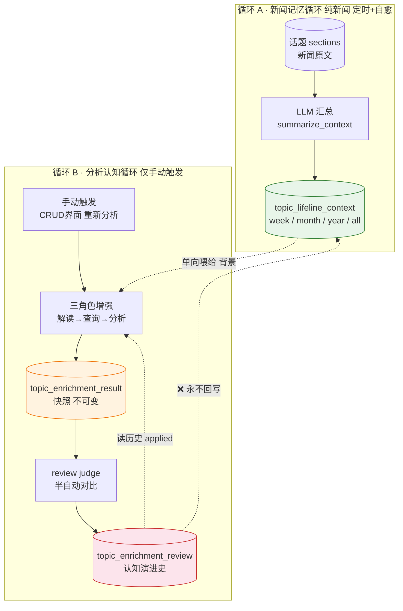
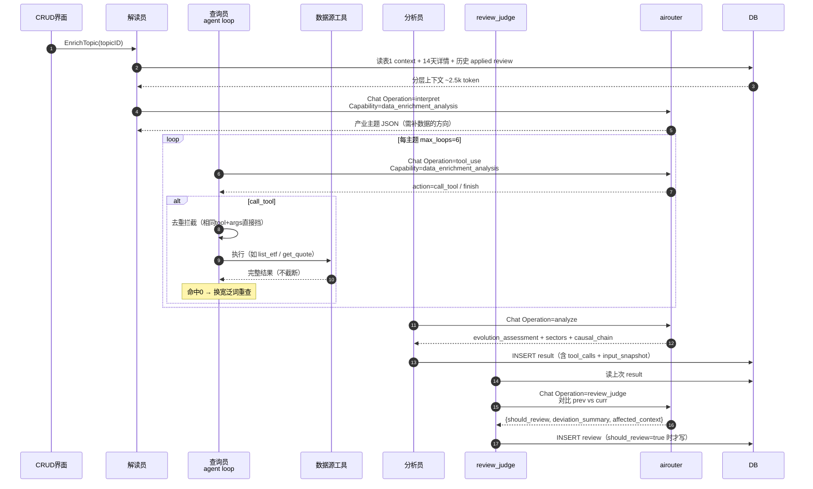

# 数据增强认知闭环流程（Data Enrichment）

> 大功能：持久话题的数据增强认知闭环——两个独立循环 + 三表关注点分离。
> 跨端。互补：`flow/daily-report.md`（持久话题归属）、`architecture/runtime.md`（scheduler 装配）。

## 核心架构：两个独立循环

持久话题的演进分析通过两个隔离循环实现，通过 `topic_lifeline_context`（表1）单向连接：

**设计原则**：循环A只产新闻事实记忆（客观，只随新闻变）；循环B产分析认知（主观，随每次分析迭代自我修正）。两者隔离——review 永远不回写表1（保持新闻事实客观）。

## 三表关注点分离

| 表 | 角色 | 生命周期 | 可变？ | 谁写 |
|-----|------|----------|--------|------|
| `topic_lifeline_context` | 新闻记忆（背景） | 滚动更新，按周期 | 可（循环A刷新/人工编辑） | 循环A（`summarize_context`） |
| `topic_enrichment_result` | 当下判断（快照） | 一次分析一行 | **不可变** | 循环B 分析员 |
| `topic_enrichment_review` | 两次快照间的增量（反思） | 追加 | deviation_summary 可人工调 | review judge / 用户手动 |

类比：**记住过去（表1）→ 形成判断（表2）→ 反思对比（表3）→ 下次判断更准（读历史 review）**。

## 循环A：新闻记忆循环

### 触发时刻（Asia/Shanghai，避开 daily_report）

| granularity | 调度器 | 墙钟 | 函数 |
|-------------|--------|------|------|
| week | lifeline_weekly | 每周一 03:00 | `NextWeeklyLifelineTime` |
| month | lifeline_monthly | 每月 1 号 03:30 | `NextMonthlyLifelineTime` |
| year | lifeline_yearly | 每年 1 月 1 号 04:00 | `NextYearlyLifelineTime` |

- **定时**：按 wall-clock 触发各自 granularity 的汇总刷新。
- **检查自愈**：每次 Job 执行时扫描所有活跃 topic 的 `as_of_date` 滞后缺口，从 `as_of_date` 次周期起逐块补齐——**补的是遗漏的周期，不是覆盖当前周期**。`as_of_date` 顺序推进。
- **手动**：CRUD 界面可手动重生成任意 granularity。

### 汇总算法

- **week**：按周块处理。正常定时时直接汇总当前周；自愈时从 `as_of_date` 次周起逐周块增量合并补齐。
- **month / year / all**：读「自上次汇总以来的增量 sections」+「该 granularity 旧汇总」→ LLM 合并生成新汇总。各 granularity 平行维护自己的滚动窗口，不搞层层金字塔合并。

## 循环B：分析认知循环（三角色编排）

仅手动触发（CRUD 界面"重新分析"按钮），不挂日报管线。

## 5 个 LLM Operation 速查

| Operation | Capability | 循环 | 角色 | 触发方式 |
|-----------|------------|------|------|----------|
| `data_enrichment.summarize_context` | `data_enrichment_news` | A | 汇总 | 定时 + 检查自愈 + 手动 |
| `data_enrichment.interpret` | `data_enrichment_analysis` | B | 解读员 | 手动增强 |
| `data_enrichment.tool_use` | `data_enrichment_analysis` | B | 查询员每轮 | 手动增强 |
| `data_enrichment.analyze` | `data_enrichment_analysis` | B | 分析员 | 手动增强 |
| `data_enrichment.review_judge` | `data_enrichment_analysis` | B | review 对比 | 增强后自动 |

SessionID 规则：
- 循环B：`data_enrichment_{topic_id}_{uuid8}`，一次增强内所有 LLM 调用共享
- 循环A：`lifeline_context_{topic_id}_{granularity}_{uuid8}`，一次汇总共享

## 关键不变量

| 不变量 | 说明 | 落地点 |
|--------|------|--------|
| **review 不回写表1** | review appended=true 不触发写 `topic_lifeline_context`，新闻事实保持客观 | `orchestrator.go` / `review_judge.go` |
| **result 不可变** | `topic_enrichment_result` 写入后不修改，确保 review 有对比基准 | repository |
| **循环B仅手动** | 不挂日报管线，CRUD 手动触发 | handler |
| **agent loop 三防御** | Qwen3 thinking 关闭（`enable_thinking=false` 走 DB provider 配置）；结果不截断；去重拦截相同 tool+args | airouter / orchestrator |
| **自愈补遗漏** | 补 `as_of_date` 之后的遗漏周期，非覆盖当前 | lifeline_context.go |
| **可追溯** | 每次切片的输入+输出均可通过 `ai_call_logs` + `tool_calls` jsonb + `input_snapshot` jsonb 重建 | 全链路 |

## REST API 路由

14 条数据增强相关 API（注册在 `/api` 下）：

**表1 topic_lifeline_context（话题分层上下文）**
| 方法 | 路径 | 说明 |
|------|------|------|
| GET | `/persistent-topics/:topicId/enrichment/contexts` | 列出某话题所有 granularity 的 context |
| GET | `/persistent-topics/:topicId/enrichment/contexts/:granularity` | 获取单个 granularity context |
| PUT | `/persistent-topics/:topicId/enrichment/contexts/:granularity` | 人工编辑 context content（body: `{content}`） |
| POST | `/persistent-topics/:topicId/enrichment/contexts/:granularity/regenerate` | 手动重生成某 granularity context |

**表2 topic_enrichment_result（分析结果）**
| 方法 | 路径 | 说明 |
|------|------|------|
| GET | `/persistent-topics/:topicId/enrichment/results` | 列出某话题所有 result（slim summary） |
| GET | `/persistent-topics/:topicId/enrichment/results/:id` | 获取单个 result 完整内容 |
| POST | `/persistent-topics/:topicId/enrichment/results/trigger` | 手动触发循环B增强（需板块开启 enrichment_enabled） |

**表3 topic_enrichment_review（认知演进）**
| 方法 | 路径 | 说明 |
|------|------|------|
| GET | `/persistent-topics/:topicId/enrichment/reviews` | 列出某话题所有 review |
| POST | `/persistent-topics/:topicId/enrichment/reviews` | 手动创建 review（body: `{curr_result_id, deviation_summary, prev_result_id?}`） |
| PUT | `/persistent-topics/:topicId/enrichment/reviews/:id` | 编辑 deviation_summary |
| POST | `/persistent-topics/:topicId/enrichment/reviews/:id/apply` | 采纳 review（applied=true，不回写表1） |

**板块数据源绑定**
| 方法 | 路径 | 说明 |
|------|------|------|
| GET | `/semantic-boards/:id/data-sources` | 列出板块绑定的数据源 |
| PUT | `/semantic-boards/:id/data-sources` | 创建/更新数据源绑定 |
| DELETE | `/semantic-boards/:id/data-sources/:sourceType` | 删除数据源绑定 |

## 代码入口

- **后端编排**：`internal/dataenrichment/`（handler / service / repository / scheduler）
- **后端熔接**：`internal/app/runtime.go`（注册 scheduler + handler + 15s check interval）
- **前端**：`front/app/features/semantic-board/`（板块详情页「数据增强」tab）

## 资料来源

架构设计：`openspec/changes/data-enrichment-orchestration/design.md`（§0 两循环 + §11 五决策）。
概要设计：`openspec/changes/data-enrichment-orchestration/overview.md`（mermaid 流程图 + 5 Operation 速查）。

## 变更溯源

| 日期 | 变更 | 摘要 | 归档位置 |
|------|------|------|----------|
