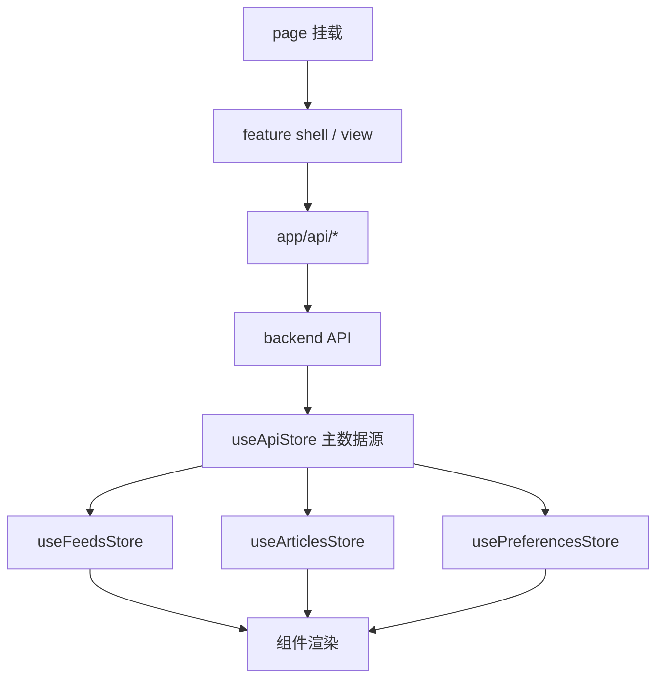
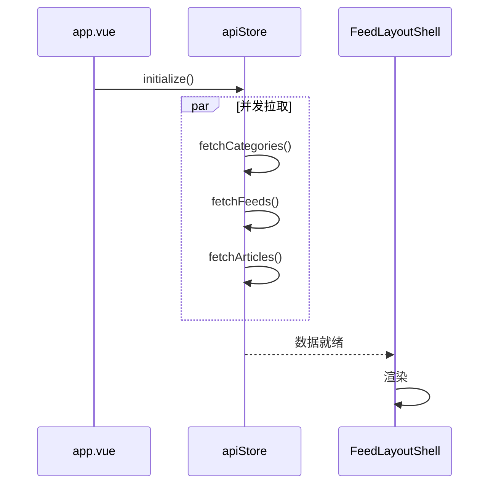

# 主阅读页流程（Reading）

> 大功能：应用启动 → 切分类 → 切 feed → 打开文章 → 记录阅读行为 / 生成偏好分数。
> 跨端。互补：`architecture/frontend.md` §页面骨架、§数据映射规则。

## 需求说明

主阅读页是用户使用系统的核心场景，解决「打开应用 → 找到想看的文章 → 阅读并被系统理解偏好」这条主链路：

- **启动即就绪**：应用挂载后并发拉分类 / feed / 文章，首屏不空。
- **导航切换**：切分类、切 feed，列表与正文即时更新；feed 可手动刷新（含进度轮询）。
- **阅读即记录**：打开、滚动、关闭、收藏等行为自动上报，驱动偏好分数，反过来影响排序与 AI 总结参考。
- **文章自动打标签**：refresh / Firecrawl / 内容补全完成后按规则入标签队列，用户也可手动重打标签。

## 链路设计

### 前端数据流



### Store 职责

| Store | 角色 | 职责 |
| ------- | ------ | ------ |
| `useApiStore` | 主数据源 | 拉分类/feed/文章；执行 CRUD；OPML 导入导出；AI 总结接口；启动初始化 |
| `useFeedsStore` | 派生订阅视图 | feed 分组、分类视图、未读数 |
| `useArticlesStore` | 派生文章视图 | 筛选条件、当前文章、已读/收藏统计、排序过滤 |
| `usePreferencesStore` | 阅读偏好 | 偏好分数、阅读统计、手动触发偏好更新 |

### 字段映射规则

- 后端响应保留 `snake_case`；前端内部统一 `camelCase`
- 前端 `id` 统一转 `string`
- 转换集中在 API 模块和 `useApiStore`，组件层不散落映射逻辑

### 应用启动



### 切分类 / 切 feed

```text
切分类: AppSidebar → FeedLayoutShell.handleCategoryClick()
        → apiStore.fetchFeeds(...) → apiStore.fetchArticles(...) → 列表/正文更新

切 feed:  AppSidebar → FeedLayoutShell.handleFeedClick()
          → apiStore.fetchArticles(feed_id) → apiStore.refreshFeed(feed_id)
          → 轮询 refresh_status → 刷新完成后再拉文章
```

### 打开文章（阅读行为上报）

```text
ArticleListPanel → ArticleContentView
  → apiStore.markAsRead()
  → useReadingTracker 记录 open/scroll/close/favorite
  → reading_behavior 接口批量上报（POST /api/reading-behavior/track-batch）
  → 后端聚合进 reading_behaviors 表 → 定时重算偏好分数（见「业务约束」）
```

## 业务约束与不变量

> 本节同时是 `scripts/doc-impact.sh context` 的数据源——改 `internal/reader/` 或 `internal/admin/`（偏好/行为）代码前会被自动 dump，必读。

1. **前端 `id` 统一字符串化、字段统一 camelCase**：后端 `snake_case` + 数值 id 到前端必须转 `string`，转换只发生在 API 模块 / `useApiStore`，组件层不得散落映射。违反会触发比较/路由参数类型错配。
2. **偏好分数为 [0,1] 的衰减加权分**：`calculatePreferenceScore` = 滚动深度 `avgScrollDepth/100*0.4` + 阅读时长 `min(avgTime/180,1)*0.3`（180 秒封顶）+ 交互次数 `min(totalEvents/50,1)*0.3`（50 次封顶），再乘时间衰减 `exp(-daysSinceInteraction/30)`（30 天半衰期），最后 clamp 到 [0,1]。`totalEvents==0` 直接返回 0。改权重/封顶值属于业务语义变更，非纯重构。
3. **偏好是「全量重建」而非增量更新（幂等）**：`UpdateAllPreferences` 在单事务内按固定顺序执行：① 修孤立 behavior（feed 还在则回填 category_id）→ ② 删不可恢复的孤立 behavior（category/feed 都没了）→ ③ 删孤立 preference → ④ `DELETE FROM user_preferences`（清空全表）→ ⑤ 按 `reading_behaviors` 重算 feed 偏好 → ⑥ 重算 category 偏好。重复执行结果一致；**清空全表后再重算**，故偏好表始终是 behavior 的纯派生，不可手工编辑。
4. **偏好重算由调度器驱动，间隔 1800 秒**：`preference_update` scheduler（`job_preference_update.go`）周期触发 `UpdateAllPreferences`；前端 `POST /api/user-preferences/update` 可手动触发同一路径。
5. **Article 打标签时机（与 feed 开关耦合）**：
   - 普通 refresh 新文章：入库后立即打标签（feed 未开启 Firecrawl 时）。
   - feed 开启 Firecrawl：refresh 阶段**先不打标签**；Firecrawl 抓完写入 `tag_jobs` 队列，由 `TagQueue` worker 异步打标签；同时开启 `article_summary_enabled` 时，等 ContentCompletion 生成 `ai_content_summary` 后再 enqueue `tag_jobs`（打标签依赖整理后的正文）。
   - 手动打标签 `POST /api/articles/:article_id/tags`：只 enqueue 返回 `job_id`，`TagQueue` 完成后经 WebSocket 广播 `tag_completed`；LLM 提示词最多返回 **8 个**标签并按优先级排序，后端写 `article_topic_tags` 前也只保留前 8 作兜底。
   - `TagQueue.Start()` 首次启动失败不阻塞应用，后台按 30 秒间隔重试最多 10 次。

## 代码入口

- **后端 reader 域**：`backend-go/internal/reader/handler/`（article/feed/content-completion/firecrawl handler）、`backend-go/internal/reader/service/`（feed_service、content_completion_service）、`backend-go/internal/reader/repository/`、`backend-go/internal/reader/routes.go`。
- **后端偏好/阅读行为（admin 域）**：`backend-go/internal/admin/service/preferences_service.go`（`PreferenceService` 全量重算）、`backend-go/internal/admin/handler/preferences_handler.go`（reading-behavior / user-preferences handler）、`backend-go/internal/admin/scheduler/job_preference_update.go`（偏好调度）、`backend-go/internal/admin/routes.go`（`/reading-behavior/*`、`/user-preferences/*`）。
- **打标签（tagmanagement 域）**：`backend-go/internal/tagmanagement/`（`TagQueue`、article_tagger）。
- **前端**：`front/app/features/articles/`（列表/正文/阅读追踪）、`front/app/features/shell/`（FeedLayoutShell、导航）、`front/app/stores/`（api/feeds/articles/preferences）、`front/app/features/preferences/composables/useReadingTracker.ts`（阅读行为采集）。
- 应用装配：`backend-go/internal/app/router.go`、`backend-go/internal/app/runtime.go`。

## 变更溯源

| 日期 | 变更 | 摘要 | 归档位置 |
|------|------|------|----------|
| 2026-05-13 | backend-package-restructure | 后端按域拆包：`feeds/articles/categories` → `reader/` 域，`preferences`/reading-behavior → `admin/` 域；本 flow「代码入口」的包路径即来自此次重组（旧 user-guide 的 `internal/domain/*`、`internal/jobs/` 路径已失效） | [`openspec/changes/archive/2026-05-13-backend-package-restructure`](../../../openspec/changes/archive/2026-05-13-backend-package-restructure) |
