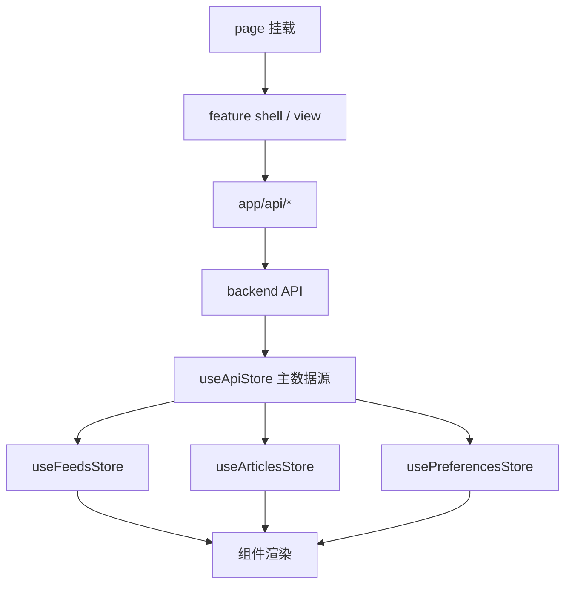
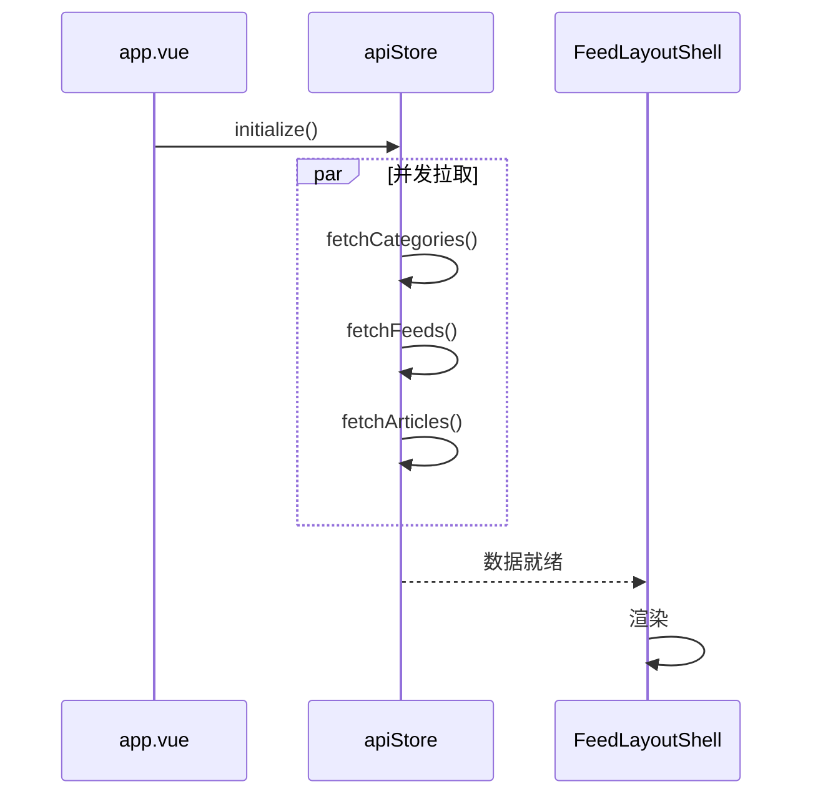

# 主阅读页流程（Reading）

> 大功能：应用启动 → 切分类 → 切 feed → 打开文章。
> 跨端。互补：`architecture/frontend.md` §页面骨架、§数据映射规则。

## 前端数据流



## Store 职责

| Store | 角色 | 职责 |
|-------|------|------|
| `useApiStore` | 主数据源 | 拉分类/feed/文章；执行 CRUD；OPML 导入导出；AI 总结接口；启动初始化 |
| `useFeedsStore` | 派生订阅视图 | feed 分组、分类视图、未读数 |
| `useArticlesStore` | 派生文章视图 | 筛选条件、当前文章、已读/收藏统计、排序过滤 |
| `usePreferencesStore` | 阅读偏好 | 偏好分数、阅读统计、手动触发偏好更新 |

## 字段映射规则

- 后端响应保留 `snake_case`；前端内部统一 `camelCase`
- 前端 `id` 统一转 `string`
- 转换集中在 API 模块和 `useApiStore`，组件层不散落映射逻辑

## 交互链路

### 应用启动



### 切分类 / 切 feed

```text
切分类: AppSidebar → FeedLayoutShell.handleCategoryClick()
        → apiStore.fetchFeeds(...) → apiStore.fetchArticles(...) → 列表/正文更新

切 feed:  AppSidebar → FeedLayoutShell.handleFeedClick()
          → apiStore.fetchArticles(feed_id) → apiStore.refreshFeed(feed_id)
          → 轮询 refresh_status → 刷新完成后再拉文章
```

### 打开文章

```text
ArticleListPanel → ArticleContentView
  → apiStore.markAsRead()
  → useReadingTracker 记录 open/scroll/close/favorite
  → reading_behavior 接口批量上报
```

## 代码入口

- 后端：`internal/reader/{handler,service}/`、`internal/app/router.go`
- 前端：`front/app/features/articles/`、`front/app/stores/`、`front/app/features/shell/`

## Article 打标签时机

1. **普通 refresh 新文章**：入库后立即打标签（feed 未开启 Firecrawl 时）
2. **feed 开启 Firecrawl**：refresh 阶段先不打标签
   - Firecrawl 抓取完成后写入 `tag_jobs` 队列，由 `TagQueue` worker 异步重新打标签
   - 同时开启 `article_summary_enabled` 时，由 ContentCompletion scheduler 生成 `AIContentSummary` 后同样 enqueue `tag_jobs`
3. **手动打标签**：`POST /api/articles/:article_id/tags`（只 enqueue 队列返回 `job_id`；`TagQueue` 完成后 WebSocket 广播 `tag_completed`）
   - LLM 提示词要求最多返回 `8` 个标签并按优先级排序；后端写入 `article_topic_tags` 前也只保留前 `8` 个作为兜底
4. `TagQueue.Start()` 首次启动失败不阻塞应用，后台按 30 秒间隔重试最多 10 次

## 资料来源

迁自原 `architecture/data-flow.md`（主链路 / 前端数据流 / 前端状态职责 / 字段映射规则 / 主阅读页交互流）。
