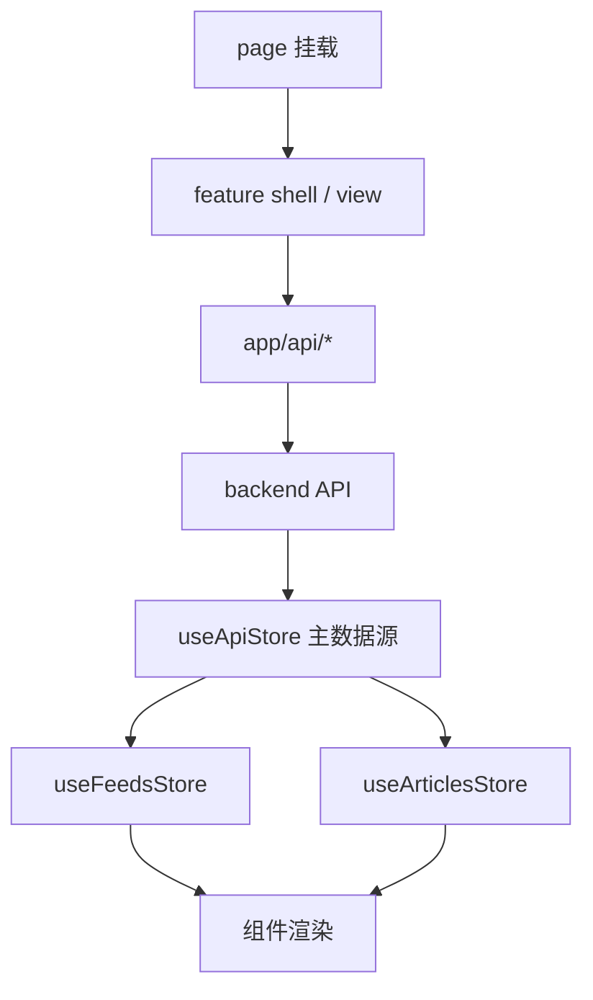
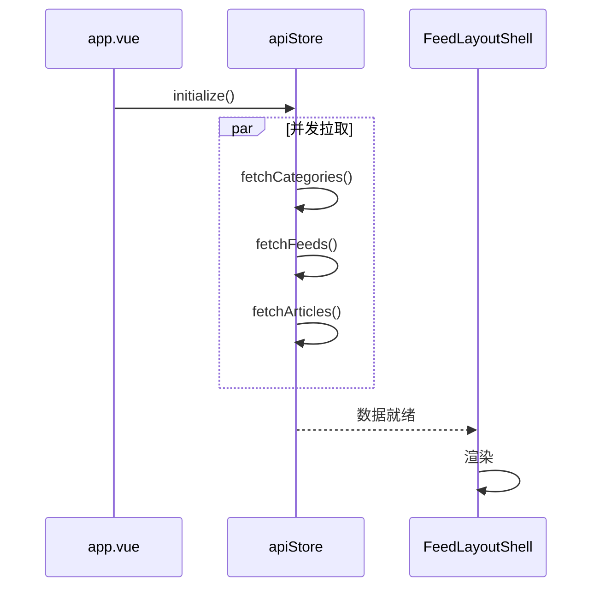

# 主阅读页流程（Reading）

> 大功能：应用启动 → 切分类 → 切 feed → 打开文章 → 记录阅读行为。
> 阅读行为是「偏好向量画像」的权重源（画像与订阅源发现见 [discovery.md](discovery.md)）。
> 跨端。互补：`architecture/frontend.md` §页面骨架、§数据映射规则。

## 需求说明

主阅读页是用户使用系统的核心场景，解决「打开应用 → 找到想看的文章 → 阅读并被系统理解」这条主链路：

- **启动即就绪**：应用挂载后并发拉分类 / feed / 文章，首屏不空。
- **导航切换**：切分类、切 feed，列表与正文即时更新；feed 可手动刷新（含进度轮询）。
- **阅读即记录**：打开、滚动、关闭、收藏等行为自动上报进 `reading_behaviors`，作为偏好向量画像的行为权重源（旧「偏好分数」已废弃，见 [discovery.md](discovery.md)）。
- **文章自动打标签**：refresh / Firecrawl / 内容补全完成后按规则入标签队列，用户也可手动重打标签。

## 链路设计

### 前端数据流



### Store 职责

| Store | 角色 | 职责 |
| ------- | ------ | ------ |
| `useApiStore` | 主数据源 | 拉分类/feed/文章；执行 CRUD；OPML 导入导出；AI 总结接口；启动初始化 |
| `useFeedsStore` | 派生订阅视图 | feed 分组、分类视图、未读数 |
| `useArticlesStore` | 派生文章视图 | 筛选条件、当前文章、已读/收藏统计、排序过滤 |

> 偏好画像不再是阅读页 store，改为设置「兴趣画像」section + 发现页消费，见 [discovery.md](discovery.md)。

### 字段映射规则

- 后端响应保留 `snake_case`；前端内部统一 `camelCase`
- 前端 `id` 统一转 `string`
- 转换集中在 API 模块和 `useApiStore`，组件层不散落映射逻辑

### 应用启动



### 切分类 / 切 feed

```text
切分类: AppSidebar → FeedLayoutShell.handleCategoryClick()
        → apiStore.fetchFeeds(...) → apiStore.fetchArticles(...) → 列表/正文更新

切 feed:  AppSidebar → FeedLayoutShell.handleFeedClick()
          → apiStore.fetchArticles(feed_id) → apiStore.refreshFeed(feed_id)
          → 轮询 refresh_status → 刷新完成后再拉文章
```

### 打开文章（阅读行为上报）

```text
ArticleListPanel → ArticleContentView
  → apiStore.markAsRead()
  → useReadingTracker 记录 open/scroll/close/favorite
  → reading_behavior 接口批量上报（POST /api/reading-behavior/track-batch）
  → 后端聚合进 reading_behaviors 表（偏好向量画像的权重源，见 flow/discovery.md）
```

### Feed 图标获取与渲染（本地化）

```text
RefreshFeed（icon_source ∈ {auto, fallback} 才重算；custom 不碰）
  → 候选管线：RSS <image> → 站点首页 HTML <link rel="icon">（仅 image 缺失时请求）
    → {host}/favicon.ico 猜测
  → 逐候选后端下载验证（10s 超时 / 256KB 上限 / 图片 Content-Type 校验，失败顺延）
  → 首个成功：落盘 data/icons/feeds/<feed_id>.<ext>（临时文件 + rename 原子写），
    DB icon = /icons/feeds/<feed_id>.<ext>、icon_source = auto；全失败：mdi:rss + fallback
  → icon 下载失败不影响 RefreshStatus（仍 success）

前端 FeedIcon.vue 三类值：iconify id → <Icon>（本地子集，零联网）；
  http(s) 远程 URL（存量）→  直连；/ 开头同源路径 → getApiOrigin() 拼后端源渲染 ；
   onerror 降级 mdi:rss
```

UI 图标（mdi:*）同为本地化机制：启动时 `app/plugins/iconify-local.ts` 将 `app/assets/iconify-subset.json`（源码扫描生成的子集，162 个图标）注册进 `@iconify/vue`，运行时不请求 api.iconify.design；新增图标需 `pnpm generate:icons` 重新生成并提交产物。

## 业务约束与不变量

> 本节同时是 `scripts/doc-impact.sh context` 的数据源——改 `internal/reader/` 或 `internal/admin/`（偏好/行为）代码前会被自动 dump，必读。

1. **前端 `id` 统一字符串化、字段统一 camelCase**：后端 `snake_case` + 数值 id 到前端必须转 `string`，转换只发生在 API 模块 / `useApiStore`，组件层不得散落映射。违反会触发比较/路由参数类型错配。
2. **偏好向量画像（替代旧偏好分数）**：旧 `user_preferences` 表 + `preference_score` + `preference_update` 调度器已整体废弃删除（preference-vector-feed-discovery）；`reading_behaviors` 采集链路本身**保留不动**，改为作为偏好**向量画像**的行为权重源（按 SemanticBoard 聚合的 embedding），画像/调度/约束见 [discovery.md](discovery.md) §业务约束与不变量。
3. **Article 打标签时机（与 feed 开关耦合）**：
   - 普通 refresh 新文章：入库后立即打标签（feed 未开启 Firecrawl 时）。
   - feed 开启 Firecrawl：refresh 阶段**先不打标签**；Firecrawl 抓完写入 `tag_jobs` 队列，由 `TagQueue` worker 异步打标签；同时开启 `article_summary_enabled` 时，等 ContentCompletion 生成 `ai_content_summary` 后再 enqueue `tag_jobs`（打标签依赖整理后的正文）。
   - 手动打标签 `POST /api/articles/:article_id/tags`：只 enqueue 返回 `job_id`，`TagQueue` 完成后经 WebSocket 广播 `tag_completed`；LLM 提示词最多返回 **8 个**标签并按优先级排序，后端写 `article_topic_tags` 前也只保留前 8 作兜底。
   - `TagQueue.Start()` 首次启动失败不阻塞应用，后台按 30 秒间隔重试最多 10 次。
4. **Feed 图标状态机与本地化**：`icon_source` ∈ `auto`（系统抓取，可刷新覆盖）/ `custom`（用户设定，RefreshFeed 不碰）/ `fallback`（占位，可刷新重算）。重算走候选管线（RSS image → 首页 HTML link → favicon.ico 猜测），**后端下载落盘 `data/icons/feeds/`、DB 存 `/icons/...` 同源路径**；不用文章封面图当 feed icon；icon 下载失败不影响 refresh 成功状态。删除 feed 时清理其 icon 文件（失败不阻断）。favicon 探测以 RSS channel link（站点首页）为基准，不用 feed URL（聚合器域名）或 Google s2 等第三方服务。
5. **UI 图标本地子集、运行时零联网**：`mdi:*` 图标全部来自构建产物 `app/assets/iconify-subset.json`（`pnpm generate:icons` 生成并纳 git），运行时不访问 iconify API；源码新增图标名必须是子集的超集（一致性单测强制）。

## 代码入口

- **后端 reader 域**：`backend-go/internal/reader/handler/`（article/feed/content-completion/firecrawl handler）、`backend-go/internal/reader/service/`（feed_service、content_completion_service、icon_store——feed 图标下载落盘）、`backend-go/internal/reader/repository/`、`backend-go/internal/reader/routes.go`；favicon 两级探测在 `rss_parser.go`（`ProbeFaviconCandidates`）。
- **后端阅读行为（admin 域）**：`backend-go/internal/admin/handler/preferences_handler.go`（仅留 reading-behavior handler）、`backend-go/internal/admin/routes.go`（`/reading-behavior/*`）；旧 `preferences_service.go` / `job_preference_update.go` / `/user-preferences/*` 已删除。
- **后端偏好画像 / 订阅源发现（admin 域）**：`backend-go/internal/admin/service/{preference_profile_service,recommendation_service,catalog_sync_service,catalog_extras,rsshub_config}.go`、`backend-go/internal/admin/handler/{preference_profile_handler,discovery_handler}.go`、`backend-go/internal/admin/scheduler/{job_preference_profile_update,job_rsshub_catalog_sync}.go`，详见 [discovery.md](discovery.md)。
- **打标签（tagmanagement 域）**：`backend-go/internal/tagmanagement/`（`TagQueue`、article_tagger）。
- **前端**：`front/app/features/articles/`（列表/正文/阅读追踪）、`front/app/features/shell/`（FeedLayoutShell、导航）、`front/app/stores/`（api/feeds/articles）、`front/app/composables/useReadingTracker.ts`（阅读行为采集）。偏好画像 UI 与发现页入口见 [discovery.md](discovery.md)。图标：`front/app/components/feed/FeedIcon.vue`（三类 icon 值渲染 + 降级）、`front/app/plugins/iconify-local.ts` + `front/app/assets/iconify-subset.json`（UI 图标本地子集）、`front/scripts/generate-icon-subset.mjs`（子集生成）。
- 应用装配：`backend-go/internal/app/router.go`、`backend-go/internal/app/runtime.go`。

## 变更溯源

| 日期 | 变更 | 摘要 | 归档位置 |
|------|------|------|----------|
| 2026-05-13 | backend-package-restructure | 后端按域拆包：`feeds/articles/categories` → `reader/` 域，`preferences`/reading-behavior → `admin/` 域；本 flow「代码入口」的包路径即来自此次重组（旧 user-guide 的 `internal/domain/*`、`internal/jobs/` 路径已失效） | [`openspec/changes/archive/2026-05-13-backend-package-restructure`](../../../openspec/changes/archive/2026-05-13-backend-package-restructure) |
| 2026-07-25 | preference-vector-feed-discovery | 旧「偏好分数」(`user_preferences` 表 / `preference_update` 调度器 / `/api/user-preferences/*` / `usePreferencesStore` / `ReadingPreferencesPanel`) 整体废弃删除；`reading_behaviors` 采集保留并改为偏好**向量画像**权重源；约束迁至 [discovery.md](discovery.md) | [`openspec/changes/archive/2026-07-25-preference-vector-feed-discovery`](../../../openspec/changes/archive/2026-07-25-preference-vector-feed-discovery) |
| 2026-08-01 | localize-icons | Feed 图标从「存远程 URL 前端直连」改为「后端下载落盘 `data/icons/feeds/` + DB 存 `/icons/...` 同源路径」；favicon 探测增强（首页 HTML `<link rel="icon">` 解析 + `/favicon.ico` 猜测 + 下载验证）；UI 图标（mdi）改本地子集注册、运行时零联网 | [`openspec/changes/archive/2026-08-01-localize-icons`](../../../openspec/changes/archive/2026-08-01-localize-icons) |
