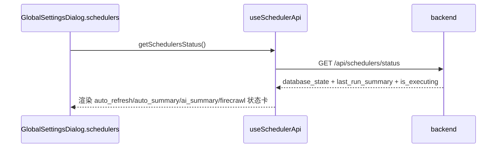

# 定时任务流程（Scheduler）

> 大功能：横切的调度器集合（feed 刷新、内容增强、AI 总结、Digest/叙事、标签、状态回传、手动 trigger）。
> 跨端。互补：`architecture/runtime.md` §Scheduler 状态、§优雅退出。

## 需求说明

Scheduler 解决「集中调度周期性后台任务」的问题。Syntopica 有大量无需用户干预的后台管线——feed 自动刷新、Firecrawl 全文抓取、内容补全、AI 摘要、Digest 日报/周报、标签提取/合并/质量分、叙事生成、板块升级建议等。Scheduler 把这些任务统一为：

- **声明式注册**：在 `app/runtime.go` 用 `registry.Register` 注册即自动出现在状态接口与手动触发接口，无需在 handler 维护第二份清单。
- **状态可视化**：前端 GlobalSettings → Schedulers tab 实时显示每个 job 的 `database_state` + `last_run_summary` + `is_executing`，用户知道后台在忙什么。
- **手动触发**：用户可即时 trigger 任一 job（不必等定时点），后端返回真实的 accepted / started / reason 反馈，前端据实展示（不只看 HTTP 200）。

## 链路设计

### 调度器清单

- feed 自动刷新
- Firecrawl / 内容补全处理
- AI 总结批量生成
- Digest 日报 / 周报生成
- 阅读偏好聚合任务
- 阻塞文章恢复
- 标签自动合并（源 DELETE，不再用 `status='merged'`）
- 标签质量分数重算
- 叙事摘要生成（SemanticBoard 派生）
- 叙事后处理（Board 连接派生、标签反馈、空 Board 清理）
- 辅助标签入库（随 tag extraction 同步）
- SemanticBoard 匹配（随 tag 入库后触发）
- 关注标签叙事维度总结
- 版块升级建议生成（discover_new，每日 06:30 固定时间点，松耦合不依赖日报，失败仅记日志；附 watch 观察池 GC）

> **自动发现**：调度器清单由 `scheduler.Registry` 自动发现——在 `app/runtime.go` 用 `registry.Register` 注册即自动出现在 `GET /api/schedulers/status` 与 `POST /api/schedulers/:name/trigger`，无需在 handler 维护第二份 descriptor 列表。展示顺序 = runtime 注册顺序。展示元数据（Description/TaskName/Aliases）随 `scheduler.Config` 走，经 `BaseScheduler.GetConfig()` 暴露。

### scheduler 状态回传



### 手动 trigger 链路

```text
GlobalSettingsDialog.schedulers tab
  → useSchedulerApi.triggerScheduler(name)
  → POST /api/schedulers/:name/trigger
  → backend 判断 accepted / started / reason / message
  → 前端显示真实反馈（不只看 HTTP 200）
  → 短周期轮询刷新最新状态
```

### `auto_refresh` 状态流

```text
auto_refresh scheduler
  → 扫描 refresh_interval > 0 的 feed
  → 判断是否到点
  → 标记 feed.refresh_status=refreshing
  → 异步调用 feedService.RefreshFeed()
  → 扫描数/到点数/触发数/已在刷新数 写回 scheduler_tasks.last_execution_result
```

`auto_refresh` 状态位预埋（代码级细节）：feed 刷新不只是在「加文章」，还会把后续 Firecrawl / 内容补全链路需要的状态位一起种进去（`buildArticleFromEntry`）：

- 默认 `summary_status = complete`
- feed 开启 `firecrawl_enabled` → 文章先标记 `firecrawl_status = pending`
- 同时开启 `article_summary_enabled` → 再标记 `summary_status = incomplete`
- `cleanupOldArticles` 按 `max_articles` 清理旧文章（收藏文章跳过）

### `auto_summary` 状态流

```text
auto_summary scheduler
  → 读取 AI 配置
  → 扫描 ai_summary_enabled=true 的 feed
  → 聚合近 time_range 内文章
  → 调 AI 生成 summary
  → feed数/生成数/跳过数/失败数 写回 scheduler_tasks.last_execution_result
  → 手动 trigger 时也走同一执行链路
```

## 业务约束与不变量

> 本节是 `doc-impact.sh context` 的数据源：apply 改 `internal/admin/` 代码前会自动 dump 给 agent，必须遵守。

1. **自动发现，单一事实源**：调度器清单由 `scheduler.Registry` 自动发现——`registry.Register` 注册即出现在 `GET /api/schedulers/status` 与 `POST /api/schedulers/:name/trigger`。**禁止在 handler 维护第二份 descriptor 列表**（展示顺序 = runtime 注册顺序，重复维护会漂移）。
2. **TriggerNow 互斥**：`BaseScheduler.TriggerNow` 用 `isExecuting` 标志做重入保护——job 正在执行时再触发返回 `status_code=409` + `accepted=false`，**不并发执行同一 job**。
3. **trigger 结果看 accepted，不只看 HTTP 200**：`respondTriggerResult` 按 `result["accepted"]` 决定 `success:true|false`；即便 HTTP 200，`accepted=false` 也要前端据 reason / message 实反馈。HTTP 409（执行中）/ 500（执行出错）按 status_code 透传。
4. **job 失败隔离**：单个 job 执行失败默认标记 task failed；但**松耦合 job（如 board_upgrade_suggest）刻意吞掉 error 返回 nil**，仅记日志，不阻塞同轮兄弟 job（design D4）。
5. **auto_refresh 过滤条件**：只扫描 `refresh_interval > 0` 的 feed；触发后先标 `feed.refresh_status=refreshing` 防止重复触发，再异步 `RefreshFeed`。
6. **auto_summary 过滤条件**：只扫描 `ai_summary_enabled=true` 的 feed；手动 trigger 走与定时**同一执行链路**（不另起路径）。
7. **状态位预埋不可漏**：`auto_refresh` 刷新文章时必须按 feed 开关（`firecrawl_enabled` / `article_summary_enabled`）种入 `firecrawl_status` / `summary_status` 初始位，否则后续 Firecrawl / 内容补全链路会漏处理。

## 代码入口

- **后端调度框架**：`backend-go/internal/admin/scheduler/`（`base.go` BaseScheduler + `TriggerNow` 互斥 + `is_executing` 状态、`registry.go` 自动发现注册、`persistence.go` scheduler_tasks 持久化、`job_*.go` 各 job wrapper：`job_auto_refresh` / `job_firecrawl` / `job_content_completion` / `job_daily_report` / `job_tag_quality_score` / `job_board_upgrade_suggest` / `job_aux_label_cleanup` / `job_blocked_article_recovery` / `job_preference_update` / `job_log_cleanup`）。
- **后端装配**：`backend-go/internal/app/runtime.go`（`registry.Register` 注册所有 scheduler、优雅退出 `Stop`）。
- **后端 handler**：`backend-go/internal/admin/handler/scheduler_handler.go`（status / trigger / reset stats，`respondTriggerResult` 透传 `accepted` + `status_code`）。
- **前端**：`front/app/components/dialog/GlobalSettingsDialog.vue`（Schedulers tab）、`front/app/components/dialog/SchedulerStatusPanel.vue`（状态卡）、`front/app/composables/useSchedulerStatus.ts`（状态轮询 + trigger）。

## 变更溯源

| 日期 | 变更 | 摘要 | 归档位置 |
|------|------|------|----------|
| 2026-05-10 | global-settings-feed-controls | Feed 卡片新增 Firecrawl / 打标签 / 内容补全 3 个管线 toggle；后端 `tagging_enabled` 字段控制是否入 tag 队列；max_articles「无限制」上限修正 | [`openspec/changes/archive/2026-05-10-global-settings-feed-controls`](../../../openspec/changes/archive/2026-05-10-global-settings-feed-controls) |
