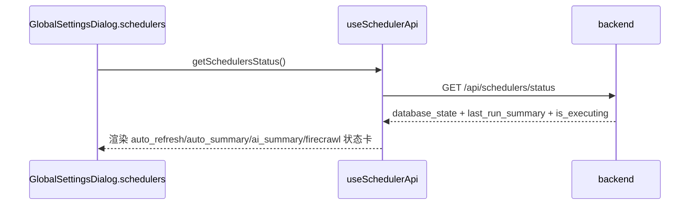

# 定时任务流程（Scheduler）

> 大功能：横切的调度器集合（feed 刷新、内容增强、AI 总结、Digest/叙事、标签、状态回传、手动 trigger）。
> 跨端。互补：`architecture/runtime.md` §Scheduler 状态、§优雅退出。

## 调度器清单

- feed 自动刷新
- Firecrawl / 内容补全处理
- AI 总结批量生成
- Digest 日报 / 周报生成
- 阅读偏好聚合任务
- 阻塞文章恢复
- 标签自动合并（源 DELETE，不再用 `status='merged'`）
- 标签质量分数重算
- 叙事摘要生成（SemanticBoard 派生）
- 叙事后处理（Board 连接派生、标签反馈、空 Board 清理）
- 辅助标签入库（随 tag extraction 同步）
- SemanticBoard 匹配（随 tag 入库后触发）
- 关注标签叙事维度总结
- 版块升级建议生成（discover_new，每日 06:30 固定时间点，松耦合不依赖日报，失败仅记日志；附 watch 观察池 GC）

> **自动发现**：调度器清单由 `scheduler.Registry` 自动发现——在 `app/runtime.go` 用 `registry.Register` 注册即自动出现在 `GET /api/schedulers/status` 与 `POST /api/schedulers/:name/trigger`，无需在 handler 维护第二份 descriptor 列表。展示顺序 = runtime 注册顺序。展示元数据（Description/TaskName/Aliases）随 `scheduler.Config` 走，经 `BaseScheduler.GetConfig()` 暴露。

## scheduler 状态回传



## 手动 trigger 链路

```text
GlobalSettingsDialog.schedulers tab
  → useSchedulerApi.triggerScheduler(name)
  → POST /api/schedulers/:name/trigger
  → backend 判断 accepted / started / reason / message
  → 前端显示真实反馈（不只看 HTTP 200）
  → 短周期轮询刷新最新状态
```

## `auto_refresh` 状态流

```text
auto_refresh scheduler
  → 扫描 refresh_interval > 0 的 feed
  → 判断是否到点
  → 标记 feed.refresh_status=refreshing
  → 异步调用 feedService.RefreshFeed()
  → 扫描数/到点数/触发数/已在刷新数 写回 scheduler_tasks.last_execution_result
```

## `auto_summary` 状态流

```text
auto_summary scheduler
  → 读取 AI 配置
  → 扫描 ai_summary_enabled=true 的 feed
  → 聚合近 time_range 内文章
  → 调 AI 生成 summary
  → feed数/生成数/跳过数/失败数 写回 scheduler_tasks.last_execution_result
  → 手动 trigger 时也走同一执行链路
```

## 代码入口

- 后端：`internal/admin/scheduler/`（base、各 scheduler wrapper）、`internal/app/`（runtime 装配）
- 前端：`front/app/features/settings/`（GlobalSettingsDialog）

## `auto_refresh` 状态位预埋（代码级细节）

feed 刷新不只是在“加文章”，还会把后续 Firecrawl / 内容补全链路需要的状态位一起种进去（`buildArticleFromEntry`）：

- 默认 `summary_status = complete`
- feed 开启 `firecrawl_enabled` → 文章先标记 `firecrawl_status = pending`
- 同时开启 `article_summary_enabled` → 再标记 `summary_status = incomplete`
- `cleanupOldArticles` 按 `max_articles` 清理旧文章（收藏文章跳过）

## 资料来源

迁自原 `architecture/data-flow.md`（定时任务链路 / scheduler 状态回传 / 手动 trigger / auto_refresh / auto_summary）。
