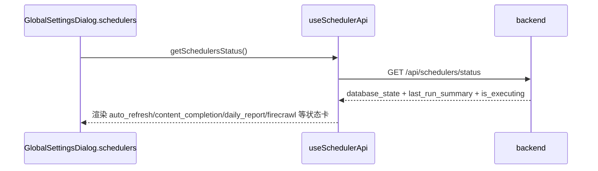

# 定时任务流程（Scheduler）

> 大功能：横切的调度器集合（feed 刷新、内容增强、AI 总结、Digest/叙事、标签、状态回传、手动 trigger）。
> 跨端。互补：`architecture/runtime.md` §Scheduler 状态、§优雅退出。

## 需求说明

Scheduler 解决「集中调度周期性后台任务」的问题。Syntopica 有大量无需用户干预的后台管线——feed 自动刷新、Firecrawl 全文抓取、内容补全（文章整理稿）、日报生成、标签质量分、阅读偏好聚合、版块升级建议、日志/辅助标签清理、生命线周/月/年刷新等。Scheduler 把这些任务统一为：

- **声明式注册**：在 `app/runtime.go` 用 `registry.Register` 注册即自动出现在状态接口与手动触发接口，无需在 handler 维护第二份清单。
- **状态可视化**：前端 GlobalSettings → Schedulers tab 实时显示每个 job 的 `database_state` + `last_run_summary` + `is_executing`，用户知道后台在忙什么。
- **手动触发**：用户可即时 trigger 任一 job（不必等定时点），后端返回真实的 accepted / started / reason 反馈，前端据实展示（不只看 HTTP 200）。

## 链路设计

### 调度器清单

调度器清单（按 `app/runtime.go` 注册顺序，共 14 个）：

| 注册名 | 中文名 | 触发 | 说明 |
| ------ | ------ | ------ | ------ |
| `log_cleanup` | 日志清理 | 86400s（启动延迟 5min） | 清理过期 `ai_call_logs` 与 `otel_spans` |
| `aux_label_cleanup` | 辅助标签清理 | 3600s（启动延迟 10min） | 清理无活跃 topic_tag 引用的辅助标签 |
| `blocked_article_recovery` | 阻塞文章恢复 | 3600s | 恢复卡在 blocked 状态的文章 |
| `preference_profile_update` | 偏好向量画像重算 | 3600s | 以 `reading_behaviors` 为权重源，按 SemanticBoard 聚合偏好向量（纯向量算术，零 LLM）；见 `flow/discovery.md` |
| `rsshub_catalog_sync` | RSSHub 路由目录同步 | 每日 | 拉取自建 RSSHub 实例 `/api/namespace`，content_hash diff 入库 + 参数标记 + 增量可用性校验 + 新路由 embedding；见 `flow/discovery.md` |
| `tag_quality_score` | 标签质量分重算 | 3600s | 重算 topic tags 的持久化质量分 |
| `auto_refresh` | Feed 自动刷新 | 60s | 刷新 `refresh_interval>0` 的 RSS feed，并种入后续链路状态位 |
| `content_completion` | 内容补全（别名 `ai_summary`） | 60s | 补全文章内容 + 生成文章级整理稿；持久化任务名/别名均为 `ai_summary` |
| `daily_report` | 日报生成 | 每日定时（TriggerNowWithDate 包装） | 为所有活跃版块生成日报（见 `flow/daily-report.md`） |
| `board_upgrade_suggest` | 版块升级建议 | 每日 06:30 固定点（松耦合） | discover_new 生成 + watch 观察池 GC，失败仅记日志 |
| `firecrawl` | Firecrawl 全文抓取 | 300s | 自动抓取文章全文 |
| `lifeline_weekly` | 生命线周度刷新 | 每周一 03:00（循环 A） | 刷新所有活跃话题的周度新闻汇总（含历史回填，见 `flow/data-enrichment.md`） |
| `lifeline_monthly` | 生命线月度刷新 | 每月1号 03:30（循环 A） | 月度新闻汇总（含历史回填） |
| `lifeline_yearly` | 生命线年度刷新 | 每年1月1号 04:00（循环 A） | 年度新闻汇总（含历史回填） |

> **已废弃 / 非调度器（旧清单误列，已删除）**：① 旧的独立 `auto_summary` 调度器 —— 已被 `content_completion`（兼容别名 `ai_summary`）取代；② 叙事摘要生成 / 叙事后处理 / 关注标签叙事维度总结 —— narrative 生成管线已废弃，生成能力并入日报（`daily_report`），watch 走日报的 `EvaluateWatchHits`，均非独立调度器；③ 标签自动合并 —— 改走 `merge-preview` 的 scan/evaluate SSE API（见 `flow/semantic-board.md`），非调度任务；④ SemanticBoard 匹配 —— tag 入库时同步触发（`semantic_board_matching.go`），非调度任务。

> **自动发现**：调度器清单由 `scheduler.Registry` 自动发现——在 `app/runtime.go` 用 `registry.Register` 注册即自动出现在 `GET /api/schedulers/status` 与 `POST /api/schedulers/:name/trigger`，无需在 handler 维护第二份 descriptor 列表。展示顺序 = runtime 注册顺序。展示元数据（Description/TaskName/Aliases）随 `scheduler.Config` 走，经 `BaseScheduler.GetConfig()` 暴露。

### scheduler 状态回传



### 手动 trigger 链路

```text
GlobalSettingsDialog.schedulers tab
  → useSchedulerApi.triggerScheduler(name)
  → POST /api/schedulers/:name/trigger
  → backend 判断 accepted / started / reason / message
  → 前端显示真实反馈（不只看 HTTP 200）
  → 短周期轮询刷新最新状态
```

### `auto_refresh` 状态流

```text
auto_refresh scheduler
  → 扫描 refresh_interval > 0 的 feed
  → 判断是否到点
  → 标记 feed.refresh_status=refreshing
  → 异步调用 feedService.RefreshFeed()
  → 扫描数/到点数/触发数/已在刷新数 写回 scheduler_tasks.last_execution_result
```

`auto_refresh` 状态位预埋（代码级细节）：feed 刷新不只是在「加文章」，还会把后续 Firecrawl / 内容补全链路需要的状态位一起种进去（`buildArticleFromEntry`）：

- 默认 `summary_status = complete`
- feed 开启 `firecrawl_enabled` → 文章先标记 `firecrawl_status = pending`
- 同时开启 `article_summary_enabled` → 再标记 `summary_status = incomplete`
- `cleanupOldArticles` 按 `max_articles` 清理旧文章（收藏文章跳过）

### `auto_summary` → 已并入 `content_completion`

历史上独立的 `auto_summary` 调度器（扫描 `ai_summary_enabled=true` 的 feed 聚合生成 summary）**已不存在**。其能力由 `content_completion` 调度器（兼容别名 `ai_summary`，TaskName 同为 `ai_summary`）承接——补全文章内容并生成文章级整理稿（见 `flow/content-enrichment.md`）。前端/历史文档若仍出现 `ai_summary` 名称，指的即是 `content_completion`。

## 业务约束与不变量

> 本节是 `doc-impact.sh context` 的数据源：apply 改 `internal/admin/` 代码前会自动 dump 给 agent，必须遵守。

1. **自动发现，单一事实源**：调度器清单由 `scheduler.Registry` 自动发现——`registry.Register` 注册即出现在 `GET /api/schedulers/status` 与 `POST /api/schedulers/:name/trigger`。**禁止在 handler 维护第二份 descriptor 列表**（展示顺序 = runtime 注册顺序，重复维护会漂移）。
2. **TriggerNow 互斥**：`BaseScheduler.TriggerNow` 用 `isExecuting` 标志做重入保护——job 正在执行时再触发返回 `status_code=409` + `accepted=false`，**不并发执行同一 job**。
3. **trigger 结果看 accepted，不只看 HTTP 200**：`respondTriggerResult` 按 `result["accepted"]` 决定 `success:true|false`；即便 HTTP 200，`accepted=false` 也要前端据 reason / message 实反馈。HTTP 409（执行中）/ 500（执行出错）按 status_code 透传。
4. **job 失败隔离**：单个 job 执行失败默认标记 task failed；但**松耦合 job（如 board_upgrade_suggest、preference_profile_update、rsshub_catalog_sync）刻意吞掉 error 返回 nil**，仅记日志，不阻塞同轮兄弟 job（design D4）。`rsshub_catalog_sync` 实例不可达时仅记日志保留旧目录，推荐继续用存量目录。
5. **auto_refresh 过滤条件**：只扫描 `refresh_interval > 0` 的 feed；触发后先标 `feed.refresh_status=refreshing` 防止重复触发，再异步 `RefreshFeed`。
6. **状态位预埋不可漏**：`auto_refresh` 刷新文章时必须按 feed 开关（`firecrawl_enabled` / `article_summary_enabled`）种入 `firecrawl_status` / `summary_status` 初始位，否则后续 Firecrawl / 内容补全链路会漏处理。

## 代码入口

- **后端调度框架**：`backend-go/internal/admin/scheduler/`（`base.go` BaseScheduler + `TriggerNow` 互斥 + `is_executing` 状态、`registry.go` 自动发现注册、`persistence.go` scheduler_tasks 持久化、`job_*.go` 各 job wrapper：`job_auto_refresh` / `job_firecrawl` / `job_content_completion` / `job_daily_report` / `job_tag_quality_score` / `job_board_upgrade_suggest` / `job_aux_label_cleanup` / `job_blocked_article_recovery` / `job_preference_profile_update` / `job_rsshub_catalog_sync` / `job_log_cleanup`）；生命线三 job（`lifeline_weekly`/`monthly`/`yearly`）的 JobFunc 由 `dataenrichment` 包提供，在 `runtime.go` 内联注册（无独立 `job_*.go` wrapper）。旧 `job_preference_update`（阅读偏好分数聚合）已删除（见 `flow/discovery.md`）。
- **后端装配**：`backend-go/internal/app/runtime.go`（`registry.Register` 注册所有 scheduler、优雅退出 `Stop`）。
- **后端 handler**：`backend-go/internal/admin/handler/scheduler_handler.go`（status / trigger / reset stats，`respondTriggerResult` 透传 `accepted` + `status_code`）。
- **前端**：`front/app/pages/settings.vue` + `front/app/features/settings/components/SettingsSectionSchedulers.vue`（新版设置工作台 Schedulers section）、`front/app/components/dialog/GlobalSettingsDialog.vue`（旧版 Schedulers tab，与 settings 页并存）、`front/app/components/dialog/SchedulerStatusPanel.vue`（状态卡）、`front/app/composables/useSchedulerStatus.ts`（状态轮询 + trigger）、`front/app/api/scheduler.ts`。

## 变更溯源

| 日期 | 变更 | 摘要 | 归档位置 |
|------|------|------|----------|
| 2026-05-10 | global-settings-feed-controls | Feed 卡片新增 Firecrawl / 打标签 / 内容补全 3 个管线 toggle；后端 `tagging_enabled` 字段控制是否入 tag 队列；max_articles「无限制」上限修正 | [`openspec/changes/archive/2026-05-10-global-settings-feed-controls`](../../../openspec/changes/archive/2026-05-10-global-settings-feed-controls) |
| 2026-07-23 | board-discovery-expansion | 新增定时 job `job_board_upgrade_suggest`（默认每天 06:30 自动以 discover_new 模式生成升级建议入 `board_upgrade_suggestions` 表，HH:MM 可配） | [`openspec/changes/archive/2026-07-23-board-discovery-expansion`](../../../openspec/changes/archive/2026-07-23-board-discovery-expansion) |
| 2026-07-25 | preference-vector-feed-discovery | 删 `preference_update`（旧偏好分数聚合，1800s），新增 `preference_profile_update`（偏好向量画像重算，3600s，纯向量算术零 LLM）+ `rsshub_catalog_sync`（RSSHub 路由目录同步，每日，含可用性校验与路由 embedding）；两 job 均松耦合失败不阻塞兄弟 job | [`openspec/changes/archive/2026-07-25-preference-vector-feed-discovery`](../../../openspec/changes/archive/2026-07-25-preference-vector-feed-discovery) |
