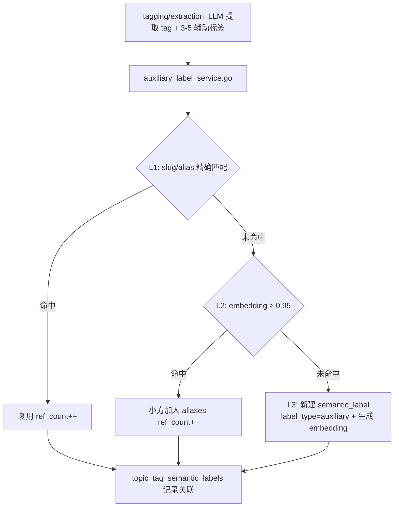
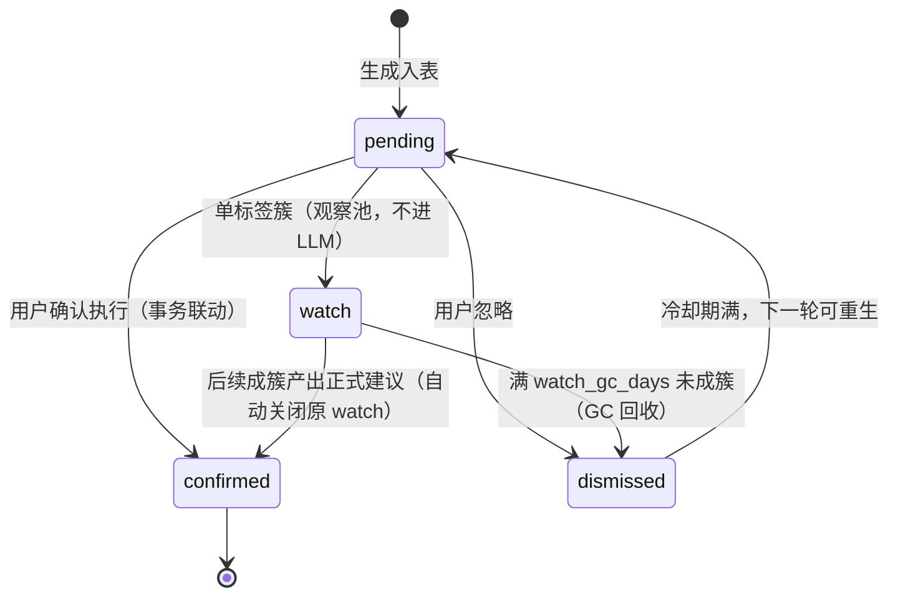
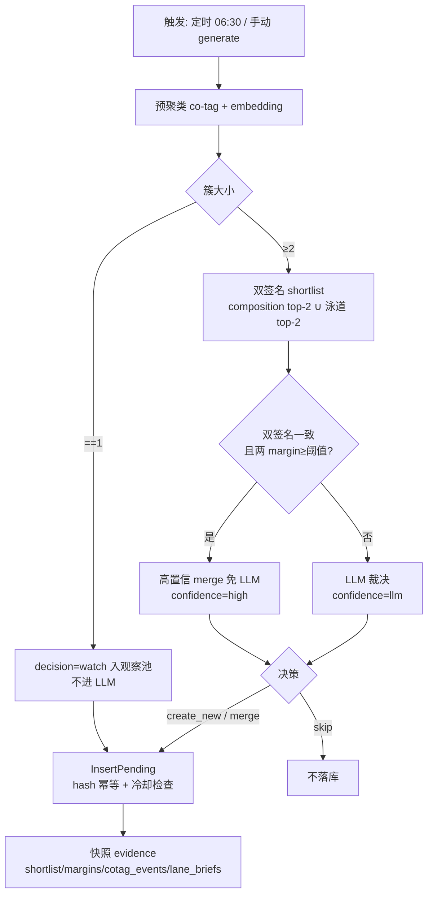
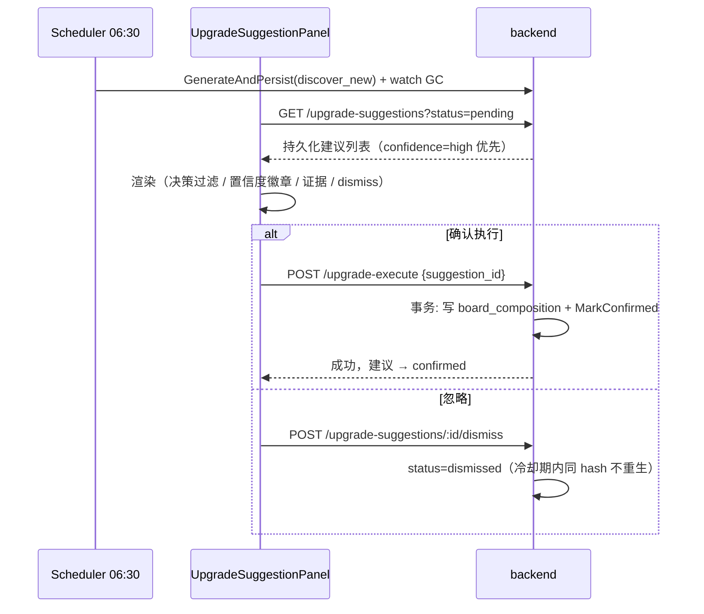

# 语义版块流程（Semantic Board）

<!-- doc-impact-applies: backend-go/internal/tagmanagement/, backend-go/internal/topicgraph/ | section=业务约束与不变量 -->
> 大功能：辅助标签入库、SemanticBoard 匹配/升级/回填、叙事面板。
> 跨端。互补：`flow/daily-report.md`、`flow/topic-graph.md`。

## 需求说明

SemanticBoard（语义版块）解决「把散装 event 标签组织成持久主题分区」的问题。event 标签每天产生数十上百个，用户无法在平铺列表里快速定位关心的领域。语义版块提供类似 BBS 论坛的持久概念板块（「AI 前沿」/「新能源」/「中美竞争」），让用户：

- **按板块浏览**：每个 section 通过辅助标签挂载到 1-3 个板块，形成折叠/钻取的分区阅读体验。
- **标签去重入库**：LLM 提取的辅助标签经 L1/L2/L3 三级去重，避免近义标签碎片化。
- **板块自演进**：升级建议（board upgrade suggestion）发现新涌现的标签簇，建议用户新建板块或合并到已有板块，让板块结构随话题演化而生长——单标签簇入观察池等成簇，双签名算法 + 定时生成，用户确认执行或忽略。

## 链路设计

### 辅助标签入库（L1/L2/L3）



> **L2 不会形成「合并黑洞」**：与主标签路径不同（`findOrCreateTag` 的 embedding 命中曾覆盖 label/slug → text_hash 变 → 重生成 embedding → 恶性循环，见 `v1.3.1/fix-tag-blackhole-embedding-match`），aux 的 L2 命中只 `addAlias`（append alias + ref_count++），**不改 Label、不重算 MergeEmbedding**（MergeEmbedding 仅 L3 新建时生成一次，之后恒定）。既有 aux 的「吸引力」= 固定 embedding 的 cosine，不随 alias 增多 / ref_count 升高而自我放大，无循环根因。阈值 `auxiliary_label_dedupe_sim` 可配（默认 0.95）。

### SemanticBoard 匹配

```text
semantic_board_matching.go
  → 读取 tag 辅助标签 + active Board composition
  → 直接命中 / 命中率 / max_sim / 加权综合（三规则）
  → 写入 topic_tag_board_labels（最多 3 个 Board）
```

### 升级建议生命周期

> **board-discovery-expansion 变更**：建议从「即算即弃的手动 LLM 调用」升级为「持久化生命周期 + 双签名算法 + 观察池 + 定时生成」。旧 `POST upgrade-suggest` 路由保留兼容期。

#### 变更影响概览

| 维度 | 变更前 | 变更后 |
| ------ | -------- | -------- |
| 存储 | 无持久化，LLM 结果直返前端 | `board_upgrade_suggestions` 表持久化（suggestion_hash 幂等） |
| 触发 | 仅手动 | 定时 06:30 + 手动（走同一生成逻辑，等效） |
| 算法 | 单一 LLM 裁决 | 双签名 shortlist + 高置信免 LLM + 泳道证据快照 |
| 单标签簇 | 直接 skip | 入观察池（decision=watch），后续成簇再裁决 |
| 用户操作 | 确认执行 | 确认执行 / 忽略 dismiss（冷却期防重现）/ 观察池自动 GC |
| API | `upgrade-suggest`（即时） | `upgrade-suggestions` 资源（列表/dismiss/generate）+ `upgrade-execute` 带 suggestion_id 联动 |

#### 建议状态机



> watch 不出现在默认建议列表（默认 status=pending 且 decision≠watch），前端有独立「观察池」过滤入口。

#### 生成链路（discover_new 模式）



#### 触发方式（两条等效路径）

- **定时**：scheduler `job_board_upgrade_suggest`，默认每日 06:30（`semantic_board_upgrade_suggest_time` 可配），仅 discover_new，失败仅记日志不阻塞兄弟 job；每轮附 watch GC。
- **手动**：前端「生成建议」→ `POST /api/semantic-boards/upgrade-suggestions/generate` → 同一 `GenerateAndPersist`，返回 `{inserted, skipped, cooldown_blocked}`。

#### 跨端协作



#### 前端面板分区（UpgradeSuggestionPanel）

- **持久化建议区（主）**：读 `GET /upgrade-suggestions`，决策过滤 tab（全部 / 合并 / 新建 / 观察池）+ 高置信徽章 + evidence 展示（泳道标题 / 共现事件，缺 key 降级不渲染）+ 确认执行（带 suggestion_id）/ dismiss。merge 建议 target 超出算法 shortlist 时 evidence 带 `target_off_shortlist=true`（方案 B：算法对新簇视野窄于 LLM，保留建议 + 标注让用户重点裁决，不再静默丢弃）。
- **手动探索区（保留）**：原 candidates/clusters + 手动 LLM 建议 + 「合并到...」下拉，数据源独立（内存态），与持久化区互不干扰。

#### 配置项（ai_settings，均可缺省）

| key | 默认 | 说明 |
| ----- | ------ | ------ |
| `semantic_board_upgrade_suggest_time` | `06:30` | 定时生成触发时间点 |
| `semantic_board_upgrade_watch_gc_days` | `30` | 观察池 watch 自动回收天数 |
| `semantic_board_upgrade_suggestion_dismiss_cooldown_days` | `14` | dismissed 冷却期（期内同 hash 不重生） |
| `semantic_board_upgrade_merge_confidence_margin` | — | 高置信 merge 的双签名 margin 阈值 |

### SemanticBoard 管理 / 回填

```text
SemanticBoard 管理面板
  → 辅助标签入库: L1 slug匹配 → L2 embedding合并 → L3 新建
  → SemanticBoard 匹配: 三规则挂载 → topic_tag_board_labels
  → 升级建议: 见上「升级建议生命周期」（持久化 + 双签名 + 观察池 + 定时生成）
  → 辅助标签治理: 禁用、alias合并、composition移除、suggest-auxiliaries、clusters、gc
  → 回填: all / unassigned / board 三种模式 + backfill-embeddings + rematch-all
```

#### 板块运维端点（`board_crud_handler.go` / `board_match_handler.go` / `board_upgrade_handler.go`）

| 端点 | 业务用途 |
| ---- | -------- |
| `POST /api/semantic-boards/backfill` | 入队一个 backfill job（`SemanticBoardBackfillRequest`，all/unassigned/board 三模式），返回 job 对象 |
| `GET /api/semantic-boards/backfill/:id` | 查询 backfill job 状态/进度（前端 `BackfillProgress.vue` 轮询） |
| `POST /api/semantic-boards/backfill-embeddings` | 为 `embedding IS NULL` 的板块生成 embedding（一次性补齐；`board-direction-check` 引入板块向量后的回填入口） |
| `POST /api/semantic-boards/rematch-all` | 取所有已挂载 `topic_tag`，逐个重跑 `MatchTopicTag`，返回 `{success, failed, total}`（匹配阈值调整后全量重算） |
| `GET/PUT /api/semantic-boards/matching-config` | 读/写匹配阈值（`ai_settings` 中 13 个 `semantic_board_match_*` key；PUT 后调 `InvalidateMatchingConfigCache` 失效缓存）。前端 `MatchingConfigDialog.vue` |

#### 辅助标签治理与建议（`board_crud_handler.go` + `service/auxlabel/`）

| 端点 | 业务用途 |
| ---- | -------- |
| `GET /api/semantic-boards/suggest-auxiliaries?label=&description=` | 全局建议：embed 查询文本 → 与 active aux cosine 排序，分页返回候选 |
| `GET /api/semantic-boards/:id/suggest-auxiliaries` | 板块级建议：以板块 `label+description` 为查询，排除已在该板块 composition 里的 aux |
| `GET /api/auxiliary-labels/clusters` | 聚类：cosine 距离 < 0.2 的连通分量（size≥2），10 分钟缓存，`?refresh=true` 强制重算 |
| `POST /api/auxiliary-labels/gc` | GC 回收，`mode` ∈ `dry_run/disable/delete/recalculate`，可选 `grace_days` |
| `POST /api/auxiliary-labels/merge-alias` | alias 合并（source→target） |
| `POST /api/auxiliary-labels/:id/disable` | 禁用单个 aux |
| `GET/POST /api/semantic-boards/:id/composition`、`DELETE /:id/composition/:aux` | 板块 composition 增删查 |

前端治理 UI（`features/tags/components/`）：`AuxiliaryLabelPool.vue`（辅助标签池）、`AuxiliaryLabelPicker.vue`（选择器）、`BoardCompositionPanel.vue`（板块 composition 管理）、`composables/useAuxiliaryLabels.ts`。

### 话题态势版图（board-topic-landscape）

板块内容 tab 首屏（`BoardCompositionPanel` 构成标签管理区下方）的态势总览，回答「板块里各持久话题处在什么阶段」——分区卡片墙 + 活力顶栏 + 话题节奏总览气泡图，卡片 click 跳话题总览 tab 深挖。接口契约见 `docs/reference/api/daily-reports.md` §`GET /semantic-boards/:id/topic-landscape`。

可视化自 `revamp-landscape-charts` 起统一为 ECharts（option 构建见 `chart-options.ts`）：

- **话题节奏总览气泡图**（`TopicRhythmChart.vue`）：一张图聚合全部话题近 N 日命中节奏，成为节奏信息的主载体——x=日期、y=话题（按态势分组序 + hit_count 排序）、气泡大小∝当日命中数、颜色=态势（legend 可过滤，archived 默认隐藏）、y 轴 dataZoom 滚轮/滑块缩放，点击气泡跳「话题总览」聚焦该话题。
- **话题卡片节奏图**（`MiniLifelineChart.vue`）：`active`/`stalled`/`pending`/`archived` 卡片内嵌 ECharts 迷你柱状图（柱高=当日命中数，空日 0 高占位保持日期轴连续，hover tooltip 显示「日期：N 节」）；`emerging`（新冒头）卡片命中 1-2 次信息量低，**不再渲染节奏图**，节奏信息由总览气泡图承载。
- **活力顶栏**（`VitalityBar.vue`）：近 N 日 section 数折线由手写 SVG polyline 改为 ECharts 面积图（轻量坐标轴 + tooltip），指标数字行不变。

- **核心约束**：态势只读 identity 轨字段派生（`status` / `hit_count` / `consecutive_hits` / `last_seen_date` / `is_vacuum`），**禁用 similarity 轨**（匈牙利二分法 section↔section 五态长跨度不可靠）。
- **态势派生**（主态势互斥，按序匹配第一个命中；N=7 天，包级常量 `topicLandscapeActiveWindowDays`）：

| 态势 | 图标 | 派生规则 |
| ---- | ---- | -------- |
| emerging | 🌱 | `status='candidate' AND 1 <= hit_count < upgrade_threshold`（hit=0 纯 orphan 不展示） |
| pending | 🔴 | `status='candidate' AND hit_count >= upgrade_threshold`（即 `CanActivate=true`） |
| active | 🟢 | `status='active' AND consecutive_hits > 0 AND days_since(last_seen_date) <= N` |
| stalled | ⏸️ | `status='active' AND (consecutive_hits = 0 OR days_since(last_seen_date) > N)` |
| archived | ⬛ | `status='archived'` |

  🌀 强吸引（`is_vacuum=true`）为与主态势正交的叠加标记，可叠加在活跃/停滞上（卡片角标附 `vacuum_strong` 数值）。
- **可见口径**：保留 `hit_count>=1` 全部（含 emerging 新苗头），仅剔 `hit=0` 纯 orphan——与话题管理 UI 的 `FilterVisibleTopics` 口径故意不同。
- **代码入口**：后端 `backend-go/internal/topicgraph/repository/topic_landscape_repository.go`（`GetBoardTopicLandscape` / `deriveTopicStance` / `filterLandscapeVisible`）、handler `getBoardTopicLandscape`（`backend-go/internal/topicgraph/handler/daily_report_handler.go`，`RegisterDailyReportRoutes` 同组）；前端 `front/app/features/tags/components/topic-landscape/`（`TopicLandscapePanel.vue` / `VitalityBar.vue` / `StanceCardWall.vue` / `TopicStanceCard.vue` / `TopicRhythmChart.vue` / `MiniLifelineChart.vue` / `useEcharts.ts` / `chart-options.ts`，挂载于 `BoardCompositionPanel.vue`）。

> 变更溯源见本文件 [§变更溯源](#变更溯源)。

### 标签级 watched tags（区别于话题级 topic-watch）

用户可在标签管理里关注（watch）任意标签，用于按标签筛选文章/日报。这与 `flow/daily-report.md` / `flow/topic-graph.md` 的**话题级** topic-watch（watch 持久话题 → 日报评估命中）是两套独立机制：一个 watch 的是**标签**，一个 watch 的是**持久话题**。

路由（`tagmanagement/handler/watched_tags_handler.go` + `service/watched/watched_tags_service.go`，挂在 `/api/topic-tags` 下）：

| 端点 | 语义 |
| ---- | ---- |
| `GET /api/topic-tags/watched` | 列出所有 `is_watched && status=active` 的标签，附 abstract 元信息（`is_abstract` + `child_slugs`，查 `topic_tag_relations`） |
| `POST /api/topic-tags/:tag_id/watch` | 标记 `is_watched=true`、`watched_at=now` |
| `POST /api/topic-tags/:tag_id/unwatch` | 取消关注（`is_watched=false`、`watched_at=NULL`） |

`GetWatchedTagIDsExpanded` 递归展开被关注标签（含抽象标签）的全部子标签 ID，供下游按 watched 标签集合做文章/日报筛选时使用。前端：`api/watchedTags.ts`。

### 标签合并预览（merge-preview，流式扫描/评估）

> 该工作流替代了已废弃的「标签自动合并 scheduler」（见 `flow/scheduler.md`，旧 scheduler 已不存在）。合并不再由定时任务自动执行，而是由用户驱动的 scan → evaluate → 分组 → dismiss/merge 流水线完成。

路由（`tagmanagement/handler/tag_merge_preview_handler.go` + `service/merge/` + `service/core/`，挂在 `/api/topic-tags` 下）：

| 端点 | 语义 |
| ---- | ---- |
| `POST /api/topic-tags/merge-preview/scan` | 启动异步全量扫描（`StartFullScan` 单例锁，已在跑返回 409） |
| `GET /api/topic-tags/merge-preview/scan/stream` | SSE 流式推送扫描进度 |
| `POST /api/topic-tags/merge-preview/evaluate` | 启动异步 LLM 评估（`StartEvaluation`，对候选对逐个裁决） |
| `GET /api/topic-tags/merge-preview/evaluate/stream` | SSE 流式推送评估进度 |
| `GET /api/topic-tags/merge-preview` | 读 pending 的 `TagMergeSuggestion`，过滤 `should_merge=false`，按目标标签分组返回 |
| `GET /api/topic-tags/merge-preview/status` | 返回 scan/eval 是否在跑 |
| `POST /api/topic-tags/merge-preview/add-to-group` | 手动把标签加入某合并组（`source=manual`，`OnConflict DoNothing`） |
| `POST /api/topic-tags/merge-preview/dismiss` | 标记候选对 `status=dismissed` |
| `POST /api/topic-tags/merge-with-name` | 真正执行硬合并：事务内 `FOR UPDATE` 锁两端 → 可选 rename + slug 冲突检测 → `HardMergeTags` → 提交后 `EnqueueMergeReembedding` 入重算队列 → 相关 suggestion 标 `merged` |

工作流：**scan**（全量扫描候选对，SSE 进度）→ **evaluate**（LLM 评估每对，SSE 进度）→ **merge-preview** 列表（按 target 分组）→ 用户对每组 **dismiss** / **add-to-group** / **merge-with-name**。合并后源标签的文章/关系迁移到目标标签，并触发 `merge-reembedding` 队列重算 embedding（见下「队列与回填运维」）。

前端（`features/tags/components/`）：`TagMergePreview.vue`、`TagMergeGroup.vue`、`composables/useTagMergePreview.ts`、`api/tagMergePreview.ts`。后端 service：`service/merge/tag_merge_suggest.go`、`service/core/merge_suggestions.go`、`service/core/hard_merge.go`、`service/core/merge_reembedding_queue.go`。

### 叙事面板数据流

```text
NarrativePanel（叙事面板）【已下线】
  原 NarrativePanel 调用的 /api/narratives/*（boards/timeline、scopes、list、regenerate）
  路由已全部移除，narrative 生成管线已废弃（生成能力并入 daily_report 日报）。
  narrative_summaries / narrative_boards 表仅保留只读历史，经
  GET /api/semantic-boards/:id/narratives（getBoardNarratives）读取；
  前端现以日报（BoardDailyReportTimeline 等）承载该视图。

SemanticBoardPanel
  → loadBoards() → GET /api/semantic-boards
  → viewBoard(id) → GET /api/semantic-boards/:id
  → viewComposition(id) → GET /api/semantic-boards/:id/composition
  → viewUpgradeCandidates() → GET /api/semantic-boards/upgrade-candidate
  → upgradeSuggest() → POST /api/semantic-boards/upgrade-suggest（旧，兼容期）
  → getUpgradeSuggestions() → GET /api/semantic-boards/upgrade-suggestions（持久化列表）
  → generateUpgradeSuggestions() → POST /api/semantic-boards/upgrade-suggestions/generate
  → dismissUpgradeSuggestion(id) → POST /api/semantic-boards/upgrade-suggestions/:id/dismiss
  → upgradeExecute(suggestion_id) → POST /api/semantic-boards/upgrade-execute（联动 confirmed）
  → backfill() → POST /api/semantic-boards/backfill
```

### Event 标签延迟 embedding

```text
Event 标签延迟 embedding: 描述+关键词生成后入队
  → 多行 embedding (semantic + event_keyword)
```

Event 类标签不随入库立即向量化，而是等描述与关键词生成后才入队，产出 semantic 与 event_keyword 两路 embedding。

## 业务约束与不变量

> 本节是 constraint-injection extension 的注入数据源：apply 改 `internal/tagmanagement/` 或 `internal/topicgraph/` 代码前会自动注入 system prompt，必须遵守。

1. **辅助标签三级去重（L1/L2/L3）**：L1 slug/alias 精确匹配复用（`ref_count++`）；L2 embedding ≥ `auxiliary_label_dedupe_sim`（默认 0.95）命中只 `addAlias`（append alias + `ref_count++`）；L3 未命中才新建 `label_type=auxiliary` 的 `semantic_label`。
2. **L2 不形成合并黑洞**：aux 的 L2 命中**只 `addAlias`，不改 Label、不重算 MergeEmbedding**。`MergeEmbedding` 仅 L3 新建时生成一次，之后恒定——既有 aux 的「吸引力」= 固定 embedding 的 cosine，不随 alias 增多 / ref_count 升高自我放大。（对照主标签 `findOrCreateTag` 的 embedding 黑洞教训。）
3. **SemanticBoard 匹配四规则 + 上限**：按 direct_hit → hit_rate → max_sim → weighted 顺序判定（`semantic_board_matching.go`），单 tag 最多挂载 `MaxBoards`（默认 3）个板块写入 `topic_tag_board_labels`。
4. **方向性校验**：除 direct_hit 外所有匹配规则命中后，校验 tag identity embedding 与 board embedding 的 cosine；低于阈值标 `direction_mismatch=true`——**仍记录但不计入日报、前端默认隐藏**。（`board-direction-check` 引入。）
5. **max_sim 双因子约束**：max_sim ≥ 0.8 直接挂载需同时满足 `hits ≥ min(2, N)` 且 `hit_rate ≥ 0.3`，防止单标签高相似度跨域误匹配。（`board-interaction-overhaul` 引入。）
6. **升级建议 suggestion_hash 幂等**：`ComputeSuggestionHash(mode, decision, targetBoardID, auxIDs)` 为 32-hex 指纹；同 hash 已有 pending 行则 `skipped`（幂等 no-op），不重复入库。
7. **dismissed 冷却期防重现**：被 dismiss 的建议在 `semantic_board_upgrade_suggestion_dismiss_cooldown_days`（默认 14 天）内，同 hash 下一轮生成被 `CountDismissedInCooldown` 拦截（`cooldown_blocked`），期满才可重生。
8. **watch 观察池 GC**：单标签簇（decision=watch）不进 LLM，入观察池等成簇；满 `semantic_board_upgrade_watch_gc_days`（默认 30 天）未成簇由 `GCOldWatch` 回收（每轮生成附跑）。
9. **upgrade-execute 事务联动**：确认执行在同一事务内写 `board_composition` + `MarkConfirmed(suggestion_id)`，建议 → confirmed；`board_composition` 写失败则整体回滚，不留半状态。
10. **定时生成失败不阻塞兄弟 job**：`job_board_upgrade_suggest` 生成失败仅记日志，返回 nil error（不标 task failed），不阻塞同轮其它 scheduler job（design D4）。
11. **禁用即弃向量（2026-08-20 起）**：任何将 `semantic_labels.status` 置为 `disabled` 的路径（API 删除 board、`DisableAuxiliaryLabel`、alias 合并源标记、GC disable 模式、更新接口）MUST 同事务同步置 `embedding=NULL, merge_embedding=NULL`（行本体与 aliases 保留）；重新启用由 backfill / llm_extract 重算。存量 disabled 向量已一次性清理。
12. **tag 删除的向量级联（2026-08-20 起）**：`topic_tag_embeddings.topic_tag_id` 有 DB 层 `FK ON DELETE CASCADE`（迁移 `20260820_0001`）——删 `topic_tags` 行时向量自动级联删除。历史孤儿（GORM 声明 CASCADE 但 DB 无约束期间残留的 25.6 万行）已清理；`hard_merge` 等显式删 embedding 的代码路径保持不变（幂等）。

## 代码入口

- **后端辅助标签**：`backend-go/internal/tagmanagement/service/auxlabel/`（`auxiliary_label_service.go` L1/L2/L3 去重、`addAlias`、alias 合并、composition 移除、禁用）。
- **后端板块匹配 / 升级 / 回填**：`backend-go/internal/tagmanagement/service/board/`（`semantic_board_matching.go` 四规则 + 方向校验、`semantic_board_upgrade.go` 升级算法 + `MarkConfirmed` 事务联动、`board_upgrade_suggestion_persist.go` `ComputeSuggestionHash` 幂等 + `CountDismissedInCooldown` 冷却、`semantic_board_backfill.go` all/unassigned/board 三模式回填）。
- **后端板块 handler**：`backend-go/internal/tagmanagement/handler/`（`board_crud_handler.go` 板块 CRUD/运维端点/suggest-auxiliaries/clusters/gc、`board_match_handler.go` 匹配/rematch-all/matching-config、`board_upgrade_handler.go` 升级建议资源/backfill job、`tag_management_handler.go`）。
- **后端标签关注 / 合并预览 / 队列 handler**：同目录下 `watched_tags_handler.go`（标签级 watched tags）、`tag_merge_preview_handler.go`（scan/evaluate SSE + dismiss/merge-with-name）、`tag_queue_handler.go`、`embedding_queue_handler.go`、`merge_reembedding_queue_handler.go`（见下「队列与回填运维」）。
- **后端 watched/merge service**：`service/watched/watched_tags_service.go`、`service/merge/tag_merge_suggest.go`、`service/core/{merge_suggestions,hard_merge,merge_reembedding_queue,person_metadata_backfill}.go`。
- **后端板块调度**：`backend-go/internal/admin/scheduler/job_board_upgrade_suggest.go`（定时 06:30 + watch GC）。
- **后端时间线 / 叙事面板**：`backend-go/internal/topicgraph/`（`service/daily_report_*.go` 板块时间线、`handler/`）。
- **前端**：`front/app/features/tags/components/UpgradeSuggestionPanel.vue`（升级建议面板）、`front/app/features/tags/components/TagsPage.vue`、`front/app/features/tags/composables/useTagsPage.ts`（SemanticBoardPanel / NarrativePanel）。

## 队列与回填运维

> settings 页 Queues section（`features/settings/components/SettingsSectionQueues.vue`）直接暴露下列三个队列给用户查看状态与 retry。

| 队列 / 回填 | 路由组 | 用途 |
| ----------- | ------ | ---- |
| tag-queue | `/api/tag-queue/{status,tasks,retry,retag-today}` | 文章打标签任务队列（`TagJob`）。`retag-today` 把今日文章批量重新入队（`force_retag=true`）；对应 `flow/reading.md` 的打标签时机。前端 `features/settings/components/TagQueuePanel.vue` |
| embedding/queue | `/api/embedding/queue/{status,tasks,retry}` | 标签/板块 embedding 生成队列（`EmbeddingQueueService`）。前端 `features/ai/components/EmbeddingQueuePanel.vue` |
| embedding/merge-reembedding | `/api/embedding/merge-reembedding/{status,tasks,retry}` | 标签合并后重算 embedding 的独立队列；`merge-with-name` 提交后由 `EnqueueMergeReembedding` 入队（`MergeReembeddingQueueService`） |
| person-metadata 回填 | `POST /api/embedding/queue/person-metadata/backfill` | 人物标签元数据回填（`service/core/person_metadata_backfill.go` 的 `BackfillPersonMetadata`） |

handler 出处：`tagmanagement/handler/{tag_queue,embedding_queue,merge_reembedding_queue}_handler.go`。

## 变更溯源

| 日期 | 变更 | 摘要 | 归档位置 |
| ------ | ------ | ------ | ---------- |
| 2026-08-22 | analysis-remediation | 存储清理两不变量落地：disabled 标签向量置 NULL（四条禁用路径同步置 NULL，重启用由 llm_extract 重算）+ `topic_tag_embeddings` 孤儿一次性清理并加 DB 层 `FK ON DELETE CASCADE`（迁移 `20260820_0001`，与 GORM 声明对齐） | [`openspec/changes/archive/2026-08-22-analysis-remediation`](../../../openspec/changes/archive/2026-08-22-analysis-remediation) |
| 2026-08-02 | revamp-landscape-charts | 话题态势版图可视化改 ECharts：新增「话题节奏总览」气泡图（聚合全部话题节奏成主载体）；卡片节奏条改 ECharts 迷你柱图（柱高=数值），emerging 卡片去图；活力折线改面积图；引入 echarts 模块化按需引入 + `useEcharts` 封装 | [`openspec/changes/archive/2026-08-02-revamp-landscape-charts`](../../../openspec/changes/archive/2026-08-02-revamp-landscape-charts) |
| 2026-08-01 | board-topic-landscape | 板块内容 tab 首屏「话题态势版图」：identity 轨态势派生（🌱emerging/🔴pending/🟢active/⏸️stalled/⬛archived + 🌀强吸引叠加）+ 分区卡片墙 + mini-lifeline + 活力顶栏；新增 `GET /semantic-boards/:id/topic-landscape` 聚合接口；禁 similarity 轨五态，可见口径保留 hit≥1（含 emerging 新苗头） | [`openspec/changes/archive/2026-08-01-board-topic-landscape`](../../../openspec/changes/archive/2026-08-01-board-topic-landscape) |
| 2026-07-23 | board-discovery-expansion | 升级建议持久化生命周期 + 双签名算法 + 观察池 watch + 定时 06:30 生成；`board_upgrade_suggestions` 表（suggestion_hash 幂等）；dismiss 冷却期 + watch GC；旧 upgrade-suggest 保留兼容期 | [`openspec/changes/archive/2026-07-23-board-discovery-expansion`](../../../openspec/changes/archive/2026-07-23-board-discovery-expansion) |
| 2026-05-29 | matching-quality-and-daily-report-redesign | hit_rate/weighted 加方向校验；文章按匹配质量排序；日报展示精简 | [`openspec/changes/archive/2026-05-29-matching-quality-and-daily-report-redesign`](../../../openspec/changes/archive/2026-05-29-matching-quality-and-daily-report-redesign) |
| 2026-05-29 | board-direction-check-and-board-editing | max_sim 方向性校验（direction_mismatch）；板块 embedding 生成 + 一次性 backfill；前端板块编辑 | [`openspec/changes/archive/2026-05-29-board-direction-check-and-board-editing`](../../../openspec/changes/archive/2026-05-29-board-direction-check-and-board-editing) |
| 2026-05-26 | board-interaction-overhaul | max_sim 双因子约束（hits ≥ min(2,N) + hit_rate ≥ 0.3）；升级建议 DTO 增强（label 替代 #id） | [`openspec/changes/archive/2026-05-26-board-interaction-overhaul`](../../../openspec/changes/archive/2026-05-26-board-interaction-overhaul) |
| 2026-05-10 | narrative-concept-boards | `board_concepts` 表，板块从「每日重建」变为跨日持久概念实体；LLM 扫描 + embedding 匹配的板块概念自动建议 | [`openspec/changes/archive/2026-05-10-narrative-concept-boards`](../../../openspec/changes/archive/2026-05-10-narrative-concept-boards) |
