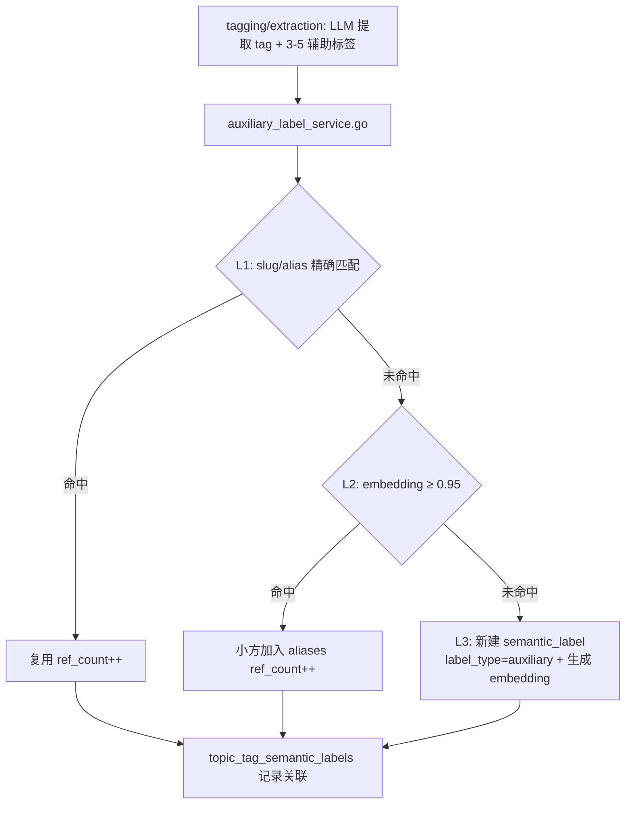
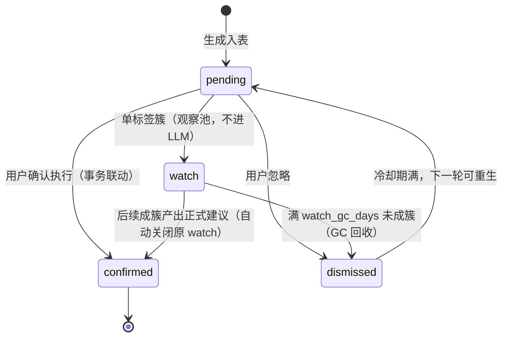
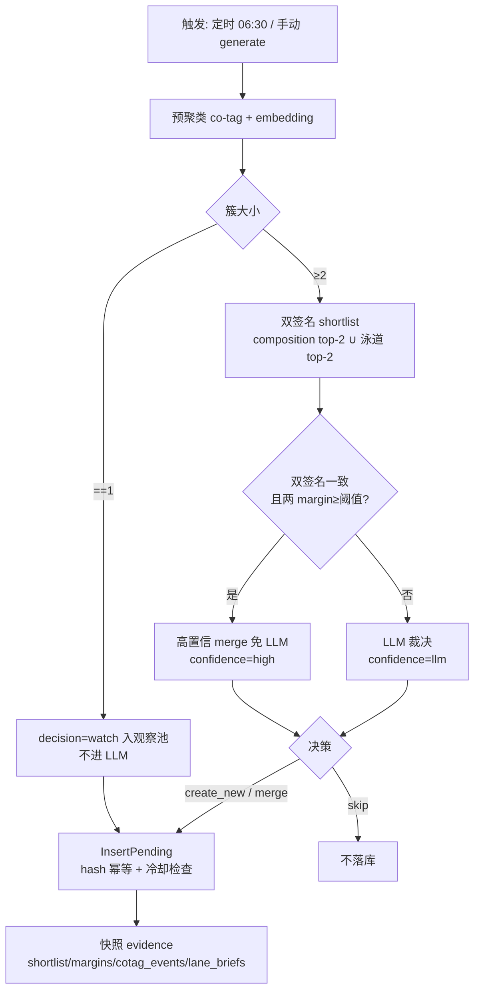
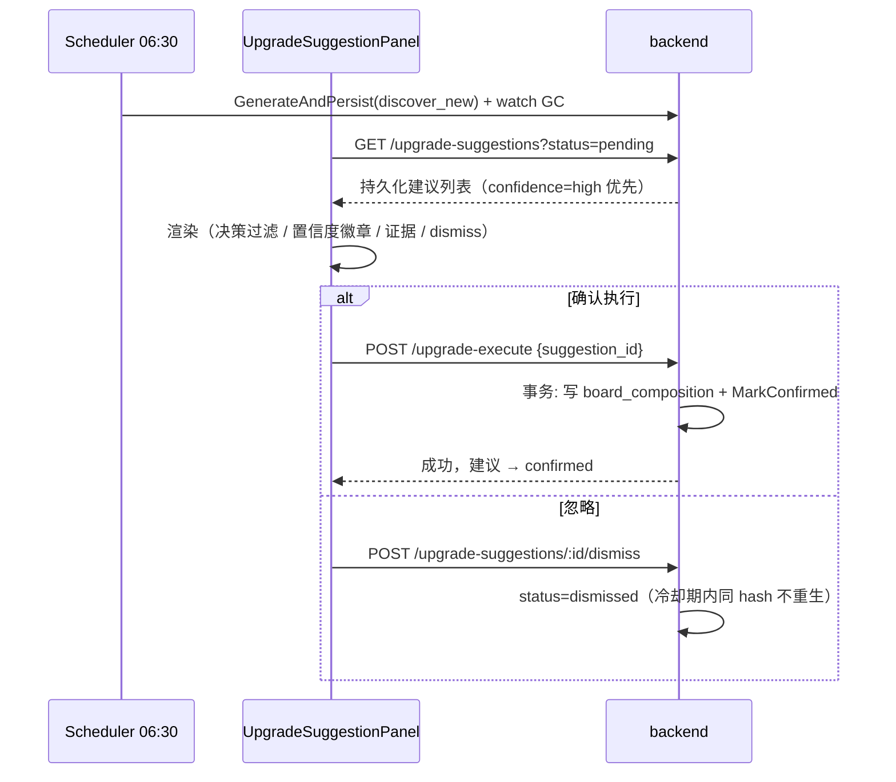

# 语义版块流程（Semantic Board）

> 大功能：辅助标签入库、SemanticBoard 匹配/升级/回填、叙事面板。
> 跨端。互补：`flow/daily-report.md`、`flow/topic-graph.md`。

## 辅助标签入库（L1/L2/L3）



> **L2 不会形成「合并黑洞」**：与主标签路径不同（`findOrCreateTag` 的 embedding 命中曾覆盖 label/slug → text_hash 变 → 重生成 embedding → 恶性循环，见 `v1.3.1/fix-tag-blackhole-embedding-match`），aux 的 L2 命中只 `addAlias`（append alias + ref_count++），**不改 Label、不重算 MergeEmbedding**（MergeEmbedding 仅 L3 新建时生成一次，之后恒定）。既有 aux 的「吸引力」= 固定 embedding 的 cosine，不随 alias 增多 / ref_count 升高而自我放大，无循环根因。阈值 `auxiliary_label_dedupe_sim` 可配（默认 0.95）。

## SemanticBoard 匹配

```text
semantic_board_matching.go
  → 读取 tag 辅助标签 + active Board composition
  → 直接命中 / 命中率 / max_sim / 加权综合（三规则）
  → 写入 topic_tag_board_labels（最多 3 个 Board）
```

## 升级建议生命周期

> **board-discovery-expansion 变更**：建议从「即算即弃的手动 LLM 调用」升级为「持久化生命周期 + 双签名算法 + 观察池 + 定时生成」。旧 `POST upgrade-suggest` 路由保留兼容期。

### 变更影响概览

| 维度 | 变更前 | 变更后 |
| ------ | -------- | -------- |
| 存储 | 无持久化，LLM 结果直返前端 | `board_upgrade_suggestions` 表持久化（suggestion_hash 幂等） |
| 触发 | 仅手动 | 定时 06:30 + 手动（走同一生成逻辑，等效） |
| 算法 | 单一 LLM 裁决 | 双签名 shortlist + 高置信免 LLM + 泳道证据快照 |
| 单标签簇 | 直接 skip | 入观察池（decision=watch），后续成簇再裁决 |
| 用户操作 | 确认执行 | 确认执行 / 忽略 dismiss（冷却期防重现）/ 观察池自动 GC |
| API | `upgrade-suggest`（即时） | `upgrade-suggestions` 资源（列表/dismiss/generate）+ `upgrade-execute` 带 suggestion_id 联动 |

### 建议状态机



> watch 不出现在默认建议列表（默认 status=pending 且 decision≠watch），前端有独立「观察池」过滤入口。

### 生成链路（discover_new 模式）



### 触发方式（两条等效路径）

- **定时**：scheduler `job_board_upgrade_suggest`，默认每日 06:30（`semantic_board_upgrade_suggest_time` 可配），仅 discover_new，失败仅记日志不阻塞兄弟 job；每轮附 watch GC。
- **手动**：前端「生成建议」→ `POST /api/semantic-boards/upgrade-suggestions/generate` → 同一 `GenerateAndPersist`，返回 `{inserted, skipped, cooldown_blocked}`。

### 跨端协作



### 前端面板分区（UpgradeSuggestionPanel）

- **持久化建议区（主）**：读 `GET /upgrade-suggestions`，决策过滤 tab（全部 / 合并 / 新建 / 观察池）+ 高置信徽章 + evidence 展示（泳道标题 / 共现事件，缺 key 降级不渲染）+ 确认执行（带 suggestion_id）/ dismiss。merge 建议 target 超出算法 shortlist 时 evidence 带 `target_off_shortlist=true`（方案 B：算法对新簇视野窄于 LLM，保留建议 + 标注让用户重点裁决，不再静默丢弃）。
- **手动探索区（保留）**：原 candidates/clusters + 手动 LLM 建议 + 「合并到...」下拉，数据源独立（内存态），与持久化区互不干扰。

### 配置项（ai_settings，均可缺省）

| key | 默认 | 来源 | 说明 |
| ----- | ------ | ------ | ------ |
| `semantic_board_upgrade_suggest_time` | `06:30` | §5 | 定时生成触发时间点 |
| `semantic_board_upgrade_watch_gc_days` | `30` | §5 | 观察池 watch 自动回收天数 |
| `semantic_board_upgrade_suggestion_dismiss_cooldown_days` | `14` | §3 | dismissed 冷却期（期内同 hash 不重生） |
| `semantic_board_upgrade_merge_confidence_margin` | — | §4 | 高置信 merge 的双签名 margin 阈值 |

## SemanticBoard 管理 / 回填

```text
SemanticBoard 管理面板
  → 辅助标签入库: L1 slug匹配 → L2 embedding合并 → L3 新建
  → SemanticBoard 匹配: 三规则挂载 → topic_tag_board_labels
  → 升级建议: 见上「升级建议生命周期」（持久化 + 双签名 + 观察池 + 定时生成）
  → 辅助标签治理: 禁用、alias合并、composition移除
  → 回填: all / unassigned / board 三种模式
```

## 叙事面板数据流

```text
NarrativePanel
  → loadBoardTimeline(date) → GET /api/narratives/boards/timeline
  → loadScopes(date) → GET /api/narratives/scopes
  → loadNarratives(date) → GET /api/narratives?date=...
  → switchScope('category') → loadScopes → 展示 board_count
  → triggerGeneration() → POST /api/narratives/regenerate

SemanticBoardPanel
  → loadBoards() → GET /api/semantic-boards
  → viewBoard(id) → GET /api/semantic-boards/:id
  → viewComposition(id) → GET /api/semantic-boards/:id/composition
  → viewUpgradeCandidates() → GET /api/semantic-boards/upgrade-candidates
  → upgradeSuggest() → POST /api/semantic-boards/upgrade-suggest（旧，兼容期）
  → getUpgradeSuggestions() → GET /api/semantic-boards/upgrade-suggestions（持久化列表）
  → generateUpgradeSuggestions() → POST /api/semantic-boards/upgrade-suggestions/generate
  → dismissUpgradeSuggestion(id) → POST /api/semantic-boards/upgrade-suggestions/:id/dismiss
  → upgradeExecute(suggestion_id) → POST /api/semantic-boards/upgrade-execute（联动 confirmed）
  → backfill() → POST /api/semantic-boards/backfill
```

## 代码入口

- 后端：`internal/tagmanagement/{handler,service}/`（auxlabel、board：backfill/matching/upgrade/clustering）
- 前端：`front/app/features/tags/`（SemanticBoardPanel、NarrativePanel）

## Event 标签延迟 embedding

```text
Event 标签延迟 embedding: 描述+关键词生成后入队
  → 多行 embedding (semantic + event_keyword)
```

Event 类标签不随入库立即向量化，而是等描述与关键词生成后才入队，产出 semantic 与 event_keyword 两路 embedding。

## 资料来源

迁自原 `architecture/data-flow.md`（叙事数据流·SemanticBoard 管理 / 辅助标签与 SemanticBoard 数据流 / 叙事面板数据流）。
