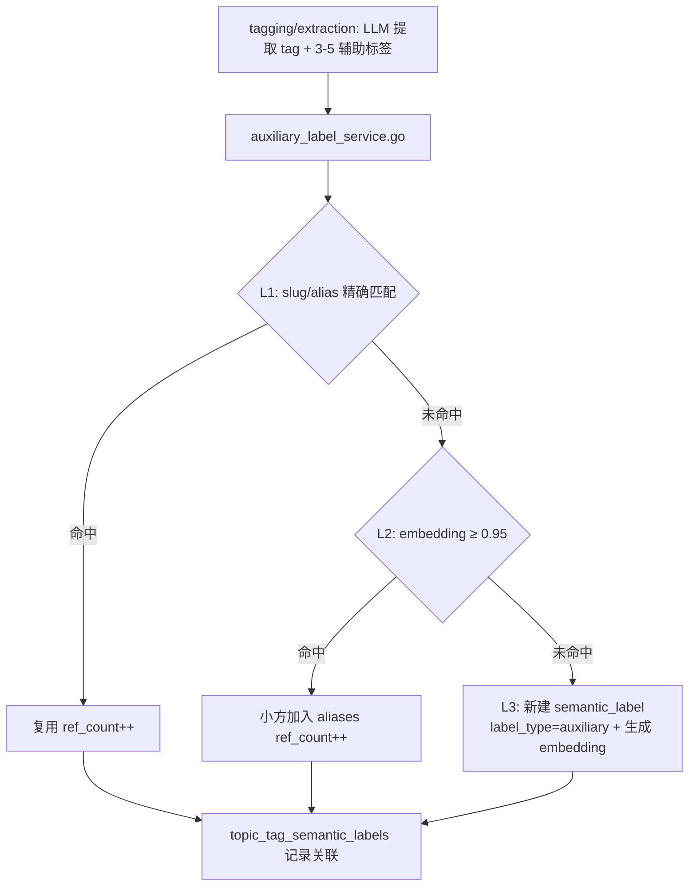
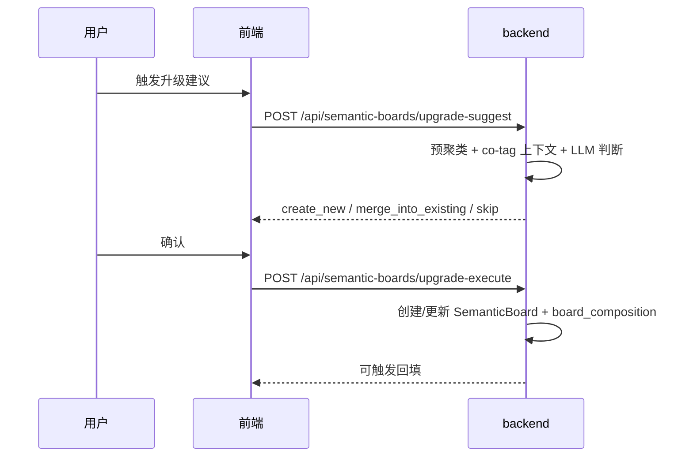

# 语义版块流程（Semantic Board）

> 大功能：辅助标签入库、SemanticBoard 匹配/升级/回填、叙事面板。
> 跨端。互补：`flow/daily-report.md`、`flow/topic-graph.md`。

## 辅助标签入库（L1/L2/L3）



## SemanticBoard 匹配

```text
semantic_board_matching.go
  → 读取 tag 辅助标签 + active Board composition
  → 直接命中 / 命中率 / max_sim / 加权综合（三规则）
  → 写入 topic_tag_board_labels（最多 3 个 Board）
```

## 升级建议



## SemanticBoard 管理 / 回填

```text
SemanticBoard 管理面板
  → 辅助标签入库: L1 slug匹配 → L2 embedding合并 → L3 新建
  → SemanticBoard 匹配: 三规则挂载 → topic_tag_board_labels
  → 升级建议: 手动触发 → 预聚类 → LLM建议 → 用户确认
  → 辅助标签治理: 禁用、alias合并、composition移除
  → 回填: all / unassigned / board 三种模式
```

## 叙事面板数据流

```text
NarrativePanel
  → loadBoardTimeline(date) → GET /api/narratives/boards/timeline
  → loadScopes(date) → GET /api/narratives/scopes
  → loadNarratives(date) → GET /api/narratives?date=...
  → switchScope('category') → loadScopes → 展示 board_count
  → triggerGeneration() → POST /api/narratives/regenerate

SemanticBoardPanel
  → loadBoards() → GET /api/semantic-boards
  → viewBoard(id) → GET /api/semantic-boards/:id
  → viewComposition(id) → GET /api/semantic-boards/:id/composition
  → viewUpgradeCandidates() → GET /api/semantic-boards/upgrade-candidates
  → upgradeSuggest() → POST /api/semantic-boards/upgrade-suggest
  → upgradeExecute() → POST /api/semantic-boards/upgrade-execute
  → backfill() → POST /api/semantic-boards/backfill
```

## 代码入口

- 后端：`internal/tagmanagement/{handler,service}/`（auxlabel、board：backfill/matching/upgrade/clustering）
- 前端：`front/app/features/tags/`（SemanticBoardPanel、NarrativePanel）

## Event 标签延迟 embedding

```text
Event 标签延迟 embedding: 描述+关键词生成后入队
  → 多行 embedding (semantic + event_keyword)
```

Event 类标签不随入库立即向量化，而是等描述与关键词生成后才入队，产出 semantic 与 event_keyword 两路 embedding。

## 资料来源

迁自原 `architecture/data-flow.md`（叙事数据流·SemanticBoard 管理 / 辅助标签与 SemanticBoard 数据流 / 叙事面板数据流）。
