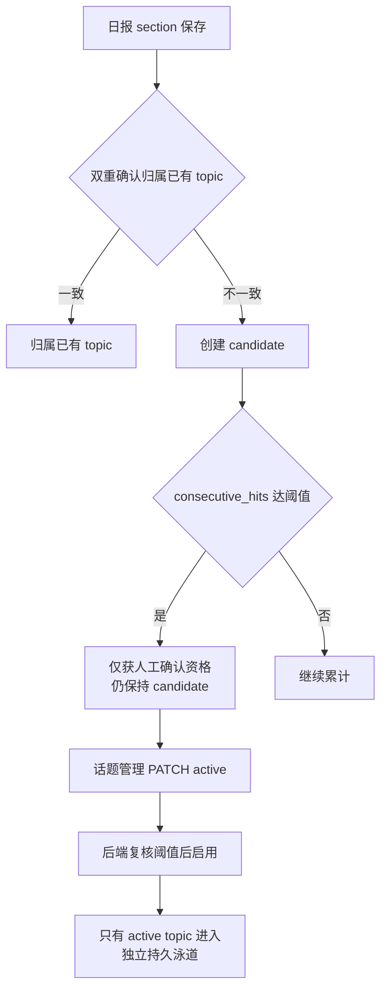

# 话题图谱流程（Topic Graph）

> 大功能：PersistentTopic 日报归属、展示，关系双轨。
> 跨端。互补：`flow/daily-report.md`（叙事生成驱动话题）、`architecture/backend.md`。

## 日报 section 归属与话题启用



### 候选生命周期窗口（全人工归档）

candidate 与 active 的归档**完全由用户在话题管理界面手动操作**。`planLifecycle` 仅更新命中计数：当天有 section 归属则 `consecutive_hits += 1`、`hit_count += 1`、`last_seen_date = 当天`；无归属则 `consecutive_hits` 归零。**不自动变更任何 status**；任何 status → archived 的转换只能由显式的用户操作触发。

`persistent_topic_candidate_decay_window`（默认 7 天）在此处仅用于 ClusterTags prompt 的卫生过滤——决定哪些 candidate 注入 LLM prompt，**不触发任何状态变更**。

### 候选展示门槛（observing → 可见 candidate）

`consecutive_hits < upgrade_threshold`（默认 3）的 candidate（"observing"）在话题管理 UI（`GET /api/semantic-boards/:id/topics`）中**隐藏**，但对用户不可见；它们仍持久化于数据库并参与可锚定话题集合（保证跨天命中能累积）。当 `consecutive_hits` 达到 `upgrade_threshold` 后，candidate 自动在管理 UI 可见（无需额外操作）。

### `auto_new` 创建门槛

当天 section 无法归属到已有 topic 时，系统自动创建 `status=candidate`、`consecutive_hits=1` 的 PersistentTopic。

### 一次性清理迁移

本 change 附带一次性迁移 `20260628_0001`：幂等删除 `status=candidate AND consecutive_hits < upgrade_threshold` 的历史 candidate，采用 `DeleteTopic` 语义——unlink 关联 section（置 NULL 含 `topic_status_at_report`），硬删 candidate，按 board 重建 relations。

### 可锚定话题选择器

ClusterTags 注入与双重确认归属共享同一个选择器（`ListAnchorableTopicsByBoard`）：全部 active 无条件入选，窗口内 candidate 按 `last_seen_date DESC, hit_count DESC, id ASC` 排序最多取 `persistent_topic_candidate_prompt_limit`（默认 20）条。窗口外 / 被截断的 candidate 两侧一致排除。

## 关系双轨

```text
similarity（匈牙利算法）
  → 时间线连线
  → emerging / continuing / split / merge / ending 状态

identity（同 persistent_topic）
  → 话题泳道连续性
  → 不参与时间线状态
```

| 轨 | 算法 | 作用 |
|----|------|------|
| similarity | 匈牙利算法 | 时间线连线、生命周期状态（emerging/continuing/split/merge/ending） |
| identity | 同 persistent_topic | 话题泳道连续性，不参与时间线状态 |

## 代码入口

- 后端：`internal/topicgraph/{handler,service,repository}/`（graph、daily_report_cluster）
- 前端：`front/app/features/tags/`（SectionLifecyclePanel）、`front/tests/e2e/topic-graph.spec.ts`

## 概念 bootstrap

```text
概念 bootstrap: 连通分量聚类 → 最小簇过滤 → LLM 命名概念
```

从话题相似度构建连通分量，过滤掉过小簇，再用 LLM 为每个概念簇命名。

## 资料来源

迁自原 `architecture/data-flow.md`（叙事数据流·PersistentTopic 日报归属与展示）。
