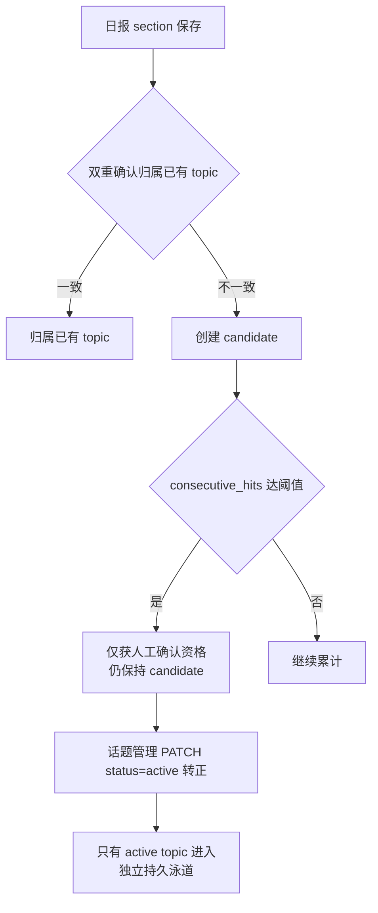

# 话题图谱流程（Topic Graph）

> 大功能：PersistentTopic 日报归属、展示，关系双轨。
> 跨端。互补：`flow/daily-report.md`（叙事生成驱动话题）、`architecture/backend.md`。

## 需求说明

PersistentTopic（持久话题）解决「跨天追踪同一话题演进」的问题。每天生成的日报 section 是一次性的叙事单元，但用户关心的 AI / 新能源 / 中美竞争等**话题是跨天存续、逐日累积**的。话题图谱把每天的 section 锚定到持久话题上，让用户：

- 在话题泳道里看到同一主题**跨天的连续叙事**（identity 轨），而不是每天孤立的一团。
- 在时间线上看到话题的**生命周期状态**——emerging / continuing / split / merge / ending（similarity 轨）。
- 通过 candidate→active 的渐进确认机制，避免噪声 / 瞬态事件污染持久话题集合；任何归档都由用户显式操作触发。

> 话题聚类消费的 event 标签来自标签提取 / 去重 / 层级管线（tagmanagement domain，详见 `flow/semantic-board.md`）；标签质量直接影响聚类纯度。本 flow 聚焦 PersistentTopic 的归属、生命周期与关系双轨。

## 链路设计

### 日报 section 归属与话题启用



双重确认锚定（AND-gate，详见 `flow/daily-report.md` §2）是归属的第一道门：语义门（section 标题向量 ↔ 话题首义向量余弦距离 ≤ 0.30）+ LLM 门（Step3 聚类的 `matched_topic_id` 指向同一话题），两道都过才 anchor_hit 到已有 topic；否则 auto_new 开新 candidate。

### 候选生命周期窗口（全人工归档）

candidate 与 active 的归档**完全由用户在话题管理界面手动操作**。`planLifecycle` 仅更新命中计数：当天有 section 归属则 `consecutive_hits += 1`、`hit_count += 1`、`last_seen_date = 当天`；无归属则 `consecutive_hits` 归零。**不自动变更任何 status**；任何 status → archived 的转换只能由显式的用户操作触发。

`persistent_topic_candidate_decay_window`（默认 7 天）在此处仅用于 ClusterTags prompt 的卫生过滤——决定哪些 candidate 注入 LLM prompt，**不触发任何状态变更**。

### 候选展示门槛（observing → 可见 candidate）

`consecutive_hits < upgrade_threshold`（默认 3）的 candidate（"observing"）在话题管理 UI（`GET /api/semantic-boards/:id/topics`）中**隐藏**，但对用户不可见；它们仍持久化于数据库并参与可锚定话题集合（保证跨天命中能累积）。当 `consecutive_hits` 达到 `upgrade_threshold` 后，candidate 自动在管理 UI 可见（无需额外操作）。

### `auto_new` 创建门槛

当天 section 无法归属到已有 topic 时，系统自动创建 `status=candidate`、`consecutive_hits=1` 的 PersistentTopic。

### 一次性清理迁移

本 change 附带一次性迁移 `20260628_0001`：幂等删除 `status=candidate AND consecutive_hits < upgrade_threshold` 的历史 candidate，采用 `DeleteTopic` 语义——unlink 关联 section（置 NULL 含 `topic_status_at_report`），硬删 candidate，按 board 重建 relations。

### 可锚定话题选择器

ClusterTags 注入与双重确认归属共享同一个选择器（`ListAnchorableTopicsByBoard`）：全部 active 无条件入选，窗口内 candidate 按 `last_seen_date DESC, hit_count DESC, id ASC` 排序最多取 `persistent_topic_candidate_prompt_limit`（默认 20）条。窗口外 / 被截断的 candidate 两侧一致排除。

### 关系双轨

```text
similarity（匈牙利算法）
  → 时间线连线
  → emerging / continuing / split / merge / ending 状态

identity（同 persistent_topic）
  → 话题泳道连续性
  → 不参与时间线状态
```

| 轨 | 算法 | 作用 |
|----|------|------|
| similarity | 匈牙利算法 | 时间线连线、生命周期状态（emerging/continuing/split/merge/ending） |
| identity | 同 persistent_topic | 话题泳道连续性，不参与时间线状态 |

### 概念 bootstrap

```text
概念 bootstrap: 连通分量聚类 → 最小簇过滤 → LLM 命名概念
```

从话题相似度构建连通分量，过滤掉过小簇，再用 LLM 为每个概念簇命名。

### 话题运维操作（重命名 / 状态 / 合并 / 分裂 / 硬删）

话题管理 UI（`GET /api/semantic-boards/:id/topics`）不仅展示全量话题，还通过下列端点把 candidate→active→archived 的状态流转与归并/拆分交给用户显式操作（`backend-go/internal/topicgraph/handler/daily_report_handler.go`）：

| 端点 | 语义 |
| ---- | ---- |
| `PATCH /api/daily-reports/topics/:id` | `{label?, status?}`：重命名（label）与/或改状态（status 仅 `active`/`archived`，即转正/重激活/归档），两字段皆可省略以单独变更。**不止「转正」一种语义**。 |
| `DELETE /api/daily-reports/topics/:id` | 硬删话题：清空其 section 的归属（section 本身保留），不可逆；可逆路径是 PATCH status=archived。 |
| `POST /api/daily-reports/topics/:id/merge` | `{source_topic_ids:[]}`：把若干源话题的 section 全部划归 `:id`，源话题归档。 |
| `POST /api/daily-reports/topics/:id/split` | `{section_ids:[], label}`：把指定 section 从 `:id` 拆出，新建一个话题承载。 |

> 注：旧文档把 PATCH 仅描述为「active 转正」过窄——实际 PATCH 是 rename + status(active|archived) 的组合运维端点，且 merge/split/DELETE 同属话题级治理操作（均不自动触发，需用户显式调用）。

### 前端：演进报告与标签合并

话题图谱前端除 candidate→active 的生命周期操作外，还承载两个与「演进/合并」相关的组件（`front/app/features/tags/components/`）：

- **演进报告 `EvolutionReport.vue`**：由 `BoardEnrichmentPanel.vue` 在板块详情「数据增强」面板的「演进报告」子区块挂载。它消费 boardEnrichment 的 `result` 详情 + `reviews`（`api/boardEnrichment.ts` 的 `EvolutionAnalysis` 复合对象），以报刊式 editorial 呈现话题的演进定位（强化/转折/扩散）、跨泳道引用与证据清单。属「B 分析认知」数据富化循环的展示层（详见 `flow/data-enrichment.md`）。
- **标签合并对话框 `TopicGraphMergeDialog.vue`**：presentational 组件，提供「搜索目标标签 → 把当前标签的所有文章迁移到目标标签」的交互（emit `doMerge`）。注意它是**标签级**合并 UI（区别于上表的**话题级** merge 端点）；当前该组件未被任何视图引用（预留/orphan）。

## 业务约束与不变量

> 本节是 `doc-impact.sh context` 的数据源：apply 改 `internal/topicgraph/` 或 `internal/tagmanagement/` 代码前会自动 dump 给 agent，必须遵守。

1. **candidate→active→archived 全人工归档**：`planLifecycle`（`repository/daily_report_assignment.go`）只更新命中计数——当天有 section 归属则 `consecutive_hits += 1`、`hit_count += 1`、`last_seen_date = 当天`；无归属则 `consecutive_hits` 归零。**不自动变更任何 status**；任何 status → archived 的转换只能由用户在话题管理界面的显式操作触发。
2. **`upgrade_threshold`（默认 3）双重含义**：`consecutive_hits` 达阈值的 candidate 仅**获得人工激活资格**（`CanActivate = Status==candidate && HitCount >= UpgradeThreshold`），仍保持 candidate，需用户 PATCH active 才转 active。同时该阈值是**话题管理 UI 的可见门槛**——未达阈值的 "observing" candidate 在 `GET /api/semantic-boards/:id/topics` 中隐藏（仍持久化、参与可锚定集合，保证跨天累积），达阈后自动可见。
3. **`auto_new` 创建契约**：当天 section 无法归属到已有 topic 时，系统自动创建 `status=candidate`、`consecutive_hits=1`、`hit_count=1` 的新 PersistentTopic（首义向量 = 该 section 标题向量）。
4. **`persistent_topic_candidate_decay_window`（默认 7 天）仅用于 prompt 卫生过滤**：决定哪些 candidate 注入 ClusterTags prompt，**不触发任何状态变更 / 归档**。
5. **可锚定话题选择器一致性**：ClusterTags 注入（Step3）与双重确认归属共享同一个选择器 `ListAnchorableTopicsByBoard`——全部 active 无条件入选；窗口内 candidate 按 `last_seen_date DESC, hit_count DESC, id ASC` 排序最多取 `persistent_topic_candidate_prompt_limit`（默认 20）条。窗口外 / 被截断的 candidate 两侧一致排除，消除单边锚定的隐式 bug。
6. **section 快照不可回填**：每条 section 的 `topic_status_at_report`、`persistent_topic_id`、`topic_match_distance`、`topic_match_confidence` 在 `SaveReport` 同一事务内写入（快照值 = 当时 PersistentTopic 的 candidate|active；未归属写 NULL）。历史快照不随后续 topic 状态变化回填。
7. **手动建泳道主权声明**（`source=manual`，详见 `flow/daily-report.md` §2）：用户主动建 active topic 跳过 candidate 阶段与连续命中门禁，`topic_match_confidence='manual'`（人工归属第四态，非算法三态）；下一期日报起与自动 active topic 一样参与 AND-gate。

## 代码入口

- **后端生命周期与归属**：`backend-go/internal/topicgraph/repository/daily_report_assignment.go`（`planLifecycle` 命中计数、`planTopicAssignments` 双重确认锚定）、`repository/daily_report_topic_repository.go`（status 状态机 `candidate|active|archived`、可锚定选择器 `ListAnchorableTopicsByBoard`）、`repository/daily_report_manual_topic.go`（手动建泳道）。
- **后端关系双轨 / 聚类**：`backend-go/internal/topicgraph/service/daily_report_cluster.go`（ClusterTags 聚类 + 概念 bootstrap）、`service/daily_report_orchestrator.go`（`GenerateDailyReport` 管线、`RebuildBoardRelations` 关系双轨）、`service/daily_report_merge.go`。
- **后端 handler**：`backend-go/internal/topicgraph/handler/topic_watch_handler.go`（话题 watch）、`handler/daily_report_handler.go`（话题管理列表 + PATCH rename/status、DELETE 硬删、POST merge/split、手动建泳道、backfill-embeddings/relations/topics）。
- **标签提取 / 去重 / 层级**（话题聚类的输入源）：`backend-go/internal/tagmanagement/`（`service/` 抽象标签层级与合并、`handler/` 标签管理、`repository/` 持久化）。
- **前端**：`front/app/features/tags/components/daily-report/`（SectionLifecyclePanel、话题锚定展示）、`front/app/features/tags/components/BoardThreadBrowser.vue`（话题总览泳道）、`front/tests/e2e/topic-graph.spec.ts`。

## 变更溯源

| 日期 | 变更 | 摘要 | 归档位置 |
|------|------|------|----------|
| 2026-07-05 | manual-topic-lane | 手动建泳道：用户主动建 active topic（`source=manual`），次期接入 AND-gate；新增 `board_persistent_topics.source` 列 + `topic_match_confidence=manual` 第四态 | [`openspec/changes/archive/2026-07-05-manual-topic-lane`](../../../openspec/changes/archive/2026-07-05-manual-topic-lane) |
| 2026-05-31 | section-lifecycle-ui | Section 获得独立生命周期（status + prev_section_id），BoardThreadBrowser 从 thread 粒度改为 section 粒度话题总览 | [`openspec/changes/archive/2026-05-31-section-lifecycle-ui`](../../../openspec/changes/archive/2026-05-31-section-lifecycle-ui) |
| 2026-08-01 | inline-compose-lane | 就地编排新建泳道：composeMode 叠加态（不切 viewMode）+ unassigned 主战场勾选 + 贴合度实时分层 + active 淡显可勾走移出 + 聚类质量单卡 + 候选侧边栏（语义搜索/相似推荐/已中断折叠）+ 废弃 ComposePanel；CandidateTopicBrief 补 status 对齐 lanes 移出口径 | [`openspec/changes/archive/2026-08-01-inline-compose-lane`](../../../openspec/changes/archive/2026-08-01-inline-compose-lane) |
