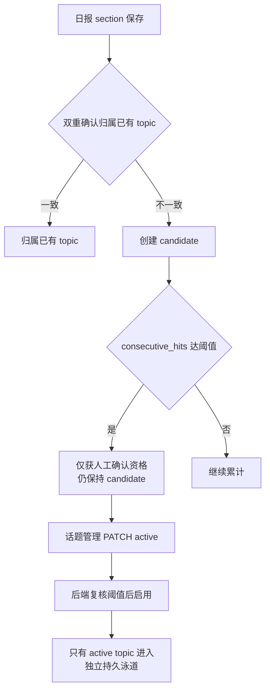

# 话题图谱流程（Topic Graph）

> 大功能：PersistentTopic 日报归属、展示，关系双轨。
> 跨端。互补：`flow/daily-report.md`（叙事生成驱动话题）、`architecture/backend.md`。

## 日报 section 归属与话题启用



### 候选生命周期窗口

candidate 超出 `persistent_topic_candidate_decay_window`（默认 7 天）末次命中后自动转为 archived；active 使用独立 `persistent_topic_decay_window`（30 天）。窗口内 miss 仅清零 `consecutive_hits`，不归档。

### 可锚定话题选择器

ClusterTags 注入与双重确认归属共享同一个选择器（`ListAnchorableTopicsByBoard`）：全部 active 无条件入选，窗口内 candidate 按 `last_seen_date DESC, hit_count DESC, id ASC` 排序最多取 `persistent_topic_candidate_prompt_limit`（默认 20）条。窗口外 / 被截断的 candidate 两侧一致排除。

## 关系双轨

```text
similarity（匈牙利算法）
  → 时间线连线
  → emerging / continuing / split / merge / ending 状态

identity（同 persistent_topic）
  → 话题泳道连续性
  → 不参与时间线状态
```

| 轨 | 算法 | 作用 |
|----|------|------|
| similarity | 匈牙利算法 | 时间线连线、生命周期状态（emerging/continuing/split/merge/ending） |
| identity | 同 persistent_topic | 话题泳道连续性，不参与时间线状态 |

## 代码入口

- 后端：`internal/topicgraph/{handler,service,repository}/`（graph、daily_report_cluster）
- 前端：`front/app/features/tags/`（SectionLifecyclePanel）、`front/tests/e2e/topic-graph.spec.ts`

## 概念 bootstrap

```text
概念 bootstrap: 连通分量聚类 → 最小簇过滤 → LLM 命名概念
```

从话题相似度构建连通分量，过滤掉过小簇，再用 LLM 为每个概念簇命名。

## 资料来源

迁自原 `architecture/data-flow.md`（叙事数据流·PersistentTopic 日报归属与展示）。
