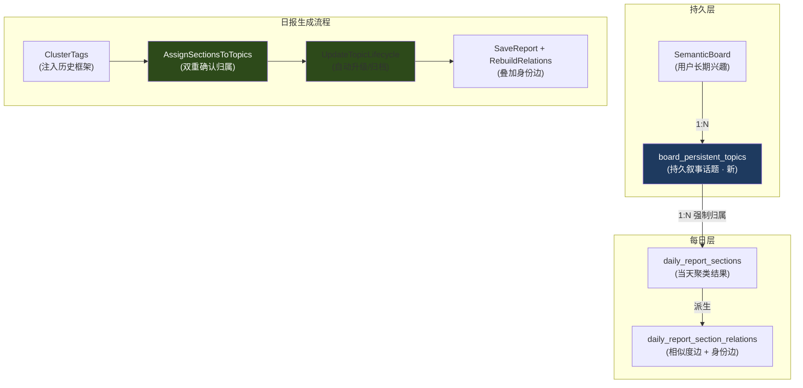
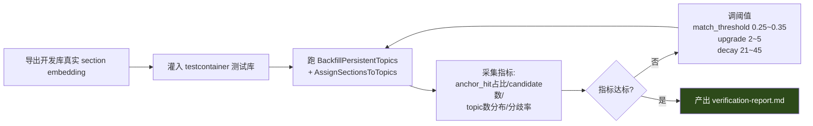
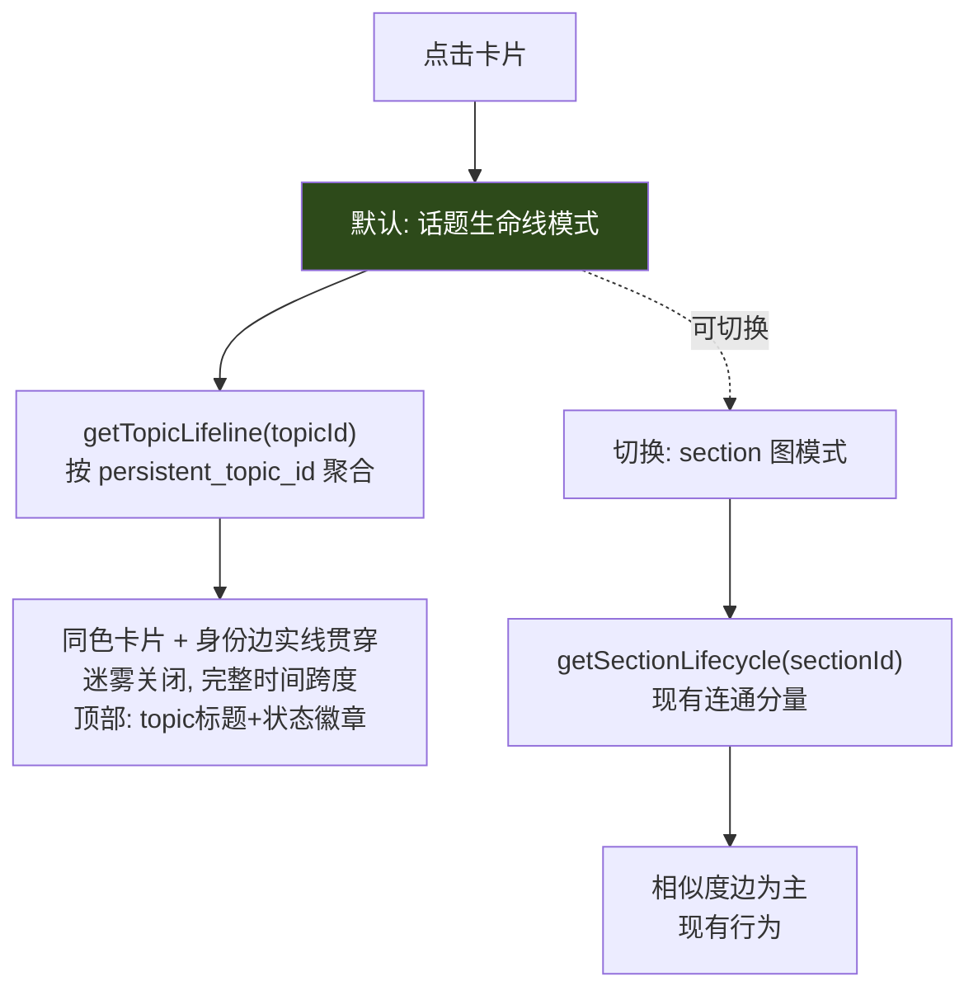

# Design: PersistentTopic 持久叙事话题

> 完整方案背景见 `.scratch/persistent-topic-design/DESIGN.md`。本文件聚焦实施设计：算法决策点、参数敏感性、集成测试策略、真实数据调试方法、数据模型 DDL。

## 1. 架构总览



## 2. 算法决策点（不确定性逐项说明）

本 change 算法存在多处参数不确定性，**不能靠纯单元测试拍板**，必须用真实数据验证。逐项列出：

### 2.1 决策点一：归属双重确认的阈值（match_threshold）

**问题**：section 归属到已有 PersistentTopic 的判定，用 embedding 最近邻 + LLM matched_topic_id 双重确认。embedding distance 阈值取多少？

- 太严（如 0.20）：大量本应合并的 section 被迫开新 candidate → topic 膨胀。
- 太松（如 0.40）：不同叙事被误并（如"中东局势"误并到"全球能源")。

**默认值**：0.30（对齐现有匈牙利 penalty=0.28，略放宽因身份边不再受 penalty 限制）。

**验证方法**：集成测试用真实历史 section embedding 跑 `AssignSectionsToTopics`，统计：
- anchor_hit 占比（目标 > 70%）
- 新建 candidate 数 / 已有 active topic 数（目标 < 0.3，否则阈值太严）

**调参规则**：成果报告产出 anchor_hit 分布直方图，若 < 50% 则降阈值到 0.28 重测；若 candidate 数爆炸则收紧。

### 2.2 决策点二：双重确认的逻辑（AND 还是 OR）

**问题**：embedding 命中 + LLM matched_topic_id 命中，两者一致才 anchor_hit（AND），还是任一命中即可（OR）？

**选 AND（默认）**，理由：
- 纯 embedding 会误并跨叙事（"中东" vs "能源"在低维 embedding 空间可能近）。
- 纯 LLM matched_topic_id 会因命名漂移标记到错 topic。
- 两者一致 → 高置信；不一致 → 宁开新 candidate（auto_new），由后续几天连续命中来验证是否真新叙事。

**边界情况**：LLM 标记的 matched_topic_id 不在传入的 existingTopics 集合（幻觉）→ 视为 null，降级为 auto_new。

**验证方法**：集成测试构造矛盾场景（embedding 近但 LLM 不标记），验证走 auto_new 分支；成果报告统计 AND/OR 在真实数据下的分歧率（目标分歧率 < 15%，否则 AND 太严需放宽为 OR）。

### 2.3 决策点三：自动升级阈值（upgrade_threshold）

**问题**：candidate 连续命中几天转 active？

**默认值**：3 天。理由：单天命中可能是噪声（突发事件），连续 3 天说明是稳定叙事。

**风险**：噪声事件连续 3 天也可能命中（如奥运开幕式连续几天报道），升级为 active 后污染"关心的话题"栏。缓解：decay_window 到期自动归档。

**验证方法**：集成测试模拟 1/2/3/4 天连续命中，验证第 3 天边界正确转正；成果报告统计真实数据下 candidate → active 转化率、误升级率（需人工抽查 active topic 是否合理）。

### 2.4 决策点四：decay 窗口（decay_window）

**问题**：active topic 多久无命中转 archived？

**默认值**：30 天。理由：月度新闻周期，1 个月无新 section 说明叙事已冷却。

**验证方法**：成果报告统计真实数据下 active topic 的 last_seen_date 分布，验证 30 天阈值是否合理（若大量 active 卡在 20-30 天无命中说明阈值偏宽，可调到 21 天）。

### 2.5 决策点五：回刷聚类阈值（cluster_threshold）

**问题**：回刷时历史 section 用 average_link 聚类成 PersistentTopic，合并阈值取多少？

**默认值**：0.30（对齐 match_threshold）。

**风险**：历史 section 本就因命名漂移而散乱，聚类阈值太严会产出过多小 topic（每个都是 active），太松会把无关叙事并成一个巨型 topic。

**验证方法**：回刷后统计单 board active topic 数（目标 5-15），若 > 20 说明阈值太严，若 < 3 说明太松。成果报告产出每个 board 的 topic 数分布。

### 2.6 决策点六：聚类 prompt 的命名与复用质量（cluster_prompt）

**问题**：上线后发现部分 topic 的标题与实际归属事件脱节，表现为：
1. **命名脑补语境**：单个标签独立成组时，LLM 凭人物/时间联想发明标题（如组内只有「特朗普对美伊协议表态」，却命名为「特朗普在 G7 峰会期间的盟友关系紧张」——当天事件根本未提及 G7）。
2. **不相关事件被宽泛框架吸收**：一旦存在人名/地名类的宽泛 topic，后续天的 LLM 会把语义不相关但语境沾边的事件都塞进去（如「空军一号交付」「美以关系表态」「美伊通牒」三个互不相关事件被并进「特朗普在 G7」框架）。

**默认 prompt 策略（2026-06-20 调优）**：
- 规则 2：单标签应优先并入语义最近的组；仅当确实无关联时才独立成组，且组名**必须直接使用该标签原文**，不得发挥。
- 规则 4：标题必须是对**组内实际事件**的提炼与概括，**禁止脱离组内事件脑补未提及的外部语境**（时间点、地点、未发生的会议、未提及的主体）。
- 复用规则：仅当一组事件**确实延续某框架的核心议题**时才复用该框架的 `matched_topic_id`，**不得仅因语境沾边**（人物/地点/时间相同）就把语义不相关的事件并入。
- 反面教材明确列出「脱离事件脑补语境」「把不相关事件强行打包」两类。

**验证方法**：用真实 board 的某天 tag 集 + 该 board 现有 topic 跑 `ClusterTags`，人工核查：(a) 是否还有脑补标题；(b) 宽泛 topic 是否继续吸收不相关事件。详见 verification-report §11。

**风险**：prompt 调优只影响**新生成的日报**，对已存在的污染 topic（如 topic 8）无效——其标题仍会被注入后续 prompt。缓解：观察 1-2 天后若仍异常，手动 `PATCH /api/daily-reports/topics/:id` 归档。

## 3. 数据模型 DDL

### 3.1 新增表 board_persistent_topics

```sql
CREATE TABLE board_persistent_topics (
    id                SERIAL PRIMARY KEY,
    semantic_board_id INT NOT NULL REFERENCES semantic_labels(id) ON DELETE CASCADE,
    label             VARCHAR(200) NOT NULL,
    description       TEXT,
    embedding         vector,  -- 维度对齐 semantic_labels.embedding
    status            VARCHAR(20) NOT NULL DEFAULT 'candidate';
    first_seen_date   DATE NOT NULL,
    last_seen_date    DATE NOT NULL,
    hit_count         INT NOT NULL DEFAULT 1,
    consecutive_hits  INT NOT NULL DEFAULT 0,
    created_at        TIMESTAMP NOT NULL DEFAULT NOW(),
    updated_at        TIMESTAMP NOT NULL DEFAULT NOW(),
    CONSTRAINT chk_topic_status CHECK (status IN ('candidate', 'active', 'archived'))
);
CREATE INDEX idx_persistent_topics_board_status
    ON board_persistent_topics(semantic_board_id, status);
CREATE INDEX idx_persistent_topics_embedding
    ON board_persistent_topics USING hnsw (embedding vector_cosine_ops);
```

按 §10：建表 + HNSW 索引走显式迁移文件，不依赖 gorm AutoMigrate。

### 3.2 扩展 daily_report_sections

```sql
ALTER TABLE daily_report_sections
    ADD COLUMN persistent_topic_id INT REFERENCES board_persistent_topics(id) ON DELETE SET NULL,
    ADD COLUMN topic_match_distance FLOAT,
    ADD COLUMN topic_match_confidence VARCHAR(20);
-- 不加 NOT NULL：兼容回刷过渡期和历史数据；归属算法保证新数据非空
```

### 3.3 扩展 daily_report_section_relations

```sql
ALTER TABLE daily_report_section_relations
    ADD COLUMN relation_type VARCHAR(20) NOT NULL DEFAULT 'similarity';
-- identity=身份边(同topic), similarity=相似度边(匈牙利)
CREATE INDEX idx_section_relations_type
    ON daily_report_section_relations(relation_type);
-- 唯一约束拓宽为 (from, to, relation_type)：identity 与 similarity 边
-- 在同一 section 对上作为两行共存，互不覆盖。见 §4.4。
```

## 4. 核心算法伪码

### 4.1 ClusterTags 注入历史框架

```go
// daily_report_cluster.go 改造
func (s *Service) ClusterTags(ctx, boardID, tags) ([]TagGroup, error) {
    existingTopics := s.repo.ListActiveTopicsByBoard(ctx, boardID)  // 新增查询
    prompt := s.buildClusterSystemPrompt(len(tags), existingTopics) // 注入框架列表
    resp := s.llm.Call(ctx, prompt)
    groups := parseGroups(resp)
    // 校验 matched_topic_id 合法性
    for i := range groups {
        if !existingTopics.Contains(groups[i].MatchedTopicID) {
            groups[i].MatchedTopicID = nil  // 幻觉降级
        }
    }
    return groups, nil
}
```

### 4.2 AssignSectionsToTopics（强制归属）

```go
// daily_report_topic.go 新增
func AssignSectionsToTopics(ctx, boardID, sections, existingTopics) {
    today := sections[0].PeriodDate
    for i := range sections {
        sec := &sections[i]
        if len(sec.Embedding) == 0 {
            sec.TopicMatchConfidence = "unmatched"
            continue
        }
        nearest, dist := findNearestTopic(existingTopics, sec.Embedding)
        llmMatchedID := sec.MatchedTopicID // 来自 ClusterTags 输出

        if dist <= matchThreshold && llmMatchedID != nil && *llmMatchedID == nearest.ID {
            // 双重确认一致 → anchor_hit
            sec.PersistentTopicID = &nearest.ID
            sec.TopicMatchDistance = &dist
            sec.TopicMatchConfidence = "anchor_hit"
        } else {
            // 不一致 → 开新 candidate
            newTopic := createCandidateTopic(boardID, sec.ClusterLabel, sec.Embedding, today)
            sec.PersistentTopicID = &newTopic.ID
            sec.TopicMatchConfidence = "auto_new"
        }
    }
}
```

### 4.3 UpdateTopicLifecycle（状态机）

```go
func UpdateTopicLifecycle(ctx, boardID, today, sections) {
    hitTopicIDs := collectHitTopicIDs(sections)
    topics := s.repo.ListAllTopicsByBoard(ctx, boardID) // 含 candidate+active
    for i := range topics {
        t := &topics[i]
        if hitTopicIDs[t.ID] {
            t.ConsecutiveHits++
            t.HitCount++
            t.LastSeenDate = today
            if t.Status == "candidate" && t.ConsecutiveHits >= upgradeThreshold {
                t.Status = "active" // 自动转正
            }
        } else {
            t.ConsecutiveHits = 0 // 断链重置
            if t.Status == "active" && daysBetween(today, t.LastSeenDate) > decayWindow {
                t.Status = "archived" // 超期归档
            }
        }
    }
    s.repo.SaveTopics(ctx, topics)
}
```

### 4.4 身份边叠加（关系重建）

```go
// daily_report_relations.go 改造
func RebuildBoardRelations(ctx, boardID) {
    // 1. 现有匈牙利 Phase 1/2/3 → similarity 边
    similarityEdges := hungarianPhase(sections)
    writeRelations(similarityEdges, "similarity")

    // 2. 新增身份边：同 persistent_topic_id 的相邻天 section
    sectionsByTopic := groupSectionsByTopic(sections)
    for topicID, secs := range sectionsByTopic {
        sort(secs, byDate)
        for i := 1; i < len(secs); i++ {
            if isAdjacentDay(secs[i-1], secs[i]) {
                dist := cosineDistance(secs[i-1].Embedding, secs[i].Embedding)
                upsertRelation(secs[i-1].ID, secs[i].ID, dist, "identity")
                // identity 边与同 from/to 的 similarity 边【共存】
            }
        }
    }
}
```

> **边共存（2026-06-20 修正）**：唯一约束从 `(from, to)` 拓宽为 `(from, to, relation_type)`，
> 所有 INSERT 的 `ON CONFLICT` 目标同步为该三元组。因此同一 section 对上的 identity 与
> similarity 是**两行独立记录**，互不覆盖。修正前 identity 会覆盖一条强匈牙利匹配
> （distance ≪ 0.28），导致「只显 similarity」的时间线视图丢边断链。详见
> verification-report §10 与迁移 `20260620_0001`。
```

## 5. 集成测试策略（重点：真实数据调试）

### 5.1 测试基础设施复用

复用 `testutil.SetupTestDB(t)`（testcontainer pgvector，隔离容器，`pgvector/pgvector:pg18-trixie` 镜像与生产一致）。每个测试函数独立事务或独立容器 schema，互不污染。

### 5.2 真实 embedding 数据来源

集成测试需要真实 embedding（不能造假向量，否则距离无意义）。

**已落地方案 —— 生产库导出 fixture**：从生产 `syntopica-postgres` 导出代表性 board 的 section（含真实 vector(2560) embedding）+ report 数据为 JSON fixture，加载进 testcontainer。生产现状（2026-06-19）：51 个 daily report / 183 个 section（全部含 embedding）/ 83 条 relation，分布在约 30 个 board；样本 board 为 1980（47 section）、2197（32）、1974（29），覆盖漂移/相似/突发三类场景。

样本脱敏后存 `backend-go/internal/topicgraph/repository/testdata/persistent_topic_fixture.json`，字段含 board_id / period_date / cluster_label / embedding（pgvector 字符串）。

**注意**：生产 embedding 是 vector(2560) > 2000，HNSW 索引会被 `ensurePersistentTopicEmbeddingDimension` 跳过（仅建 IVFFlat/无索引）；测试用 testcontainer 同样行为，距离计算靠 `<=>` 操作符，不依赖索引正确性。

### 5.3 集成测试用例清单

| 用例 | 验证决策点 | 断言 |
|------|-----------|------|
| `TestAssignSections_AnchorHit` | 2.1 阈值 | 同叙事 section 归同一 active topic，confidence=anchor_hit |
| `TestAssignSections_AutoNew_DriftBreak` | 2.2 双重确认 | embedding 近但 LLM 不标记 → auto_new 开新 candidate |
| `TestAssignSections_Unmatched_EmptyEmbedding` | 边界 | embedding 为空 → unmatched |
| `TestLifecycle_UpgradeOnConsecutiveHits` | 2.3 升级 | 第 3 天 candidate → active |
| `TestLifecycle_ResetOnBreak` | 2.3 升级 | 中断 1 天 consecutive_hits 归 0 |
| `TestLifecycle_ArchiveOnDecay` | 2.4 归档 | 31 天无命中 active → archived |
| `TestRelations_IdentityEdgeSurvivesDrift` | 根因 B | section 命名漂移 distance=0.32 > penalty，身份边不断 |
| `TestClusterTags_InjectsExistingTopics` | 根因 A | prompt 含 existingTopics 列表，LLM 输出 matched_topic_id |
| `TestBackfill_TopicConvergence` | 2.5 回刷 | 回刷后单 board active topic 数在 5-15 |

### 5.4 真实数据调参工作流（成果报告产出依据）



工作流产物：`verification-report.md`，含调参前后的指标对比表，证明算法参数合理。这是本 change 归档门禁的硬性产物。

## 6. 前端展示改造

### 6.1 侦探墙生命周期双模式



**默认选话题生命线**：更稳定、更符合"追一根线索到底"的产品定位。

### 6.2 渲染规则

- 卡片底色：`persistent_topic.color`（后端按 topic_id 哈希分配稳定色，避免前端重算跳色）
- 红线：`relation_type==='identity'` → 实线 + 满 opacity；`'similarity'` → 虚线 + 半透明
- candidate topic 卡片：虚线边框（PaperMesh 描边）
- BFS 增强：起点生命线候选 = {同 topic 全部 section} ∪ {BFS 沿相似度边可达 section}

### 6.3 日报分栏

按 `persistent_topic.status` 分组渲染：
- **关心的话题**：命中 active topic 的 section
- **突发的新话题**：candidate / 当天 auto_new
- **未分类**：`persistent_topic_id IS NULL`（回刷过渡期）

## 7. 兼容性

- 回刷过渡期历史 section `persistent_topic_id IS NULL`，所有展示界面归"未分类"，不报错。
- API 新增字段全 optional，老前端忽略也能工作。
- `relation_type` 默认 'similarity'，老数据无需回填。
- 保留 section 级 lifecycle 模式，不强制移除现有行为。

## 8. 风险与缓解

| 风险 | 缓解 |
|------|------|
| 双重确认太严，anchor_hit 占比低 | 成果报告驱动调阈值；分歧率 > 15% 时考虑改 OR |
| candidate 堆积 | decay_window 到期自动 archived |
| 误合并（同框架子话题分化） | 用户可手动拆分 topic（管理 API） |
| 回刷产出畸形 topic 分布 | 回刷后验证 topic 数分布，异常重跑 |
| LLM 成本增加（prompt 变长） | 单次 +200 token，可接受 |

## 9. 不做的事

- 不动匈牙利算法实现（只在下游叠加身份边）
- 不做 N:M 归属（强制 1:N）
- 不做跨 board 共享 PersistentTopic
- 不替代 board-upgrade（粒度不同，并存）
- 不做 PersistentTopic 前端管理页（先放详情面板入口，管理页后续迭代）
