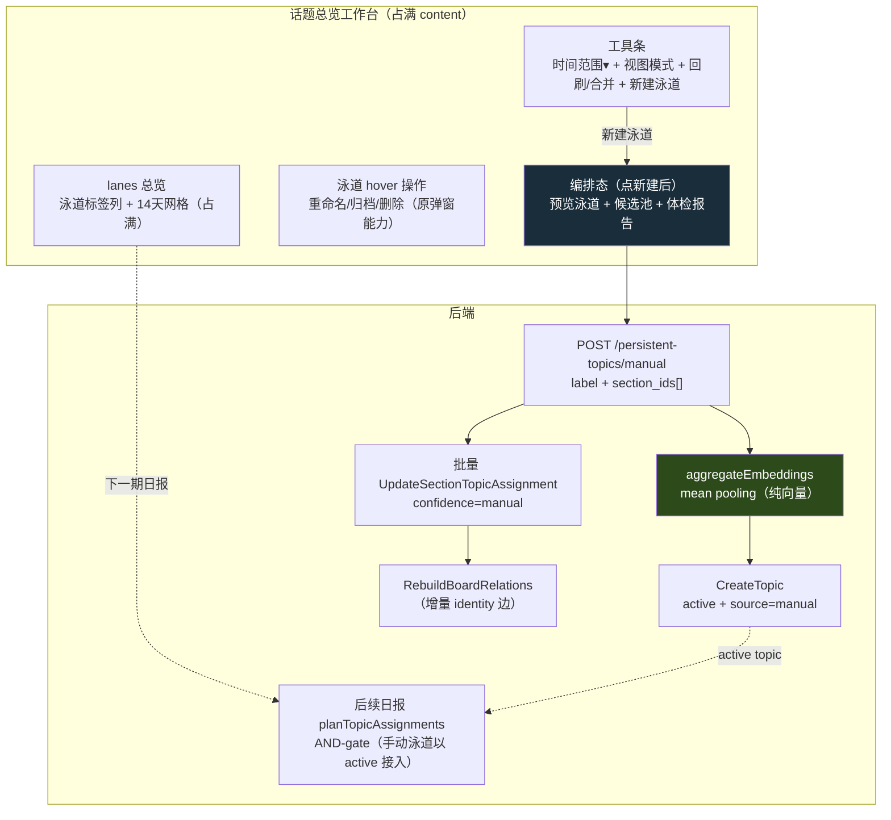

# Design: 话题总览工作台 + 手动建泳道

## 1. Context

持久化话题（persistent-topic）让 section→topic 归属全自动（聚类 + embedding AND-gate + LLM 双重确认），但用户全程无法干预：误聚类纠正不了、想主动串联几条 section 做不到、话题管理只能对已有 topic 弹窗维护。本 change 把话题总览升级成占满式工作台，补"编排主权"。

约束：

- 后端 Go/Gin + GORM + PostgreSQL/pgvector；前端 Nuxt 4 + Vue 3 + 手写 SVG 画布。
- `board_persistent_topics` 现有 `status`(candidate/active/archived) + `upgrade_threshold`(默认3) 门禁；`daily_report_sections.persistent_topic_id` 单值；`topic_match_confidence` 现为 anchor_hit/auto_new/unmatched 三态。
- `BoardThreadBrowser` 已有 timeline/lanes/focus 三模式；lanes 同天多节点已纵向堆叠（`subOffset` + 自适应 `laneH`）。
- `TopicManageDialog`（回刷/重命名/归档/合并）是现有话题维护入口。
- 单用户、无 auth；embedding 经 `airouter`，手动建泳道**不**走 AI（纯向量聚合）。

## 2. Goals / Non-Goals

**Goals**

- 用户可在话题总览工作台手动新建泳道、勾选 section 串联，保存为参与自动归属的 active topic。
- 话题总览占满 content，弃用 `TopicManageDialog` 弹窗，维护能力并入工具条 + 泳道 hover。
- 手动建泳道有充分的"评判依据"——编排态实时预览 + 体检报告（聚类质量 / 撞车 / 离群）。

**Non-Goals（明确不做）**

- 不动 persistent_topic 的**自动**生命周期算法（candidate→active 仍走 upgrade_threshold；active→archived 仍走 decay_window + 手动）。手动建泳道是**绕过**门禁的新路径，不改门禁本身。
- 不动 embedding AND-gate / 聚类 / 双重确认算法（手动泳道建好后以 active 身份天然接入，不特殊对待）。
- 不做 section 多对多归属（`persistent_topic_id` 保持单值；"移动"=覆盖，非共享）。
- 不做体检报告第④项"未来预期"（预览历史 section 潜在命中）——v1 不做，留 v2。
- 不做编排态的 section 跨期范围自定义（候选池固定取时间范围选择器的窗口，默认 14 天）。

## 3. 架构总览

关键接入点：**手动建泳道是用户即时操作（独立 API + 事务），不在 SaveReport 日报生成流程内**；建好的 active topic 在下一期日报生成时天然被 `ListAnchorableTopicsByBoard` 纳入 AND-gate。

## 4. 决策点

### 4.1 手动建泳道直接 active + source=manual，绕过门禁

**选**：手动建泳道 `status=active`、新增 `source='manual'`，跳过 candidate 阶段与 `upgrade_threshold` 连续命中门禁。

**理由**：用户主权声明，且选中 section 本身就是内容支撑（不像自动 candidate 只凭单期聚类）。直接 active 让它立刻享受 active 话题的内容注入（`buildClusterSystemPrompt` 注入近期 section），并参与自动归属。`source` 字段区分来源，便于后续观察"手动 vs 自动"的归属质量差异，不混入算法统计。

**备选（否决）**：手动建也走 candidate，连续命中 3 天才转 active。否决：用户已经手动挑了 N 条 section，再让他等 3 天才能用，违背"编排主权"初衷；且 candidate 不享受内容注入，体验割裂。

### 4.2 embedding 来自选中 section 聚合（mean pooling）

**选**：新 topic 的 embedding = 选中 N 个 section embedding 的平均向量。

**理由**：复用现有 `daily_report_backfill_topics.go` 的 average_link 思路（已是项目验证过的向量聚合方式），纯运算无 AI 成本。平均向量代表"这组 section 的语义中心"，作为 AND-gate 锚点合理。同时计算每个选中 section 到该中心的距离，用于编排态体检（贴合/边界/离群判定）。

**备选（否决）**：取 label 文本 embedding。否决：label 是用户起的宽名字，embed 出来容易"泛地缘式"误吸，正是 persistent-topic 当初引入 AND-gate 要避开的污染回路。

### 4.3 归属覆盖单值 + confidence=manual 第四态

**选**：选中 section 的 `persistent_topic_id` 被改写到新泳道（覆盖原值），新增 `topic_match_confidence='manual'` 标记"人工归属，非算法"。

**理由**：`persistent_topic_id` 现为单值（每个 section 恰好归属 1 个 topic），"移动"即覆盖，符合现有约束，不引入多对多复杂度。`confidence=manual` 让前端能区分显示（手动归属的节点不套用算法的三态样式，避免误导），也让后续可统计"哪些归属是人工干预的"。

**备选（否决）**：section 多对多（同时属原话题 + 新泳道）。否决：要把单值外键改成中间表，波及归属算法/关系重建/所有查询，工程量与收益不匹配；用户真正要的是"纠正/重组"，不是"同时挂着"。

### 4.4 离群只标黄、不自动删

**选**：编排态实时计算选中 section 到聚合锚点的距离，超过 `match_threshold × 1.3` 标为离群（黄框 + "建议剔除"），但**不自动移除**，由用户勾选决定。

**理由**：离群是提示不是判决——用户可能有理由把一条语义偏离的 section 硬串进来（如"美伊博弈"里放一条"油价波动"做关联参照）。自动删会剥夺判断权，且阈值是拍值可能误伤。标黄 + 体检报告"一键剔离群"按钮（用户主动点）是平衡点。

### 4.5 弃弹窗，能力并入工作台

**选**：删除 `TopicManageDialog.vue`，其能力（回刷归属 / 重命名 / 归档 / 合并）并入工作台工具条（回刷/合并）+ 泳道 hover 操作菜单（重命名/归档/删除）。

**理由**：弹窗与工作台是两套入口，并存会让用户困惑"去哪管理话题"。工作台占满式布局有空间承载全部维护操作，且 hover 就地操作比弹窗逐个点击高效。`source=manual` 的话题与自动话题在 hover 操作上一视同仁（都可重命名/归档/删除）。

**备选（否决）**：弹窗保留只管"已有话题维护"，新建+串联放工作台。否决：两套入口维护心智负担大，且 hover 操作已覆盖弹窗所有能力，弹窗成冗余。

### 4.6 候选池时间范围默认 14 天

**选**：编排态候选 section 池取时间范围选择器的窗口，默认 14 天（与总览窗口一致，可切 7/30/全部）。

**理由**：14 天与话题总览窗口对齐，用户在总览看到什么，编排时就能选什么，所见即所建。全部历史 section 太多（噪音大、滚动累），14 天是"最近活跃内容"的合理窗口。

## 5. Risks / Trade-offs

- **[手动泳道 embedding 过宽误吸]** → 聚合向量可能比单 section 向量"宽"，后续日报自动归属时吸进过多 section。缓解：编排态体检"撞车检查"提示与现有 topic 重叠；后续 v2 的"未来预期"预览；观察后视情况对手动 topic 收紧 match_threshold。
- **[归属覆盖破坏聚类血统]** → 手动把 section 从原 topic 移走，原 topic 的 identity 关系链可能断。缓解：建泳道事务末尾触发 `RebuildBoardRelations`（幂等重建该 board 的全部关系，含 identity 边重算），保证血统一致。
- **[manual confidence 与前端三态样式冲突]** → 现有 observability 节点三态（实心/边界/空心）基于 distance + 算法 confidence。手动归属无算法距离语义。缓解：`confidence=manual` 的节点在 lanes 用独立样式（如双环描边）区分，hover 显示"人工归属"，不套用算法三态。
- **[聚合 embedding 维度/格式]** → mean pooling 需保证所有选中 section embedding 同维度（正常应是）。缓解：聚合前校验维度一致，维度缺失的 section 跳过并提示。
- **[回刷归属能力迁移]** → 从弹窗迁到工具条，需保证触发参数（boardId）一致，不丢原有批量回刷语义。

## 6. Migration Plan

1. 后端：版本化迁移新增 `board_persistent_topics.source` 列（默认 `'auto'`，CHECK 约束 auto/manual）；历史行保持 auto 不回填。
2. 后端：`BoardPersistentTopic` 模型加 `Source` 字段；`topic_match_confidence` 枚举常量加 `TopicConfManual`。
3. 后端：新增手动建泳道 service（事务：聚合 embedding → CreateTopic(active,manual) → 批量 UpdateSectionTopicAssignment(manual) → RebuildBoardRelations）+ handler + 路由。
4. 前端：`BoardThreadBrowser` 工作台化（工具条 + lanes 占满 + 泳道 hover 操作）。
5. 前端：编排态（viewMode='compose'）预览泳道 + 候选池 + 体检报告。
6. 前端：迁移回刷/重命名/归档/合并能力到工作台，删除 `TopicManageDialog.vue`。
7. 部署：迁移幂等；历史 topic source=auto 不受影响；manual confidence 为新增枚举值，老前端遇此值降级显示为普通节点。
8. 回滚：DROP source 列可逆；手动建泳道 API 可独立 revert；前端改动可独立 revert。

## 8. 项目执行规范约束（实现期强制遵循）

本变更实现期必须遵守 `docs/reference/开发执行规范.md` 与前端架构文档，以下列出与本次强相关的约束（非全量复述）：

### 8.1 后端（§4）

- **业务逻辑按域组织**：手动建泳道属 `internal/topicgraph/` 域，handler 薄封装、业务逻辑不在 handler/router 内（§4.4）。
- **Handler 响应格式统一**：`gin.H{"success": bool, "data"|"error"|"message": ...}`（§4.4）。
- **错误包装**：`fmt.Errorf("context: %w", err)`，禁止 panic（§4.4）。
- **JSON snake_case**（§4.4）。
- **测试双层（§4.2）**：
  - embedding 聚合纯函数 / 离群判定 / source 字段 CRUD 等**轻量纯逻辑** → 内存 SQLite。
  - 涉及 pgvector 真实向量 / 迁移幂等 / 手动建泳道事务零副作用断言（identity 边重建一致）→ testcontainer pgvector。
- **迁移**：版本化迁移（`platform/database/postgres_migrations.go`），幂等、有回滚路径（§10）。
- **质量门禁**：`golangci-lint run && go vet && go test && go build`（§4.1）。
- **变更控制（§8）**：apply 阶段禁止改 proposal 需求范围；需变更走 delta。

### 8.2 前端（§5 + 架构文档）

- **双主题系统**：editorial（暖白）+ dark（深色）。编排态节点三态、离群黄框、体检卡片颜色 MUST 由语义 token（`--color-*`）派生，不写死色值；`confidence=manual` 的双环节点样式同样跟随主题。
- **统一组件库**：编排态泳道名输入用 `AppInput`、保存/取消用 `AppButton`、撞车确认用 `AppDialog`，禁止原生样式、禁止 `window.alert/prompt/confirm`。
- **API 边界归一**：手动建泳道 + 批量改写归属经 `app/api/client.ts` 的 `ApiClient`，封装进 `app/api/`（新 `persistentTopics.ts` 或并入 `dailyReports.ts`）。
- **命名转换**：snake_case → camelCase 在 normalizer 层完成；数字 ID 转字符串。
- **`<script setup lang="ts">`** Composition API（§5.4）。
- **质量门禁**：`pnpm lint && nuxi typecheck && pnpm test:unit && pnpm build`，其中 typecheck/build MUST 经 Windows cmd（AGENTS.md）。

### 8.3 架构体检（§7，强制）

- 每个子任务完成后跑 `codegraph impact <符号>` + `codegraph affected <文件>`；HIGH/CRITICAL 风险必须暂停报告。
- **已知局限**：codegraph 追踪不到 Gin `group.POST(..., fn)` 注册，新增 handler 会被误报"无调用者"，需 grep 路由注册二次确认，不得误删。
- **传导链守卫**：手动改写 section 归属后，重跑 `TestTopicLineageSurvivesClusterDrift` + identity 边相关测试，确认血缘未被打散。

### 8.4 数据兼容性（§10）

本变更含 DDL（`board_persistent_topics.source` 列），必须：
- 确认既有数据兼容（历史 topic source 默认 auto 不报错）。
- 迁移可重复执行（幂等）。
- `topic_match_confidence=manual` 为新增枚举值，向后兼容（老前端忽略降级）。
- 列回滚路径明确（DROP COLUMN 可逆）。

### 8.5 文档流转（§12）

- `docs/reference/`（api / database / architecture / flow）在**里程碑收尾时**统一更新，不在本 change 内逐条改活文档。
- 本 change tasks 的文档节列出待更新 reference 清单，标注「里程碑收尾」。触及 daily-report flow 的，archive 后按 §12.2 补「变更溯源」链接。

## 9. Open Questions

- **聚合向量是否归一化**：mean pooling 后是否需要重新归一化到单位向量再存（pgvector cosine 对向量长度不敏感，但与现有 backfill 行为对齐需确认）——tasks 阶段核对 `daily_report_backfill_topics.go` 的处理。
- **撞车检查的"建议合并"是否可操作**：体检报告"撞车"卡当前只提示 + "坚持新建"，是否要加"一键合并到现有 topic"（调合并 API）——倾向 v1 只提示，合并走工作台既有合并预览。
- **lanes 占满后的纵向密度**：mockup 每条泳道 74px，泳道多时纵向滚动体验需浏览器视觉验收微调。
