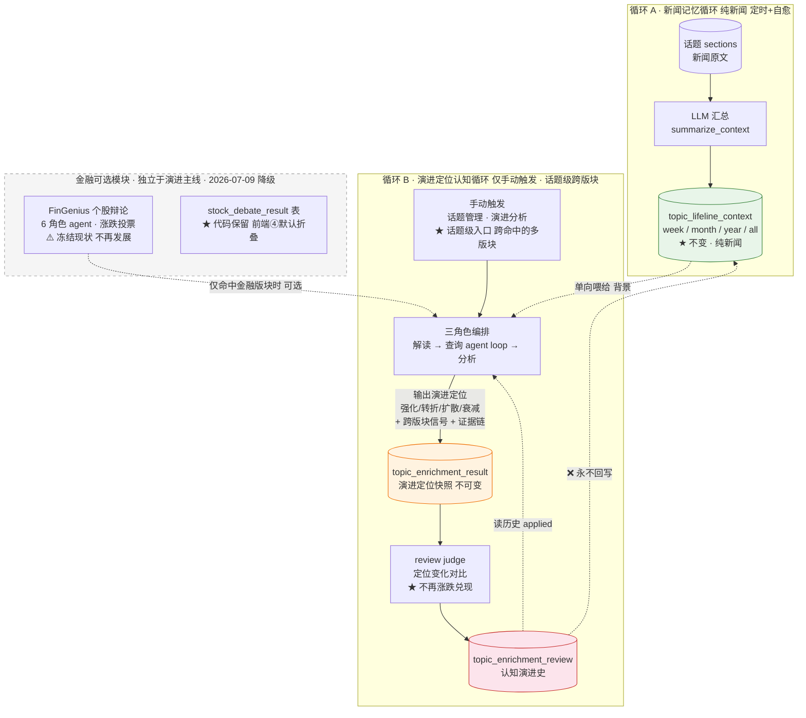
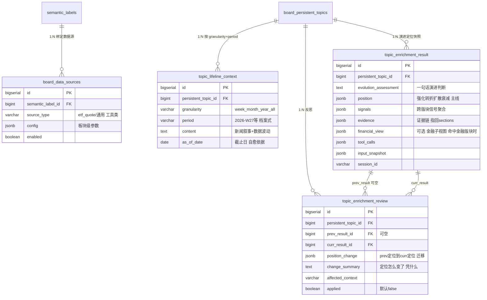
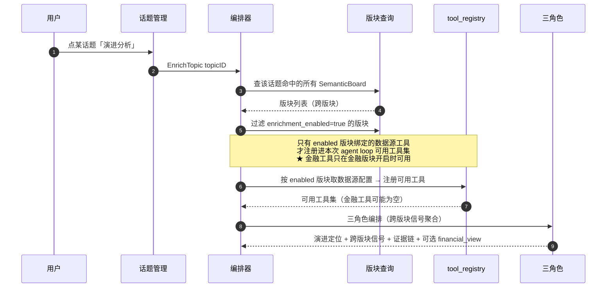
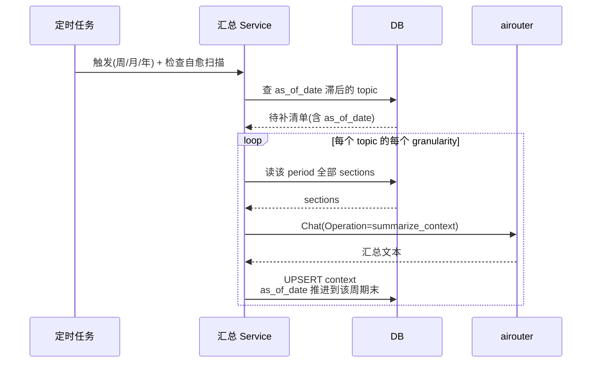
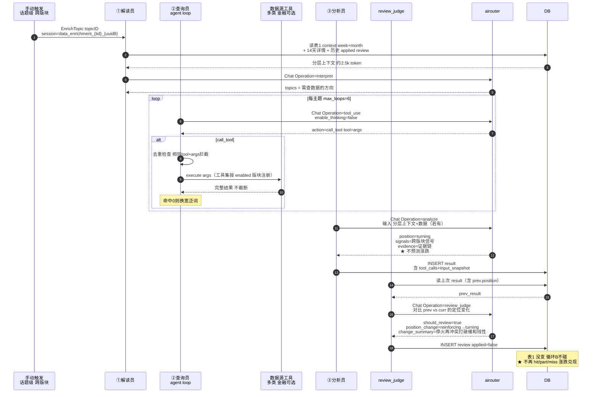
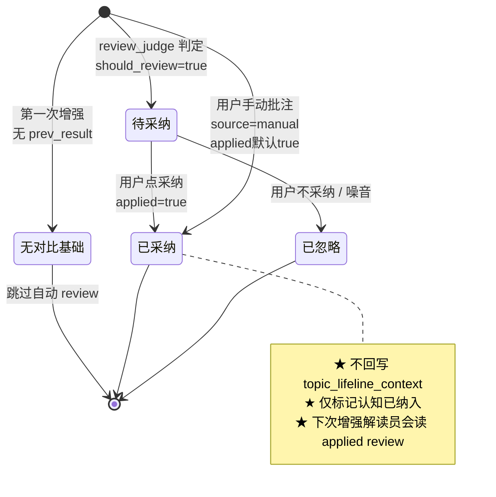
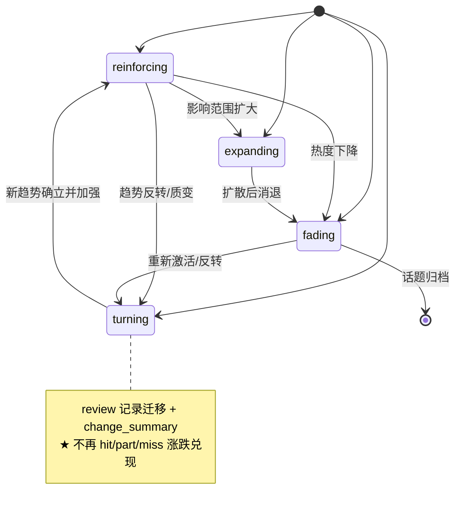
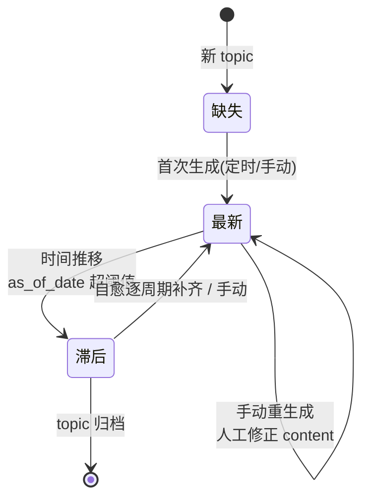
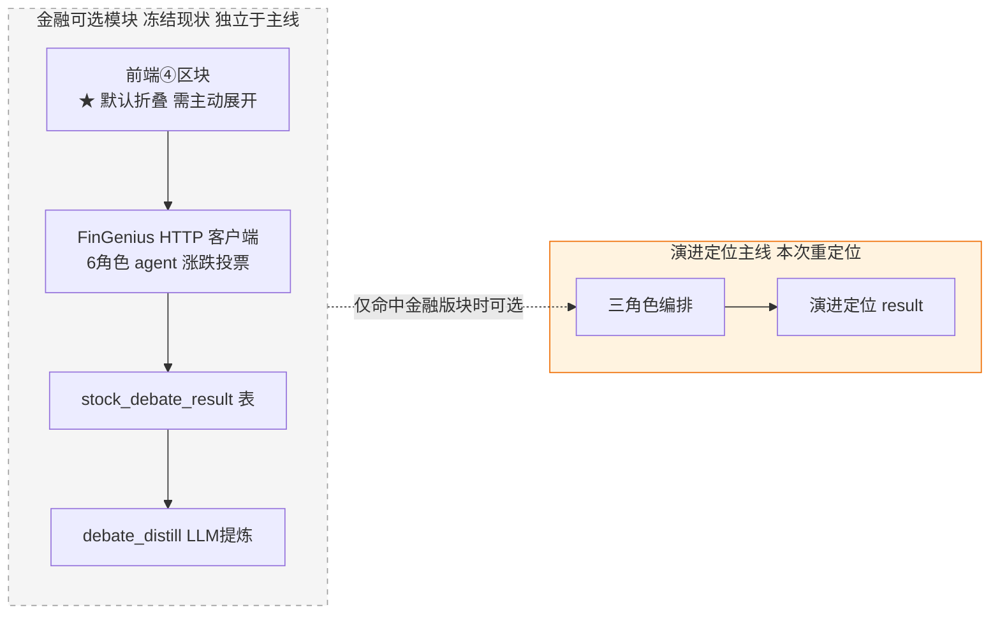

# 概要设计 — data-enrichment-orchestration（演进定位主线 · 2026-07-09 重定位）

> 持久话题的**认知闭环系统**：沿话题泳道做演进定位，数据源是 agent 工具（金融只是其一）。
> 本文用 mermaid 辅助说明**顺序、状态、表结构依赖**。完整决策见 `design.md`，字段约束见 `specs/data-enrichment/spec.md`。
>
> **本次重定位（2026-07-09）**：主线从「金融走向预测 + 涨跌兑现」拉回到「持久话题演进定位」。金融降为可选数据源视角；FinGenius 个股辩论冻结现状、标为金融可选模块、独立于演进主线、前端默认折叠。骨架（三角色编排 / 三表分离 / agent loop / 可观测性 / 循环A）保留。

---

## 0. 产品定位（为什么重定位）

Syntopica 的产品主轴是**持久话题的泳道演进**：一个 persistent topic 每天被日报 section 归属、按天排成一条线（`identity` 轨保证泳道连续，`similarity` 轨给时间线状态）。**泳道本身就是「新闻被串起来」的成品。**

数据增强该做的，是在这条串好的线之上帮用户判断**「现在走到哪了」**——而不是脱离泳道做「未来涨跌预测 + 兑现打分」（那是金融分析师的工作流，套不进非金融话题）。

| 话题 | 旧主线（走向预测）能做吗 | 新主线（演进定位） |
|---|---|---|
| 美伊局势 | ✅ 能（查原油/黄金）但只盯涨跌 | ✅ 沿泳道判"停火→再冲突 = turning" + 跨版块（地缘/能源/贵金属）信号 + 行情作佐证 |
| Rust 1.x 发布 | ❌ 没有"涨跌"可预测 | ✅ 判"长期演进中的版本节点定位" |
| AI 模型军备 | ❌ 没有"涨跌" | ✅ 判"从训练算力 → 扩散到端侧/芯片 = expanding" |
| 某框架停维 | ❌ 没有"涨跌" | ✅ 判"长期增长 → 突然停维 = turning" |

一句话：**演进定位一个框架服务所有话题；金融走向降为命中金融版块时的可选子视图。**

---

## 1. 架构总览：两个独立循环 + 三表认知闭环

两个循环通过 `topic_lifeline_context`（表1）**单向连接**——循环 A 只产新闻记忆，循环 B 消费它并自我迭代，但 review 永远不回写表1（保持新闻事实客观）。



**为什么循环 B 仅手动**：不是所有话题都需要增强（如纯版本发布），自动挂日报管线浪费成本。但**一旦触发，就走话题级跨版块**——agent 能看到该话题命中的所有版块信号，不再锁死单板块。

**三表关注点分离**（生命周期/关联关系都不同，必须独立）：

| 表 | 角色 | 生命周期 | 可变？ |
|---|---|---|---|
| `topic_lifeline_context` | 新闻记忆（背景） | 滚动更新，按周期 | 可（循环A刷新/人工编辑） |
| `topic_enrichment_result` | 当下演进定位（快照） | 一次分析一行 | **不可变**（否则没法对比） |
| `topic_enrichment_review` | 两次定位间的变化（反思） | 追加 | change_summary 可人工调 |

类比人的认知：**记住过去（表1）→ 形成定位（表2）→ 反思变化（表3）→ 下次定位更准（读历史 review）**。表3 永远不污染表1（新闻事实保持客观）。

---

## 2. 演进定位四档（替换旧 direction 涨跌）

分析员对每个话题产出一个**演进定位**，判断这条线现在走到哪了：

| 定位 | 含义 | 典型场景 |
|---|---|---|
| `reinforcing` 强化 | 现有趋势在延续/加强 | 美伊：上月停火→本月再冲突，"紧张"趋势强化 |
| `turning` 转折 | 方向反转或质变 | 某框架长期增长→突然宣布停维 |
| `expanding` 扩散 | 影响传导到新领域/新主体 | AI 军备：训练算力→扩散到端侧/芯片/能源 |
| `fading` 衰减 | 热度/影响力下降 | 某短期事件逐渐没人报道 |

**为什么不预测涨跌**：涨跌是金融专属语义，套不进非金融话题；演进定位是话题通用的。金融走向降为命中金融版块时的**可选子视图**（`financial_view`，见 §4 schema）。

---

## 3. 表结构依赖（ER 图）

5 张表，其中 `topic_enrichment_result` 与 `topic_enrichment_review` 的**字段语义随定位变更**（表结构基本不动，存的是演进定位而非走向预测）。`stock_debate_result` 属金融可选模块。



> **注**：`topic_enrichment_result` 不再有 `sectors[].direction/trigger`（涨跌语义）；`topic_enrichment_review` 不再有 `verdict[]{mark:hit/part/miss}`（涨跌兑现）。语义换、表结构基本不动（position/signals/evidence 用 jsonb，旧 sectors jsonb 字段名保留或迁移，见 design）。

---

## 4. 循环 B 分析员输出 schema（演进定位 · 核心）

```
输入: 表1 context（当前周期 + 历史 period）+ 14天详情 + 查询员数据 + 历史 applied review
输出: JSON {
  evolution_assessment,                 // 一句话演进判断
  position: "reinforcing"|"turning"|"expanding"|"fading",   // ★ 演进定位（替 direction 涨跌）
  signals: [{                           // ★ 跨版块信号聚合（话题命中的多个版块）
    board,                              //   命中的 SemanticBoard（可多个）
    signal,                             //   信号描述
    mechanism                           //   传导/关联机制
  }],
  evidence: [{                          // 证据链（指回 sections/context，不变）
    context_id, period, quote           //   引用哪段 context 的原话
  }],
  financial_view: {                     // ★ 可选：金融子视图（仅命中金融版块时产出）
    sectors: [{ sector, direction, supporting_data }]  // 原金融走向，降级为可选
  },
  causal_chain, overall
}
```

**关键变化（相对旧设计）**：
- `position` 替 `direction`：从"涨/跌/横盘"→"强化/转折/扩散/衰减"，话题通用。
- `signals` 替 `sectors`：从"金融板块走向"→"跨版块信号聚合"，显式跨版块。
- `evidence` 保留：证据链指回 sections/context 原话（前端 tooltip 悬停展示，不跳转），这块设计本来就对，不动。
- `financial_view` 可选：原 `sectors` 的金融走向内容降级进这里，**仅当话题命中绑定了金融数据源的版块时**才产出。

---

## 5. 触发：话题级跨版块（核心变化）



**enrichment_enabled 跨版块语义**：
- 触发入口在**话题级**（话题管理界面点「演进分析」）。
- 话题命中的版块里，**只要有一个 `enrichment_enabled=true` 就允许触发**（演进定位本身不依赖金融数据）。
- 分析时，agent 看到该话题命中的**所有版块**的信号（演进定位是跨版块的）；但**只有 enabled 版块绑定的数据源工具**才注册进 agent loop 的可用工具集。
- 效果：**演进定位永远能跑**（纯新闻驱动也成立）；**金融数据只在用户开启的版块生效**（尊重板块级开关，不强制全跑金融）。

---

## 6. 循环 A：新闻汇总（顺序图，不变）

定时触发（周/月/年）+ 检查自愈（补遗漏周期）+ 手动重生成。**本次重定位不改循环 A**——它是新闻汇总基础设施，与演进定位主线正交。



---

## 7. 循环 B：演进定位认知（顺序图）



---

## 8. 状态机

### 8.1 review 的 applied 生命周期（认知采纳，不变）



### 8.2 review 的 position_change 迁移（新增 · 替涨跌兑现）



### 8.3 context 的滚动状态（不变）



---

## 9. FinGenius 个股辩论（金融可选模块 · 独立于演进主线 · 2026-07-09 降级）



**降级处理（2026-07-09）**：
- **代码冻结**：`fingenius_client.go` / `stock_debate_result` 表 / `debate_distill` Operation / `DebateSection.vue` / 36 个测试，**原样保留不动**。
- **定位隔离**：proposal/design 标注「金融可选模块 · 独立于演进定位主线 · 不再作为主线发展」。
- **前端折叠**：`DebateSection.vue` 默认折叠，需用户主动展开；仅当话题命中金融版块时才提示可用。
- **不再冲突**：演进定位主线说"我不预测涨跌"，FinGenius④说"我预测个股涨跌"——两者**并存但隔离**，④明确是可选金融增强，不混入演进定位 result/review。

---

## 10. 关键约束速查

| 约束 | 说明 | 落地点 |
|---|---|---|
| **单向不回写** | review 永远不写 `topic_lifeline_context` | review_judge.go |
| **快照不可变** | `topic_enrichment_result` 写入后不修改 | repository |
| **循环B仅手动** | 不挂日报管线，话题级手动触发 | handler |
| **★ 话题级跨版块** | 触发吃单 topicID，内部聚合该话题命中的**所有版块**信号 | orchestrator（新） |
| **★ 演进定位非涨跌** | 分析员输出 `position`(强化/转折/扩散/衰减)，不预测涨跌 | orchestrator（改） |
| **★ 工具按版块注册** | 只有 enabled 版块的数据源工具进 agent loop 可用集 | orchestrator（新） |
| **★ review 判定位变化** | 对比 prev.position vs curr.position，不做 hit/part/miss | review_judge.go（改） |
| **★ 金融为可选视角** | `financial_view` 仅命中金融版块时产出 | orchestrator（改） |
| **★ FinGenius 独立折叠** | 冻结现状，前端④默认折叠，不进主线 | DebateSection.vue |
| **自愈补遗漏** | 补 as_of_date 之后的遗漏周期 | lifeline_context.go（不变） |
| **thinking 关闭** | 本地 Qwen3 请求带 `enable_thinking=false`（走 DB provider 配置） | airouter 请求层（不变） |
| **历史不截断** | agent loop 累积完整工具结果 | orchestrator（不变） |
| **去重拦截** | 相同 tool+args 直接挡 | orchestrator（不变） |

---

## 11. 可追溯性（不变 · 强化保留）

每次演进分析的所有切片 SHALL 可查、可重建：

| 切片 | 输入 | 输出 | 存哪 |
|---|---|---|---|
| 解读员 | 分层上下文（rendered） | topics JSON | `ai_call_logs`（messages+content） |
| 查询员每轮 | 主题+工具+历史 | action JSON | `ai_call_logs` |
| 工具调用 | args | 返回结果+耗时 | `result.tool_calls` jsonb |
| 分析员 | 分层+数据 | position/signals/evidence | `ai_call_logs` + `result` |
| review_judge | prev+curr result | position_change JSON | `ai_call_logs` + `review` |
| 编排元数据 | 读的context层/版块范围/as_of/section范围 | — | `result.input_snapshot` jsonb |

**排查路径**：`result.session_id` → `GET /api/ai/call-logs?session_id=` 重建该次演进分析的全部 LLM 调用；`result.tool_calls` + `result.input_snapshot` 补齐工具与输入上下文（含跨版块范围）；三表持久化全部中间结论。

---

## 12. Operation 速查

| Operation | 循环 | 角色 | 触发 | 变化 |
|---|---|---|---|---|
| `data_enrichment.summarize_context` | A | 汇总 | 定时/自愈/手动 | 不变 |
| `data_enrichment.interpret` | B | 解读员 | 手动演进分析 | 不变 |
| `data_enrichment.tool_use` | B | 查询员每轮 | 手动演进分析 | 不变（工具集按版块动态注册） |
| `data_enrichment.analyze` | B | 分析员 | 手动演进分析 | ★ prompt+输出改演进定位 |
| `data_enrichment.review_judge` | B | review 对比 | 演进分析后 | ★ 改定位变化对比 |
| `data_enrichment.debate_distill` | 可选 | FinGenius 提炼 | 手动④辩论 | 冻结（金融可选模块） |

SessionID 规则：循环 B = `data_enrichment_{topic_id}_{uuid8}`；循环 A = `lifeline_context_{topic_id}_{granularity}_{uuid8}`；辩论 = `data_enrichment_debate_{tid}_{rid}`。

---

## 13. 前端认知工作台（区块重做范围）

| 区块 | 旧（金融走向） | 新（演进定位） | 改动 |
|---|---|---|---|
| ① 新闻记忆 | 周期筛选翻历史 + 编辑 | 同 | 🟢 不动 |
| ② 走向预测 → **演进定位** | 板块可展开卡片（涨红跌绿/置信度/触发） | **演进定位卡片**（position 四档 + 跨版块信号 + 证据链 tooltip） | 🔴 重做 |
| ③ 兑现复盘 → **定位变化** | hit绿/part黄/miss红 结算 | **定位迁移**（prev→curr + change_summary） | 🔴 重做 |
| ④ 个股辩论 | 明牌④区块 | 折叠 + 标「金融可选·独立」 | 🟡 折叠降级 |
| ⑤ 数据源/参数 | 板块配置 | 同（加版块数据源类型说明） | 🟢 微调 |

**术语翻译**：position → 走势定位（强化/转折/扩散/衰减）；signals → 涉及的版块信号；position_change → 这次跟上次比怎么变了；禁用 direction/trigger/verdict/hit/miss 等金融术语（除非在④折叠区内）。
