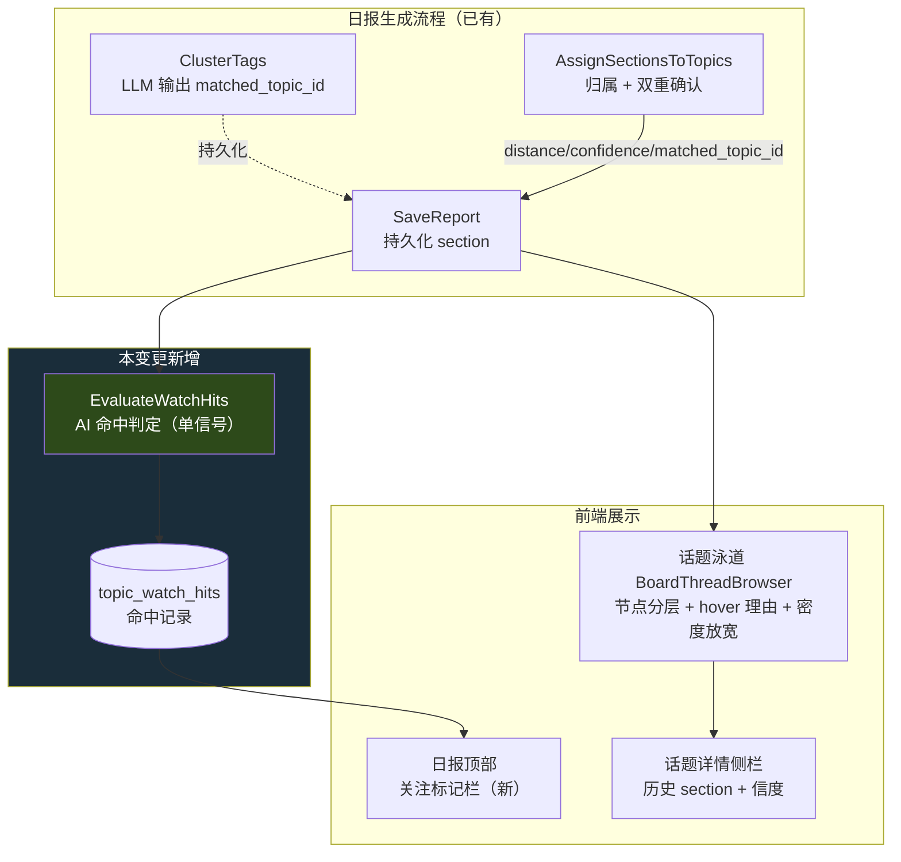

# Design: 关注标记 + 归属理由可视化 + 画布密度

## 1. Context

持久化话题（persistent-topic）上线后暴露三类问题（详见 proposal）：归属黑盒、无法主动追踪、画布太窄。本变更把"可观测 + 用户主权 + 可读性"作为基座，刻意**不动算法本身**（embedding AND-gate、聚类、生命周期），只补"看、盯、看清"三件事。

约束：

- 后端 Go/Gin + GORM + PostgreSQL/pgvector；前端 Nuxt 4 + Vue 3 + 手写 SVG 画布。
- `matched_topic_id` 当前是 `gorm:"-"` 瞬态字段，归属后即弃。
- `BoardThreadBrowser` 是 2D SVG 画布（timeline/lanes 双模式），与 3D `TopicGraphCanvas` 无关。
- 单用户、无 auth；AI 经 `airouter` 统一出口。

## 2. Goals / Non-Goals

**Goals**

- 用户可声明"关注标记"，AI 每期日报判定命中，命中在日报顶部独立栏展示。
- section 归属理由（distance / confidence / LLM 选的 topic）全程可追溯、可看见。
- 话题画布默认可读，无需浏览器缩放。

**Non-Goals（明确不做）**

- 不动 persistent_topic 的 embedding AND-gate / 聚类 / 生命周期算法（那是后续 change 的事）。
- 关注标记不做"筐"（不累积 section 历史、不参与归属、无生命周期）。
- 不做画布响应式（窗口宽度自适应），只调默认密度。
- 不做 section 级"移动/拒绝"纠错（柱 C，留后续）。
- 不回刷历史 section 的 `matched_topic_id`。

## 3. 架构总览

关键接入点：**关注命中判定挂在日报生成流程最末**（归属完成后），对 section 归属零副作用。

## 4. 决策点

### 4.1 关注标记是独立实体，不并入 persistent_topic

**选**：新建 `board_topic_watches` / `topic_watch_hits`，与 `board_persistent_topics` 完全隔离。

**理由**：persistent_topic 的 embedding AND-gate 是污染回路的根源（宽框架误吸）。把用户声明的话题塞进同一实体 + 同一 gate，等于给污染回路开一个人工入口，且更难察觉（用户信任自己种的）。独立实体让"盯梢"绕开整条复杂逻辑，简单、零污染。

**备选（否决）**：复用 persistent_topic 加 `source=manual` 字段。否决：会把生命周期门禁、embedding 刷新、聚类注入等一堆不适用语义带进来，且污染回路上身。

### 4.2 关注命中走 AI 单信号，不走 embedding 双重确认

**选**：AI 单信号判定命中。

**理由**：关注是用户**意图声明**（"美伊会不会真打起来"），不是聚类产物。意图声明天然没有 embedding 锚点（除非用 label 文本 embed，但宽 label embed 出来靠近"泛地缘"，反而误吸）。AI 看懂这句话去匹配 section，比算向量更准。成本：每期日报多一轮批量 AI 调用。

**备选（否决）**：label 文本 embed + 最近邻。否决：宽 label 误吸，且和 persistent_topic 的 gate 行为不可区分。

### 4.3 matched_topic_id 由瞬态转持久化

**选**：新增列 `matched_topic_id`（可空），版本化迁移，历史 NULL 不回填。

**理由**：理由可视化的"AI 是否认同"这一半完全依赖此字段。不持久化，理由永远是单腿（只有 distance，没有 LLM 判断）。历史回填无意义（当时的 LLM 输出已丢失）。

### 4.4 边界命中的判定比例

**问题**：节点分层三态里"边界命中（半实心）"需要界定 distance 阈值。

**默认**：`distance > match_threshold × 0.85` 且 `≤ match_threshold` 视为边界（以 match_threshold=0.30 为例，边界区间 ≈ [0.255, 0.30]）。

**验证**：用真实 board 的 section distance 分布直方图校准该比例，避免边界区间过宽（满屏半实心失去提示意义）或过窄（几乎不触发）。

### 4.5 画布密度放宽，不引入响应式

**选**：调 `COL_W`（148→约 200）、字号上调、默认 `zoomScale` 1→约 1.25。不动窗口宽度响应。

**理由**：响应式重排是更大的工程（SVG 坐标全依赖固定常量），且当前 `viewportWidth` 仅判移动端。先治最直接的痛（默认太小），用最小改动换最大可读性提升。横向滚动用户已确认接受。

## 5. Risks / Trade-offs

- **[宽关注标记误中过多]** → 关注 label 若过宽（如"中东局势"），AI 可能命中大量 section，顶部栏拥挤。缓解：UI 限制顶部栏展示条数（如每组最多 5 条 + 折叠）；prompt 约束 AI 保守判定；观察后视情况加"最小相似要求"。
- **[AI 命中判定成本]** → 每期日报多一轮 AI 调用。缓解：批量单次请求涵盖全部 section × 关注；关注数通常很少（个位数）。
- **[matched_topic_id 迁移兼容]** → 历史行 NULL，前端需处理 NULL（hover 显示"历史数据，无 AI 判断记录"）。
- **[画布密度放宽后泳道过高]** → lanes 视图话题多时纵向已可能很高，密度放宽不直接影响纵向，但节点标签变大可能挤压。缓解：验证时核 lanes 视图布局。
- **[边界比例需真实数据校准]** → 4.4 的 0.85 是拍值。缓解：tasks 含真实数据直方图校准步骤。

## 6. Migration Plan

1. 后端：版本化迁移新增 `daily_report_sections.matched_topic_id` 列（NULL）；新增 `board_topic_watches`、`topic_watch_hits` 两表。
2. 后端：`DailyReportSection.MatchedTopicID` 由 `gorm:"-"` 改为持久化 tag；归属流程写入该列。
3. 后端：日报生成流程末尾接入 `EvaluateWatchHits`。
4. 前端：画布密度参数 + 节点分层 + hover + 顶部栏 + 话题详情信度。
5. 部署：迁移幂等；历史 section 的 matched_topic_id 保持 NULL（前端降级显示）。
6. 回滚：删除两表与列；前端改动可独立 revert。关注命中写入失败 SHALL NOT 阻断日报生成（非致命，记日志跳过）。

## 8. 项目执行规范约束（实现期强制遵循）

本变更实现期必须遵守 `docs/reference/开发执行规范.md` 与前端架构文档，以下列出与本次强相关的约束（非全量复述）：

### 8.1 后端（§4）

- **业务逻辑按域组织**：关注标记属 `internal/topicgraph/` 域，handler 薄封装、业务逻辑不在 handler/router 内（§4.4）。
- **Handler 响应格式统一**：`gin.H{"success": bool, "data"|"error"|"message": ...}`（§4.4）。
- **错误包装**：`fmt.Errorf("context: %w", err)`，禁止 panic（§4.4）。
- **JSON snake_case**（§4.4）。
- **测试双层（§4.2）**：
  - 关注 CRUD / matched_topic_id 写入分支等**轻量 CRUD / 纯逻辑** → 内存 SQLite（`glebarez/sqlite` mode=memory，参考 `feed_service_test.go`）。
  - 涉及 pgvector / 真实 schema / 迁移幂等 / EvaluateWatchHits 零副作用断言 → testcontainer pgvector（`testutil.SetupTestDB(t)`）。
- **迁移**：版本化迁移（`platform/database/postgres_migrations.go`），幂等、有回滚路径（§10）。
- **质量门禁**：`golangci-lint run && go vet && go test && go build`（§4.1）。
- **变更控制（§8）**：apply 阶段禁止改 proposal 需求范围；需变更走 delta。

### 8.2 前端（§5 + 架构文档）

- **双主题系统（架构文档 §主题系统）**：editorial（暖白）+ dark（深色），通过 `<html data-theme>` 切换。**节点分层样式（实心/半实心/空心）、hover 气泡、关注栏的颜色 MUST 由语义 token（`--color-*`）派生，不写死色值**；顶部关注栏同样跟随主题。
- **统一组件库**：按钮用 `AppButton`、输入用 `AppInput`、弹窗用 `AppDialog`，禁止原生 button/input 样式类、禁止 `window.alert/prompt/confirm`（§13 已清零，本变更不得回退）。
- **API 边界归一**：所有 HTTP 经 `app/api/client.ts` 的 `ApiClient`，不在组件里直接 fetch（§5.4 + 架构文档 API 层）。关注 API 封装进 `app/api/`（新 `topicWatches.ts` 或并入 `dailyReports.ts`）。
- **命名转换**：snake_case → camelCase 在 normalizer 层（`camelizeKeys()`）完成，模板/组件内只用 camelCase；数字 ID 在 API 边界转字符串（§5.4 + 架构文档数据映射）。
- **Feature 封装**：禁止跨 feature 深 import 内部实现；共享 UI 上移 `components/`。
- **`<script setup lang="ts">`** Composition API（§5.4）。
- **质量门禁**：`pnpm lint && nuxi typecheck && pnpm test:unit && pnpm build`，其中 typecheck/build MUST 经 Windows cmd（AGENTS.md）。

### 8.3 架构体检（§7，强制）

- 每个子任务完成后跑 `codegraph impact <符号>` + `codegraph affected <文件>`；HIGH/CRITICAL 风险必须暂停报告。
- **已知局限**：codegraph 追踪不到 Gin `group.POST(..., fn)` 注册，新增 handler 会被误报“无调用者”，需 grep 路由注册二次确认，不得误删。
- 分层符合现有架构（后端 `internal/topicgraph/` + `internal/platform/*`；前端 feature + components 分层）。

### 8.4 数据兼容性（§10）

本变更含 DDL（`daily_report_sections.matched_topic_id` 列 + `board_topic_watches` / `topic_watch_hits` 两表），必须：
- 确认既有数据兼容（历史 section matched_topic_id NULL 不报错）。
- 迁移可重复执行（幂等）。
- GORM 模型字段变更不破坏 JSON 响应格式（matched_topic_id 为可空新增字段，向后兼容）。
- 列回滚路径明确（DROP COLUMN 可逆，两表 DROP 可逆）。

### 8.5 文档流转（§12）

- `docs/reference/`（api / database / architecture）在**里程碑收尾时**统一更新，不在本 change 内逐条改活文档。
- 本 change tasks 的文档节列出待更新 reference 清单，标注「里程碑收尾」。

## 9. Open Questions

- **关注命中 AI prompt 形态**：是把全部 section 文本 + 关注 label 一次喂给 AI 让它输出"哪个 section 命中哪个关注"，还是逐关注判定？倾向前者（一次请求），但需在 tasks 阶段定 prompt schema。
- **默认缩放/列宽具体值**：1.25 / 200 是估值，需浏览器视觉验收后微调。
- **顶部栏与现有"关心的话题/突发新话题"分区的关系**：顶部栏是"关注标记命中"，正文分区是"persistent_topic 归属"，二者语义不同，需 UI 上明确区分避免用户混淆。
