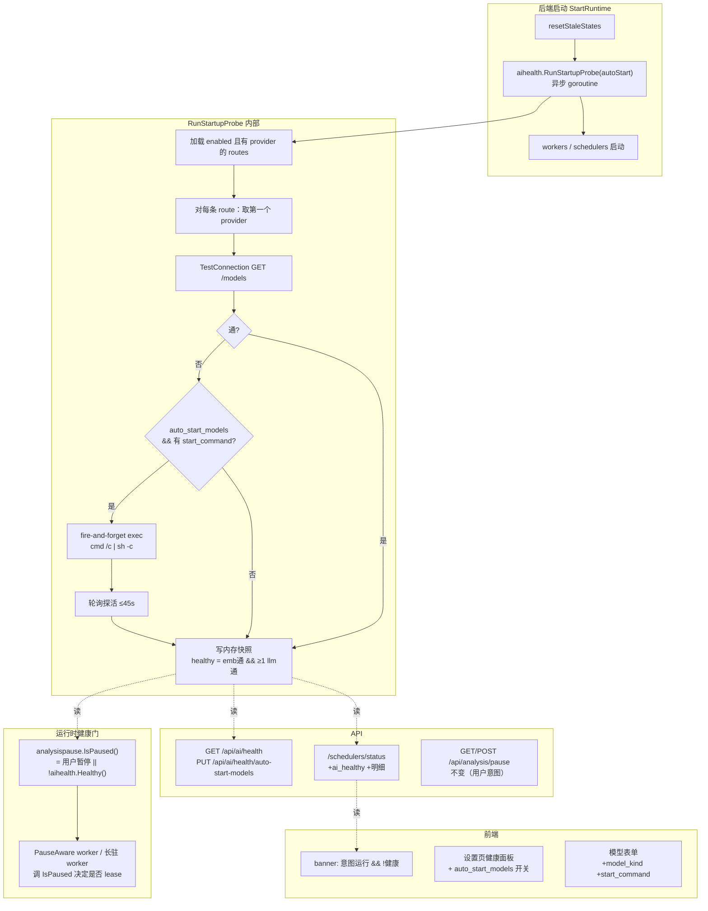

# Design: AI 模型健康门 + 启动自动拉起 + 模型类型区分

## 1. Context

- 单用户本地部署，主力 LLM/Embedding 后端是 **llama.cpp**（`llama-server`，OpenAI 兼容），每次重启要手动拉进程。
- 分析暂停闸 `analysispause.IsPaused()` 只读用户开关 `analysis_paused`（fail-open）；模型没好时分析照 lease，狂刷错误。
- `AIProvider` 无 llm/embedding 类型属性，只有 `provider_type`（openai_compatible/ollama = 协议）。
- 路由模型：`AIRoute`(capability) — `AIRouteProvider`(priority) — `AIProvider`；已有 `airouter.TestConnection`（GET `{base_url}/models`，零 token 探活）。
- 迁移：GORM AutoMigrate 加列；`postgresMigrations()` 版本化迁移做 backfill/约束。
- 前端：`useSchedulerStatus` 轮询 `/schedulers/status`（含 `analysis_paused`）；设置页 `SettingsSectionAiProviders.vue` / `SettingsSectionCapabilityRoutes.vue`。

约束（来自需求澄清，硬约束）：

- **硬执行**：模型没好时 worker 实际不跑（`IsPaused = 用户暂停 || !健康`）。
- **现有的暂停/启动按钮与 API 不动**（手动 start 不健康也不拒绝，靠健康门让 worker 不跑 + 前端 banner 提示）。
- **健康判定宽松**：embedding 主 provider 通 且 ≥1 条 llm 主 provider 通 即算健康。
- **健康检测只在后端启动触发**（无周期复检、无前端一键拉起）；只探每个 route 的第一个 provider。
- **自动拉起需总开关** `auto_start_models`（默认 off）；provider 侧 `start_command` 有值才被托管。

## 2. Goals / Non-Goals

**Goals**

- provider 显式区分 llm/embedding；embedding 任务路由硬约束只能挂 embedding 模型。
- 启动时检测每条路由主 provider 可达性；可选（总开关）自动拉起不通的本地模型进程。
- 健康门硬执行：模型没就绪时分析 worker 不 lease、不消费队列。
- 用户开关/按钮/API 零改动；前端以 banner + 健康面板提示健康状态。

**Non-Goals（明确不做）**

- 不做周期性健康复检（只在启动触发；运行中模型崩了要等下次重启或手动处理）。
- 不做前端「一键重新检测/拉起」按钮。
- 不托管 provider 进程生命周期（fire-and-forget：不记 PID、不杀进程、不崩溃重启；靠「探活失败才拉」防重复拉起）。
- 不改 `analysis_paused` 语义与持久化、不改 favicon 跟随用户意图的现状。
- 不做 model_kind 的 DB 级 CHECK 约束（应用层路由绑定校验为主；DB 仅 default llm）。
- 不探非主 provider（fallback provider 不参与启动健康检测/拉起）。
- 不重新设计 provider_type（openai_compatible/ollama 协议维度保留，与 model_kind 正交）。

## 3. 架构总览



## 4. 数据模型

### `models.AIProvider`（新增字段，AutoMigrate 加列）

| 字段 | gorm | 说明 |
|---|---|---|
| `ModelKind` | `size:20;default:llm;index` | 枚举 `llm`/`embedding`。默认 llm。应用层校验合法值。 |
| `StartCommand` | `type:text` | 可空。有值 = 声明「我是本地进程，请托管」。 |

`provider_type`（openai_compatible/ollama，协议）保留不变，与 `model_kind`（功能）正交。

### 版本化迁移 `20260802_0001_ai_provider_model_kind_backfill`

- backfill：`UPDATE ai_providers p SET model_kind='embedding' WHERE EXISTS (SELECT 1 FROM ai_route_providers rp JOIN ai_routes r ON rp.route_id=r.id WHERE rp.provider_id=p.id AND r.capability='embedding')`；其余保持 default llm。幂等（仅更新 model_kind 仍为 llm 但确属 embedding 路由的行）。
- 冲突检测告警：查「同一 provider 同时出现在 embedding 路由与 llm 路由」的行，`logging.Warnf` 列出，提示用户手动拆分（后续路由保存校验也会拦）。不自动改路由绑定。

### 路由绑定校验（`airouter.Store.UpsertRoute`）

- capability 分类：`embedding` → embedding 类；其余（summary/topic_tagging/digest_polish/open_notebook/feed_discovery）→ llm 类。
- 校验：对该 route 的每个 `providerID`，加载其 `model_kind`，必须与 route 类别一致；不一致返回错误（如「embedding 路由不能挂 llm 模型『X』」）。
- 该校验同时是 embedding 任务必须用 embedding 模型的硬约束落地。

## 5. 关键流程

### 5.1 启动健康检测 + 自动拉起（`internal/platform/aihealth`）

```
RunStartupProbe(ctx, autoStart bool):
  routes = store.ListRoutes() 中 enabled && len(RouteProviders)>0
  entries = []
  for route in routes:
    primary = route.RouteProviders[0].Provider   // 第一个 = priority 最高
    res, err = airouter.TestConnection(ctx, primary)
    reachable = (err==nil && res.Reachable)
    launched = false
    if !reachable && autoStart && primary.StartCommand != "":
        execDetached(primary.StartCommand)        // cmd /c | sh -c，脱离
        reachable, launched = pollProbe(ctx, primary, upTo=45s)
    entries += {route_name, capability, primary_name, model_kind, reachable, launched, last_checked, error}
  healthy = any(e for e in entries if e.capability=='embedding' && e.reachable)
        AND any(e for e in entries if e.capability!='embedding' && e.reachable)
  setSnapshot(snapshot{entries, healthy, checked_at=now})
```

- **异步**：`StartRuntime` 里 `go aihealth.RunStartupProbe(...)`；快照初值 `healthy=false, checked_at=nil`（probing）。worker 启动即见 healthy=false 不跑；探活完成后翻 true。
- **脱离执行**：Windows `CREATE_NEW_PROCESS_GROUP|DETACHED_PROCESS`；*nix `Setsid`。不 `Wait` 退出码（fire-and-forget）；但 `pollProbe` 在 spawn 后周期 `TestConnection` 直到通或超时。
- **零 token**：全程 `GET /models`，不发推理请求。

### 5.2 健康门 wiring（`analysispause`）

```
IsPaused():
  userPaused, _, err = aisettings.LoadAnalysisPausedConfig()
  if err != nil: userPaused = false            // 读失败仍 fail-open（用户维度）
  return userPaused || !aihealth.Healthy()      // 健康维度：快照未就绪→false→暂停
PausedAt(): 不变（返回用户暂停时间戳）
```

- `aihealth.Healthy()`：读内存快照；快照未初始化（probing/无数据）→ 返回 false（保守，分析不跑）。

### 5.3 API

- `GET /api/ai/health` → `{ healthy, checked_at, auto_start_models, routes:[{route_name, capability, primary_provider, model_kind, reachable, launched_by_backend, last_checked, error}] }`
- `PUT /api/ai/health/auto-start-models` body `{enabled:bool}` → 写 aisettings `auto_start_models`，返回新值。
- `/schedulers/status` 顶层增量 `{ai_healthy:bool, ai_health_routes:[...简明...]}`（供前端 banner/面板，明细仍走 `/api/ai/health`）。
- `GET/POST /api/analysis/pause`：**不变**，仍返回用户意图 `paused`/`paused_at`。

### 5.4 前端

- `useSchedulerStatus`：状态加 `aiHealthy` + `aiHealthRoutes`；轮询 `/schedulers/status` 填充。
- banner 组件（全局）：`!analysisPaused（意图运行） && !aiHealthy` → 显示「AI 模型未就绪（LLM/Embedding 未连通），分析暂停运行」+ 「去配置」跳 `/settings`。
- 设置页「AI 健康状态」面板：列各路由主 provider 通断 + launched 徽标 + 上次检测时间；`auto_start_models` 开关（写 `PUT /api/ai/health/auto-start-models`）。
- 模型表单：`model_kind` 单选 + `start_command` 输入（占位符 `llama-server -m D:/models/qwen.gguf --port 8081`）。
- 能力路由：挂 provider 时按 `model_kind` 过滤候选列表。

## 6. 边界与部署影响

1. **重启后分析默认停**（健康门：启动 healthy=false 直到探活通过）——这是预期行为，非 bug。用户开关若原本是「运行」，探活通过后自动恢复（无需手动点）。
2. **`auto_start_models` 默认 off**：首次部署后端不会自动 exec 任何进程；用户在设置页开启 + 给 provider 填 `start_command` 后才生效。
3. **路由绑定校验**：存量错误配置（embedding 路由误挂 llm provider）在迁移后下次保存路由时被拦；迁移阶段已告警。需用户手动修正（拆 provider 或换绑定）。
4. **同时挂 embedding+llm 路由的存量 provider**：迁移 backfill 后 model_kind 二选一，另一类路由绑定失效；迁移告警列出，需手动拆。
5. **`start_command` 注入面**：单用户本地工具可接受；设置页文案提示「将以后台方式执行，请确保命令可信」。
6. **fire-and-forget 孤儿进程**：旧 llama.cpp 仍占端口 → 探活成功 → 不重拉，无端口冲突；后端退出不杀（用户可能在 app 外复用）。
7. **运行中模型崩溃**：本 change 不复检、不一键拉起 → 需重启后端才恢复（已知代价，用户确认接受）。

## 7. Open Questions

- 无遗留开放问题（关键决策已澄清：硬执行、宽松判定、按钮不动、只启动触发、不托管生命周期）。实现期若 `pollProbe` 超时阈值（45s）需按真实 llama.cpp 冷启调优，记在 tasks 验收里。
