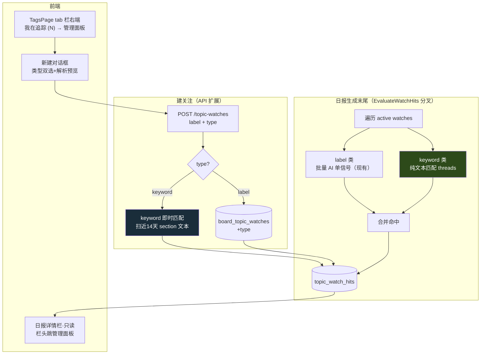

# Design: watch 双轨化（keyword 文本匹配）+ 即时匹配 + 快捷关注

## 1. Context

关注标记（topic-watch）现状：`board_topic_watches(id, semantic_board_id, label, status, ...)`，命中全走 AI 单信号（`EvaluateWatchHits` 批量喂 section+watch 给 AI）。缺口：① 无关键字文本匹配轨（盯具体词只能硬塞 label 让 AI 模糊匹配）；② 入口只在日报顶部栏对话框、建完等下一期日报才见效。

约束：

- 后端 Go/Gin + GORM + PostgreSQL；前端 Nuxt 4 + Vue 3。
- `topic_watch_hits(watch_id, section_id, report_id, period_date, reason)` 复合唯一索引（防重复命中行，已有）。
- `EvaluateWatchHits` 挂在 `GenerateAndSaveReport` 末尾（日报生成流程外，失败 log 吞）。
- `topic-watch` 主 spec 基线在 `openspec/specs/topic-watch/`（topic-watchlist-observability 2026-07-23 归档时遗漏同步，2026-08-24 补回）；本 change 对其做 MODIFIED（3 个）+ REMOVED（1 个：AI 命中判定）+ ADDED（3 个）。
- section 的文本：`cluster_label`（聚类标题，短）+ threads 的 `title`/`summary`（中长）。底层 articles 不在本 change 匹配范围（开销大）。

## 2. Goals / Non-Goals

**Goals**

- watch 支持 keyword 类型，纯文本匹配，零 AI 成本、即时生效。
- keyword 多词逻辑（空格 AND / `|` OR），大小写不敏感。
- 版块级关注管理面板（创建/管理唯一入口），日报详情栏只读化 + 栏头跳转。

**Non-Goals（明确不做）**

- 不动 label 类的 AI 判定逻辑（保持现有批量单信号）。
- 不匹配底层 articles 正文（只匹配 threads 标题+摘要，召回/开销平衡）。
- 不给 keyword 命中补 AI 理由（keyword 是确定性匹配，理由=「含关键字『XX』」，零 AI）。
- **不做内容流快捷入口**（section/话题详情旁「＋关注」）——与文章页标签关注（心形）入口撞心智，用户已否决（2026-08-24）。
- 不给关注加 `source_topic_id`/`source_section_id` 来源字段（v1 不统计来源，保持简单；Open Questions 留口）。
- 不改 label 类的"等下一期日报"反馈模式（label 类本质要 AI，无法即时；只有 keyword 类即时）。

## 3. 架构总览

关键：**keyword 的两条命中路径**（建关注时即时 + 日报生成时增量），都写同一张 `topic_watch_hits`，靠复合唯一索引去重。

## 4. 决策点（已与用户确认）

### 4.1 关键字匹配范围 = threads 标题+摘要

**选**：keyword 匹配 section 下各 thread 的 `title` + `summary` 拼接文本（不含底层 articles 正文）。

**理由**：`cluster_label` 太短（常漏，如聚类标题"中东动态"不含"霍尔木兹"）；articles 正文太重（每个 section 数十篇，扫描开销大）。threads 标题+摘要是召回与开销的平衡点——thread 本身已是文章聚类后的代表线索，含关键实体词。

**备选（否决）**：匹配 articles 正文。否决：每期每 board 数百 article 全文扫描，且 keyword 即时匹配要扫近 14 天，开销不可控。

### 4.2 关键字多词逻辑 = 空格 AND / `|` OR

**选**：keyword 文本支持多词——空格分隔 = AND（全含才命中），`|` 分隔 = OR（含任一即命中）。可混用：`ASML|镓锗 出口` = (ASML 或 镓锗) 且 含 出口。

**理由**：盯"半导体管制"用户常想抓多个相关词（ASML/镓锗/锗），单关键字太死，多词 OR 贴合"盯一族词"；AND 用于收紧（"出口 限制"避免误抓"出口增长"）。大小写不敏感（英文如 ASML/asml 等价）。

**备选（否决）**：一 watch 一词。否决：盯一族词要建多条 watch，管理累；顶部栏分组爆炸。

### 4.3 keyword 命中不显示 AI 理由

**选**：keyword 命中的 `reason` 字段写机械文本「含关键字『ASML』」（命中了哪个词），顶部栏展示该机械理由，**不调 AI 生成自然语言理由**。

**理由**：keyword 的价值就是零 AI 成本、确定性。补 AI 理由等于把成本加回来，违背初衷。机械理由「含关键字『XX』」已足够让用户知道为何命中。

### 4.4 keyword 即时匹配（不等日报）

**选**：建 keyword watch 后，立刻扫最近 14 天 section 的 threads 文本匹配，命中即写 `topic_watch_hits`（`report_id` 取 section 所属 report、`period_date` 取 section 日期）。

**理由**：解决 label 类固有的"建完等下一期"反馈延迟。keyword 是纯文本匹配，即时扫历史零成本零风险。label 类无法即时（要 AI 且依赖当期 section 集合），故只有 keyword 类支持即时。

**备选（否决）**：keyword 也只挂日报生成末尾。否决：等于没解决延迟，keyword 的即时优势白费。

### 4.5 入口收敛到版块级 tab 栏；命中成为阅读导航（2026-08-24 用户确认）

**选**：创建/管理唯一入口 = 版块工作台内容区 tab 栏（TagsPage `tags-content-tabs`）右端「我在追踪 (N)」入口 chip，版块选中后在五个内容 tab（板块内容/话题总览/日报/文章/数据增强）下均常驻可见；点开管理面板（新建 + 列表 + 暂停/删除 + 回扫反馈）。入口位置和职责不变，只保证图标/文案不换行并调整 gap/padding。

日报命中不再置于正文中间的独立窄宽栏。日报时间线保持日期顺序，在每期记录下以最多两个 `# keyword` / `✦ topic` 紧凑 tag 预告命中（余项 `+N`）；详情页在「关心的话题」之前依次提供全宽同级的「追踪关键字」「追踪话题」分区。分区仅放可点击单行索引，点击定位已有 section；不复制正文或常驻 reason。keyword 以 `#` 区分，不使用与日报主题冲突的大面积绿色。

**理由**：watch 是**版块级**跨期存续的实体，原设计把新建入口埋在**每一期**日报详情里——入口与实体不同级：同一版块每份日报顶着同一个新建按钮，且只能在"读某天日报"状态下创建，无处管理全部。真实前端结构中日报与话题总览是 TagsPage 的平级 tab（`contentTab: daily-reports / topic-overview / ...`，非同一面板内切换），入口挂任何一个 tab 内组件都会在其他 tab 下消失；tab 栏右端是唯一随版块常驻的导航层，与实体同级。同时否决内容流快捷入口（section/话题旁「＋关注」）——与文章页标签关注（心形）撞心智，三入口并发必乱。（注：`BoardDailyReportTimeline` 内部残留的 showThreadBrowser 切换是 tab 拆分前的遗留，不作为本 change 依据。）

**备选（否决）**：① 挂 BoardDailyReportTimeline 头部——切到话题总览/文章 tab 入口即消失；② 维持每期日报栏内新建——入口错位 + 无管理面；③ 内容流快捷入口——与既有标签关注入口撞心智。

### 4.6 keyword 对话框无预填，靠解析预览降负担

**选**：类型双选对话框不预填（面板入口无内容流上下文可取）；keyword 态靠三件套降冷启动负担——语法提示（空格 AND / `|` OR）、实时解析预览（chips 化 "ASML|镓锗 出口" → `[ASML|镓锗] × [出口]`，无效表达式红字 + 禁提交）、回扫预期说明（建后立即扫近 14 天）。

**理由**：原预填逻辑依赖内容流入口（cluster_label/topic.label），入口收敛后无上下文来源；解析预览在输入时即时反馈表达式语义，比预填更直接地消除"这个词写对没"的疑虑。

### 4.7 架构：keyword 塞进 watch 表（不独立功能）

**选**：keyword 作为 `board_topic_watches.type` 的一个值，与 label 共表共展示，不独立成"关键字监控"功能。

**理由**：用户心智里 label 和 keyword 都是"我在追踪的东西"，顶部栏统一展示比分两个入口清爽。共表共 API 共展示，工程上也最省。`type` 字段只影响"怎么判定命中"，不影响"怎么管理/展示"。

## 5. Risks / Trade-offs

- **[keyword 误召回过多]** → 宽关键字（如"中国"）命中大量 section，顶部栏拥挤。缓解：keyword 多词 AND 收紧；UI 顶部栏已有"每组最多 5 条 + 折叠"（topic-watchlist-observability 既有限制）。
- **[即时匹配与日报匹配重复写]** → 同一 (watch_id, section_id, report_id) 可能被即时匹配和日报匹配各写一次。缓解：复用现有 `topic_watch_hits` 复合唯一索引（watch_id+section_id+report_id）+ OnConflict DoNothing，幂等去重。
- **[keyword 匹配性能]** → 即时匹配扫近 14 天全部 section 的 threads 文本。缓解：14 天 section 量级可控（单 board 数十~百余 section，threads 文本 KB 级），纯内存字符串扫描，无需索引；如后续 article 级匹配再考虑全文索引。
- **[type 字段历史兼容]** → 历史 watch 无 type。缓解：迁移默认 label，历史 watch 行为完全不变（仍走 AI）。
- **[label/keyword 展示混淆]** → 两类命中若做成独立卡片会抢正文并与整页宽度脱节。缓解：时间线只做 #/✦ 紧凑预告；详情使用同级全宽导航分区和图标区分，点击回到原 section，不复制正文。

## 6. Migration Plan

1. 后端：版本化迁移新增 `board_topic_watches.type` 列（CHECK label/keyword，默认 label），幂等。历史行 type=label。
2. 后端：`BoardTopicWatch.Type` 字段；`CreateWatch(boardID, label, watchType)` 签名扩展（默认 label 保持向后兼容）。
3. 后端：`EvaluateWatchHits` 内部分叉——收集 label 类走 AI 批量（现有逻辑）、keyword 类走 `matchKeywordSections`（纯函数）；合并命中写表。
4. 后端：keyword 即时匹配——`CreateWatch` 当 type=keyword 时，建表后同步扫近 14 天 section 写 hits（OnConflict DoNothing 幂等）。
5. 后端：createTopicWatch handler body 加 type 字段解析（缺省 label）。
6. 前端：`topicWatches.ts` createWatch 加 type；新建关注对话框（类型双选 + 解析预览），挂载于管理面板。
7. 前端：TagsPage tab 栏右端「我在追踪 (N)」入口 chip（五 tab 常驻）+ 管理面板（列表/暂停/删除/回扫反馈）；日报列表批量读取 active watch 摘要作 tag 预告；以详情索引分区替代 `DailyReportWatchBar`。
8. 部署：迁移幂等；历史 watch type=label 不报错；keyword 即时匹配失败 SHALL NOT 阻断建关注（非致命，记日志跳过，watch 仍建成功）。
9. 回滚：DROP type 列可逆；keyword 逻辑可独立 revert（label 类不受影响）。

## 8. 项目执行规范约束（实现期强制遵循）

> 与 manual-topic-lane change §8 同源（§4 后端 / §5 前端 / §7 架构体检 / §10 数据兼容 / §12 文档），此处只列本次强相关差异，不全文复述。

### 8.1 后端

- `matchKeywordSections(keywords string, sections []Section) []Hit` 为**纯函数**（多词解析 + 大小写不敏感 + threads 文本拼接），单元测试覆盖（`keyword_match_unit_test.go`，无 DB）：(1) 单词 (2) 多词AND (3) 多词OR (4) 混用 `ASML|镓锗 出口` (5) 大小写 (6) 空串 / 纯分隔符降级。变体矩阵见 change 目录 test-cases.md。
- keyword 即时匹配 + EvaluateWatchHits 分叉涉及真实 section 文本 → testcontainer pgvector 集成测试（断言两类命中分别写表、复合唯一索引去重）。
- `CreateWatch` 签名变更波及调用方（handler + 即时匹配），跑 `codegraph impact CreateWatch`。
- 新增/改 handler grep 路由注册二次确认（codegraph 追不到 group.POST）。

### 8.2 前端

- 新建关注对话框类型切换 + 管理面板（列表/暂停/删除），复用 `AppDialog`/`AppInput`/`AppButton`，禁 `window.*`。
- keyword 命中「含关键字『XX』」+ label/keyword 视觉微区分，全语义 token。
- API 经 `ApiClient`，snake→camel normalizer。

### 8.3 数据兼容性（§10）

- `type` 列默认 label，历史行无行为变化。
- keyword 即时匹配写 hits 用 OnConflict DoNothing，与日报匹配幂等共存。
- JSON 响应 type 为新增可选字段（默认 label），向后兼容。

### 8.4 文档流转（§12）

- `docs/reference/`（api / database）里程碑收尾统一更新。
- 本 change tasks 文档节列待更新清单，标注「里程碑收尾」。

## 9. Open Questions

- **关注是否记来源**：v1 不加 `source_topic_id`/`source_section_id`（不统计来源）。若后续要分析"哪些 watch 是哪来的"，再加来源字段。
- **keyword 即时匹配的时间窗口**：默认扫近 14 天（与话题总览窗口对齐）。是否允许用户自定义即时匹配窗口——倾向 v1 固定 14 天，避免参数膨胀。
- **多词解析的边界**：`ASML|镓锗 出口` 的解析优先级（先拆 `|` 再拆空格），tasks 阶段在纯函数单测里固化。
- ~~**入口与工作台的衔接**~~：已解决——管理面板直接落在版块日报面板头部（与话题总览同面），无需另补 lanes 入口。
