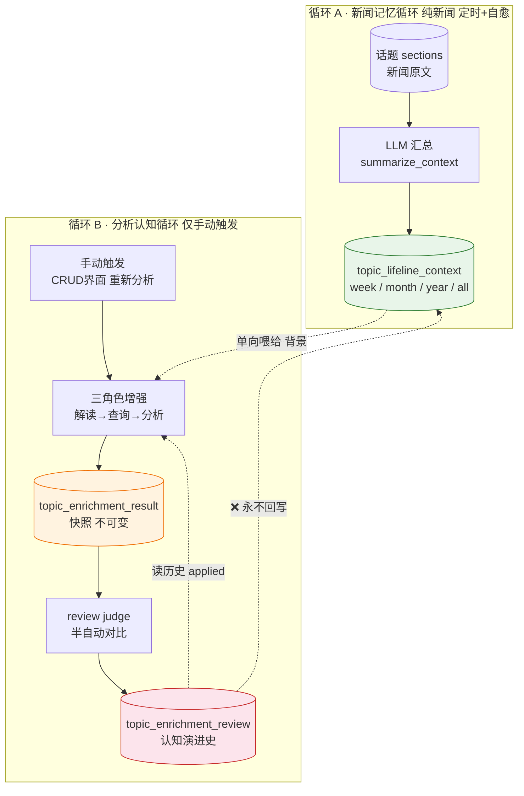
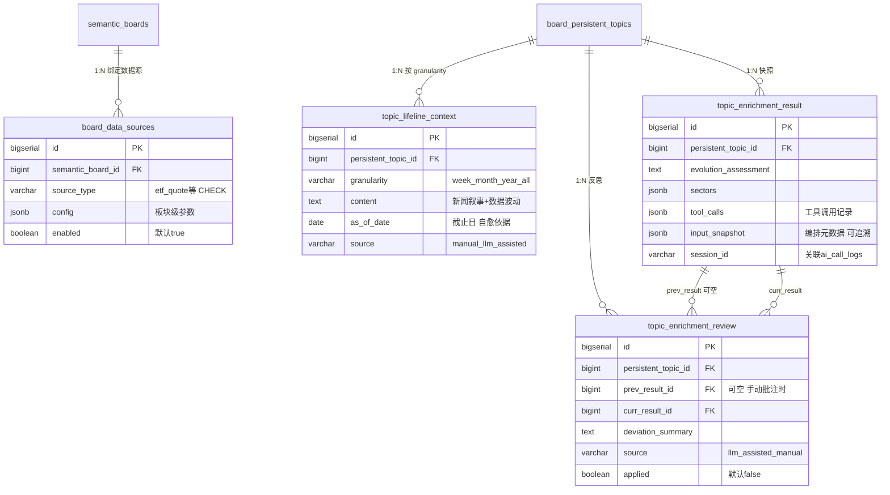
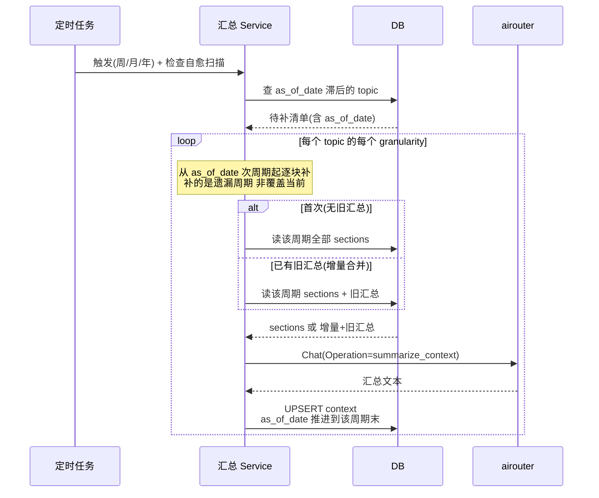
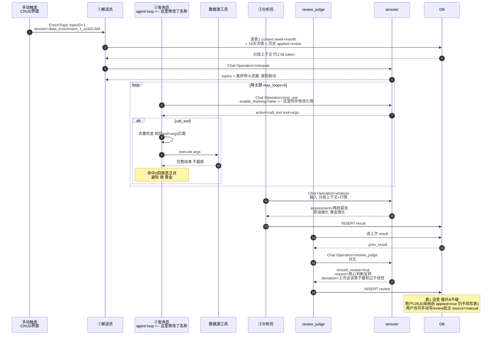
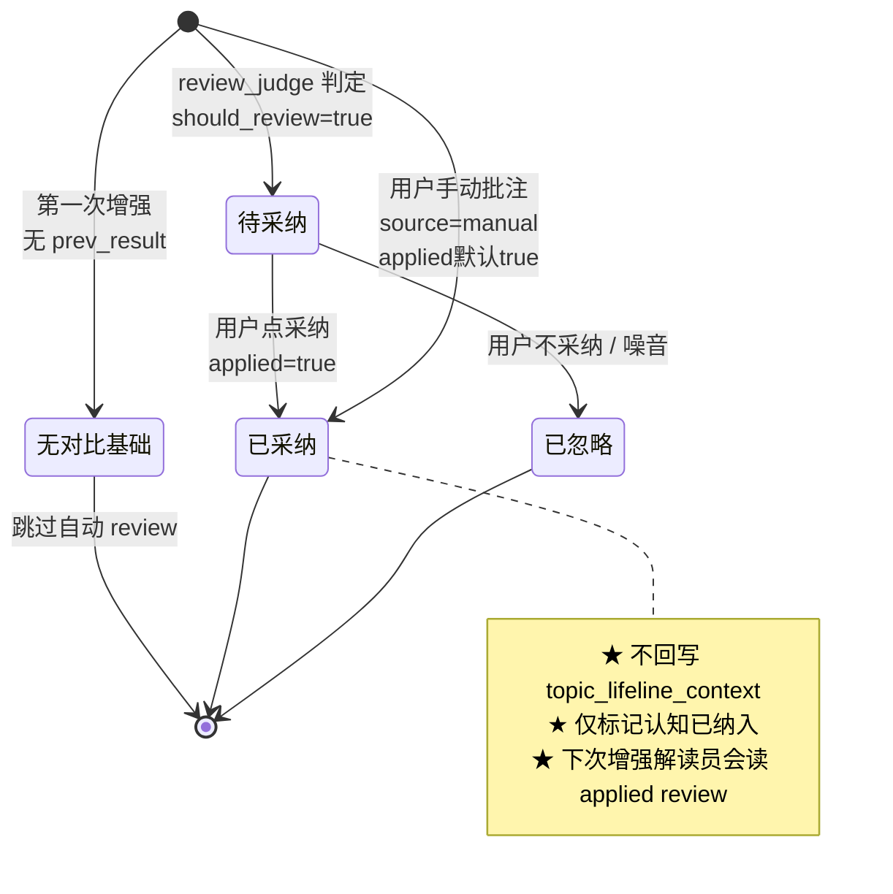
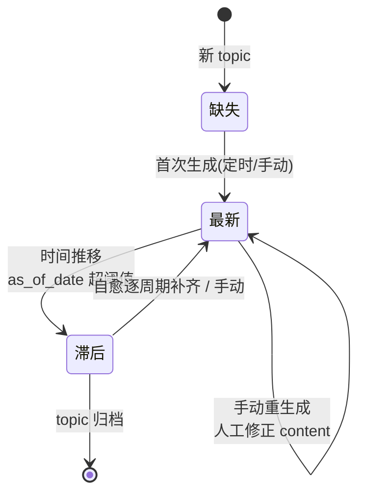

# 概要设计 — data-enrichment-orchestration

> 持久话题的**认知闭环系统**：两个独立循环 + 三表关注点分离。
> 本文用 mermaid 辅助说明**顺序、状态、表结构依赖**。完整决策见 `design.md`，字段约束见 `specs/data-enrichment/spec.md`。

---

## 1. 架构总览

两个循环通过 `topic_lifeline_context`（表1）**单向连接**——循环 A 只产新闻记忆，循环 B 消费它并自我迭代，但 review 永远不回写表1（保持新闻事实客观）。

**为什么循环 B 仅手动**：不是所有板块对金融数据有影响（如"开发工具"板块），自动挂日报管线会产生无意义增强 + 浪费 LLM 成本。用户判断需要时手动点。

**三表关注点分离**：

| 表 | 角色 | 可变？ | 谁写 |
|---|---|---|---|
| `topic_lifeline_context` | 新闻记忆（背景） | 可（滚动/人工） | 循环 A |
| `topic_enrichment_result` | 当下判断（快照） | **不可变** | 循环 B 分析员 |
| `topic_enrichment_review` | 两次快照间增量（反思） | deviation_summary 可调 | review judge / 用户手动 |

---

## 2. 表结构依赖（ER 图）

4 张新表 + 关联的 3 张已有表。`topic_enrichment_result` 新增 `input_snapshot` 字段（记录本次增强读了哪些输入，可追溯）。

**注意**：`topic_enrichment_result` 移除了 `report_id`（循环B不再挂日报管线）；`prev_result_id` 可空（支持用户手动批注，无 prev 对比）。

---

## 3. 循环 A：新闻汇总（顺序图）

定时触发（周/月/年）+ 检查自愈（**补遗漏的周期，非覆盖当前**）+ 手动重生成。

**关键**：循环 A 只读 sections，**不读** result/review；表1 永远只随它变。隔周再触发时，自愈会先补上周遗漏的 week，再补本周，`as_of_date` 顺序推进。

---

## 4. 循环 B：分析认知（顺序图，含 2026-07-05 topic 1 实例）

---

## 5. 状态机

### 5.1 review 的 applied 生命周期（含手动批注）

### 5.2 context 的滚动状态

**`as_of_date` 的双重作用**：解读员/分析员据此判断时效（滞后时以 14 天详情为准）；检查自愈据此扫描缺口并逐周期补齐。

---

## 6. 关键约束速查

| 约束 | 说明 | 落地点 |
|---|---|---|
| **单向不回写** | review 永远不写 `topic_lifeline_context` | review_judge.go |
| **快照不可变** | `topic_enrichment_result` 写入后不修改 | repository |
| **循环B仅手动** | 不挂日报管线，CRUD 手动触发 | handler |
| **自愈补遗漏** | 补 as_of_date 之后的遗漏周期，非覆盖当前 | lifeline_context.go |
| **thinking 关闭** | 本地 Qwen3 请求带 `enable_thinking=false` | airouter 请求层 |
| **历史不截断** | agent loop 累积完整工具结果 | orchestrator |
| **去重拦截** | 相同 tool+args 直接挡 | orchestrator |
| **可追溯** | 每次切片输入输出都可查（见 §7） | ai_call_logs + result |

---

## 7. 可追溯性（变更大，强化）

每次增强的所有切片 SHALL 可查、可重建：

| 切片 | 输入 | 输出 | 存哪 |
|---|---|---|---|
| 解读员 | 分层上下文（rendered） | topics JSON | `ai_call_logs`（messages+content） |
| 查询员每轮 | 主题+工具+历史 | action JSON | `ai_call_logs` |
| 工具调用 | args | 返回结果+耗时 | `result.tool_calls` jsonb |
| 分析员 | 分层+行情 | assessment/sectors | `ai_call_logs` + `result` |
| review_judge | prev+curr result | should_review JSON | `ai_call_logs` + `review` |
| 编排元数据 | 读的context层/as_of/section范围 | — | `result.input_snapshot` jsonb |

**排查路径**：`result.session_id` → `GET /api/ai/call-logs?session_id=` 重建该次增强的全部 LLM 调用（输入+输出）；`result.tool_calls` + `result.input_snapshot` 补齐工具与输入上下文；三表持久化全部中间结论。

---

## 8. 5 个 Operation 速查

| Operation | 循环 | 角色 | 触发 |
|---|---|---|---|
| `data_enrichment.summarize_context` | A | 汇总 | 定时/自愈/手动 |
| `data_enrichment.interpret` | B | 解读员 | 手动增强 |
| `data_enrichment.tool_use` | B | 查询员每轮 | 手动增强 |
| `data_enrichment.analyze` | B | 分析员 | 手动增强 |
| `data_enrichment.review_judge` | B | review 对比 | 增强后 |

SessionID 规则：循环 B = `data_enrichment_{topic_id}_{uuid8}`；循环 A = `lifeline_context_{topic_id}_{granularity}_{uuid8}`。
